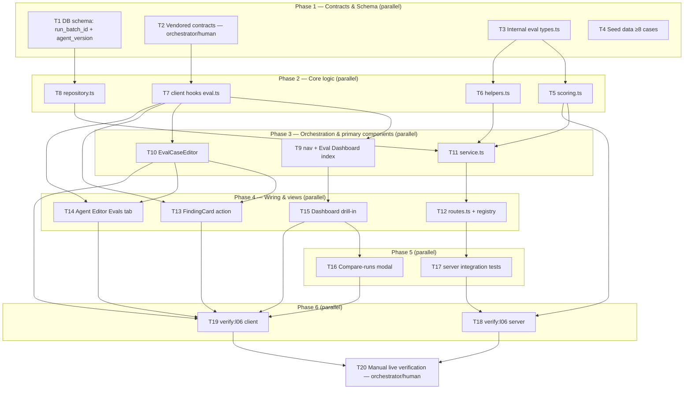

# Implementation Plan: Eval Pipeline

## Overview

Turn the L06 lab's regression-eval methodology into a first-class DevDigest capability: users
turn an accepted/dismissed finding into a reusable eval case in one click, hand-author more cases,
run an agent's whole case set against fixed (never re-fetched) inputs through the SAME
`reviewer-core` review path a live PR uses, score every run 100% in code (zero LLM calls beyond
the agent's own review-generation call), and see the result both locally (Agent Editor Evals tab)
and globally (a new Eval Dashboard with per-agent trend, a global recent-runs table, and a
two-run Compare-runs modal with system-prompt diff + "Promote v‹N›").

## Source spec

`specs/2026-07-29-eval-pipeline.md` (SPEC-2026-07-29-eval-pipeline, status draft).

## Execution mode

**multi-agent (parallel)** — the DAG below has four phases of 3–4 mutually-independent tasks
each (Phase 1 alone has 4), server and client tracks are almost fully decoupled once the shared
contract lands, and every concurrently-scheduled task in this plan owns a disjoint file set. This
shape is exactly what multi-agent parallelism is for; single-agent would serialize work that has
no reason to be serial. See the DAG diagram below.

## Requirements (verified)

Restated from the spec's EARS ACs (see spec for full text). All 40 are in scope; none are
relitigated. Two items rest on the spec's own stated defaults, carried forward unchanged:

- R1 (AC-1/AC-2): one-click case-from-finding, `must_find` for accepted / `must_not_flag` for
  dismissed, disposition resolved by the later of `accepted_at`/`dismissed_at`.
- R2 (AC-3/AC-4): action unavailable (and API-rejected) for a pending finding or an agent-less
  review.
- R3 (AC-5/AC-6): created case's `input_diff` scoped to the finding's file only, `input_meta` a
  frozen point-in-time snapshot; case is immediately editable, no dead-end.
- R4 (AC-7–AC-10): case editor JSON-validates `expected_output`, gates Save on valid JSON,
  supports "run on save", shows/omits the "Last run" status strip correctly.
- R5 (AC-11–AC-13): `POST /agents/:id/eval-runs` executes the agent's CURRENT config against
  every targeted case's stored inputs (never a live fetch), one `eval_runs` row per case, reusing
  `EvalRunResult`/`EvalDashboard`.
- R6 (AC-14–AC-21): citation_accuracy/recall/precision/pass computed 100% in code, reusing the
  grounding gate's exact range-intersection semantics; zero LLM calls in scoring, proven with a
  Container throwing-double.
- R7 (AC-22): a prompt edit removing a rule visibly moves recall/precision between two runs.
- R8 (AC-23): `pnpm verify:l06` exists and passes in `server` (assumed default — confirm: also in
  `client`, mirroring `verify:l03`'s split, since AC-27/31/34/35 are UI-only behavior).
- R9 (AC-24/AC-25): no case-count cap; seeded workspace ships ≥1 agent with ≥8 cases spanning
  both expectation types; both types are independently creatable/editable/runnable/scorable.
- R10 (AC-26–AC-29): Agent Editor Evals tab — metric tiles+deltas, case list with pass/fail +
  "expected N, got M" + badges + per-row actions, "Run all evals" + "+ New eval case", "View full
  dashboard →" link.
- R11 (AC-30): sidebar "Eval Dashboard" nav item under SKILLS LAB, reusing the pre-scaffolded
  `eval` key.
- R12 (AC-31/AC-32): top-level dashboard — per-agent sparkline+metrics+"last run" row (empty
  state for zero-batch agents), workspace-wide recent-runs table, "Run all agents" (skips
  zero-case agents, no error).
- R13 (AC-33–AC-38): per-agent drill-in — tiles+deltas, trend chart, recent-runs table with
  version tag; deterministic code-generated "most notable movement" alert (none below 2 batches);
  exactly-2 checkbox selection with oldest-replaced-on-third-pick; Compare-runs modal with
  deltas + system-prompt diff (explicit "no change" state when same version); "Promote v‹N›"
  reusing the agents module's existing version-read + update endpoints.
- R14 (AC-39): cross-workspace access to any eval case/run resolves not-found.
- R15 (AC-40): "Run all evals" / per-case run / "Run all agents" show a non-duplicable
  in-progress state, mirroring the Intent/Blast/Brief recompute convention (assumed default:
  client-side declarative guard only — `Button loading={mutation.isPending}` — no server-side
  mutex; this is the ONLY existing precedent in this codebase for that convention, confirmed by
  reading `BlastCard.tsx`).

## Open questions & recommendations

- Q: Should `verify:l06` have a client lane? → default: **yes** (spec's own default; several ACs
  are UI-only and unreachable server-side).
- Q: `case_ids` targeting a mix of valid + cross-agent/invalid ids? → default: **silently exclude
  invalid ones, run the valid subset** (spec's own default).
- Q: orphaned eval cases after agent deletion? → default: **no cleanup job**, accepted (spec's own
  default; `eval_cases.owner_id` has no FK to cascade).
- **New gap found (beyond the spec's own flagged ones):** the spec's proposed contract additions
  cover the per-agent dashboard (`EvalDashboard`) and per-batch identity (`EvalTrendPoint` +
  `run_id`/`agent_version`), but AC-31/AC-32 need a **workspace-wide index view** — "per agent:
  sparkline + current metrics + last-run line" and "one global recent-runs table across every
  agent" — and nothing in the existing or proposed contracts carries an agent's **name** next to
  its dashboard, or an **agent identifier** on a cross-agent run row. Recommendation (adopted
  below, Phase 1/T2): add two more contracts, `EvalAgentSummary` (`agent_id`, `agent_name`,
  `dashboard: EvalDashboard`) and `EvalGlobalRunRow` (`EvalTrendPoint` + `agent_id`/`agent_name`),
  plus a `EvalWorkspaceDashboard = { agents: EvalAgentSummary[]; recent_runs: EvalGlobalRunRow[] }`
  wrapper for `GET /eval-dashboard`. This is additive to the spec's own proposal, not a
  contradiction of it — `EvalDashboard`/`EvalTrendPoint` are reused unchanged inside it.
- Rec: scope this feature's routes/UI to `owner_kind: 'agent'` only (matches every user story,
  which references only the Agent Editor). `EvalOwnerKind` keeps `'skill'` in the enum for
  schema/contract stability, but no skill-side eval route or UI ships in this plan. Flag, don't
  silently build it — a skill-eval surface is a clean future extension of the same module.
- Rec: keep `POST /agents/:id/eval-runs` (per-agent batch) as the ONLY execution entrypoint;
  "Run all agents" (AC-32) is a thin service-level loop calling that same per-agent path
  sequentially (not fanned out further) — avoids compounding the ≤4-concurrent-per-batch cap
  across agents simultaneously, and keeps one code path to test for AC-11/12/13/20/21/22.

## Affected packages & contracts

- **server** — new `src/modules/eval/` (types/scoring/helpers/repository/service/routes/constants
  + colocated tests), a schema migration on `eval_runs`, a `seed-eval-cases.ts` addition, one line
  in `src/modules/index.ts`, one `verify:l06` script.
- **client** — new `EvalCaseEditor` shared component, a new `EvalsTab` on the Agent Editor, a new
  `/eval` (index) + `/eval/[agentId]` (drill-in) route tree with a `CompareRunsModal`, a
  `FindingCard` action + prop-drilling change, a new `lib/hooks/eval.ts`, one nav entry, one
  `verify:l06` script.
- **Contracts (vendored, two-sided, `orchestrator/human`)**:
  - `eval_runs.run_batch_id` (uuid, not null) + `eval_runs.agent_version` (integer, not null) —
    DB schema only (server-side, not vendored — see T1).
  - `EvalTrendPoint` — add `run_id: string`, `agent_version: number` (int).
  - `EvalDashboard.recent_runs` — retype from `EvalRunRecord[]` to `EvalTrendPoint[]`.
  - New: `EvalRunBatchInput { case_ids?: string[] }`.
  - New: `EvalRunBatchResponse { run_batch_id: string; results: EvalRunResult[]; dashboard: EvalDashboard }`.
  - New: `EvalCaseFromFindingInput { finding_id: string }`.
  - New (gap found in this plan): `EvalAgentSummary`, `EvalGlobalRunRow`, `EvalWorkspaceDashboard`.
  - `EvalCase`, `EvalCaseInput`, `EvalRun`, `EvalPerTrace`, `EvalRunRecord`, `EvalRunResult`
    reused unchanged.

## Architecture changes

- New onion-shaped module `server/src/modules/eval/` (routes → service → repository, plus a pure
  `scoring.ts`/`helpers.ts`/`types.ts` core with zero I/O) — mirrors `blast`/`why-risk-brief`'s
  shape (no dedicated repository in those two only because they piggyback on `ReviewRepository`;
  `eval` needs its own repository since `eval_cases`/`eval_runs` are its own tables).
  Registered statically in `server/src/modules/index.ts`.
- `eval`'s service is a new CALLER of `reviewer-core`'s `reviewPullRequest` (`reviewer-core/src/review/run.ts:132`)
  — exactly like `run-executor.ts` already is for live reviews — never a parallel reimplementation.
  It assembles the agent's runnable config the same way `run-executor.ts` does (agent row fields +
  a separate `agentsRepo.linkedSkills` call), since no single "resolve agent's full config" helper
  exists yet to extract instead (confirmed absent).
- Client: a new top-level route tree `client/src/app/eval/` (index + `[agentId]` drill-in),
  Server Components by default per `next-best-practices`, with `'use client'` pushed to the
  interactive leaves (checkbox selection, mutations, chart).
- `EvalCaseEditor` is placed as a **shared** component (`client/src/components/EvalCaseEditor/`),
  not colocated under one route, because it is consumed from two places (the FindingCard
  "Turn into eval case" flow and the Evals tab's "+ New"/edit actions) — per
  `frontend-architecture`'s "used in 2+ places → shared location" rule.



## Phased tasks

### Phase 1 — Contracts & Schema

- **T1**
  - **Action:** Add `run_batch_id` (`uuid('run_batch_id').notNull()`) and `agent_version`
    (`integer('agent_version').notNull()`) to the `evalRuns` table in
    `server/src/db/schema/eval.ts`; add a plain (non-unique) B-tree index on `run_batch_id`
    (the primary access path for grouping per-case rows into one selectable "run"/batch — used by
    Recent Runs, trend chart, Compare). Both columns are safe as `NOT NULL` with no default:
    `eval_runs` has zero rows today (no module writes to it yet, confirmed — this feature ships
    forward per the spec's own non-goal, no backfill needed). Run `pnpm db:generate` then
    `pnpm db:migrate` — never hand-author the SQL.
  - **Package:** server
  - **Type:** backend
  - **Owner:** implementer
  - **Skills to use:** drizzle-orm-patterns, postgresql-table-design
  - **Owned paths:** `server/src/db/schema/eval.ts`, `server/src/db/migrations/00NN_*.sql`,
    `server/src/db/migrations/meta/00NN_snapshot.json`, `server/src/db/migrations/meta/_journal.json`
  - **Depends-on:** none
  - **Risk:** low
  - **Known gotchas:** never hand-author migration SQL — `pnpm db:generate` needs no DB
    connection and re-derives from the schema diff; a hand-authored file gets silently
    discarded/regenerated on the next `db:generate` (server/INSIGHTS.md, 2026-06-19).
  - **Acceptance:** `pnpm db:generate` produces a new migration file with both columns +
    the index; `pnpm db:migrate` applies cleanly against the running Postgres (`./scripts/dev.sh
    --db-only`); `psql \d eval_runs` (or an equivalent Drizzle introspection check) shows both
    columns `NOT NULL`. Traces to R5/R13 (foundational for `run_batch_id`/`agent_version` grouping).

- **T2**
  - **Action:** Edit `server/src/vendor/shared/contracts/eval-ci.ts` **and**
    `client/src/vendor/shared/contracts/eval-ci.ts` in lock-step (identical field additions, only
    comments may differ):
    1. Extend `EvalTrendPoint` with `run_id: z.string()` and `agent_version: z.number().int()`
       (both required — this type is computed fresh per response, never persisted as JSON, so no
       back-compat `.nullish()` concern applies).
    2. Change `EvalDashboard.recent_runs` from `z.array(EvalRunRecord)` to
       `z.array(EvalTrendPoint)`.
    3. Add `EvalRunBatchInput = z.object({ case_ids: z.array(z.string()).optional() })`.
    4. Add `EvalRunBatchResponse = z.object({ run_batch_id: z.string(), results:
       z.array(EvalRunResult), dashboard: EvalDashboard })`.
    5. Add `EvalCaseFromFindingInput = z.object({ finding_id: z.string() })`.
    6. Add (plan-identified gap, not in the spec's own list) `EvalAgentSummary = z.object({
       agent_id: z.string(), agent_name: z.string(), dashboard: EvalDashboard })`,
       `EvalGlobalRunRow = EvalTrendPoint.extend({ agent_id: z.string(), agent_name: z.string()
       })`, and `EvalWorkspaceDashboard = z.object({ agents: z.array(EvalAgentSummary),
       recent_runs: z.array(EvalGlobalRunRow) })` — needed for the workspace-wide Eval Dashboard
       index (AC-31/AC-32), which needs an agent name next to its dashboard and an agent
       identifier on a cross-agent run row, neither of which any existing/spec-proposed type
       carries.
    Export every new type (`export type X = z.infer<typeof X>`) per `zod` skill conventions.
  - **Package:** server + client (single task, edits both vendored copies together)
  - **Type:** backend/ui (contract-only)
  - **Owner:** orchestrator/human (vendored contract change — never a parallel `implementer`)
  - **Skills to use:** zod, typescript-expert
  - **Owned paths:** `server/src/vendor/shared/contracts/eval-ci.ts`,
    `client/src/vendor/shared/contracts/eval-ci.ts`
  - **Depends-on:** none
  - **Risk:** medium (touches a shared, two-sided, hand-synced file — the highest-leverage single
    point of failure in this plan; every downstream task reads it)
  - **Known gotchas:** the two vendored copies are never auto-synced — a field added to one and
    not the other typechecks fine locally and fails at the OTHER package's build
    (server/INSIGHTS.md + client/INSIGHTS.md, 2026-06-19). Diff the two files after editing to
    confirm only comments differ.
  - **Acceptance:** `cd server && pnpm typecheck` and `cd client && pnpm typecheck` both pass with
    only the new/changed exports referenced (a throwaway import in each package, deleted after,
    is an acceptable manual check); a side-by-side diff of both `eval-ci.ts` files shows no
    field-level divergence. Traces to R5/R12/R13 and the new-gap recommendation above.

- **T3**
  - **Action:** Create `server/src/modules/eval/types.ts` — a server-internal (non-Zod,
    non-vendored) TypeScript type for the informal "expectation item" shape carried inside
    `expected_output` (per spec: "carried inside `expected_output: z.unknown()`, not itself Zod-
    validated server-side beyond 'is a JSON array'"):
    ```ts
    export interface ExpectationItem {
      type: 'must_find' | 'must_not_flag';
      file: string;
      start_line: number;
      end_line?: number; // defaults to start_line when omitted
      severity?: string;
      category?: string;
      title?: string;
    }
    ```
    Also define `MatchResult` (per-expectation-item match outcome used by scoring/helpers, e.g.
    `{ item: ExpectationItem; matched: boolean }`) and any small shared literal unions scoring and
    helpers both need, so T5/T6 (Phase 2) don't duplicate type definitions.
  - **Package:** server
  - **Type:** core (pure types, no I/O)
  - **Owner:** implementer
  - **Skills to use:** typescript-expert, zod (for the boundary note on why this stays internal,
    not a Zod schema)
  - **Owned paths:** `server/src/modules/eval/types.ts`
  - **Depends-on:** none
  - **Risk:** low
  - **Known gotchas:** none — first file in a brand-new module directory.
  - **Acceptance:** `cd server && pnpm typecheck` passes; the file exports `ExpectationItem` and
    is importable with no circular dependency (verify by a throwaway import from a scratch file,
    deleted after). Supports R6 (AC-14–AC-19 matching) and R4 (AC-7 editor validation shape).

- **T4**
  - **Action:** Create `server/src/db/seed-eval-cases.ts` exporting a data array (mirrors the
    existing `seed-prompts.ts`/`seed-skills.ts`/`seed-conventions.ts` pattern of "large seed
    content lives in its own file, imported into `seed.ts`") of **≥8** `evalCases` rows for ONE
    existing seeded agent (pick the most fully-configured entry in `seedAgents`,
    `server/src/db/seed.ts`), spanning both expectation types (at least one `must_find`, at least
    one `must_not_flag` — AC-24/AC-25). Each case needs a minimal but valid unified-diff fragment
    for `input_diff` (reuse an existing PR fixture diff already present in `seed.ts`/reviewer-core
    test fixtures for realistic diff syntax rather than hand-crafting new diff text from scratch),
    a plausible `input_files`/`input_meta` snapshot, and an `expected_output` array of
    `ExpectationItem`-shaped objects (T3). Wire the import + idempotent insert into `seed.ts`
    (select-then-insert-if-absent keyed on `(workspaceId, ownerKind, ownerId, name)`, matching the
    existing agents/skills idempotency convention).
  - **Package:** server
  - **Type:** backend
  - **Owner:** implementer
  - **Skills to use:** drizzle-orm-patterns
  - **Owned paths:** `server/src/db/seed-eval-cases.ts`, `server/src/db/seed.ts` (edit)
  - **Depends-on:** none (targets the pre-existing, unmodified `eval_cases` schema)
  - **Risk:** low
  - **Known gotchas:** `seed.ts` seeds are idempotent via select-before-insert on a natural key —
    follow that shape exactly or a second `pnpm db:seed` run duplicates rows.
  - **Acceptance:** `pnpm db:seed` run twice in a row leaves exactly 8+ `eval_cases` rows for the
    chosen agent (no duplicates); a manual query confirms both expectation types present. Traces
    to R9 (AC-24/AC-25).

### Phase 2 — Core logic

- **T5**
  - **Action:** Create `server/src/modules/eval/scoring.ts` — pure, zero-I/O functions:
    `matchExpectations(expected: ExpectationItem[], groundedFindings: Finding[]): MatchResult[]`
    reusing the **exact** range-intersection semantics of `groundFindings`'s
    `rangeIntersects` (`reviewer-core/src/grounding.ts:41-46` — closed-integer-interval overlap on
    `[start_line, end_line]`, matched on `file` first); `computeCitationAccuracy(kept, dropped):
    number` = `kept / (kept + dropped)`, `1.0` when both zero (AC-14); `computeRecall(expected,
    matches): number` = matched-must_find / total-must_find, `1.0` when zero must_find items
    (AC-15/AC-16); `computePrecision(groundedFindings, matches): number` = backed / total-grounded,
    `1.0` when zero grounded findings (AC-17/AC-18 — an unbacked finding counts against precision
    whether or not it also matches a `must_not_flag` item; report "confirmed noise" vs "unbacked
    extra" as a string tag on the result for UI/trace, both debit identically); `computePass(recall,
    precision): boolean` = `recall === 1.0 && precision === 1.0` (AC-19). Write
    `server/src/modules/eval/scoring.test.ts` covering: AC-14 (kept/dropped ratio incl. 0/0→1.0),
    AC-15 (2 must_find/1 matched→0.5; must_not_flag-only→1.0), AC-16 (adjacent-non-overlapping
    ranges don't match; single overlapping line does — mirror the grounding gate's own range test
    cases), AC-17 (3 produced/1 backed→1/3; zero produced→1.0), AC-18 (unbacked-extra vs
    confirmed-noise debit precision identically), AC-19 (the 4 recall/precision boundary
    combinations as a table test).
  - **Package:** server
  - **Type:** core
  - **Owner:** implementer
  - **Skills to use:** typescript-expert
  - **Owned paths:** `server/src/modules/eval/scoring.ts`, `server/src/modules/eval/scoring.test.ts`
  - **Depends-on:** T3
  - **Risk:** medium (the matching semantics are the crux of the whole feature — AC-16 explicitly
    requires mirroring the grounding gate's own test cases, so a subtle divergence here silently
    produces wrong recall/precision numbers everywhere downstream)
  - **Known gotchas:** none yet recorded for this module — this is the first eval-specific file;
    read `reviewer-core/src/grounding.ts` directly rather than trusting a paraphrase, since AC-16
    demands identical semantics.
  - **Acceptance:** `cd server && pnpm exec vitest run --exclude '**/*.it.test.ts' src/modules/eval/scoring.test.ts`
    passes, covering every case listed above. Traces to R6 (AC-14–AC-19).

- **T6**
  - **Action:** Create `server/src/modules/eval/helpers.ts` — pure, zero-I/O functions: (1)
    `sliceDiffForFile(diff: UnifiedDiff, file: string): UnifiedDiff` restricted to the finding's
    own file's hunks, for AC-5's "scoped to the finding's own file" requirement; (2)
    `buildExpectationFromFinding(finding: Finding, disposition: 'accepted'|'dismissed'):
    ExpectationItem[]` producing exactly one `must_find` (accepted) or `must_not_flag` (dismissed)
    item copying `severity`/`category`/`title`/`file`/`start_line`/`end_line` (AC-1/AC-2); (3)
    `resolveDisposition(acceptedAt: Date|null, dismissedAt: Date|null): 'accepted'|'dismissed'|
    'pending'` — later timestamp wins when both set (AC-1/AC-2 tie-break); (4)
    `selectNotableMetric(latest: EvalTrendPoint, previous: EvalTrendPoint | undefined): { metric:
    'recall'|'precision'|'citation_accuracy'; delta: number; message: string } | null` — the
    single largest-absolute-signed-delta metric between the two most recent batches, `null` when
    fewer than two batches exist, message built by plain string interpolation (never a model call
    — AC-34); (5) `buildTrendPoint(runBatchId, agentVersion, ranAt, runs: EvalRun[]): EvalTrendPoint`
    aggregating a batch's per-case `EvalRun`s into one trend point (mean recall/precision/
    citation_accuracy, pass_rate, summed cost). Write `server/src/modules/eval/helpers.test.ts`
    covering: AC-1/AC-2 tie-break both directions, AC-5 file-scoped diff slicing, AC-34's
    fixed-deltas table (asserting correct metric/direction chosen and message built by string
    interpolation, not a model call — grep the function body for zero LLM-provider references as
    a secondary check, being careful of the false-positive-comment trap already recorded in
    server/INSIGHTS.md 2026-07-12).
  - **Package:** server
  - **Type:** core
  - **Owner:** implementer
  - **Skills to use:** typescript-expert
  - **Owned paths:** `server/src/modules/eval/helpers.ts`, `server/src/modules/eval/helpers.test.ts`
  - **Depends-on:** T3
  - **Risk:** low
  - **Known gotchas:** a naive grep for LLM-call identifiers to "prove" zero calls can false-
    positive on an explanatory comment that spells out the same identifiers — verify by reading
    control flow (server/INSIGHTS.md, 2026-07-12).
  - **Acceptance:** `cd server && pnpm exec vitest run --exclude '**/*.it.test.ts' src/modules/eval/helpers.test.ts`
    passes. Traces to R1 (AC-1/AC-2), R3 (AC-5), R13 (AC-34).

- **T7**
  - **Action:** Create `client/src/lib/hooks/eval.ts` mirroring `client/src/lib/hooks/blast.ts`'s
    shape (`useQuery`/`useMutation` pair per resource, `api` from `../api`, `[domain, ownerId]`
    cache-key convention). Export: `useEvalCases(agentId)` (`GET /agents/:id/eval-cases`),
    `useEvalCase(caseId)` (`GET /eval-cases/:id`), `useCreateEvalCase(agentId)`,
    `useUpdateEvalCase(caseId)` (accepts an optional `run_on_save` flag in its mutate payload),
    `useDeleteEvalCase(caseId)`, `useCreateEvalCaseFromFinding()` (`POST /findings/:id/eval-case`,
    body `EvalCaseFromFindingInput`), `useRunEvalBatch(agentId)` (`POST /agents/:id/eval-runs`,
    body `EvalRunBatchInput`, response `EvalRunBatchResponse`), `useAgentEvalDashboard(agentId)`
    (`GET /agents/:id/eval-dashboard`), `useEvalWorkspaceDashboard()` (`GET /eval-dashboard`,
    response `EvalWorkspaceDashboard`), `useRunAllAgentEvals()` (`POST /eval-dashboard/run-all`),
    `useAgentVersion(agentId, version)` (`GET /agents/:id/versions/:version` — add only if no
    existing hook already covers it; grep `client/src/lib/hooks/agents.ts` first and reuse if
    present). Mutations that return the fresh parent record use `setQueryData` (like `blast.ts`);
    ones that don't use `invalidateQueries` (like `reviews.ts`'s `useFindingAction`).
  - **Package:** client
  - **Type:** ui
  - **Owner:** implementer
  - **Skills to use:** react-best-practices, typescript-expert
  - **Owned paths:** `client/src/lib/hooks/eval.ts`, `client/src/lib/hooks/eval.test.tsx` (mirror
    `onboarding.test.tsx`'s `renderHook` + `QueryClientProvider` + `vi.mock('../api')` harness)
  - **Depends-on:** T2
  - **Risk:** low
  - **Known gotchas:** `src/lib/hooks/` had zero hook tests before `onboarding.test.tsx` — that
    file is the working harness template (mock `@/lib/api`, not `fetch`; msw is not installed)
    (client/INSIGHTS.md, 2026-07-18).
  - **Acceptance:** `cd client && pnpm test src/lib/hooks/eval.test.tsx` passes; `pnpm typecheck`
    passes. Supports R1, R4, R5, R10, R11, R12, R13.

- **T8**
  - **Action:** Create `server/src/modules/eval/repository.ts` — a `Container`-injected class
    with workspace-scoped CRUD over `eval_cases` (`listByOwner(workspaceId, ownerKind, ownerId)`,
    `getCase(workspaceId, id)`, `createCase`, `updateCase`, `deleteCase`) and `eval_runs`
    (`insertRun(caseId, runBatchId, agentVersion, result: EvalRun)`, `latestRunForCase(caseId)`,
    `runsForBatch(runBatchId)`, `recentBatchesForOwner(workspaceId, ownerKind, ownerId, limit)` —
    grouped by `run_batch_id`, ordered by `ran_at` descending — and `recentBatchesWorkspace(
    workspaceId, limit)` joined through `eval_cases` for the cross-agent view). Every query is
    workspace-scoped (`and(eq(evalCases.workspaceId, workspaceId), ...)`) per
    `onion-architecture`'s repository invariant. Return plain typed rows/DTOs (contract-shaping
    happens in `service.ts`, not here — mirrors the `repos` module's layering).
  - **Package:** server
  - **Type:** backend
  - **Owner:** implementer
  - **Skills to use:** onion-architecture, drizzle-orm-patterns, postgresql-table-design
  - **Owned paths:** `server/src/modules/eval/repository.ts`
  - **Depends-on:** T1
  - **Risk:** medium (the batch-grouping query is new — no existing module groups by a shared
    non-PK uuid column; get it wrong and Recent Runs/Compare silently show per-case rows instead
    of per-batch rows)
  - **Known gotchas:** none recorded yet for this exact query shape; the closest precedent is
    `ReviewRepository.reviewsForPull` (`server/src/modules/smart-diff/service.ts` uses it) for a
    "join once, group in memory" style rather than a SQL `GROUP BY` if that proves simpler.
  - **Acceptance:** repository methods are exercised indirectly by T17's integration tests
    (no standalone unit test needed for a thin DB-query layer, per this project's own precedent —
    `repos`/`agents` repositories have no dedicated unit tests either); `cd server && pnpm typecheck`
    passes. Traces to R5, R13, R14 (AC-39 workspace scoping).

### Phase 3 — Orchestration & primary components

- **T9**
  - **Action:** Add a new `NavItemDef` (`key: 'eval'`, route `/eval`, an appropriate icon) to the
    `SKILLS LAB` section of `client/src/vendor/ui/nav.ts` (confirmed: the `shell.nav.eval` i18n
    string and the `/eval` active-route match in `components/app-shell/helpers.ts` already exist,
    unused — only the `NAV` array entry itself is missing; do NOT re-add the i18n key or the
    helper match, only the nav array entry, to avoid a duplicate-key error). Create
    `client/src/app/eval/page.tsx` (Server Component shell) +
    `client/src/app/eval/_components/EvalDashboardIndex/EvalDashboardIndex.tsx` (Client Component
    leaf) rendering, per agent with ≥1 run batch: a `Sparkline` (from `@devdigest/ui`'s chart
    barrel — `recharts` is already a dependency, no new charting library needed) + current
    recall/precision/citation-accuracy + "last run vN · date · P/Q pass" (AC-31); a neutral empty
    state for zero-batch agents (AC-31); a workspace-wide "Recent eval runs · all agents" table
    (one row per `EvalGlobalRunRow`, AC-32); a "Run all agents" `Button` using
    `useRunAllAgentEvals()` with `loading={mutation.isPending}` (mirrors `BlastCard`'s recompute
    CTA — label swap + `Button`'s own disable-while-loading, no manual overlap guard needed,
    AC-40).
  - **Package:** client
  - **Type:** ui
  - **Owner:** implementer
  - **Skills to use:** frontend-architecture, next-best-practices, react-best-practices
  - **Owned paths:** `client/src/vendor/ui/nav.ts` (one entry added), `client/src/app/eval/page.tsx`,
    `client/src/app/eval/_components/EvalDashboardIndex/*` (component, styles, helpers, test)
  - **Depends-on:** T7
  - **Risk:** low
  - **Known gotchas:** a `NAV` item's `key` must match in three places or you get silent runtime
    breakage (missing-message console warning + a sidebar item that never highlights active) — in
    this case two of the three (`shell.json`, `helpers.ts`) are ALREADY correct and must not be
    touched; only add the `nav.ts` entry, using the exact key `'eval'` (client/INSIGHTS.md,
    2026-07-18).
  - **Acceptance:** `cd client && pnpm test src/app/eval/_components/EvalDashboardIndex` passes,
    covering populated + empty-agent states and the "Run all agents" wiring; the sidebar renders
    "Eval Dashboard" under SKILLS LAB with no `MISSING_MESSAGE` console warning (manual/dev-server
    spot check). Traces to R11, R12, R15.

- **T10**
  - **Action:** Create the shared `client/src/components/EvalCaseEditor/` component: `name` input,
    a JSON textarea for `expected_output` with live parse validation (visible valid/invalid
    indicator gating the Save button — AC-7), an "input diff/files/meta" section (read-only
    display, or editable per AC-6 "every field remains changeable afterward" — plan for
    editability of all fields), a "Run on save" toggle (AC-8 — on save, persist THEN fire exactly
    one `useRunEvalBatch`-style single-case run via the update mutation's `run_on_save` flag), and
    an inline status strip: "Last run passed/failed · expected N finding(s), got M · duration ·
    cost" sourced from the case's latest `EvalRunRecord` when at least one run exists (AC-9),
    omitted entirely when none exists (AC-10 — not a zeroed/failed placeholder).
  - **Package:** client
  - **Type:** ui
  - **Owner:** implementer
  - **Skills to use:** frontend-architecture, react-best-practices, zod (client-side JSON
    validation of the informal expectation-item shape), react-testing-library
  - **Owned paths:** `client/src/components/EvalCaseEditor/EvalCaseEditor.tsx`,
    `.../helpers.ts`, `.../constants.ts`, `.../styles.ts`, `.../index.ts`,
    `.../EvalCaseEditor.test.tsx`
  - **Depends-on:** T7
  - **Risk:** medium (the JSON-valid/invalid gate is a hard AC — AC-7 explicitly requires Save to
    be disabled on malformed JSON and re-enabled on a corrected array; get the debounce/parse
    timing wrong and Save either never disables or never re-enables)
  - **Known gotchas:** this client test suite uses `fireEvent`, not `userEvent`
    (`@testing-library/user-event` isn't installed) — follow the existing convention, not the
    generic `react-testing-library` skill's default (client/INSIGHTS.md, 2026-07-12).
  - **Acceptance:** `cd client && pnpm test src/components/EvalCaseEditor` passes, covering: valid
    → invalid → valid JSON toggling Save's disabled state (AC-7); "run on save" firing exactly one
    run request and the strip updating without reload (AC-8); the four-fragment status strip
    render with a populated latest run (AC-9); the strip's total absence with zero runs (AC-10).
    Traces to R4 (AC-6–AC-10).

- **T11**
  - **Action:** Create `server/src/modules/eval/service.ts` and
    `server/src/modules/eval/constants.ts` (`MAX_CONCURRENT_CASE_REVIEWS = 4`, mirroring
    `repo-intel/pipeline/full.ts`'s scoped `PQueue` pattern, not the persistent `platform/jobs.ts`
    queue). `EvalService(container: Container)` methods: `createCaseFromFinding(workspaceId,
    findingId)` — resolves `findingContext` (reused from `ReviewRepository`, same helper
    `run-executor.ts`/`smart-diff` already call) to get `{finding, review, pull}`, 404s if missing
    or agent-less (`review.agentId == null`) or workspace mismatch (AC-4), 400s if disposition is
    `pending` (`resolveDisposition` from T6), slices the diff to the finding's file (`
    sliceDiffForFile`, T6), builds the expectation item (`buildExpectationFromFinding`, T6),
    persists via `repository.createCase` (AC-1/AC-2/AC-5); `runBatch(workspaceId, agentId,
    caseIds?)` — resolves the agent's CURRENT runnable config the same way `run-executor.ts` does
    (agent row fields + a separate `agentsRepo.linkedSkills` call — no shared helper exists to
    extract instead, confirmed by research), generates one `run_batch_id`, iterates targeted cases
    through a `PQueue({concurrency: MAX_CONCURRENT_CASE_REVIEWS})`, calls `reviewPullRequest` per
    case (never re-fetching — feeding the case's stored `input_diff`/`input_files`/`input_meta`
    directly, AC-11/AC-12), scores via `scoring.ts` (T5) against the case's `expected_output`,
    persists one `eval_runs` row per case via `repository.insertRun` (including `run_batch_id` +
    the agent's CURRENT `version` as `agent_version`), degrades a single case to a failed/recorded
    row on any per-case throw rather than failing the whole batch (mirrors the codebase's
    "degrade per unit, don't 5xx the whole request" convention, per the spec's failure contract),
    returns an empty aggregate (not an error) for an empty target set (AC-11 edge case); builds and
    returns `EvalRunBatchResponse` (`results` + agent-scoped `EvalDashboard` via
    `buildTrendPoint`/`selectNotableMetric` from T6); `getAgentDashboard(workspaceId, agentId)`;
    `getWorkspaceDashboard(workspaceId)` (builds `EvalWorkspaceDashboard` — one `EvalAgentSummary`
    per enabled agent with ≥1 batch, plus a workspace-wide `EvalGlobalRunRow[]`);
    `runAllAgents(workspaceId)` — sequentially loops `runBatch` over every enabled agent with ≥1
    eval case, skipping (not erroring) agents with zero cases (AC-32).
  - **Package:** server
  - **Type:** backend
  - **Owner:** implementer
  - **Skills to use:** onion-architecture, fastify-best-practices (for the error-throwing
    convention consumed by routes), drizzle-orm-patterns
  - **Owned paths:** `server/src/modules/eval/service.ts`, `server/src/modules/eval/constants.ts`
  - **Depends-on:** T5, T6, T8
  - **Risk:** high (this is the feature's central orchestration point: it's the only place that
    calls `reviewPullRequest` for eval purposes, the only place that must guarantee zero
    LLM-provider calls downstream of "findings produced" per AC-20/AC-21, and the only place that
    must never let one case's failure 5xx the whole batch)
  - **Known gotchas:** `OpenRouterProvider.complete()` is an always-throwing stub — only
    `completeStructured()` works; if any future change needs a direct LLM call in this service
    (it shouldn't — `reviewPullRequest` already owns that), never call `.complete()`
    (server/INSIGHTS.md + reviewer-core/INSIGHTS.md, 2026-07-15).
  - **Acceptance:** exercised by T17's integration tests (this task's own self-check is
    `cd server && pnpm typecheck`); no standalone unit test file for the orchestration layer
    itself, consistent with `blast`/`why-risk-brief`'s `service.ts` (integration-tested, not
    unit-tested). Traces to R1, R2, R5, R6, R7, R9 (partially — execution path), R12.

### Phase 4 — Wiring & views

- **T12**
  - **Action:** Create `server/src/modules/eval/routes.ts` (Fastify plugin, mirrors
    `blast/routes.ts`'s shape — `app.withTypeProvider<ZodTypeProvider>()`, `getContext` for
    `workspaceId`, shared `IdParams` from `_shared/schemas.ts`) with: `POST
    /findings/:id/eval-case` (body `EvalCaseFromFindingInput` or path-scoped per the finding id —
    check `reviews/routes.ts`'s existing findings-action route prefix and mirror its exact style);
    `GET /agents/:id/eval-cases`; `POST /agents/:id/eval-cases` (body =
    `EvalCaseInput.omit({owner_kind:true, owner_id:true})`, server sets both from the path); `GET
    /eval-cases/:id`; `PUT /eval-cases/:id` (body = a partial case-fields shape plus an optional,
    non-persisted `run_on_save: boolean`); `DELETE /eval-cases/:id`; `POST /agents/:id/eval-runs`
    (body `EvalRunBatchInput`, response `EvalRunBatchResponse`); `GET /agents/:id/eval-dashboard`
    (response `EvalDashboard`); `GET /eval-dashboard` (response `EvalWorkspaceDashboard`); `POST
    /eval-dashboard/run-all`. Every route resolves `workspaceId` via `getContext` and 404s (never
    leaks) on a cross-workspace id (AC-39). Register the module: add `import evalModule from
    './eval/routes.js';` and one entry to the `modules` record in
    `server/src/modules/index.ts` (already earmarked by that file's own comment).
  - **Package:** server
  - **Type:** backend
  - **Owner:** implementer
  - **Skills to use:** fastify-best-practices, zod, onion-architecture
  - **Owned paths:** `server/src/modules/eval/routes.ts`, `server/src/modules/index.ts` (one
    import + one registry entry)
  - **Depends-on:** T11
  - **Risk:** medium (tenancy — AC-39 is a hard requirement across every one of these ~10 routes)
  - **Known gotchas:** ESM relative imports carry the `.js` extension even for `.ts` source files
    (server/CLAUDE.md).
  - **Acceptance:** exercised end-to-end by T17; `cd server && pnpm typecheck` passes; a manual
    `app.inject` smoke check per route during self-review confirms 2xx/4xx shapes match the zod
    response schemas. Traces to R5, R10, R12, R13, R14.

- **T13**
  - **Action:** Add "Turn into eval case" to `FindingCard.tsx`'s existing action row (mirrors the
    existing Accept/Dismiss `Button` pattern — `kind="secondary"` or `"ghost"`, `size="sm"`,
    disabled while `pending`), calling `useCreateEvalCaseFromFinding()` (T7) and, on success,
    opening `EvalCaseEditor` (T10) pre-populated with the created case (AC-6 — "not a dead-end").
    Disable the button when the finding is pending (`f.accepted_at == null && f.dismissed_at ==
    null`, AC-3) OR when the owning review has no agent (`agent_id == null`, AC-4) — since
    `FindingRecord` does NOT carry `agent_id` today (confirmed absent), thread a new
    `reviewAgentId: string | null` prop down: `ReviewRunAccordion.tsx` (already has
    `review.agent_id`) → `FindingsPanel.tsx` → `FindingCard.tsx`.
  - **Package:** client
  - **Type:** ui
  - **Owner:** implementer
  - **Skills to use:** react-best-practices, react-testing-library
  - **Owned paths:**
    `client/src/app/repos/[repoId]/pulls/[number]/_components/FindingCard/FindingCard.tsx`
    (+ its `.test.tsx`),
    `client/src/app/repos/[repoId]/pulls/[number]/_components/FindingsPanel/FindingsPanel.tsx`,
    `client/src/app/repos/[repoId]/pulls/[number]/_components/ReviewRunAccordion/ReviewRunAccordion.tsx`
  - **Depends-on:** T7, T10
  - **Risk:** medium (prop-drilling through three existing, already-tested components — must not
    regress the existing Accept/Dismiss tests)
  - **Known gotchas:** this test suite uses `fireEvent`, not `userEvent` (client/INSIGHTS.md,
    2026-07-12).
  - **Acceptance:** `cd client && pnpm test FindingCard FindingsPanel ReviewRunAccordion` passes,
    including new cases for: pending finding → button disabled + no API call (AC-3); agent-less
    review → button disabled (AC-4); accepted finding → click creates a case and opens the editor
    (AC-1/AC-6); dismissed finding → same for `must_not_flag` (AC-2). Existing Accept/Dismiss
    tests remain green (regression check). Traces to R1, R2, R3.

- **T14**
  - **Action:** Add an `EvalsTab` to the Agent Editor — the three-file wiring
    (`client/src/app/agents/[id]/page.tsx`'s `VALID_TABS` array, `AgentEditor/constants.ts`'s
    `TABS` array, `AgentEditor.tsx`'s render ternary) plus a new
    `AgentEditor/_components/EvalsTab/` folder (mirrors `ContextTab`'s shape — query hook +
    mutation hooks + distinct loading/empty/populated states). Render: metric tiles
    (recall/precision/citation-accuracy/traces-passed) with deltas vs the previous batch, sourced
    from `useAgentEvalDashboard` (AC-26); the case list — one row per case with a pass/fail icon
    from the case's latest run (a distinct neutral icon for never-run cases), "expected N
    finding(s), got M", a severity/category badge, and run/edit/delete controls (AC-27); "Run all
    evals" (unscoped `useRunEvalBatch`, `loading={mutation.isPending}` guard per AC-40) and "+ New
    eval case" (opens `EvalCaseEditor`, T10, for a fresh case scoped to this agent, either
    expectation type selectable) (AC-28); a "View full dashboard →" link to `/eval/[agentId]`
    (AC-29).
  - **Package:** client
  - **Type:** ui
  - **Owner:** implementer
  - **Skills to use:** frontend-architecture, react-best-practices, react-testing-library
  - **Owned paths:** `client/src/app/agents/[id]/page.tsx` (edit),
    `client/src/app/agents/[id]/_components/AgentEditor/constants.ts` (edit),
    `client/src/app/agents/[id]/_components/AgentEditor/AgentEditor.tsx` (edit),
    `client/src/app/agents/[id]/_components/AgentEditor/_components/EvalsTab/*` (new)
  - **Depends-on:** T7, T10
  - **Risk:** medium (the three-file tab-wiring convention is a known, easy-to-drop-one-of-three
    trap)
  - **Known gotchas:** adding a tab touches THREE places that must agree — `VALID_TABS`
    (`page.tsx`), `TABS` (`constants.ts`), and the render switch (`AgentEditor.tsx`); missing one
    means the `?tab=` query param is silently rejected and falls back to `config`
    (client/INSIGHTS.md, 2026-06-26).
  - **Acceptance:** `cd client && pnpm test EvalsTab AgentEditor` passes — tiles+deltas render
    (AC-26), rows render all five listed elements for run/never-run cases (AC-27), both actions
    present and "Run all evals" issues an unscoped request (AC-28), the dashboard link resolves to
    `/eval/[agentId]` (AC-29); navigating to `?tab=evals` renders the tab (regression-checks the
    three-file wiring). Traces to R10.

- **T15**
  - **Action:** Create `client/src/app/eval/[agentId]/page.tsx` (drill-in view) +
    `client/src/app/eval/[agentId]/_components/*` rendering: recall/precision/citation-accuracy
    tiles with deltas vs the previous batch, a `LineChart` (from `@devdigest/ui`'s chart barrel)
    over recent batches, and a "Recent runs" table (one row per batch — version tag, metrics, pass
    count, cost) (AC-33); a deterministic one-line alert built from `selectNotableMetric` (T6),
    rendered only when ≥2 batches exist (AC-34); exactly-2 checkbox selection state in the table
    with "select a 3rd → drop the 1st (oldest)" behavior and "Compare runs" disabled until exactly
    2 are selected (AC-35). Create `client/src/app/eval/helpers.ts` if `selectNotableMetric`'s
    UI-facing wrapper needs client-side reformatting beyond T6's server-side helper (otherwise
    reuse the value the dashboard response already carries — the dashboard's `alert: string |
    null` field is server-computed per AC-34, so this page likely just RENDERS `dashboard.alert`
    rather than recomputing it; confirm which during implementation and only add a client helper
    if genuinely needed).
  - **Package:** client
  - **Type:** ui
  - **Owner:** implementer
  - **Skills to use:** frontend-architecture, next-best-practices, react-best-practices,
    react-testing-library
  - **Owned paths:** `client/src/app/eval/[agentId]/page.tsx`,
    `client/src/app/eval/[agentId]/_components/*`, `client/src/app/eval/helpers.ts` (only if
    needed per the note above) + tests
  - **Depends-on:** T9
  - **Risk:** medium (the checkbox "oldest-replaced-on-third-pick" invariant is a precise,
    easy-to-get-backwards state machine)
  - **Known gotchas:** the `@devdigest/ui` `Checkbox` has no accessible name unless a `label` prop
    is passed — select checkboxes by row order in tests (`getAllByRole("checkbox")`)
    (client/INSIGHTS.md, 2026-07-18).
  - **Acceptance:** `cd client && pnpm test` on this page's test files passes — tiles+chart+table
    render with ≥3 batches (AC-33); alert absent below 2 batches, correct metric/direction chosen
    with a fixed deltas fixture (AC-34); selecting a 3rd checkbox drops the 1st, Compare disabled
    at 0/1 and enabled at exactly 2 (AC-35). Traces to R13 (AC-33–AC-35).

### Phase 5

- **T16**
  - **Action:** Create `client/src/app/eval/[agentId]/_components/CompareRunsModal/` — given two
    selected `EvalTrendPoint`/`EvalGlobalRunRow`-shaped batches (older→newer by `ran_at`), render
    recall/precision/citation-accuracy/cost deltas with directional indicators (icon + text label,
    never colour alone, per this codebase's accessibility convention — AC-36); fetch both
    versions' snapshotted `system_prompt` via `useAgentVersion(agentId, version)` (T7) and render a
    diff view with changed lines highlighted, OR an explicit "no change" state when both batches
    share the same `agent_version` (AC-38); a "Promote v‹N›" action per compared version that
    calls the existing agents-module update mutation with that version's full snapshotted
    `AgentVersionConfig` as the new current config (AC-37 — reuses `GET
    /agents/:id/versions/:version` + `PUT /agents/:id`, introduces no new agent-versioning
    primitive). Wire the modal's open/selection state into T15's drill-in page (editing that
    page, not creating a new state owner — this is a sequential, not concurrent, edit since T16
    depends on T15).
  - **Package:** client
  - **Type:** ui
  - **Owner:** implementer
  - **Skills to use:** frontend-architecture, react-best-practices, react-testing-library
  - **Owned paths:** `client/src/app/eval/[agentId]/_components/CompareRunsModal/*`,
    `client/src/app/eval/[agentId]/page.tsx` (edit — adds the modal trigger/selection wiring on
    top of T15's checkbox state)
  - **Depends-on:** T15
  - **Risk:** medium (AC-37's "Promote" must produce a NEW version snapshot equal to the promoted
    one — confirm the existing `PUT /agents/:id` → `AgentsRepository.update` → `snapshotVersion`
    path is invoked correctly with the full config, not a partial patch that silently drops a
    field like `context_documents`)
  - **Known gotchas:** none new; this reuses the agents module's existing, tested versioning
    machinery — do not build a new "current version pointer" mechanism (spec non-goal).
  - **Acceptance:** `cd client && pnpm test CompareRunsModal` passes — four deltas + a highlighted
    diff render with two fixture batches (AC-36); two same-version batches render "no change", not
    a blank panel (AC-38). The "Promote v‹N›" integration behavior (agent's current config
    matching the promoted version, a new version row recorded) is proven server-side by T17, not
    re-proven here with a live PUT. Traces to R13 (AC-36–AC-38).

- **T17**
  - **Action:** Create `server/src/modules/eval/eval.it.test.ts` (colocated, per the existing
    `onboarding.it.test.ts` precedent for `*.it.test.ts` outside `server/test/`). Cover: AC-1/AC-2
    (accept a finding → create case → assert one `must_find` item matching fields; dismiss → one
    `must_not_flag` item); AC-3/AC-4 (pending finding / agent-less review → API rejects, not
    silently accepted); AC-5 (created case's `input_diff` contains only the finding's file's
    hunks; re-syncing the source PR afterward doesn't change the case); AC-11/AC-12/AC-13 (run a
    seeded case set — one new `eval_runs` row per targeted case, no repo/PR-fetch adapter called,
    response validates against `EvalRunBatchResponse`); the AC-11 edge case (empty target set →
    empty aggregate, not an error); AC-21 — using the EXACT throwing-double technique from
    `server/test/smart-diff.it.test.ts` (`ContainerOverrides.llm` with every provider throwing),
    inject the double for calls made AFTER the (separately stubbed/mocked) review-generation call
    returns, and assert the run still scores and persists correctly; AC-22 — two consecutive
    `POST /agents/:id/eval-runs` calls (one before, one after a `system_prompt` edit), using a
    `MockLLMProvider`/`ContainerOverrides` double that returns a degraded finding set for the
    "after" prompt, asserting the two runs' persisted aggregates differ; AC-25 (one `must_find`
    case and one `must_not_flag` case, each independently create → run → score correctly, end to
    end); AC-37 ("Promote v‹N›" results in the agent's current config matching the promoted
    version's snapshot and a new version row recorded); AC-39 (a case/run seeded under a second
    workspace → every route returns not-found).
  - **Package:** server
  - **Type:** backend
  - **Owner:** implementer
  - **Skills to use:** fastify-best-practices, drizzle-orm-patterns
  - **Owned paths:** `server/src/modules/eval/eval.it.test.ts`
  - **Depends-on:** T12
  - **Risk:** medium (integration tests run against real Docker Postgres — flakiness risk if run
    concurrently with other it-tests touching shared seed state; follow the existing lane's
    isolation conventions, e.g. seeding a fresh workspace per test rather than reusing the demo
    seed)
  - **Known gotchas:** integration tests that poll a status then immediately fetch a dependent
    row can race under parallel it-lane load (server/INSIGHTS.md, "Recurring Errors & Fixes",
    2026-07-18) — poll/retry rather than assume immediate consistency if this test hits a similar
    shape.
  - **Acceptance:** `cd server && pnpm exec vitest run .it.test` (with Docker up) passes,
    including every AC listed above. Traces to R1, R2, R3, R5, R6 (AC-21 specifically), R7 (AC-22),
    R9 (AC-25), R13 (AC-37), R14 (AC-39).

### Phase 6

- **T18**
  - **Action:** Add `"verify:l06": "vitest run src/modules/eval/scoring.test.ts
    src/modules/eval/helpers.test.ts src/modules/eval/eval.it.test.ts"` (or the actual final test
    file names, if T5/T6/T17 named them differently) to `server/package.json`'s `scripts` block,
    mirroring the exact fixed-file-list style of `verify:l03`.
  - **Package:** server
  - **Type:** backend
  - **Owner:** implementer
  - **Skills to use:** none beyond reading the existing `verify:l03` line
  - **Owned paths:** `server/package.json`
  - **Depends-on:** T5, T17
  - **Risk:** low
  - **Known gotchas:** `server/package.json` may be `git skip-worktree` in some clones — verify
    with `git ls-files -v server/package.json` (`S` = set) before assuming an edit here persists;
    flag to the user if set (server/CLAUDE.md).
  - **Acceptance:** `pnpm verify:l06` exits 0 inside `server/`. Traces to R8 (AC-23).

- **T19**
  - **Action:** Add a `"verify:l06"` script to `client/package.json`'s `scripts` block, mirroring
    `verify:l03`'s `vitest run <file>` style, listing the client test files most load-bearing for
    the UI-only ACs (at minimum: `EvalCaseEditor.test.tsx` for AC-7–AC-10, `EvalsTab.test.tsx` for
    AC-26–AC-29, the drill-in page's test file for AC-33–AC-35, `CompareRunsModal.test.tsx` for
    AC-36–AC-38).
  - **Package:** client
  - **Type:** ui
  - **Owner:** implementer
  - **Skills to use:** none beyond reading the existing `verify:l03` line
  - **Owned paths:** `client/package.json`
  - **Depends-on:** T10, T13, T14, T15, T16
  - **Risk:** low
  - **Known gotchas:** none.
  - **Acceptance:** `pnpm verify:l06` exits 0 inside `client/`. Traces to R8 (AC-23).

### Phase 7 — Manual verification

- **T20**
  - **Action:** With both `verify:l06` lanes green, run the app locally (`./scripts/dev.sh`),
    manually: create a case from a real accepted finding and a real dismissed finding; run an
    agent's eval set; edit its `system_prompt` to remove a rule the seeded cases exercise and
    re-run, confirming recall/precision visibly move (AC-22 live-eyeballed, not just the mocked
    integration test); open the Eval Dashboard, drill into the agent, select two runs, and
    **take a screenshot of the two-run Compare-runs modal** (a deliverable the user needs
    personally — this is a manual follow-up, not an automatable acceptance check); try "Promote
    v‹N›" and confirm the agent's current config updates.
  - **Package:** server + client (manual, cross-cutting)
  - **Type:** e2e/manual
  - **Owner:** orchestrator/human (no pipeline agent owns live/manual browser verification, per
    this repo's own convention for e2e-adjacent work)
  - **Skills to use:** none (manual)
  - **Owned paths:** none (no files changed)
  - **Depends-on:** T18, T19
  - **Risk:** low
  - **Known gotchas:** none.
  - **Acceptance:** a screenshot of the Compare-runs modal exists (delivered to the user,
    not committed to the repo); every manual step above completes without a console error.
    Traces to R7 (AC-22, live confirmation), R13 (AC-36 screenshot).

## Testing strategy

- **Server unit:** `cd server && pnpm exec vitest run --exclude '**/*.it.test.ts' src/modules/eval/scoring.test.ts src/modules/eval/helpers.test.ts`
- **Server integration (Docker required):** `cd server && pnpm exec vitest run .it.test` (or
  scoped: `pnpm exec vitest run src/modules/eval/eval.it.test.ts`)
- **Server typecheck:** `cd server && pnpm typecheck`
- **Client unit/component:** `cd client && pnpm test` (or scoped per component during each task)
- **Client typecheck:** `cd client && pnpm typecheck`
- **Lesson gate (both lanes):** `cd server && pnpm verify:l06` and `cd client && pnpm verify:l06`
- **Manual (T20 only, not automated):** live browser verification + Compare-runs modal screenshot.

## Risks & mitigations

- **Vendored contract drift (T2)** — the single highest-leverage file in this plan; every later
  task reads it. Mitigation: T2 is `orchestrator/human`-owned specifically so it lands atomically
  in both copies before any Phase-2+ task starts; diff the two files after editing.
- **Range-intersection semantics divergence (T5)** — AC-16 requires exact parity with the
  grounding gate's own logic; a subtle off-by-one silently mis-scores every case. Mitigation:
  T5 explicitly instructs reading `grounding.ts` directly and mirroring its own test cases, not
  reimplementing from the spec's prose description alone.
- **Duplicated agent config assembly (T11)** — no single "resolve agent's full runnable config"
  helper exists; `run-executor.ts`'s inline assembly is duplicated rather than reused. Mitigation:
  accepted as-is for this plan (avoids touching `reviews/run-executor.ts`, which is out of this
  feature's scope); flag as a candidate future refactor (extract a shared
  `resolveAgentRunConfig(agentId)` helper) — noted here, not silently left undocumented.
- **No server-side run-batch mutex (AC-40)** — this codebase's only precedent (Blast/Intent
  recompute) is a client-only `Button loading` guard, not a server lock. Two rapid clicks past the
  client guard (e.g. two browser tabs) could start two overlapping batches. Accepted risk,
  consistent with existing precedent and the AC's own UI-focused phrasing; not treated as a gap to
  silently fix beyond the spec's scope.
- **Docker-dependent integration test flakiness (T17)** — this it-lane has one recorded flake
  precedent (a status-then-fetch race under parallel load). Mitigation: T17 seeds a fresh
  workspace per test rather than reusing shared demo data, reducing cross-test interference.

## Red-flags check

- [x] Every requirement (and every spec AC-N) maps to a task
- [x] No specification was authored or edited — requirements were taken as input from
      `specs/2026-07-29-eval-pipeline.md`
- [x] Execution mode is recorded (multi-agent) and the plan is shaped for it
- [x] Dependencies form a DAG (no cycles) — see the Mermaid diagram
- [x] (multi-agent) Concurrent tasks have non-overlapping Owned paths — verified per phase above
      (T16 is the one deliberate exception, sequential-after T15 by `Depends-on`, not concurrent)
- [x] Every Acceptance is measurable (a command, a specific test file, or an observable behavior)
- [x] Vendored-contract (T2) and manual/e2e (T20) tasks are owned by `orchestrator/human`, not a
      parallel `implementer`
- [x] No tests/builds were run during planning
- [x] No model-generated structure is parsed from prose — `expected_output`'s informal shape is
      explicitly NOT model-generated (it's reviewer- or system-authored), and the one
      model-adjacent surface in this feature (the agent's own review-generation call) already goes
      through `reviewPullRequest`'s existing structured-output contract, unchanged by this plan
