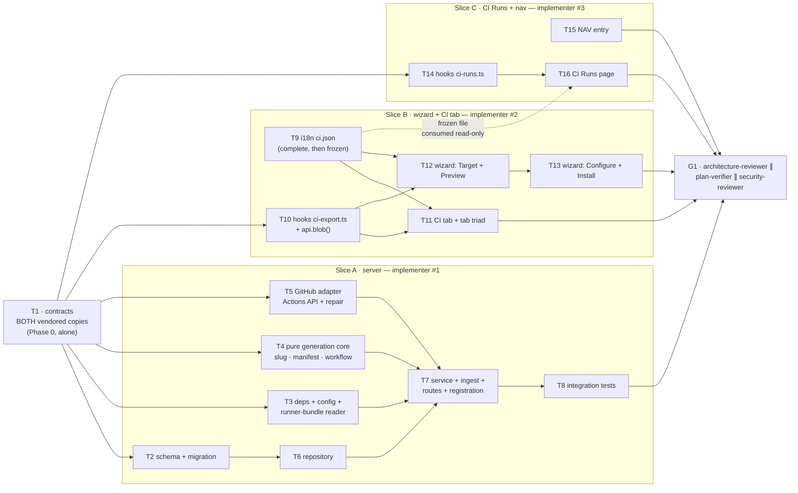

# Implementation Plan: Export to CI

## Overview

Turn a tuned agent (model + system prompt + linked skills + settings) into a self-contained CI
installation: a 4-step Export Wizard serialises the agent into a manifest, its skills, an empty
memory file, the ncc-built `agent-runner` bundle and a hardened GitHub Actions workflow, commits
them as one atomic commit onto a `devdigest/ci` branch, and opens a pull request. Results come back
on an explicit Refresh that reads the Actions API, downloads `devdigest-result.json` and writes into
the **existing** run model (`agent_runs` with `source='ci'`) plus `ci_runs`. Two new screens surface
it: a CI Runs page and a CI tab on the agent editor.

## Source spec

`/Users/igornegrutsa/Projects/dev-digest/specs/2026-08-03-export-to-ci.md`
(SPEC-2026-08-03-export-to-ci, status: **approved**, 83 EARS criteria, authoritative generated
workflow, 3-slice decomposition constraint).

## Execution mode

**multi-agent (parallel) — exactly 3 implementer agents**, one per the spec's *Decomposition
constraint* slices. Decided by the coordinator, not negotiated here.

| Slice | Agent | Owns |
|---|---|---|
| **A — Server** | implementer #1 | the `ci` module end to end (generation, install, ingest), schema + migration, the Actions-API capability on the GitHub adapter **and the repair of the three never-called write methods**, and — in a blocking Phase 0 — **both vendored copies of `contracts/eval-ci.ts`** |
| **B — Client · wizard + agent CI tab** | implementer #2 | `client/src/app/agents/[id]/**`, `client/src/lib/hooks/ci-export.ts`, `client/src/lib/api.ts`, and `client/messages/en/ci.json` (additive, then frozen) |
| **C — Client · CI Runs page + nav** | implementer #3 | `client/src/app/ci-runs/**`, `client/src/lib/hooks/ci-runs.ts`, the one `NAV` entry in `client/src/vendor/ui/nav.ts` |

**What actually runs concurrently.**

- **Phase 0 is strictly serial and blocking.** T1 (the vendored contract reconciliation + every new
  contract shape) runs **alone**. Nothing else starts until `diff` of the two copies is empty and
  both typechecks pass. All three slices type against T1.
- **Phase 1: slices A, B and C run fully concurrently.** No path overlap.
  - Inside **slice A** the true parallel-safe set after T1 is `{T2, T3, T4, T5}` — four independent
    tasks. One agent owns the slice so it works them in order, but T6 needs T2, and T7 needs
    T3+T4+T5+T6. T8 needs T7.
  - Inside **slice B**, T9 (i18n) and T10 (hooks) are independent of each other and both must land
    before T11/T12/T13. T12 → T13 (the wizard's Configure step regenerates what Preview renders).
  - Inside **slice C**, T14 (hooks) and T15 (nav) are independent; T16 needs T14.
- **Slices B and C never wait on slice A's runtime.** They compile against T1's contracts. They can
  only be *manually* verified once slice A's routes exist — that is the Phase 2 gate's job, not a
  build dependency.

**Slice C does not edit `client/messages/en/ci.json`.** Slice B's T9 completes the whole `ci`
namespace — including the `runs.*` keys slice C is missing — and the file is frozen from that
moment. This is the same treatment `multiAgent.json` got in `docs/plans/multi-agent-review.md`.

---

## ⚠ Plan-wide hard rules (repeat these to every implementer)

1. **`agent-runner/` and `reviewer-core/` are READ-ONLY.** Not one file in either package is
   created, edited, or deleted. The export reads `agent-runner/dist/` as opaque bytes and imports
   nothing from either package. Any task whose diff touches those trees has failed.
2. **Do not enter the just-finished feature's territory.** `server/src/modules/multi-runs/`,
   `server/src/modules/reviews/`, `client/src/app/multi-agent-review/` and
   `client/src/app/repos/[repoId]/pulls/` carry **uncommitted, implemented-and-verified** work from
   the previous feature. A stray edit there is indistinguishable from a regression.
3. **🚩 NO `git stash`, `git reset`, `git checkout --`, `git clean`, or `git restore` — by anyone,
   for any reason.** The working tree carries **three features' worth of uncommitted work**. On the
   previous run an implementer ran `git stash` to test a hypothesis and briefly wiped two other
   agents' in-progress work. If you need to test "what does this look like without my change",
   comment the code out or copy the file to the scratchpad — never touch the index or the worktree
   through git. `git diff` / `git status` / `git log` (read-only) are fine.
4. **Migrations:** schema change → `pnpm db:generate` → `pnpm db:migrate`. Never hand-author SQL.
   Migrations are **not** applied on boot.
5. **No new `vendor/ui` primitive.** `ExportWizardSteps`, `Modal`, `Button`, `Badge`, `Chip`,
   `FormField`, `EmptyState`, `Toggle`, `Checkbox`, `SelectInput`, `SearchableSelect`, `Icon`,
   `MonoLink`, `Card` all exist. The **only** sanctioned `vendor/ui` edit in this whole plan is the
   single `NAV` entry in T15.
6. **Secrets via `container.secrets`, never `process.env`.** Path/config values go through the
   server config object, not `process.env` reads scattered in services.

---

## Requirements (verified)

Restated from the spec and grouped by AC block. Every `AC-N` id is carried verbatim into task
`Acceptance` fields.

- **R1 — Data model & contracts** (AC-1 – AC-6): one installation per (agent, repository) enforced by
  a DB unique constraint; installation carries post_as, triggers, base, **pinned** manifest path,
  workflow path, monotonic workflow version, export PR URL, last-ingest timestamp; `ci_runs` carries
  workspace, nullable `agent_runs` ref, GitHub Actions run id (the idempotency key), agent-name
  snapshot, PR-title snapshot, duration and per-severity counts; all schema changes generated by
  drizzle-kit, never hand-authored, never applied on boot.
- **R2 — The exported file set** (AC-7 – AC-16): exactly manifest + one file per linked **enabled**
  skill + empty `memory.jsonl` + **every** file in the runner build output copied byte-for-byte +
  the workflow; manifest validates under the shared `AgentManifest`; no secret in any file;
  deterministic ASCII slugs with order-based disambiguation and an empty-name fallback; a missing or
  **partially readable** bundle fails the **whole** export with zero commits.
- **R3 — The generated workflow is the security boundary** (AC-17 – AC-26): exactly
  `contents: read` + `pull-requests: write`; credentials only via `${{ secrets.* }}`; `post_as` via
  `DEVDIGEST_POST_AS` env and **not** in the manifest; an explicit fork guard; `on:` = `{pull_request}`
  only; `persist-credentials: false`; only first-party `actions/*` in `uses:`; `timeout-minutes`;
  per-PR `concurrency` with `cancel-in-progress`; unconditional artifact upload with compression off
  and `if-no-files-found: warn`.
- **R4 — Install** (AC-27 – AC-33): one atomic commit onto `devdigest/ci`, branch created from the
  configured base when absent; **never** the default branch; layering onto an existing branch
  preserves unrelated files; an open PR for the branch is reused, otherwise one is opened; the
  installation is upserted and its workflow version incremented; a failed commit/PR records no
  successful installation.
- **R5 — Ingest on Refresh** (AC-34 – AC-44): list workflow runs → download `devdigest-result.json`
  → validate against the shared `CiResultArtifact` → write one `agent_runs` row with `source='ci'`
  and one linked `ci_runs` row; no webhook, no upload; PR link resolved when the PR is known,
  otherwise left null; per-run resilience (artifact-less / malformed / oversized runs fail only
  themselves); a missing token yields the existing config-error contract naming `GITHUB_TOKEN`; a
  403 from the Actions API yields a **distinct** message naming the missing **Actions read** scope;
  one Refresh is bounded by a **named constant**.
- **R6 — CI Runs page** (AC-45 – AC-53): heading + sub-line from `ci.runs.*`; the design's nine
  columns in order; `#<number>` + truncated title with no fabricated title; a severity-coloured
  findings cell rendering `—` (never `0`) when empty; a four-state dotted status badge distinguishable
  by text; a trailing link to the Actions job; the five filter chips; a Refresh control with a
  distinct in-progress state; the design's empty state with a CTA.
- **R7 — Agent CI tab** (AC-54 – AC-61): a `CI` tab positioned last with its key consistent across
  the route's valid-tab list, the editor's tab constant and the render switch; empty state with
  `Add to CI`; `CI deployment` header with active-repository count and two actions; one row per
  installation with repo name, target badge, most-recent-run-derived status, workflow version and a
  relative timestamp; an explicit **pending** status before the first ingest; the `Fail CI on` card
  bound to the agent's existing gate-policy field, persisting immediately; a **drift notice** when
  the studio policy has changed since the last export; a dashed `Add repository` control.
- **R8 — Export Wizard** (AC-62 – AC-78): 720-wide modal, four-label step indicator reusing
  `ExportWizardSteps`, `Back`/`Continue`/`Install` footer; four target cards with three visibly and
  programmatically disabled and inert; repository chosen from the **workspace**; provider block;
  already-claimed-repository block; two-pane preview over the exact AC-7 file set; only the workflow
  editable; runner bundle shown as a placeholder; regenerate-on-config-change with an explicit
  notice; trigger chips with `opened`+`synchronize` mandatory; three `Post results as` radios; the
  branch-protection info card; the install card producing the PR URL; the zip fallback.
- **R9 — Navigation and i18n** (AC-79 – AC-83): exactly one `CI Runs` sidebar entry with a key
  consistent across the nav definition, shell messages and the active-route resolver; a command
  palette entry; the pre-scaffolded `ci` namespace consumed, never duplicated; message-file edits
  strictly additive; the dead `publishDialog` group left in place and unreferenced.
- **R10 — Repair the unproven adapter methods** (spec *What exists but is unproven*): `commitFiles`,
  `openPullRequest` and `findOpenPr` have **zero callers**. This feature is their first consumer.
  AC-27 – AC-33 must be **demonstrated against a real throwaway repository**, not asserted from
  mocks; fixing the adapter where reality diverges from its doc-comments is in scope.
- **R11 — Non-functional**: generation < 500 ms p95 excluding the byte copy; install < 10 s p95 with
  a distinct client in-progress state throughout; ingest bounded by a named constant, artifacts
  > 256 KB rejected as malformed, cap-sized batch < 20 s p95; export/install and ingest routes each
  ≤ 6 req/min; CI Runs list < 300 ms p95 for 200 rows; CI Runs page auto-re-reads the **local** table
  every 30 s while visible (never a background GitHub poll); zero new LLM calls; WCAG 2.1 AA.

---

## Open questions & recommendations

These are recommendations to the coordinator, **not** spec edits. Each carries a default that the
tasks below already encode, so the plan is executable as written.

- **🚩 Rec 1 — the server has no YAML and no ZIP library; the plan adds two dependencies.**
  Verified: `server/package.json` has neither. But the feature needs to *emit* YAML (the manifest,
  AC-8), *create* a zip (AC-78) and *extract* a zip (the Actions artifact download returns a zip —
  AC-34, AC-41).
  **Default encoded in T3:** add `yaml@^2.6.1` (the exact version `agent-runner` already parses the
  manifest with, so studio-write and runner-read round-trip through one implementation) and
  `fflate@^0.8` (tiny, zero-dependency, synchronous, both directions).
  *Alternative if you want zero new deps:* hand-roll a store-only (method 0) zip writer plus a
  central-directory reader over `node:zlib.inflateRaw` — about 140 lines and entirely doable, but it
  puts a hand-written archive parser on the path that ingests **untrusted bytes from someone else's
  CI**, which is exactly where I would least like bespoke parsing code. Hand-rolling the YAML
  emitter is worse: `system_prompt` is multi-line free text and block-scalar escaping is a silent-
  failure class that surfaces inside a stranger's CI run.
  **⚠ Trap either way:** `server/package.json` may be `git skip-worktree` in this clone. T3 must
  check `git ls-files -v server/package.json` (`S` = set) and, if set, clear it before editing —
  otherwise the dependency addition is invisible to git and the next clone crashes at import.

- **Rec 2 — AC-60 needs a column AC-2 does not name.** The drift notice requires comparing the
  agent's **current** `ci_fail_on` against the value that was **last exported**. The exported value
  travels inside the committed manifest, which the server cannot read back. AC-2 says "at minimum",
  so T2 adds `exported_ci_fail_on` to `ci_installations`. Without it AC-60 is unimplementable.

- **Rec 3 — a skipped workflow run gets no `ci_runs` row.** AC-40 wants a skipped fork-PR job
  recorded as "non-ingested rather than failed", but `CiRunStatus` is frozen at
  `succeeded | failed | no_findings | running` — none of which means "skipped". **Default encoded in
  T7:** a workflow run whose conclusion is `skipped` produces **zero** rows, is never downloaded, and
  is counted under `skipped` in the ingest response. This is idempotent by construction (the same
  bounded window re-derives the same answer every Refresh, at zero API cost), keeps the CI Runs table
  honest, and satisfies AC-5's "exactly one row per workflow run" trivially. *Accepted consequence:* a
  repository swamped by fork PRs can fill the per-refresh cap with skipped runs — recorded under
  Risks.

- **🚩 Rec 4 — the `blockMergeDesc` message contradicts AC-76.** `client/messages/en/ci.json`
  already ships `exportWizard.blockMergeDesc` = *"Requires a GitHub App — not available with PAT in
  local mode"*. AC-76 requires the Configure step to say the opposite: that **no GitHub App is
  needed**. AC-82 forbids renaming or repurposing an existing key. **Default encoded in T9:** add a
  **new** key `exportWizard.blockMergeInfo` carrying the AC-76 copy and leave `blockMergeDesc`
  in place and unreferenced, exactly as `publishDialog` is left (AC-83).

- **Rec 5 — the `commitFiles` doc-comment does not describe the code, and the gap is load-bearing
  here.** The comment claims an atomic *"blobs → tree → commit → ref"* sequence. The implementation
  (`server/src/adapters/github/octokit.ts:264-330`) **never calls `createBlob`** — it inlines every
  file's text into a single `createTree` call. This feature's first commit carries **~1.6 MB of
  runner bundle in one `createTree` request body**, which is precisely the case that sequence exists
  to avoid. T5 treats blob-first as the expected repair, not a speculative one.

- **Rec 6 — one query hook file per slice, and neither touches the hooks barrel.** The spec assigns
  "its query hooks under `client/src/lib/hooks/`" to **both** client slices, which would collide on
  one file. T10 owns `client/src/lib/hooks/ci-export.ts`, T14 owns
  `client/src/lib/hooks/ci-runs.ts`, and **neither edits `client/src/lib/hooks/index.ts`** — both
  import their module path directly.

---

## Affected packages & contracts

- **`server` (`@devdigest/api`)** — new `src/modules/ci/` module registered statically in
  `src/modules/index.ts`; `src/db/schema/ci.ts` extended + one generated migration; the GitHub
  adapter gains an Actions read surface and its three write methods get repaired; two new
  dependencies (`yaml`, `fflate`); one config field (`runnerDistDir`).
- **`client` (`@devdigest/web`)** — a `CI` tab on the agent editor plus the Export Wizard under
  `src/app/agents/[id]/`; a new `/ci-runs` route tree; two new hook files; a binary-download helper
  on `src/lib/api.ts`; one `NAV` entry; the `ci` message namespace completed additively.
- **Contracts (vendored `@devdigest/shared`, two-sided — T1, Phase 0, serialized):**
  reconcile `contracts/eval-ci.ts` to the **server copy** (adopting `AgentManifest`,
  `CiResultArtifact` and the `openrouter` provider value into the client), then add, **to both
  copies in lock-step**, `CiExportInput.workflow`, the extended `CiInstallation`, the extended
  `CiRun`, `CiRunsResponse`, `CiExport` (file set + repo + count), and `CiIngestResult`.
- **Server-only contract (no client mirroring obligation, and the spec says so explicitly):**
  `server/src/vendor/shared/adapters.ts` gains the Actions methods on `GitHubClient`. No client file
  imports any adapter interface — do not "sync" this to the client copy.
- **Frozen, must not change:** `AgentManifest`, `CiResultArtifact`, `CiTarget`, `CiFile`,
  `CiRunStatus` (`agent-runner` consumes the first two).
- **Untouched by this plan (enforced per task):** `agent-runner/`, `reviewer-core/`, `mcp-server/`,
  `e2e/`, `server/src/modules/multi-runs/`, `server/src/modules/reviews/`,
  `client/src/app/multi-agent-review/`, `client/src/app/repos/[repoId]/pulls/`.

---

## Architecture changes

### Server (onion layering)

```
server/src/modules/ci/
  constants.ts       # literals: branch, paths, caps, artifact name        (—)
  slug.ts            # DOMAIN CORE — pure slugging + disambiguation        (AC-10, AC-11)
  manifest.ts        # DOMAIN CORE — pure AgentManifest build + YAML emit  (AC-8, AC-19)
  workflow.ts        # DOMAIN CORE — pure workflow generator               (AC-17 – AC-26)
  generation.ts      # DOMAIN CORE — pure file-set assembly (runner bytes  (AC-7, AC-12, AC-16)
                     #   are an INJECTED argument, so this stays zero-I/O)
  runner-bundle.ts   # INFRASTRUCTURE — the only fs reader in the module   (AC-13 – AC-15a)
  archive.ts         # INFRASTRUCTURE — zip create / zip extract (fflate)  (AC-41, AC-78)
  repository.ts      # INFRASTRUCTURE — the only Drizzle importer          (AC-1 – AC-5)
  service.ts         # APPLICATION — export/install orchestration          (AC-27 – AC-33, AC-66 – AC-68)
  ingest.ts          # APPLICATION — the Refresh use case                  (AC-34 – AC-44)
  helpers.ts         # DOMAIN CORE — DTO mapping only
  routes.ts          # TRANSPORT — zod schemas, getContext, delegate
  index.ts
```

**Why `generation.ts` takes the runner bytes as an argument.** It keeps the entire security-relevant
generation path — manifest, workflow, slugs, the exact path list — a pure function that unit tests
can exercise with no filesystem, no database and no GitHub. The one thing that must touch `fs`
(`runner-bundle.ts`) is isolated so AC-15/AC-15a can be tested by injecting a failing reader.

**Routes** (all under the module plugin, registered statically in `server/src/modules/index.ts`):

| Route | Purpose | Limit | ACs |
|---|---|---|---|
| `POST /agents/:id/export-ci` | `action:'files'` → generate + return the file set (no commit, no row). `action:'open_pr'` → generate + commit + resolve-or-open PR + upsert installation. | 6/min | AC-7 – AC-16, AC-27 – AC-33, AC-66 – AC-68 |
| `POST /agents/:id/export-ci/zip` | same generation, returns `application/zip`, **zero** GitHub calls | 6/min | AC-78 |
| `GET /agents/:id/ci-installations` | the agent CI tab's rows (+ derived status, last activity, drift flag) | global | AC-56 – AC-60 |
| `GET /ci-runs` | workspace-scoped rows + the facets the filter chips need | global | AC-45 – AC-51 |
| `POST /ci-runs/refresh` | the GitHub pull; returns `CiIngestResult` | 6/min | AC-34 – AC-44, AC-52 |

**GitHub adapter (server-only interface change).** `GitHubClient` in
`server/src/vendor/shared/adapters.ts` gains three read methods, implemented in
`server/src/adapters/github/octokit.ts` over the already-present Octokit client
(`octokit.rest.actions.*`) and mirrored in `server/src/adapters/mocks.ts` so the ingest path stays
mockable:

```
listWorkflowRuns(repo, workflowFile, limit)  -> WorkflowRunMeta[]   // newest first
listRunArtifacts(repo, runId)                -> ArtifactMeta[]
downloadArtifact(repo, artifactId)           -> Uint8Array          // a zip archive
```

### Client (RSC boundaries)

- `client/src/app/ci-runs/page.tsx` — thin RSC segment (the `/eval` precedent); the interactive work
  lives in `'use client'` leaves under `client/src/app/ci-runs/_components/CiRunsView/`.
- `client/src/app/agents/[id]/_components/AgentEditor/_components/CITab/` — the CI tab, colocated
  beside `ConfigTab` / `SkillsTab` / `ContextTab` / `EvalsTab`.
- `client/src/app/agents/[id]/_components/AgentEditor/_components/CITab/_components/ExportWizard/` —
  the wizard modal, colocated with its only consumer (the CI tab), with its own `styles.ts` /
  `constants.ts` / `helpers.ts`.
- Data access strictly through TanStack Query hooks (`ci-export.ts`, `ci-runs.ts`); no raw `fetch`
  in components. The **one** exception is the zip download, which must read a `Blob` — that goes
  through a new `api.blob()` helper in `client/src/lib/api.ts`, still called from a hook.
- Strings via `useTranslations("ci")`.

### Design sources (authoritative for structure and styling)

```
/private/tmp/claude-501/-Users-igornegrutsa-Projects-dev-digest/cf0fdcdb-e3aa-495a-b832-d7facbdfa3fe/scratchpad/design-src/
```

| File | What it defines | Used by |
|---|---|---|
| `screen_export.jsx` | `CI_TARGETS` (:3), `EXPORT_TREE` (:10), `YAML_PREVIEW` (:18), `FileTreeRow` (:37), `ExportWizard` (:46), Modal width 720, footer at :105-109 | T12, T13 |
| `screen_agents.jsx` | `CITab` (:121-160) — empty state :134, header row :136-141, `Fail CI on` card :142-149, repository rows :150-156, dashed `Add repository` :157-159 | T11 |
| `screen_cizruns.jsx` | `CI_STATUS` (:3), `CIFindingsCell` (:9), `ScreenCIRuns` (:18) — empty state :19-20, header :22-28, chips :29-34, grid `140px 1fr 150px 130px 70px 110px 70px 110px 80px` :36, rows :38-52 | T16 |
| `chrome.jsx` | the GLOBAL nav list; `{ key: "ci-runs", label: "CI Runs", icon: "Workflow" }` at :19 | T15 |
| `primitives.jsx`, `kit2.jsx` | `Modal` (kit2 :16-27), `Badge`, `Chip`, `Button`, `FormField`, `EmptyState`, `MonoLink`, `SEV` — consult when a token or prop is ambiguous | T11 – T13, T16 |

**🚩 Two things in `screen_export.jsx` are wrong and must NOT be copied** (repeated as per-task
gotchas):

1. **`YAML_PREVIEW` (:18-35) has no `permissions:` block, no fork guard, no concurrency group, no
   timeout, no `persist-credentials: false` and no artifact upload.** The generated workflow adds
   every one of those. The spec's YAML (reproduced in T4) is authoritative. Rendering the design
   string would ship the exact security hole this feature exists to close.
2. **The `run:` line (:32) passes CLI flags the runner does not accept** —
   `node .devdigest/runner.mjs review --agent … --pr … --fail-on critical`. `agent-runner` parses
   `process.argv` only to detect direct execution; it is entirely env-driven, and the bundle is a
   **directory** (`index.js` + a lazily-imported chunk + a `{"type":"module"}` marker), not a single
   `.mjs`. The real line is `node .devdigest/runner/index.js`.

Also note: `EXPORT_TREE` (:10-16) lists five files and **omits the runner entirely**. The real tree
carries the runner files too (AC-7, AC-71).

---

## Task DAG



---

## Phased tasks

### Phase 0 — Contracts (blocking; runs alone; nothing else may start)

- **T1 — Reconcile both vendored `contracts/eval-ci.ts` copies, then add every new shape in lock-step**
  - **Action:** Two movements, in this order.
    **(a) Reconcile.** The two copies have diverged by **33 lines** (pre-existing, predates all
    current work). Verified diff:
    - line 3 — server imports `Provider, CiFailOn` from `./knowledge.js`; client does not;
    - lines 207-235 — the entire `AgentManifest` block (schema + `AgentManifest` type +
      `AgentManifestInput` type + its doc comment) exists only in the server copy;
    - server line 312 / client line 283 — `ConformanceInput.provider` is
      `z.enum(['openai','anthropic','openrouter'])` on the server and
      `z.enum(['openai','anthropic'])` on the client.
    Adopt the **server copy as the source of truth** (it is the strict superset, and it is the copy
    the runner already consumes through a path alias). Bring the client copy to byte-identical
    parity. Both prerequisite symbols (`Provider`, `CiFailOn`) already exist in **both** copies of
    `contracts/knowledge.ts` — verified — so no other file needs touching, and
    `adapters.ts` / `knowledge.ts` / `productionize.ts` / `trace.ts` divergences are **explicitly out
    of scope** (spec *Contracts*) and must not be touched.
    **(b) Add, identically to both copies:**
    - `CiExportInput` gains `workflow: z.string().optional()` — the user's hand-edited workflow
      contents; absent means "generate it" (AC-70, AC-72).
    - `CiInstallation` gains `workspace_id`, `post_as` (`'github_review'|'pr_comment'|'none'`),
      `triggers: z.array(z.string())`, `base: z.string()`, `manifest_path: z.string()`,
      `workflow_path: z.string()`, `workflow_version: z.number().int()`,
      `pr_url: z.string().nullable()`, `last_ingest_at: z.string().nullable()`,
      `exported_ci_fail_on: CiFailOn.nullable()`, plus the derived
      `status: CiRunStatus.nullable()` (null ⇒ pending, AC-58),
      `last_activity_at: z.string().nullable()` and `policy_drift: z.boolean()` (AC-60).
    - `CiRun` gains `workspace_id`, `agent_run_id: z.string().nullable()`,
      `github_run_id: z.string()`, `repo: z.string()`, `pr_title: z.string().nullish()`, and
      `critical` / `warning` / `suggestion`, each `z.number().int().nullish()`. Keep the existing
      `agent` and `duration_s` fields — the migration finally gives them backing columns (AC-4).
    - New `CiRunsResponse` = `{ runs: CiRun[], agents: {id,name}[], repos: string[] }` so the chip
      row fills in one round trip.
    - `CiExport` gains `repo: z.string()` and `file_count: z.number().int()`; each `CiFile` entry may
      carry `placeholder: z.string().nullish()` (the runner-bundle marker, AC-71) — when present the
      client renders the placeholder and `contents` is the empty string.
    - New `CiIngestResult` = `{ examined, ingested, skipped, already_known, failures: { github_run_id, reason }[] }`
      so the client reports partial success honestly.
    **Do NOT touch** `AgentManifest`, `CiResultArtifact`, `CiTarget`, `CiFile`'s existing fields or
    `CiRunStatus` — `agent-runner` consumes them and the spec freezes them.
  - **Package:** server + client (vendored, two-sided) · **Type:** core · **Owner:** implementer #1
  - **Skills to use:** zod, typescript-expert
  - **Owned paths:** `server/src/vendor/shared/contracts/eval-ci.ts`,
    `client/src/vendor/shared/contracts/eval-ci.ts`
  - **Depends-on:** none
  - **Risk:** medium
  - **Known gotchas:** the two copies are hand-maintained and **not** auto-synced — a whole type has
    previously shipped missing from the client side with nothing failing typecheck
    (`client/INSIGHTS.md` 2026-07-29). Use `.nullish()` (not `.nullable()`) for anything parsed from
    already-persisted rows (`server/INSIGHTS.md` 2026-06-19). Adding a **required** field to a
    vendored contract breaks client fixtures built from a `Partial<>` helper with `TS2719`
    (`client/INSIGHTS.md` 2026-06-19) — every field added here is optional or nullish; keep it that
    way. The `AgentManifest` doc-comment refers to `CiService.agentYaml`, which does not exist yet —
    that is a forward reference to T4; do not "fix" it by deleting it. This task runs **alone**:
    do not start T2–T5 until it is done.
  - **Acceptance:** `diff server/src/vendor/shared/contracts/eval-ci.ts client/src/vendor/shared/contracts/eval-ci.ts`
    prints **nothing** and exits 0 — a literal byte-identical diff, not a typecheck;
    `cd server && pnpm typecheck` and `cd client && pnpm typecheck` both pass;
    `git diff --name-only` lists exactly those two files and nothing under `agent-runner/` or
    `reviewer-core/`. Traces to R1, the spec's *Contracts* section, and unblocks every other task.

---

### Phase 1 — Slice A ∥ Slice B ∥ Slice C (all three run concurrently)

#### Slice A — server (implementer #1)

- **T2 — Extend `ci_installations` / `ci_runs` + generated migration**
  - **Action:** In `server/src/db/schema/ci.ts`:
    **`ciInstallations`** gains — `workspaceId uuid NOT NULL REFERENCES workspaces(id) ON DELETE CASCADE`
    (so installation reads are workspace-scoped directly, not through a join, per the spec's data-model
    section); `postAs text NOT NULL DEFAULT 'github_review'`;
    `triggers jsonb NOT NULL DEFAULT '["opened","synchronize"]'` typed `$type<string[]>()`;
    `baseBranch text NOT NULL DEFAULT 'main'`; `manifestPath text NOT NULL` (**pinned at first
    install**, AC-3); `workflowPath text NOT NULL`;
    `workflowVersion integer NOT NULL DEFAULT 0` (AC-2, AC-32); `prUrl text`;
    `lastIngestAt timestamptz`; `exportedCiFailOn text` (Rec 2 → AC-60). Add
    **`unique(agentId, repo)`** (AC-1) and an index on `workspaceId`.
    **`ciRuns`** gains — `workspaceId uuid NOT NULL REFERENCES workspaces(id) ON DELETE CASCADE`;
    `agentRunId uuid REFERENCES agent_runs(id) ON DELETE SET NULL` (nullable, AC-4);
    `githubRunId text NOT NULL`; `repo text`; `agentName text`; `prTitle text`;
    `durationMs integer`; `critical integer`; `warning integer`; `suggestion integer`. Add
    **`unique(ciInstallationId, githubRunId)`** (AC-5, the ingest idempotency key) and indexes on
    `workspaceId` and `agentRunId` (Postgres does not auto-index FK columns).
    Then `cd server && pnpm db:generate` followed by `pnpm db:migrate`.
    **`agent_runs` is not altered** — its `source` already accepts `'ci'` with a `'local'` default,
    `pr_id`/`agent_id` are already nullable, and `duration_ms`/`cost_usd`/`findings_count`/`score`
    already exist (AC-37, verified in `server/src/db/schema/runs.ts`).
  - **Package:** server · **Type:** backend · **Owner:** implementer
  - **Skills to use:** drizzle-orm-patterns, postgresql-table-design, onion-architecture
  - **Owned paths:** `server/src/db/schema/ci.ts`, `server/src/db/migrations/` (generated output only)
  - **Depends-on:** T1
  - **Risk:** medium
  - **Known gotchas:** migrations are **NOT** applied on boot. **Never hand-author the SQL**, even
    with Docker down: without the matching `meta/00NN_snapshot.json` the next `pnpm db:generate`
    re-emits the same columns and the hand-written file is discarded (`server/INSIGHTS.md`
    2026-06-19). Both tables currently hold **zero rows** (zero readers and zero writers exist), so
    `NOT NULL` without a backfill is safe here — but drizzle-kit will still prompt for a default on a
    `NOT NULL` add; supply one in the schema rather than answering the prompt interactively.
    `unique(agentId, repo)` is what AC-1's observable ("a database-level uniqueness constraint on the
    pair exists") checks — put it on the table, not in application code. Do not add a `workspace_id`
    to `agent_runs`; it reaches the workspace through `agents`.
  - **Acceptance:** a new `server/src/db/migrations/00NN_*.sql` plus its `meta/00NN_snapshot.json`
    and a new `meta/_journal.json` entry exist and were produced by `pnpm db:generate` (not typed by
    hand); `pnpm db:migrate` applies cleanly against the running Postgres; `\d ci_installations`
    shows the unique constraint on `(agent_id, repo)` and `\d ci_runs` shows the unique constraint on
    `(ci_installation_id, github_run_id)`; `pnpm typecheck` passes. Traces to **AC-1, AC-2, AC-4,
    AC-5, AC-6, AC-37**.

- **T3 — Dependencies, `runnerDistDir` config, and the runner-bundle reader**
  - **Action:** Three pieces.
    **(a) Dependencies (see Rec 1).** First run `git ls-files -v server/package.json`; if the flag is
    `S` (skip-worktree), clear it with `git update-index --no-skip-worktree server/package.json`
    before editing, or the change is invisible to git and a fresh clone crashes at import. Then
    `cd server && pnpm add yaml@^2.6.1 fflate@^0.8`. `yaml` is pinned to the version `agent-runner`
    already parses the manifest with, so studio-write and runner-read go through one implementation.
    **(b) Config.** Add `runnerDistDir` to the server config object
    (`server/src/platform/config.ts`), defaulting to `path.resolve(process.cwd(), '../agent-runner/dist')`
    — the server runs and tests run with cwd `server/`. Make it overridable through the same
    `config()` factory that `buildApp({ config: config() })` already accepts, so T8 can point it at a
    fixture directory. This is a **path**, not a secret: it belongs in config, not `container.secrets`
    and not a scattered `process.env` read.
    **(c) `server/src/modules/ci/runner-bundle.ts`** — the module's **only** filesystem reader,
    exporting `readRunnerBundle(dir): Promise<{ path: string; contents: string }[]>`:
    - **read the directory** and ship every file it emits — never a hard-coded list. Today that is
      three files (`index.js` ≈ 1.57 MB, a build-generated chunk `300.index.js`, and a 23-byte
      `{"type":"module"}` `package.json`), but the chunk's name is build-generated and can change
      between builds **(AC-14)**;
    - copy **verbatim** — no rewriting, minifying, renaming or reassembling **(AC-13)**;
    - **if the directory is missing, empty or unreadable → throw a typed error whose message names
      the build command literally** (`cd agent-runner && pnpm build`). `agent-runner/dist/` is
      git-ignored (verified: `agent-runner/.gitignore:2`), so **"not built" is the default state of a
      fresh clone**, not a rare accident **(AC-15)**;
    - **if ANY single file cannot be read → fail the WHOLE read.** Never return a partial set
      **(AC-15a)**. Do not `Promise.allSettled` and keep the successes; use `Promise.all` and let the
      first rejection propagate.
    Also add `server/src/modules/ci/archive.ts` over `fflate`: `zipFiles(files) → Uint8Array`
    (AC-78) and `readArtifactJson(bytes, maxBytes) → unknown` which rejects anything over the cap
    before decompressing and rejects a non-extractable archive with a readable reason (AC-41).
    Add `server/src/modules/ci/constants.ts` with `CI_BRANCH = 'devdigest/ci'`,
    `WORKFLOW_PATH = '.github/workflows/devdigest-review.yml'`, `MANIFEST_DIR = '.devdigest/agents'`,
    `SKILLS_DIR = '.devdigest/skills'`, `MEMORY_PATH = '.devdigest/memory.jsonl'`,
    `RUNNER_DIR = '.devdigest/runner'`, `ARTIFACT_NAME = 'devdigest-result'`,
    `ARTIFACT_FILE = 'devdigest-result.json'`, `ARTIFACT_MAX_BYTES = 256 * 1024` and
    **`REFRESH_MAX_RUNS = 30`** — the named constant AC-44 requires.
  - **Package:** server · **Type:** backend · **Owner:** implementer
  - **Skills to use:** typescript-expert, onion-architecture, fastify-best-practices
  - **Owned paths:** `server/package.json`, `server/pnpm-lock.yaml`,
    `server/src/platform/config.ts`, `server/src/modules/ci/runner-bundle.ts`,
    `server/src/modules/ci/archive.ts`, `server/src/modules/ci/constants.ts`,
    `server/src/modules/ci/runner-bundle.test.ts`, `server/src/modules/ci/archive.test.ts`
  - **Depends-on:** T1
  - **Risk:** medium
  - **Known gotchas:** **🚩 `server/package.json` may be `git skip-worktree` in this clone** —
    check with `git ls-files -v server/package.json` (`S` = set) before editing; a dependency added
    behind that flag never reaches git (root `CLAUDE.md`). The runner bundle is **UTF-8 JavaScript
    text**, and the commit adapter can only send text (`createTree` takes `content`, not a binary
    blob sha, today) — reading as `utf8` and writing back is byte-identical for valid UTF-8, which
    ncc output is; do **not** attempt a base64 or binary round trip through `CiFile.contents`
    (a `z.string()`). `agent-runner/` is READ-ONLY — you read `dist/`, you never run its build as
    part of a task and you never edit it. AC-15a is the single worst failure mode in this feature:
    a PR carrying `index.js` without its lazily-imported chunk **installs cleanly, reviews as
    correct, merges, and then crashes at runtime inside someone else's CI**, far from its cause —
    shipping nothing is always better than shipping most of the bundle.
  - **Acceptance:** `cd server && pnpm exec vitest run --exclude '**/*.it.test.ts'` green, with unit
    tests asserting: a fixture directory of three files returns all three with **byte-identical**
    contents **(AC-13, AC-14)**; a missing directory throws an error whose message contains the
    literal runner build command **(AC-15)**; an empty directory throws the same class of error
    **(AC-15)**; a directory where one file is unreadable throws and returns **nothing at all** —
    the test asserts no partial array is produced **(AC-15a)**; `zipFiles` round-trips through the
    reader; an artifact over 256 KB and a truncated archive each reject with a readable reason
    **(AC-41)**; `REFRESH_MAX_RUNS` is exported as a named constant **(AC-44)**.
    `git ls-files -v server/package.json` does not report `S`, and `git diff --stat` shows
    `server/package.json` changed.

- **T4 — The pure generation core: slug, manifest, workflow, file set (+ unit tests)**
  - **Action:** Four **pure, zero-I/O** files — no `container`, no Drizzle, no `fs`, no
    `process.env`.
    **`slug.ts`** — lowercase, ASCII, hyphen-separated derivation **(AC-10)**; where two linked
    skills derive the same slug, disambiguate **deterministically by link order** so both filenames
    and the manifest's `skills` list stay in agreement and stable across repeated generations
    **(AC-10)**; where a name yields an empty slug, substitute a deterministic fallback identifier
    rather than emitting an empty filename **(AC-11)**.
    **`manifest.ts`** — build the `AgentManifest` object from the agent (name, provider, model,
    system prompt, the **ordered slugs of its linked enabled skills**, strategy, `ci_fail_on`) and
    serialise with `yaml.stringify` **(AC-8)**. **The manifest must NOT contain a `post_as` key** —
    that value travels as a workflow env var **(AC-19)**. It must contain no secret, key or token
    **(AC-9)**.
    **`workflow.ts`** — `renderWorkflow({ triggers, postAs, workflowVersion })` emitting **exactly**
    the spec's authoritative YAML, comments included (the user must be able to explain every line):

    ```yaml
    # Generated by DevDigest · Export to CI · workflow v{WORKFLOW_VERSION}
    # Safe to edit: re-exporting this agent replaces this file.
    name: DevDigest Review

    # ONLY pull_request. Never pull_request_target (it would run with a privileged
    # token in the base-repo context) and never issue_comment or any other
    # comment-driven trigger — comment text is attacker-controlled input, never a
    # command channel.
    on:
      pull_request:
        types: [{TRIGGERS}]

    # Least privilege. contents:read to check out .devdigest/, pull-requests:write
    # to post the review. Nothing wider "just in case".
    permissions:
      contents: read
      pull-requests: write

    # One review in flight per PR; a new push cancels the previous run.
    concurrency:
      group: devdigest-review-${{ github.event.pull_request.number }}
      cancel-in-progress: true

    jobs:
      review:
        # A PR from a fork receives NO repository secrets, so the review could only
        # start with an empty API key and fail. Skip it outright and say so.
        if: github.event.pull_request.head.repo.full_name == github.repository
        runs-on: ubuntu-latest
        timeout-minutes: 15
        steps:
          - name: Check out the pull request
            uses: actions/checkout@v4
            with:
              # Do not leave the job token in .git/config for a later step to read.
              persist-credentials: false

          - name: Set up Node
            uses: actions/setup-node@v4
            with:
              node-version: 22

          - name: Run DevDigest review
            # The reviewer is vendored in this repository under .devdigest/runner/
            # and was reviewed in the same pull request that added this file. No
            # marketplace action, so nothing outside this repo can change what runs.
            # The runner takes no CLI flags — everything is passed as env.
            run: node .devdigest/runner/index.js
            env:
              # Credentials come from this repository's Actions secrets ONLY. They
              # appear in no committed file and in no agent manifest.
              OPENROUTER_API_KEY: ${{ secrets.OPENROUTER_API_KEY }}
              GITHUB_TOKEN: ${{ secrets.GITHUB_TOKEN }}
              GITHUB_REPOSITORY: ${{ github.repository }}
              PR_NUMBER: ${{ github.event.pull_request.number }}
              DEVDIGEST_POST_AS: {POST_AS}

          - name: Upload result
            if: always()
            uses: actions/upload-artifact@v4
            with:
              name: devdigest-result
              path: devdigest-result.json
              if-no-files-found: warn
              compression-level: 0
    ```

    `{TRIGGERS}` and `{POST_AS}` are the **only** values Configure substitutes; `{WORKFLOW_VERSION}`
    is the installation's counter. **Emit this as a template string, not by round-tripping through
    `yaml.stringify`** — a YAML emitter will drop every comment, and the comments are an explicit
    requirement of the spec.
    **`generation.ts`** — `buildFileSet({ agent, skills, runnerFiles, manifestPath, config })`
    returning the ordered `CiFile[]`: the manifest at the installation's **pinned**
    `.devdigest/agents/<slug>.yaml` **(AC-3)**; one `.devdigest/skills/<slug>.md` per linked
    **enabled** skill (disabled skills are excluded from both the files and the manifest list, matching
    how a local run assembles skills); a **zero-byte** `.devdigest/memory.jsonl` **(AC-16)**; every
    runner file verbatim under `.devdigest/runner/` **(AC-7, AC-13, AC-14)**; and the workflow at
    `.github/workflows/devdigest-review.yml`. **And no other file.** Where the agent has no linked
    enabled skills, emit no skill files and an **empty** `skills` list in the manifest **(AC-12)**.
    Only the workflow entry is `editable: true`; every other entry is `editable: false` **(AC-70)**.
    Runner entries carry a `placeholder` marker and an empty `contents` **in the response shape only**
    — the full bytes go to the commit path **(AC-71)**.
    Write `slug.test.ts`, `manifest.test.ts`, `workflow.test.ts`, `generation.test.ts`.
  - **Package:** server · **Type:** core · **Owner:** implementer
  - **Skills to use:** typescript-expert, onion-architecture, zod, security
  - **Owned paths:** `server/src/modules/ci/slug.ts`, `server/src/modules/ci/manifest.ts`,
    `server/src/modules/ci/workflow.ts`, `server/src/modules/ci/generation.ts`,
    `server/src/modules/ci/types.ts`, and the four colocated `*.test.ts` files
  - **Depends-on:** T1
  - **Risk:** high — **this task is the feature's security boundary.** Every AC in the AC-17 – AC-26
    block is satisfied or missed here.
  - **Known gotchas:** **🚩 Do NOT copy `screen_export.jsx:18-35` (`YAML_PREVIEW`).** It has no
    `permissions:` block (so it silently inherits the repository's default token scope — the exact
    hole this feature closes), no fork guard, no concurrency group, no timeout, no
    `persist-credentials: false` and no artifact upload. **🚩 Do NOT copy its `run:` line (:32)** —
    `node .devdigest/runner.mjs review --agent … --pr … --fail-on critical` is fabricated:
    `agent-runner` reads `process.argv` only to detect direct execution and is entirely env-driven,
    and the bundle is a directory, not one `.mjs` file. The spec's YAML above is authoritative.
    `AgentManifest.skills` uses `.nullish().transform(v => v ?? [])` because YAML `skills:` with no
    value parses to `null` — an **empty array** serialises as `skills: []`, which is what AC-12 wants;
    verify the round trip rather than assuming. `strategy` on the agent row is
    `'single-pass'|'map-reduce'|'auto'` and the manifest enum matches — no mapping needed.
    `agent-runner/` and `reviewer-core/` are READ-ONLY: import `AgentManifest` from the **vendored
    server contract**, never from `agent-runner/src/`.
  - **Acceptance:** `cd server && pnpm exec vitest run --exclude '**/*.it.test.ts'` green, with tests
    asserting **at minimum**:
    *file set* — an agent with two enabled skills produces the exact path list of AC-7 and nothing
    else **(AC-7)**; a disabled linked skill appears in neither the files nor the manifest
    **(AC-7)**; a zero-skill agent produces no `.devdigest/skills/` entry and a manifest whose
    `skills` is `[]` **(AC-12)**; `.devdigest/memory.jsonl` is present with zero bytes and is not
    referenced by the manifest **(AC-16)**; a three-file runner fixture yields three
    `.devdigest/runner/*` entries whose bytes equal the source **(AC-13, AC-14)**.
    *manifest* — the generated YAML parses under the shared `AgentManifest` and succeeds, and a
    deliberately corrupted field fails the same schema **(AC-8)**; the parsed object has **no**
    `post_as` key **(AC-19)**; a scan of every generated file for the configured secret values and
    for `OPENROUTER_API_KEY`/`GITHUB_TOKEN`-shaped literals finds none outside `${{ secrets.… }}`
    expressions **(AC-9, AC-18)**.
    *slugs* — `Secret Leakage Gate` and `secret-leakage gate` produce two distinct, stable filenames
    across repeated generations and the manifest list matches them exactly **(AC-10)**; an agent
    named only with non-ASCII characters yields a valid, reproducible manifest path **(AC-11)**.
    *workflow, parsed with `yaml.parse`* — `permissions` equals exactly
    `{contents:'read', 'pull-requests':'write'}` and nothing else **(AC-17)**; the `on:` key set
    equals exactly `{pull_request}` and contains none of `pull_request_target`, `issue_comment`,
    `pull_request_review_comment`, `workflow_run` **(AC-21)**; the job's `if` is exactly
    `github.event.pull_request.head.repo.full_name == github.repository` **(AC-20)**; the checkout
    step carries `persist-credentials: false` **(AC-22)**; every `uses:` value starts with `actions/`
    and none names a DevDigest action **(AC-23)**; the job carries `timeout-minutes` **(AC-24)**; a
    `concurrency` block is keyed by the PR number with `cancel-in-progress: true` **(AC-25)**; the
    upload step is present with name `devdigest-result`, `if: always()`, `compression-level: 0` and
    `if-no-files-found: warn` **(AC-26)**; `DEVDIGEST_POST_AS` reflects the configured value
    **(AC-19)**; `types:` reflects the active trigger chips **(AC-73)**; the `run:` line is exactly
    `node .devdigest/runner/index.js` with **no** CLI flags **(spec deviation 2 and 3)**.

- **T5 — GitHub adapter: Actions read surface + repair of the three never-called write methods**
  - **Action:** Two movements.
    **(a) New Actions capability.** Extend the `GitHubClient` interface in
    `server/src/vendor/shared/adapters.ts` (**server-side only — no client mirroring; the spec states
    this exemption explicitly so a reviewer does not read it as a missed sync**) with
    `listWorkflowRuns(repo, workflowFile, limit)`, `listRunArtifacts(repo, runId)` and
    `downloadArtifact(repo, artifactId)`, plus the `WorkflowRunMeta` / `ArtifactMeta` shapes.
    Implement in `server/src/adapters/github/octokit.ts` over the existing Octokit client
    (`octokit.rest.actions.listWorkflowRuns` with `workflow_id` = the workflow **filename**,
    `listWorkflowRunArtifacts`, `downloadArtifact` with `archive_format: 'zip'`), wrapped in the
    same `withRetry(withTimeout(...))` envelope every other method uses. `WorkflowRunMeta` carries
    `id`, `status`, `conclusion`, `html_url`, `created_at`, `updated_at`, `run_started_at`,
    `display_title` (the PR title snapshot, AC-4) and `pull_number` (from
    `run.pull_requests?.[0]?.number ?? null`). **Map a 403 from any of these three to a distinct
    typed error naming the missing `Actions: read` scope** — not a generic failure — because the
    export/commit path does not need that scope and keeps working **(AC-43)**. Mirror all three in
    `server/src/adapters/mocks.ts` so the ingest path stays mockable for T8.
    **(b) Repair the write path.** These three methods have **zero callers anywhere in the
    repository** (verified) — their documented behaviour is a doc-comment claim, not an observed
    fact. Expected repairs, each to be confirmed against a real repository in the manual pass:
    - **`commitFiles` never creates blobs** (`octokit.ts:264-330`) despite its doc-comment claiming
      *"blobs → tree → commit → ref"* — it inlines every file's text into one `createTree` call. This
      feature's first commit carries **~1.6 MB of runner bundle**, which is exactly the case that
      sequence exists to avoid. Switch to `createBlob` per file (base64 encoding) and reference the
      returned `sha` in the tree. Update the doc-comment to describe what the code does.
    - **`commitFiles` swallows non-404 errors** on `getRef(heads/<branch>)`: a 403 or a network
      failure is caught by the bare `catch` and silently treated as "the branch does not exist",
      after which the commit lands on a branch created from base — masking an auth failure as a
      first install. Distinguish 404 from everything else and rethrow the rest.
    - **`commitFiles` uses `updateRef({ force: true })`** on an existing branch. The parent is the
      branch's own tip so the update is a fast-forward; `force: true` only makes a concurrent-write
      race silently destructive. Set it to `false`.
    - **`findOpenPr`** passes `head: \`${owner}:${branch}\``, which is correct — verify against the
      real repository rather than changing it speculatively.
    Do **not** change any method's signature beyond what the interface addition requires; existing
    callers of `postReview`/`listPullRequests`/etc. must be unaffected.
  - **Package:** server · **Type:** backend · **Owner:** implementer
  - **Skills to use:** typescript-expert, onion-architecture, security
  - **Owned paths:** `server/src/vendor/shared/adapters.ts`,
    `server/src/adapters/github/octokit.ts`, `server/src/adapters/mocks.ts`
  - **Depends-on:** T1
  - **Risk:** high — untested-in-production code becomes load-bearing here.
  - **Known gotchas:** **do NOT mirror `adapters.ts` into the client copy.** No client file imports
    any adapter interface, and the spec exempts it explicitly (*Contracts*, final bullet) — mirroring
    it would widen the diff and invite a "missed sync" finding that is not one.
    `container.github()` is **async** and throws `ConfigError('GITHUB_TOKEN is not configured')` when
    the secret is absent (`server/src/platform/container.ts:153-160`) — that is the existing
    configuration-error contract AC-42 requires; reuse it, do not invent a second one.
    `downloadArtifact` returns a **redirect that Octokit follows**; the body is an `ArrayBuffer`, and
    it is a **zip**, not the JSON — extraction is `archive.ts`'s job (T3), not the adapter's. Bound
    it: read no more than `ARTIFACT_MAX_BYTES` **(AC-41, and it is untrusted input from someone
    else's CI)**. `run.pull_requests` is frequently **empty** for a `pull_request`-triggered run;
    prefer the artifact's own `pr_number` and fall back to this — T7 owns that precedence.
    `reviewer-core/` and `agent-runner/` are READ-ONLY.
  - **Acceptance:** `cd server && pnpm typecheck` passes and
    `pnpm exec vitest run --exclude '**/*.it.test.ts'` stays green; the mock client implements all
    three new methods so the ingest tests in T8 compile; `git diff` shows
    `client/src/vendor/shared/adapters.ts` **unchanged**; `git diff --name-only` lists nothing under
    `agent-runner/`, `reviewer-core/`, `server/src/modules/reviews/` or
    `server/src/modules/multi-runs/`. Behaviour is asserted in T8 (mocked) and, for AC-27 – AC-31,
    **against a real repository in the manual pass** — a mocked test cannot prove branch layering or
    PR reuse. Traces to **R10, AC-27 – AC-31, AC-34, AC-43**.

- **T6 — CI repository (the module's only Drizzle importer)**
  - **Action:** `server/src/modules/ci/repository.ts`, every query workspace-scoped:
    `findInstallation(workspaceId, agentId, repo)`;
    `findInstallationByRepo(workspaceId, repo)` — resolves AC-68's "already claimed by a **different**
    agent" check;
    `listInstallationsForAgent(workspaceId, agentId)` joined to each installation's **most recent**
    `ci_runs` row for the derived status and last-activity timestamp (AC-57, AC-58) — one query, not
    N;
    `upsertInstallation(...)` performing an `ON CONFLICT (agent_id, repo) DO UPDATE` that
    **preserves `manifest_path`** (pinned at first install, AC-3) and
    **increments `workflow_version` by one on every export** (AC-32), writing back `post_as`,
    `triggers`, `base_branch`, `pr_url`, `exported_ci_fail_on`;
    `touchLastIngest(installationId, ts)`;
    `findCiRunByGithubRunId(installationId, githubRunId)` — the idempotency lookup (AC-5);
    `insertCiRun(...)`;
    `listCiRuns(workspaceId, filters)` returning the rows **plus** the distinct agents and
    repositories present in the result set, so the chip row fills in one round trip (AC-51);
    `findPullRequest(workspaceId, repo, prNumber)` → the `pull_requests` row or null (AC-38).
    Reuse the **existing** agent-run write path rather than duplicating it: the ingest inserts through
    `agent_runs` with `source='ci'` — read `server/src/modules/agents/repository.ts:221-250` for how
    linked skills are joined (`agentSkills` → `skills`, ordered by `agentSkills.order`) and reuse that
    ordering for the manifest's `skills` list.
  - **Package:** server · **Type:** backend · **Owner:** implementer
  - **Skills to use:** drizzle-orm-patterns, postgresql-table-design, onion-architecture
  - **Owned paths:** `server/src/modules/ci/repository.ts`
  - **Depends-on:** T2
  - **Risk:** medium
  - **Known gotchas:** **`server/src/modules/reviews/` is off-limits** (previous feature's
    uncommitted territory) — if you need to create an `agent_runs` row, insert it from **this**
    repository against `t.agentRuns` directly rather than reaching into the reviews repository.
    Every query must be workspace-scoped; a CI run row from another workspace must be unreachable.
    Postgres `ON CONFLICT` needs the **exact** unique index T2 created — `(agent_id, repo)`, not a
    partial or expression index. Do **not** issue one query per installation for the derived status;
    AC-4's observable is that the table renders "with no live GitHub call", and R11 caps the runs
    list at 300 ms p95 for 200 rows.
  - **Acceptance:** `cd server && pnpm typecheck` passes; a grep confirms `repository.ts` is the only
    file under `server/src/modules/ci/` importing `drizzle-orm` or `db/schema`, and that
    `listInstallationsForAgent` and `listCiRuns` are each backed by a single statement. Behaviour is
    asserted in T8. Traces to **AC-1 – AC-5, AC-32, AC-38, AC-51, AC-57, AC-58**.

- **T7 — Service, ingest, routes, module registration**
  - **Action:** `server/src/modules/ci/service.ts` (application ring; adapters pulled off
    `container`, never `new`-ed; typed errors from `platform/errors.ts`):
    `generate(workspaceId, agentId, input)` — load the agent + its linked **enabled** skills; **block
    when the agent's provider is not `openrouter`** with a message naming the required provider,
    because the runner unconditionally constructs an OpenRouter provider from `OPENROUTER_API_KEY`
    **(AC-67)**; **constrain the target repository to one already in the caller's workspace** and
    reject anything else — this is the access-control boundary of the write path, since the target
    decides where the server's GitHub token writes **(AC-66)**; **block when the repository already
    has an installation for a different agent**, naming the installed agent **(AC-68)**; read the
    runner bundle (T3) — a missing or partially readable bundle rejects the **whole** request with
    **no commit, no PR and no installation row** **(AC-15, AC-15a)**; call `buildFileSet` (T4); use
    the client's `workflow` override when present and regenerate otherwise **(AC-70)**; return
    `CiExport` with runner entries reduced to placeholders **(AC-71)**.
    `install(...)` — generate as above, then `commitFiles` **once** onto `CI_BRANCH` with the
    configured base **(AC-27, AC-28)**; `findOpenPr(branch)` and **reuse** its URL if one exists,
    otherwise `openPullRequest(base)` **(AC-30, AC-31)**; **upsert the installation and increment its
    workflow version only after both succeed** — a failed commit or PR surfaces the underlying
    failure and records no successful installation **(AC-32, AC-33)**.
    `zip(...)` — generate, then `archive.zipFiles` over the **full** file set including the real
    runner bytes, with **zero** GitHub calls **(AC-78)**.
    `installations(workspaceId, agentId)` — repository pass-through plus the drift flag
    (`agent.ciFailOn !== installation.exportedCiFailOn`) **(AC-60)** and the pending status when no
    run has been ingested **(AC-58)**.
    `server/src/modules/ci/ingest.ts` (application ring, the Refresh use case):
    for each installation, `listWorkflowRuns(repo, WORKFLOW_FILE, REFRESH_MAX_RUNS)` newest-first
    **(AC-34, AC-44)**; skip runs whose `github_run_id` is already stored **(AC-5)**; a run whose
    conclusion is `skipped` produces **no rows at all**, is never downloaded, and is counted under
    `skipped` (Rec 3 → **AC-40**); a run still in progress is recorded/rendered as `Running`
    **(AC-49)**; otherwise `listRunArtifacts` → find `devdigest-result` → `downloadArtifact` →
    `archive.readArtifactJson` (256 KB cap) → **validate against the shared `CiResultArtifact` before
    persisting a single field** **(AC-39)**; on success write one `agent_runs` row with
    `source='ci'` carrying agent, duration, cost and findings count **and** one linked `ci_runs` row
    **(AC-36)**, resolving the PR link from `pull_requests` when the number is known and leaving it
    null otherwise **(AC-38)**; an artifact-less, malformed, oversized or non-extractable run is
    recorded as `failed` with a readable reason and **never aborts the batch** **(AC-40, AC-41)**;
    a missing token propagates the existing `ConfigError` naming `GITHUB_TOKEN` and changes no data
    **(AC-42)**; a 403 from the Actions API surfaces T5's distinct Actions-read message while the
    export path keeps working **(AC-43)**. Return `CiIngestResult`.
    PR-number precedence: the artifact's own `pr_number`, then `run.pull_requests[0].number`, then
    null. PR title snapshot: `run.display_title`.
    `server/src/modules/ci/routes.ts` — the five routes in the table above, with zod body/params/
    querystring schemas, `getContext(app.container, req)` for tenancy, `config: { rateLimit: { max: 6,
    timeWindow: '1 minute' } }` on the export, zip and refresh routes **(R11)**, and delegation to
    `service.*` / `ingest.*` only — **never** `repo.*`. The zip route sets
    `reply.header('content-type','application/zip')` and a `content-disposition` filename.
    `server/src/modules/ci/helpers.ts` — pure DTO mapping (rows → `CiInstallation` / `CiRun`,
    including `duration_ms` → `duration_s`). Register the module in `server/src/modules/index.ts`
    (one import + one entry).
    **Explicitly do not build:** no webhook route and no upload route **(AC-35)**.
  - **Package:** server · **Type:** backend · **Owner:** implementer
  - **Skills to use:** fastify-best-practices, zod, onion-architecture, typescript-expert, security
  - **Owned paths:** `server/src/modules/ci/service.ts`, `server/src/modules/ci/ingest.ts`,
    `server/src/modules/ci/routes.ts`, `server/src/modules/ci/helpers.ts`,
    `server/src/modules/ci/index.ts`, `server/src/modules/index.ts`
  - **Depends-on:** T3, T4, T5, T6
  - **Risk:** high
  - **Known gotchas:** feature modules are registered **statically** in `modules/index.ts` — there is
    no autoload. Routes must **never** hand-build an error response; throw the typed error and let the
    central handler serialize the `{ error: { code, message, details } }` envelope. ESM: relative
    imports carry the `.js` extension. `schema.querystring` with a zod schema is supported under
    `fastify-type-provider-zod` — `context/routes.ts` is the in-repo precedent
    (`server/INSIGHTS.md` 2026-07-18). Routes call `service.*`, never the repository directly
    (`server/INSIGHTS.md`). **The ingested artifact is untrusted input from someone else's CI:**
    validate before persisting, never interpolate any field into a prompt, a query, a URL or a
    command, and never render it as anything but escaped text. **Do not touch
    `server/src/modules/reviews/` or `server/src/modules/multi-runs/`** — write the `agent_runs` row
    through this module's own repository. **`AC-3` is easy to miss:** on a re-export the manifest path
    comes from the **stored installation**, not from a freshly slugged agent name — a renamed agent
    must keep its original file, because the runner hard-fails on more than one manifest and the
    commit API can add or replace files but cannot delete them.
  - **Acceptance:** `cd server && pnpm typecheck` passes and
    `pnpm exec vitest run --exclude '**/*.it.test.ts'` stays green; `REFRESH_MAX_RUNS` is
    **referenced** by the ingest path rather than inlined **(AC-44)**; a grep confirms no webhook and
    no upload route exists **(AC-35)**; `git diff --name-only` lists nothing under
    `agent-runner/`, `reviewer-core/`, `mcp-server/`, `e2e/`, `server/src/modules/reviews/` or
    `server/src/modules/multi-runs/`. Behaviour is asserted in T8. Traces to **AC-3, AC-15, AC-15a,
    AC-27 – AC-44, AC-66 – AC-68, AC-70, AC-71, AC-78**.

- **T8 — Server integration tests (mocked GitHub)**
  - **Action:** `server/src/modules/ci/ci.it.test.ts` — boot with
    `buildApp({ config: config({ runnerDistDir: <fixture> }), db, overrides: { github: mockClient } })`
    and drive over `app.inject`, following `server/src/modules/eval/eval.it.test.ts` as the
    precedent. Cover:
    *generation and blocks* — an agent with two enabled skills produces the exact AC-7 path list
    **(AC-7)**; a `runnerDistDir` pointing at a missing directory returns an error naming the build
    command with **zero** mock commits and **zero** installation rows **(AC-15)**; a fixture with one
    unreadable file produces the same — never a commit carrying the remaining files **(AC-15a)**; a
    non-`openrouter` agent is refused at generation **(AC-67)**; a repository outside the workspace is
    refused **(AC-66)**; a repository already installed for a different agent is refused with a
    message naming the installed agent, and nothing is committed **(AC-68)**.
    *install* — every mock commit targets `devdigest/ci` and the default branch is never a target
    **(AC-28)**; a second export with an already-open PR for the branch returns the first PR's URL
    and records **zero** additional create-PR calls **(AC-30)**; with no open PR exactly one is
    opened against the configured base and its URL is persisted **(AC-31)**; a second export of the
    same pair leaves **one** installation row whose `workflow_version` increased by exactly one
    **(AC-1, AC-32)**; a renamed agent's re-export touches the **original** manifest path and creates
    no second manifest file, while the manifest's `name` reflects the new name **(AC-3)**; a mocked
    commit failure and a mocked PR failure each yield a readable 4xx/5xx with **no** installation row
    (or an unchanged pre-existing one) **(AC-33)**.
    *ingest* — a fixture batch observes the list-runs call, the artifact download and the resulting
    rows **(AC-34)**; an ingested result yields one `agent_runs` row with `source='ci'` **and** one
    `ci_runs` row referencing it **(AC-36)**; Refresh invoked **three times** over the same fixture
    produces exactly one `ci_runs` row and one `agent_runs` row per workflow run **(AC-5)**; a result
    for an un-imported PR still yields both rows with a null pull-request reference **(AC-38)**; a
    malformed artifact is rejected and produces **no** row **(AC-39)**; a batch of one artifact-less
    run plus two good runs ingests all three deterministically and reports the artifact-less one as
    failed **(AC-40)**; a `skipped` conclusion produces zero rows and is counted under `skipped`
    **(AC-40, Rec 3)**; a truncated-archive fixture yields one failed row without preventing the
    others **(AC-41)**; with the secret cleared Refresh returns the `GITHUB_TOKEN` configuration error
    and the run tables are unchanged **(AC-42)**; a mocked 403 from the Actions API produces a message
    naming the missing **Actions read** permission while a subsequent export/commit still succeeds
    **(AC-43)**; a fixture with more runs than `REFRESH_MAX_RUNS` ingests exactly the cap's worth,
    newest first **(AC-44)**.
    *zip* — the download contains exactly the AC-7 file set and the mock GitHub client records
    **zero** calls **(AC-78)**.
    Inject a throwing LLM double via `ContainerOverrides.llm` to prove this feature makes **zero**
    model calls (R11).
  - **Package:** server · **Type:** backend · **Owner:** implementer
  - **Skills to use:** fastify-best-practices, drizzle-orm-patterns, typescript-expert
  - **Owned paths:** `server/src/modules/ci/ci.it.test.ts`,
    `server/src/modules/ci/__fixtures__/**`
  - **Depends-on:** T7
  - **Risk:** medium
  - **Known gotchas:** the file **must** end in `*.it.test.ts` or the unit lane runs it without
    Docker. `LocalNoAuthProvider.currentWorkspace()` always resolves the workspace literally named
    `'default'`, so a cross-workspace test needs no header manipulation — seed the resource under a
    second, differently-named workspace and call the route normally (`server/INSIGHTS.md` 2026-07-12).
    Build the runner fixture as a **temp directory of three small files**, not by pointing at the real
    1.6 MB bundle — the tests must not depend on `agent-runner` having been built, and they must never
    write into it. Seed workflow-run fixtures with **distinct, explicit** timestamps rather than
    relying on `defaultNow()`, or "newest first" assertions become timing-dependent.
    **A mocked test proves the ci module calls the adapter correctly; it cannot prove the adapter
    works** — AC-27, AC-29, AC-30 and AC-31 are verified against a **real repository** in the manual
    pass, and these mocked assertions are the secondary regression guard, exactly as the spec's
    *Install* preamble states.
  - **Acceptance:** `cd server && pnpm exec vitest run .it.test` green (Docker up) and
    `cd server && pnpm exec vitest run --exclude '**/*.it.test.ts'` still green. Traces to **AC-1,
    AC-3, AC-5, AC-7, AC-15, AC-15a, AC-28, AC-30 – AC-44, AC-66 – AC-68, AC-78**.

---

#### Slice B — client · Export Wizard + agent CI tab (implementer #2)

- **T9 — Complete `client/messages/en/ci.json` (additive), then it is FROZEN**
  - **Action:** Add every missing key so **no other task ever edits this file**. The `ci` namespace is
    pre-scaffolded with `runs`, `exportWizard`, `ciTab`, `publishDialog` and `page`; consume it, never
    introduce a parallel namespace **(AC-81)**. **The diff must be strictly additive — do not rename
    or repurpose any existing key** **(AC-82)**, and **leave the entire `publishDialog` group in place
    and unreferenced** **(AC-83)**.
    **`runs.*` — these are for SLICE C, which does not edit this file.** Add:
    `table.agent` ("Agent"), `table.duration` ("Dur.") — the design's grid has nine columns and the
    scaffold only names six **(AC-46)**; `filters.allSources` ("All sources") — the design's chip row
    has five chips and the scaffold has four **(AC-51)**; `emptyCta` ("Set up CI for an agent")
    **(AC-53)**; `viewJob` ("View job") for the trailing action cell **(AC-50)**; `noTitle` (empty
    string placeholder is not allowed — the cell renders `#<number>` alone, so this key is only for
    the aria-label) **(AC-47)**; `refreshDone` ("Ingested {ingested} of {examined} runs"),
    `refreshPartial` ("Ingested {ingested} of {examined}; {failed} failed") so partial success is
    reported honestly **(AC-52)**.
    **`exportWizard.*`** add: `targets.comingSoon` ("coming soon"),
    `targets.unavailable` ("{target} export is not available yet") for the accessible explanation on
    the three disabled cards **(AC-64)**; `providerBlocked` ("This agent runs on {provider}. The CI
    runner only executes OpenRouter agents — switch the agent's provider to OpenRouter to export it.")
    **(AC-67)**; `repoClaimed` ("{repo} already runs {agent} in CI. One agent per repository.")
    **(AC-68)**; `runnerPlaceholder` ("Runner bundle · {size} · contents not shown") **(AC-71)**;
    `workflowRegenerated` ("Your edits to the workflow were replaced because the configuration
    changed.") **(AC-72)**; `triggers.opened` / `triggers.synchronize` / `triggers.reopened`
    (`"pull_request:opened"` etc.) and `triggers.required` ("required") **(AC-73, AC-74)**;
    `postAsHint` ("Only GitHub review yields a verdict on the pull request.") **(AC-75)**;
    **`blockMergeInfo`** carrying the AC-76 copy — *"To block merges: set **Fail CI on** (CI tab) so
    the run exits non-zero, then add a **required status check** in the repo's GitHub branch
    protection. No GitHub App needed."* — as a **new** key, because the existing `blockMergeDesc`
    says the opposite ("Requires a GitHub App") and AC-82 forbids repurposing it (see Rec 4)
    **(AC-76)**; `zipCardTitle` ("Copy files as a zip"), `zipCardHint` ("add them manually")
    **(AC-78)**; `bundleSizeNote` ("Adds ~{size} of runner bundle to the repository.")
    **(NFR)**; `installedTitle` ("Pull request opened"), `openPr` ("View pull request"),
    `installError` ("Install failed — nothing was committed.") **(AC-77, AC-33)**;
    `runnerMissing` ("The CI runner bundle has not been built.") **(AC-15)**.
    **`ciTab.*`** add: `emptyTitle` ("Not in CI yet"),
    `emptyBody` ("Deploy this agent to run automatically on every pull request in a repo's CI
    pipeline."), `addToCi` ("Add to CI") **(AC-55)** — note the existing `ciTab.empty` references the
    dead publish flow and must **not** be reused; `deployment` ("CI deployment"),
    `activeIn` ("Active in {count} repos"), `updateConfig` ("Update CI config") **(AC-56)**;
    `workflowVersion` ("workflow v{version}") **(AC-57)**; `pending` ("Pending first run")
    **(AC-58)**; `failOnTitle` ("Fail CI on"), `failOnDesc` ("Exit non-zero when a finding at or above
    this severity lands. Pair with a required status check to block merges."),
    `failOn.critical` ("Critical"), `failOn.warning` ("Warning +"), `failOn.never` ("Never")
    **(AC-59)**; `driftNotice` ("CI still runs the previously exported policy ({exported}) until you
    re-export this agent.") **(AC-60)**; `addRepository` ("Add repository") **(AC-61)**.
  - **Package:** client · **Type:** ui · **Owner:** implementer
  - **Skills to use:** frontend-architecture
  - **Owned paths:** `client/messages/en/ci.json`
  - **Depends-on:** none
  - **Risk:** low
  - **Known gotchas:** i18n namespaces need **no registration** — `client/src/i18n/request.ts` merges
    every `messages/en/*.json` via `readdirSync`, and `ci.json` is already merged
    (`client/INSIGHTS.md` 2026-07-18). **From the moment this task completes the file is FROZEN:**
    T11–T13 and slice C's T16 consume it read-only, and any missing key is added by the orchestrator
    between phases — never by a concurrently-running implementer. **Deleting `publishDialog` is
    forbidden** (AC-83) even though nothing reads it, and **`blockMergeDesc` must stay** even though
    it is wrong (AC-82) — add `blockMergeInfo` beside it.
  - **Acceptance:** the file is valid JSON with no duplicate keys; `git diff client/messages/en/ci.json`
    shows **only additions**, zero deletions and zero renames **(AC-82)**; the `publishDialog` group is
    byte-identical to before **(AC-83)**; `cd client && pnpm test` stays green. Unblocks the copy for
    AC-45 – AC-78.

- **T10 — Query hooks `ci-export.ts` + a binary-download helper on the api client**
  - **Action:** Create `client/src/lib/hooks/ci-export.ts`:
    `useCiInstallations(agentId)` — `queryKey: ["ci-installations", agentId]`,
    `api.get<CiInstallation[]>(\`/agents/${agentId}/ci-installations\`)`, `enabled: !!agentId`;
    `useGenerateCiExport()` — `useMutation` over
    `api.post<CiExport>(\`/agents/${agentId}/export-ci\`, { ...input, action: "files" })`, used by the
    Preview step and re-fired whenever a Configure option changes **(AC-72)**;
    `useInstallCiExport()` — the same route with `action: "open_pr"`, invalidating
    `["ci-installations", agentId]` and `["ci-runs"]` on success **(AC-77)**;
    `useDownloadCiZip()` — a mutation that calls the new blob helper and triggers a browser download
    from an object URL, with **zero** other network calls **(AC-78)**.
    In `client/src/lib/api.ts` add a `blob(path, body?)` helper alongside the existing
    `get/post/put/patch/del` (which all assume JSON) — same base URL, same error handling, returning
    `Response.blob()`. Keep it a thin addition; do not restructure `apiFetch`.
    **Do not edit `client/src/lib/hooks/index.ts`** — import the module path directly (Rec 6).
    Add `client/src/lib/hooks/ci-export.test.tsx`.
  - **Package:** client · **Type:** ui · **Owner:** implementer
  - **Skills to use:** react-best-practices, frontend-architecture, react-testing-library,
    typescript-expert
  - **Owned paths:** `client/src/lib/hooks/ci-export.ts`,
    `client/src/lib/hooks/ci-export.test.tsx`, `client/src/lib/api.ts`
  - **Depends-on:** T1
  - **Risk:** low
  - **Known gotchas:** this repo has **no** `useApiQuery`/`useApiMutation` wrapper — use `useQuery` /
    `useMutation` directly over the `api` client, matching `client/src/lib/hooks/agents.ts`. The
    hook-test harness is `renderHook` with a `QueryClientProvider` wrapper built from
    `new QueryClient({ defaultOptions: { queries: { retry: false } } })`, mocking the single
    `@/lib/api` seam via `vi.mock` — **msw is not installed** (`client/INSIGHTS.md` 2026-07-18).
    `client/src/lib/hooks/ci-runs.ts` belongs to **slice C** — do not create it here.
  - **Acceptance:** `cd client && pnpm typecheck` and `pnpm test` green, with tests asserting: the
    generate mutation posts `action: "files"` and the install mutation posts `action: "open_pr"` to
    the same route; a successful install invalidates both `["ci-installations", agentId]` and
    `["ci-runs"]`; the zip hook calls `api.blob` exactly once and issues no other request
    **(AC-78)**. Unblocks AC-55 – AC-78.

- **T11 — The agent editor `CI` tab (tab triad + `CITab` component)**
  - **Action:** Add the tab in **all three** places a tab key is consumed, positioned **last**
    **(AC-54)**:
    1. `client/src/app/agents/[id]/page.tsx:15` — append `"ci"` to `VALID_TABS`;
    2. `client/src/app/agents/[id]/_components/AgentEditor/constants.ts:13-18` — append
       `{ key: "ci", labelKey: "editor.tabs.ci", icon: "Workflow" }` to `TABS`;
    3. `client/src/app/agents/[id]/_components/AgentEditor/AgentEditor.tsx:26-34` — add the render
       branch.
    If `agents.editor.tabs.ci` is missing from `client/messages/en/agents.json`, add **that one key**
    there (it is the agent namespace, not the `ci` namespace, and slice C never touches it).
    Then build
    `client/src/app/agents/[id]/_components/AgentEditor/_components/CITab/` with its own
    `styles.ts` / `constants.ts` / `helpers.ts` / `index.ts`, from
    **`design-src/screen_agents.jsx:121-160` (`CITab`)**:
    - **empty branch** (`useCiInstallations` returns none) — centred `EmptyState` with icon
      `Workflow`, title `Not in CI yet`, the explanatory body and an `Add to CI` CTA that opens the
      Export Wizard **(AC-55)**, styled per :133-134 (`maxWidth: 600, textAlign: center, padding:
      "40px 0"`);
    - **populated branch** — header row (:136-141) `CI deployment` at `fontSize: 16 / fontWeight: 700`,
      a dotted `Badge` reading the active-repository count, and right-aligned `Update CI config`
      (secondary, `RefreshCw`) + `Add to CI` (primary, `Plus`) **(AC-56)**;
    - the **`Fail CI on` card** (:142-149) — `padding: "12px 14px", borderRadius: 8, 1px solid
      var(--border), background var(--bg-elevated)`, title at `13/600`, description at `11.5` muted,
      and a segmented control (`display:flex, gap:2, background var(--bg-surface), borderRadius 7,
      padding 2`; buttons `padding "5px 12px", fontSize 12, fontWeight 600, borderRadius 5`) with the
      design's three options `Critical` / `Warning +` / `Never`, **bound to the agent's existing
      `ci_fail_on` field via the existing `useUpdateAgent()` mutation and persisting immediately**
      **(AC-59)**. **Edge case:** when the stored value is the fourth enum member `any`, render **no
      option active** and do **not** silently rewrite the stored value;
    - **one row per installation** (:150-156) — `GitBranch` icon, the repository full name in
      monospace at `13/600`, a target-type `Badge` with the `Workflow` icon, a dotted status `Badge`
      derived from that installation's **most recent CI run**, **the workflow version** (an addition
      to the design, per AC-57) and a relative "last activity" timestamp **(AC-57)**. Where no run has
      been ingested, render the explicit **pending** state — never success or failure **(AC-58)**;
    - where the agent's gate policy has changed since that installation's most recent export
      (`policy_drift` from the contract), render an explicit **drift notice** on that row stating that
      CI still runs the previously exported policy until re-export **(AC-60)**;
    - a trailing **dashed** `Add repository` control (:157-159) that opens the wizard **(AC-61)**.
  - **Package:** client · **Type:** ui · **Owner:** implementer
  - **Skills to use:** react-best-practices, frontend-architecture, next-best-practices,
    react-testing-library, typescript-expert
  - **Owned paths:** `client/src/app/agents/[id]/page.tsx`,
    `client/src/app/agents/[id]/_components/AgentEditor/constants.ts`,
    `client/src/app/agents/[id]/_components/AgentEditor/AgentEditor.tsx`,
    `client/src/app/agents/[id]/_components/AgentEditor/_components/CITab/**`,
    `client/messages/en/agents.json` (one key, only if missing)
  - **Depends-on:** T9, T10
  - **Risk:** medium
  - **Known gotchas:** **the tab triad has previously broken silently past typecheck** — adding a tab
    touches `VALID_TABS` in `page.tsx`, the `TABS` array in `constants.ts` and the render switch in
    `AgentEditor.tsx`, and if any one disagrees the `?tab=` value is rejected and falls back to
    `config` with **no compile error** (`client/INSIGHTS.md` 2026-07-18) — AC-54's observable exists
    precisely because of this. The existing tab keys are `config`, `skills`, `context`, `evals`; `ci`
    goes **last**. **🚩 A modal must NOT be nested inside any ancestor that conditionally gets
    `opacity`/`filter`/`transform`** — `position: fixed` escapes `overflow: hidden` but **not** an
    ancestor's opacity, which is exactly how the PR-page `EvalCaseEditor` shipped visibly broken
    (`client/INSIGHTS.md` 2026-07-30); render the wizard as a **sibling** of the tab root, in a
    Fragment. `fireEvent`, not `userEvent` — **`@testing-library/user-event` is not installed**
    (`client/INSIGHTS.md` 2026-07-12). Do **not** touch any other tab component; `EvalsTab` in
    particular has uncommitted changes from the previous feature. `ciTab.empty` in the message file
    references the dead publish flow — use `ciTab.emptyBody` from T9.
  - **Acceptance:** `cd client && pnpm typecheck` and `pnpm test` green, with tests asserting:
    navigating directly to the agent page with `?tab=ci` renders the CI tab rather than falling back
    to `config`, and the tab is **last** in the bar **(AC-54)**; an agent with no installation renders
    the icon, `Not in CI yet`, the body and the `Add to CI` action, and activating it opens the wizard
    **(AC-55)**; an agent with two installations renders the `CI deployment` header with a badge
    reading `2` and both actions **(AC-56)**; an installation row shows the repo name, target badge,
    status badge, **workflow version** and relative timestamp **(AC-57)**; a freshly installed
    repository with no ingested run shows the **pending** state and neither success nor failure
    **(AC-58)**; changing `Fail CI on` fires `useUpdateAgent` with the new `ci_fail_on` and the
    selection survives a re-render **(AC-59)**; an installation whose `policy_drift` is true renders
    the drift notice and one whose is false does not **(AC-60)**; the dashed `Add repository` control
    opens the wizard **(AC-61)**; a stored value of `any` renders **no** active option and issues no
    mutation **(edge case)**.

- **T12 — Export Wizard: shell, Target step, Preview step**
  - **Action:** Create
    `client/src/app/agents/[id]/_components/AgentEditor/_components/CITab/_components/ExportWizard/`
    with `styles.ts` / `constants.ts` / `helpers.ts` and a `_components/` folder.
    **Design source: `design-src/screen_export.jsx`.**
    **Shell (:104-111)** — `Modal` at **width 720**, title `Export to CI`, subtitle
    `Run <agent name> automatically on pull requests`; a step indicator row at
    `padding: "18px 20px"` with a bottom border rendering the **existing** `ExportWizardSteps`
    primitive with labels `["Target","Preview","Configure","Install"]` — **author no second step
    indicator**; body at `padding: 20`; footer (:105-109) carrying `Back` (ghost, `ChevronLeft`) from
    step 2 onward and `Continue` (primary, `ArrowRight`) / `Install` (primary, `Check`) on the last
    step **(AC-62)**. The modal traps focus and is dismissible by keyboard, and the step indicator
    exposes the current step programmatically **(NFR accessibility)**.
    **Target step (:54-62)** — a two-column grid, gap 12, of four cards from `CI_TARGETS` (:3-8):
    GitHub Actions, CircleCI, Jenkins, Generic CLI, each `padding: 16, borderRadius: 10,
    1.5px solid` (accent when selected), a 34px `borderRadius: 8` icon tile, the name at `14/600`,
    the description at `12` muted, and a `recommended` `Badge` on GitHub Actions **(AC-63)**. Copy
    from `ci.exportWizard.targets.*`. **CircleCI, Jenkins and Generic CLI render in a visibly
    unavailable state** — reduced-emphasis text and icon, a `coming soon` marker **in the
    `recommended` badge slot**, a non-interactive cursor — and are `disabled` / `aria-disabled` with
    an accessible explanation **(AC-64)**; activating one leaves the selection on GitHub Actions and
    does **not** advance the wizard **(AC-65)**.
    Below the grid, the **target repository** control: a constrained picker over the repositories
    already in the caller's workspace (existing `useRepos()` hook), labelled with the pre-scaffolded
    `ci.exportWizard.repoLabel` / `repoHint` copy **(AC-66)**. **🚩 This is a deliberate deviation:
    the scaffolded copy implies a free-text `owner/name` field, but free text would let any caller aim
    the server's GitHub token at any repository that token can write to.** Reuse the copy for a
    constrained control; do **not** render a `TextInput`.
    Block `Continue` with an explicit inline explanation when the agent's provider is not the one the
    runner constructs **(AC-67)**, and when the chosen repository already has an installation for a
    **different** agent **(AC-68)** — both messages come from T9's new keys and both must prevent the
    wizard from advancing.
    **Preview step (:64-72)** — a two-pane layout `gridTemplateColumns: "260px 1fr", height: 340,
    1px solid var(--border), borderRadius: 9, overflow: hidden`. Left: a `FILES TO CREATE` label at
    `10.5/700, letterSpacing .05em` muted, then one `FileTreeRow` (:37-44) per file — `padding:
    "5px 8px", borderRadius 5, fontSize 12`, a `FileText` icon at 13, the path in monospace, accent
    background when active. Right: a header at `padding: "8px 12px"` with the path in monospace and,
    **only for the workflow**, an `editable` `Badge`; then the contents in a monospace `pre` at
    `padding: 14, fontSize 11.5, lineHeight 1.6, background var(--code-bg)` **(AC-69)**. There is no
    syntax-highlighting or code-block component in this codebase — this monospace presentation is new
    styling, not reuse.
    **Only the workflow pane accepts input**; the manifest, skills, memory and runner panes are
    read-only **(AC-70)**. **Runner entries render the size/binary placeholder, never their contents**
    — the browser must not receive ~1.6 MB of bundle text **(AC-71)**; the server already elides them
    (T7), so render `ci.exportWizard.runnerPlaceholder` whenever a file carries the placeholder
    marker.
    The file set comes from `useGenerateCiExport()` (T10) — **never** a hard-coded tree.
  - **Package:** client · **Type:** ui · **Owner:** implementer
  - **Skills to use:** react-best-practices, frontend-architecture, next-best-practices,
    react-testing-library, typescript-expert
  - **Owned paths:**
    `client/src/app/agents/[id]/_components/AgentEditor/_components/CITab/_components/ExportWizard/**`
  - **Depends-on:** T9, T10
  - **Risk:** medium
  - **Known gotchas:** **🚩 `EXPORT_TREE` (:10-16) in the design lists five files and omits the runner
    entirely** — the real tree also carries `.devdigest/runner/*` entries (AC-7), rendered as
    placeholders (AC-71). Do not hard-code the design's list; render whatever the server returned.
    **🚩 `YAML_PREVIEW` (:18-35) is the design's fabricated workflow** — no `permissions:`, no fork
    guard, and a `run:` line with CLI flags the runner does not accept. Never render it; render the
    server's generated workflow. `ExportWizardSteps` already exists at
    `client/src/vendor/ui/ExportWizardSteps.tsx` (props `{ step: number; labels: string[] }`) and is
    exported from the `@devdigest/ui` barrel — **reuse it; author no new `vendor/ui` primitive**
    (AC-62). Disabled cards must be **both** visually de-emphasised **and** programmatically disabled
    with an accessible explanation — visual-only fails AC-64 and the WCAG NFR. `fireEvent`, not
    `userEvent`. Render the modal as a **sibling**, never nested under an opacity-dimmed ancestor
    (`client/INSIGHTS.md` 2026-07-30).
  - **Acceptance:** `cd client && pnpm typecheck` and `pnpm test` green, with tests asserting: the
    modal renders at width 720 with the four-label indicator supplied by the **existing**
    `ExportWizardSteps`, and no second step-indicator component exists in the diff **(AC-62)**; four
    target cards render with `recommended` on GitHub Actions **(AC-63)**; the three non-GHA cards are
    `disabled`/`aria-disabled`, carry a `coming soon` marker and an accessible explanation
    **(AC-64)**; clicking each of the three records **no** selection change and **no** step change
    **(AC-65)**; the repository control offers only workspace repositories and no free-text input
    exists in the diff **(AC-66)**; a non-OpenRouter agent shows the inline explanation and `Continue`
    is disabled **(AC-67)**; a repository already claimed by another agent blocks with a message
    naming that agent **(AC-68)**; the preview renders the tree from the server response including
    the runner entries **(AC-69)**; only the workflow pane accepts input **(AC-70)**; a runner entry
    renders the placeholder and its `contents` never reach the DOM **(AC-71)**.

- **T13 — Export Wizard: Configure step, Install step, regenerate semantics**
  - **Action:** **Configure step (`screen_export.jsx:74-87`)**, `maxWidth: 600`:
    - **`Trigger`** as a `FormField` over a wrapped chip row (`gap: 7`) with
      `pull_request:opened`, `pull_request:synchronize` and `pull_request:reopened`; the first two
      **active by default** with a `Check` icon, `reopened` optional **(AC-73)**. **`opened` and
      `synchronize` cannot be deselected** — the trigger set can never become empty; only `reopened`
      toggles **(AC-74)**. Mark the two mandatory chips with the `triggers.required` label so the
      constraint is visible, not just enforced.
    - **`Post results as`** as three radio options (:78-83) — `GitHub review` with a `recommended`
      badge, `PR comment`, `None (exit code only)` — defaulting to `GitHub review`, each a 16px round
      indicator with an 8px accent dot when selected; state that it is the only option that yields a
      verdict **(AC-75)**. The chosen value reaches the workflow as `DEVDIGEST_POST_AS` **(AC-19)**.
    - the **information card** (:84-87) — `Info` icon at 15, `padding: "11px 13px", borderRadius: 8,
      1px solid var(--border)` — rendering **`ci.exportWizard.blockMergeInfo`** (T9's new key),
      explaining that blocking merges requires setting `Fail CI on` **and** adding a required status
      check in the repository's branch protection, and that **no GitHub App is needed** **(AC-76)**.
      **🚩 Do not render the pre-existing `blockMergeDesc`** — it says the opposite (see Rec 4).
    **Regenerate semantics (AC-72).** Keep the user's workflow edit in local state and pass it as
    `CiExportInput.workflow` on install. **IF the user has edited the workflow and then changes any
    Configure option, regenerate the workflow from the new configuration and show an explicit inline
    notice that the manual edit was replaced** (`ci.exportWizard.workflowRegenerated`). The edit is
    **never silently discarded and never silently retained** — this is the exact behaviour the AC
    names, and both silent variants are the obvious implementation slip.
    **Install step (:89-101)**, `maxWidth: 600`:
    - the primary card `Open a PR with these files`, `padding: 18, borderRadius: 10, 1.5px solid
      var(--accent), background var(--accent-bg)`, `GitPullRequest` icon, title at `14/700`, a
      `recommended` badge, and a body naming the **target repository** and the **file count** from the
      server response; activating it performs the install and, on success, surfaces the resulting
      pull-request URL as a link **(AC-77)**. Render a distinct in-progress state for the whole
      duration (`ci.exportWizard.installing`) — install is a ≤10 s p95 operation **(NFR)**. On
      failure, surface the server's message and record nothing **(AC-33)**.
    - the secondary card `Copy files as a zip` (:96-100), `padding: 16, borderRadius: 10, 1px solid
      var(--border-strong)`, `Copy` icon, with the muted `add them manually` hint on the right —
      the degraded manual path, producing an archive of the **same** generated file set with **no**
      GitHub contact **(AC-78)**, via `useDownloadCiZip()`.
    - the Install step also states that `OPENROUTER_API_KEY` must be added to the repository's Actions
      secrets (`ci.exportWizard.secretNote`, already scaffolded) and that the export adds roughly
      1.6 MB of runner bundle (`bundleSizeNote`) **(edge case, NFR)**.
  - **Package:** client · **Type:** ui · **Owner:** implementer
  - **Skills to use:** react-best-practices, frontend-architecture, react-testing-library,
    typescript-expert
  - **Owned paths:**
    `client/src/app/agents/[id]/_components/AgentEditor/_components/CITab/_components/ExportWizard/_components/ConfigureStep/**`,
    `.../ExportWizard/_components/InstallStep/**`
  - **Depends-on:** T12
  - **Risk:** medium
  - **Known gotchas:** **🚩 the design's info-card copy and the scaffolded `blockMergeDesc` contradict
    AC-76** — the design (:87) is actually correct ("No GitHub App needed") and the *message file* is
    the stale one. Use T9's `blockMergeInfo`; leave `blockMergeDesc` untouched (AC-82). The radio group
    must expose its selected state programmatically and the editable workflow field needs an
    accessible label **(NFR accessibility)**. `fireEvent`, not `userEvent`. The zip download reads a
    `Blob` — go through T10's `api.blob` helper from the hook, never a raw `fetch` in the component.
    Do not add a per-file "download" affordance; AC-78 is one archive of the whole set.
  - **Acceptance:** `cd client && pnpm typecheck` and `pnpm test` green, with tests asserting: the
    three trigger chips render with `opened` and `synchronize` active by default **(AC-73)**;
    attempting to deselect either mandatory chip leaves it active while `reopened` toggles freely
    **(AC-74)**; the three radios render with `GitHub review` selected and badged `recommended`
    **(AC-75)**; the info card renders the `blockMergeInfo` copy and the string "GitHub App"
    appears only in the "no GitHub App needed" sense — `blockMergeDesc` is referenced nowhere in the
    diff **(AC-76, AC-82)**; editing the workflow then toggling `reopened` re-fires generation **and**
    renders the replaced-edit notice **(AC-72)**; the install card names the repository and the file
    count, shows a distinct in-progress state, and renders the returned PR URL as a link on success
    **(AC-77)**; the zip card calls the zip hook and the install/generate mutations are **not** fired
    **(AC-78)**.

---

#### Slice C — client · CI Runs page + navigation (implementer #3)

- **T14 — Query hooks `ci-runs.ts`**
  - **Action:** Create `client/src/lib/hooks/ci-runs.ts`:
    `useCiRuns(filters)` — `queryKey: ["ci-runs", filters]`,
    `api.get<CiRunsResponse>("/ci-runs?…")`, with **`refetchInterval: 30_000` and
    `refetchIntervalInBackground: false`** so the page re-reads the **local table** every 30 s while
    mounted and visible and stops when hidden **(NFR client refresh semantics)**. This is a local
    re-read, **not** a background GitHub poll — the design's `auto-refresh on` indicator describes
    exactly this and must not be read as a promise the feature does not keep.
    `useRefreshCiRuns()` — `useMutation` over `api.post<CiIngestResult>("/ci-runs/refresh")`,
    invalidating `["ci-runs"]` on success **(AC-34, AC-52)**.
    **Do not edit `client/src/lib/hooks/index.ts`** and **do not create or edit
    `client/src/lib/hooks/ci-export.ts`** — that file belongs to slice B (Rec 6).
    Add `client/src/lib/hooks/ci-runs.test.tsx`.
  - **Package:** client · **Type:** ui · **Owner:** implementer
  - **Skills to use:** react-best-practices, frontend-architecture, react-testing-library,
    typescript-expert
  - **Owned paths:** `client/src/lib/hooks/ci-runs.ts`, `client/src/lib/hooks/ci-runs.test.tsx`
  - **Depends-on:** T1
  - **Risk:** low
  - **Known gotchas:** no `useApiQuery`/`useApiMutation` wrapper exists — `useQuery`/`useMutation`
    directly over the `api` client (`client/src/lib/hooks/agents.ts` is the pattern). **msw is not
    installed**; mock the `@/lib/api` seam with `vi.mock` inside a `QueryClientProvider` harness
    (`client/INSIGHTS.md` 2026-07-18). Do **not** add a `client/src/lib/api.ts` helper — slice B owns
    that file this phase; everything here is JSON and needs nothing new.
  - **Acceptance:** `cd client && pnpm typecheck` and `pnpm test` green, with tests asserting the
    30 s local `refetchInterval` is set and does **not** run in the background, and that the refresh
    mutation posts to `/ci-runs/refresh` and invalidates `["ci-runs"]` **(AC-52, NFR)**.

- **T15 — The one `CI Runs` nav entry**
  - **Action:** A **single-file** change. In `client/src/vendor/ui/nav.ts`, append **one** item to the
    existing `GLOBAL` group's `items` array:
    `{ key: "ci-runs", label: "CI Runs", icon: "Workflow", href: "/ci-runs", gKey: "i" }` — the key,
    label and icon come from the design (`chrome.jsx:19`). Add the matching
    `{ keys: "g i", label: "Go to CI Runs", group: "Navigation" }` to the `SHORTCUTS` array in the
    same file. `gKey: "i"` is free (taken today: `p, o, x, s, a, c, e, m` and `,` for Settings).
    **Add nothing else** — not the design's `Memory` and not its `Agent Performance` entries
    **(AC-79)**.
    **Verified: nothing else is missing.** `client/messages/en/shell.json:28` already ships
    `nav["ci-runs"] = "CI Runs"`, and `activeKeyFor()` in
    `client/src/components/app-shell/helpers.ts` already returns `"ci-runs"` for
    `pathname.startsWith("/ci-runs")`. **Match those; do not duplicate them, and do not invent a new
    key.** The command palette needs no change — it derives go-to commands from `NAV` via
    `t(\`nav.${it.key}\`)` in `client/src/components/app-shell/hooks/useShellCommands.ts` **(AC-80)**.
  - **Package:** client · **Type:** ui · **Owner:** implementer
  - **Skills to use:** frontend-architecture, next-best-practices
  - **Owned paths:** `client/src/vendor/ui/nav.ts`
  - **Depends-on:** none
  - **Risk:** medium — small diff, high blast radius.
  - **Known gotchas:** **this exact triad has broken silently in this repo before.** Adding
    `key: "onboarding"` while `shell.json` and `helpers.ts` used `onboarding-tour` produced a
    `MISSING_MESSAGE: shell.nav.onboarding` on **every** page (the palette builds nav commands
    globally) and a sidebar item that never highlighted — **invisible to both `pnpm typecheck` and
    `pnpm test`**, caught only by reading the browser console (`client/INSIGHTS.md` 2026-07-18).
    Here the other two legs already exist and are already spelled `ci-runs`; the failure mode is
    inventing `ciRuns` or `ci_runs` instead. `client/src/vendor/ui/` is a
    do-not-touch-without-coordination path — **this single nav entry plus its shortcut is the one
    edit this plan sanctions there**, and `ExportWizardSteps` is consumed, never modified.
  - **Acceptance:** `cd client && pnpm typecheck` and `pnpm test` green; `git diff --stat` shows
    `client/src/vendor/ui/nav.ts` as the **only** changed file in this task, and
    `client/messages/en/shell.json` + `client/src/components/app-shell/helpers.ts` **unchanged**;
    manual browser check (folded into the verification section): exactly one new `GLOBAL › CI Runs`
    entry, it highlights on `/ci-runs`, the console is free of `MISSING_MESSAGE` **(AC-79)**, and
    `⌘K` lists `CI Runs` and navigating via it works **(AC-80)**.

- **T16 — The CI Runs page**
  - **Action:** Create `client/src/app/ci-runs/page.tsx` — a thin RSC segment delegating to
    `client/src/app/ci-runs/_components/CiRunsView/` (`'use client'`, with `styles.ts` /
    `constants.ts` / `helpers.ts` / `index.ts`), following the `/eval` precedent exactly.
    **Design source: `design-src/screen_cizruns.jsx`.**
    - **Header (:22-28)** — H1 `CI Runs` at `22/700, letterSpacing -0.02em`, muted sub-line
      `Agent reviews executed inside CI · not local runs` at `13`, both from the pre-scaffolded
      `ci.runs.*` messages; right-aligned, the `auto-refresh on` indicator (a 6px green dot at `11.5`)
      and a secondary `Refresh` button with the `RefreshCw` icon **(AC-45)**.
    - **Filter chips (:29-34)** — five chips: a date-range chip (`Calendar`), an agent chip (`Cpu`),
      a repository chip (`GitBranch`), a status chip, and a **source** chip (`Workflow`), from
      `ci.runs.filters.*` **(AC-51)**. Populate the agent and repository options from the facets the
      server returns in the same round trip.
    - **Table (:35-52)** — the design's grid
      `140px 1fr 150px 130px 70px 110px 70px 110px 80px`, header at `10.5/700, uppercase,
      letterSpacing .04em`, columns in the design's order: `Timestamp`, `Pull request`, `Agent`,
      `Source`, `Dur.`, `Findings`, `Cost`, `Status`, and a trailing action cell **(AC-46)**.
      - `Pull request` (:42-44) — monospace accent `#<number>` at `11` followed by the title at
        `12.5`, truncated with an ellipsis at `maxWidth: 85%`; **where no title is known, render
        `#<number>` alone — never placeholder text** **(AC-47)**.
      - `Findings` — port `CIFindingsCell` (:9-16): one severity-coloured icon+count pair per
        **non-zero** severity among critical / warning / suggestion, and **`—` when all three are zero
        or unknown — never `0`** **(AC-48)**.
      - `Status` — a dotted `Badge` over the design's three states (`Succeeded`, `No findings`,
        `Failed`) **plus `Running`** for a workflow run that has not yet concluded, all four from
        `ci.runs.status.*` and **each distinguishable by text, not only colour** **(AC-49, NFR
        accessibility)**.
      - `Cost` — `—`, never `$0.00`, when unknown **(AC-46, edge case)**.
      - trailing cell — a `MonoLink` opening the workflow run's **GitHub Actions job URL in a new
        tab**, using the URL persisted at ingest **(AC-50)**. The design labels this `Trace`; use
        `ci.runs.viewJob` from T9, because it links to GitHub, not to a DevDigest trace.
    - **Refresh (:28)** — activating it triggers `useRefreshCiRuns()` (the GitHub pull of AC-34) and
      renders a distinct in-progress state (`ci.runs.refreshing`) until it settles **(AC-52)**; report
      the returned `CiIngestResult` honestly with `refreshDone` / `refreshPartial` rather than a flat
      "done".
    - **Empty state (:19-20)** — when the workspace has **no CI runs at all**, render the design's
      `EmptyState` with the `Workflow` icon, `No CI runs yet`, the explanatory body and a CTA leading
      to setting up CI for an agent (`/agents`) — **not** an empty table shell **(AC-53)**.
    - Wrap in `AppShell` with `crumb: [{ label: t("page.crumb") }]`.
  - **Package:** client · **Type:** ui · **Owner:** implementer
  - **Skills to use:** react-best-practices, frontend-architecture, next-best-practices,
    react-testing-library, typescript-expert
  - **Owned paths:** `client/src/app/ci-runs/**`
  - **Depends-on:** T14 (and, for copy, the completed-and-frozen `ci.json` from T9 — **read-only**)
  - **Risk:** medium
  - **Known gotchas:** **🚩 do not edit `client/messages/en/ci.json`** — slice B's T9 owns it and
    completes the `runs.*` keys you need (`table.agent`, `table.duration`, `filters.allSources`,
    `emptyCta`, `viewJob`, `refreshDone`, `refreshPartial`). If a key is genuinely missing at
    implementation time, **stop and report it to the orchestrator**; do not add it yourself — a
    concurrent write to that file is exactly the collision this split exists to prevent. **Everything
    in a row is untrusted text from someone else's CI** (the agent-name and PR-title snapshots in
    particular): render as escaped React text, never `dangerouslySetInnerHTML`, never interpolated
    into a URL. The only URL you render is the server-persisted `github_url`; add
    `rel="noopener noreferrer"` on the new-tab link. `fireEvent`, not `userEvent`.
    `client/src/app/repos/[repoId]/pulls/` is off-limits — this page links to GitHub, not into the PR
    page. Author no new `vendor/ui` primitive; `Badge`, `Chip`, `Button`, `EmptyState`, `MonoLink`,
    `Icon` and `SEV` all exist.
  - **Acceptance:** `cd client && pnpm typecheck` and `pnpm test` green, with tests asserting: the
    heading and sub-line render from `ci.runs.*` with **no** `MISSING_MESSAGE` **(AC-45)**; the nine
    columns render in the design's order **(AC-46)**; a run with no known PR title renders
    `#<number>` alone with no fabricated title **(AC-47)**; a run with `{critical:2, warning:0,
    suggestion:1}` renders two severity pairs and a run with all zeros renders `—`, never `0`
    **(AC-48)**; all four status states render with distinct **text** **(AC-49)**; the trailing link
    targets the persisted GitHub URL and opens in a new tab **(AC-50)**; five filter chips render
    **(AC-51)**; activating `Refresh` fires the ingest mutation and renders the refreshing state until
    it settles **(AC-52)**; an empty workspace renders the icon, `No CI runs yet`, the body and the
    CTA rather than an empty table **(AC-53)**; and `git diff` shows `client/messages/en/ci.json`
    **unchanged by this task**.

---

### Phase 2 — Review gate

- **G1 — `architecture-reviewer` ∥ `plan-verifier` ∥ `security-reviewer`, all three in parallel over the full diff**
  - **Action:** Dispatch all three concurrently once T8, T11, T13, T15 and T16 are done.
    - **`architecture-reviewer`** — onion rules on the server (`routes → service → repository`;
      `slug.ts` / `manifest.ts` / `workflow.ts` / `generation.ts` genuinely pure with **zero** I/O;
      Drizzle only in `repository.ts`; fs only in `runner-bundle.ts` and `archive.ts`; adapters off
      `container`, never `new`-ed; no `process.env`), and frontend rules on the client (colocation,
      no cross-route-private imports, hooks not raw fetch, no business logic in JSX, no new
      `vendor/ui` primitive beyond the nav entry).
    - **`plan-verifier`** — every requirement and every `AC-N` in this plan checked against the code,
      with a fresh unbiased view. Pass it only this plan and the diff.
    - **`security-reviewer` — mandatory this time, and not as boilerplate.** The previous feature
      skipped it because its envelope was "zero prompts, zero model calls, no secrets, no file
      handling, workspace-scoped reads". **This feature escapes that envelope on three axes at once:**
      1. **It generates a security artifact whose properties are themselves acceptance criteria.**
         The workflow's `permissions:` map, its secret handling, its fork guard and its trigger
         surface are AC-17 – AC-26. A wrong `permissions:` block or a dropped fork guard does not
         fail a test — it silently widens a token's scope inside **someone else's repository**,
         and the whole point of the feature is that this workflow is the security boundary.
      2. **It sends a server-held GitHub token at a user-named repository.** The target repository
         decides where the server's credential writes. AC-66 constrains it to the caller's workspace
         precisely because free text would be an authorization hole; that boundary needs an
         adversarial read, not a unit test. The commit path is new, and the three adapter methods it
         rides on had **zero production callers** before this feature.
      3. **It ingests a JSON artifact produced outside our trust boundary.** `devdigest-result.json`
         is generated inside a repository we do not control, arrives over the network as a zip, is
         extracted by our code and is then persisted and rendered. Size cap, schema validation before
         persistence, archive-extraction safety (zip-slip is not applicable since we read one named
         entry, but decompression bounds are), and escaped rendering of every snapshotted string all
         need checking.
      Scope it to the changed files and ask specifically for: the generated workflow's permission and
      trigger surface, secret handling across generation and the workflow, the repository-target
      authorization path, artifact ingestion (validation, bounds, extraction), and rendering of
      untrusted snapshots.
    - **No `test-writer` pass is planned.** Each implementer keeps its own lane green as part of its
      acceptance, and the pure generation core arrives **with its own unit tests written by its
      implementer** (T4), because the spec states it as a directly unit-testable pure function.
  - **Package:** — · **Type:** — · **Owner:** orchestrator/human
  - **Depends-on:** T8, T11, T13, T15, T16
  - **Risk:** low
  - **Acceptance:** all three agents report no blocking findings, or every blocking finding is fixed
    and re-reviewed. Traces to all of R1 – R11.

---

## Testing strategy

Implementers run these; the planner ran none.

- **Server unit (no Docker):** `cd server && pnpm exec vitest run --exclude '**/*.it.test.ts'` —
  must stay green for every slice-A task. New unit files: `ci/runner-bundle.test.ts`,
  `ci/archive.test.ts` (T3), `ci/slug.test.ts`, `ci/manifest.test.ts`, `ci/workflow.test.ts`,
  `ci/generation.test.ts` (T4). **Integration files must end in `*.it.test.ts`** or this lane runs
  them without a database.
- **Server integration (Docker up):** `cd server && pnpm exec vitest run .it.test` — new
  `ci/ci.it.test.ts` (T8).
- **Client (vitest + jsdom + RTL):** `cd client && pnpm test` — must stay green for every slice-B and
  slice-C task. New tests: `lib/hooks/ci-export.test.tsx` (T10), `lib/hooks/ci-runs.test.tsx` (T14),
  and colocated component tests for the CI tab (T11), the wizard's Target/Preview (T12) and
  Configure/Install (T13) steps, and the CI Runs page (T16). Use `fireEvent`;
  **`@testing-library/user-event` is not installed** and **msw is not installed**.
- **Typecheck:** `cd server && pnpm typecheck` and `cd client && pnpm typecheck` after T1 and at the
  end of every task.
- **Migration:** `cd server && pnpm db:generate` then `pnpm db:migrate`, in **T2 only**. Never
  hand-author SQL; migrations are not applied on boot.
- **Not planned:** no e2e flow (`e2e/` is out of scope per the spec's *Cross-module interactions*),
  no `test-writer` pass.
- **Not automatable, and deliberately so:** AC-27, AC-29, AC-30 and AC-31 are verified **against a
  real GitHub repository** in the manual pass. A mock proves the ci module calls the adapter with the
  right arguments; only a real repository proves the never-before-called adapter behaves as its
  doc-comments claim.

---

## Preconditions the coordinator must arrange (an implementer cannot fake these)

1. **A real, throwaway GitHub repository you can safely receive a pull request in**, added to the
   DevDigest workspace (AC-66 constrains the target to workspace repositories). It must have at least
   one commit and a default branch. AC-29's "preserves an unrelated file added to that branch between
   two exports" needs you to add such a file by hand between the two exports.
2. **A GitHub token with the right scopes, configured through Settings** (so
   `container.secrets.get('GITHUB_TOKEN')` resolves): `repo` (contents write, pull requests write)
   **and `actions: read`** — the Actions scope is separate, and AC-43 exists precisely because a token
   with repo access but no Actions read produces a 403 only on Refresh. To exercise AC-43 you will
   want a *second*, Actions-less token to swap in briefly.
3. **`agent-runner/dist/` must be built before any export is attempted:**
   `cd agent-runner && pnpm build`. It is git-ignored, so a fresh clone genuinely has none — which is
   also how you verify AC-15: delete the directory, attempt an export, confirm the actionable error,
   then rebuild.
4. **An `OPENROUTER_API_KEY` Actions secret in the target repository**, otherwise the installed
   workflow fails at the first model call (which is itself a useful AC-40 test).
5. **The agent you export must be an OpenRouter agent** (AC-67 blocks anything else).

---

## Manual verification (after the implementers finish)

Run `./scripts/dev.sh` (client :3000, API :3001, Postgres in Docker). Workspace has repo
`IgorN/vue-starter-kit` (`d487c285-9e41-403a-8506-5b2b88c1670b`, PR #1 with real findings), two
seeded demo repos and 5 enabled agents. **Use the throwaway repository from Preconditions #1 for
every step that opens a PR** — not `vue-starter-kit`, unless you are happy to receive the PR there.

**Do steps 1–3 before building the runner bundle.**

1. **Sidebar + palette** — exactly one new `GLOBAL › CI Runs` entry (no `Memory`, no
   `Agent Performance`); it highlights on `/ci-runs`; `⌘K` offers `CI Runs` and navigating via it
   works; **the browser console is clean** (no `MISSING_MESSAGE`). → **AC-79, AC-80**.
2. **CI Runs empty state** — with no ingested runs, the page shows the icon, `No CI runs yet`, the
   body and the CTA — not an empty table shell. → **AC-53**.
3. **🚩 Runner not built** — with `agent-runner/dist/` deleted, open an agent → `CI` tab →
   `Add to CI` → pick the throwaway repo → `Continue`. The export is rejected with a message that
   **names the runner build command**; the repository receives **no commit**, and the CI tab still
   shows the empty state (**no installation row**). → **AC-15**. Now `cd agent-runner && pnpm build`.
   *(Confirm afterwards that `git status` shows `agent-runner/` clean apart from the ignored `dist/` —
   not one tracked file in `agent-runner/` or `reviewer-core/` may have changed.)*
4. **CI tab, empty** — the agent's `CI` tab is **last** in the tab bar, reachable by direct URL
   (`/agents/<id>?tab=ci`), and shows `Not in CI yet` with `Add to CI`. → **AC-54, AC-55**.
5. **Wizard · Target** — 720-wide modal titled `Export to CI` with the subtitle naming the agent and a
   four-label step indicator. Four cards; GitHub Actions badged `recommended`. **Click CircleCI,
   Jenkins and Generic CLI in turn: nothing happens** — the selection stays on GitHub Actions and the
   wizard does not advance. The repository control offers **only workspace repositories** and is not
   a free-text field. → **AC-62 – AC-66**.
   5a. **Provider block** — temporarily switch the agent to a non-OpenRouter provider and reopen the
   wizard: `Continue` is disabled with an inline explanation naming the required provider. Switch
   back. → **AC-67**.
6. **Wizard · Preview** — the left tree lists the manifest, one file per **enabled** linked skill,
   `.devdigest/memory.jsonl`, **the runner files**, and `.github/workflows/devdigest-review.yml`.
   Selecting a runner file shows the **placeholder**, not 1.6 MB of text (check DevTools Network:
   the generate response is small). Only the workflow pane has an `editable` badge and accepts input.
   → **AC-69 – AC-71**.
7. **🚩 Read the generated workflow line by line — this is the course brief's core moment.** In the
   preview pane confirm, by eye: the `# Generated by DevDigest` header with the version;
   `on:` containing **only** `pull_request` (no `pull_request_target`, no `issue_comment`);
   `permissions:` = exactly `contents: read` + `pull-requests: write`; the `concurrency` block keyed
   by the PR number with `cancel-in-progress: true`; the job's fork guard
   `if: github.event.pull_request.head.repo.full_name == github.repository`; `timeout-minutes: 15`;
   `persist-credentials: false` on checkout; every `uses:` starting with `actions/`;
   `run: node .devdigest/runner/index.js` with **no CLI flags**; credentials only as
   `${{ secrets.… }}`; `DEVDIGEST_POST_AS` present in `env:`; and the always-run upload step with
   `compression-level: 0` and `if-no-files-found: warn`. Then open the manifest pane and confirm it
   carries **no `post_as` key** and no credential of any kind. → **AC-17 – AC-26, AC-9, AC-19**.
8. **Wizard · Configure** — `opened` and `synchronize` are active and **cannot be deselected**;
   `reopened` toggles. Three radios with `GitHub review` selected and badged. The info card says a
   required status check is needed and that **no GitHub App is needed**. → **AC-73 – AC-76**.
   8a. **Regenerate notice** — go back to Preview, edit the workflow (add a comment), return to
   Configure and toggle `reopened`: the workflow regenerates **and** an explicit notice says the
   manual edit was replaced. → **AC-72**.
9. **Wizard · Install → PR opened** — the primary card names the repository and the file count and
   states the secret requirement and the bundle size. Click it. A distinct in-progress state shows
   throughout, then the success state offers a link to the pull request. Open it on GitHub:
   **exactly one commit** on branch `devdigest/ci` containing **every** generated file — not one
   commit per file, not a partial tree — and the **default branch is untouched**.
   → **AC-27, AC-28, AC-31, AC-77**.
10. **CI tab, populated** — back on the agent: `CI deployment` header with the repository count,
    `Update CI config` + `Add to CI`, one row with the repo name, target badge, **workflow version**,
    a relative timestamp and the **pending** status (nothing ingested yet), plus the dashed
    `Add repository` control. → **AC-56 – AC-58, AC-61**.
11. **🚩 Re-export: branch layering + PR reuse + version increment.** On GitHub, add an unrelated file
    to the `devdigest/ci` branch by hand. Then re-run the wizard for the **same** agent and repo.
    Confirm: your unrelated file **survives** and the new commit is layered on top; the wizard returns
    the **same** PR URL and the repository still shows **exactly one** open PR for the branch; and the
    CI tab's workflow version has increased by exactly one. → **AC-29, AC-30, AC-32**.
    *(This is the step a mock cannot substitute for — it is the whole reason R10 exists.)*
12. **One agent per repository** — try to export a **different** agent to the same repository: refused
    with a message naming the installed agent, and nothing is committed. → **AC-68**.
13. **Rename + re-export** — rename the agent, re-export, and confirm the commit touches the
    **original** `.devdigest/agents/<slug>.yaml` path, creates **no second** manifest file, and the
    manifest's `name:` carries the new name. → **AC-3**.
14. **Zip fallback** — click `Copy files as a zip`. Unzip it and confirm it contains **exactly** the
    same file set, **including the real runner bytes**, and that DevTools Network shows no GitHub
    call. → **AC-78**.
15. **🚩 Merge the PR, then open a test PR — the agent comments.** Merge `devdigest/ci`. Open a small
    test pull request in the throwaway repository. Watch the Actions tab: the `DevDigest Review`
    workflow runs, and the agent's review appears on the PR as a **GitHub review**. → **the course
    brief's end-to-end claim; AC-19, AC-23**.
16. **🚩 Fail CI on → CRITICAL blocks the merge.** On the agent's CI tab set `Fail CI on` to
    `Critical` (confirm it persists across a reload → **AC-59**) and note that a **drift notice**
    appears on the installation saying CI still runs the previously exported policy → **AC-60**.
    Re-export to clear it. In the repository, add a required status check for the DevDigest job in
    branch protection, then open a PR containing a deliberate CRITICAL finding (a hardcoded secret is
    the reliable one): the job **exits non-zero** and the merge button is **blocked**. Set
    `Fail CI on` to `Never`, re-export, re-run: the same PR now passes. → **AC-59, AC-60, AC-76**.
17. **🚩 The run shows up in CI Runs.** Open `/ci-runs` and click `Refresh`. The control shows its
    refreshing state, then the run appears with: the timestamp, `#<number>` + the PR title, the agent
    name, the source badge, the duration, a severity-coloured findings cell, the cost, a dotted status
    badge, and a trailing link that opens the **GitHub Actions job** in a new tab. Click through and
    confirm it lands on the right job. → **AC-34, AC-36, AC-45 – AC-52**.
18. **Refresh is idempotent** — click `Refresh` twice more. The row count does **not** change.
    → **AC-5**.
19. **The run landed in the existing run model** — check the agent's own run history (and/or query
    `agent_runs` directly): the CI run is present with `source='ci'`, linked to the `ci_runs` row, and
    the PR reference is populated if that PR is imported into DevDigest and **null** if it is not
    (in which case the CI Runs cell shows `#<number>` with **no fabricated title**).
    → **AC-36, AC-38, AC-47**.
20. **Fork PR is skipped** — from a fork (or by simulating: open a PR from a fork of the throwaway
    repo), confirm the workflow job is **skipped** by its own condition, no secrets are exposed, no
    review runs, and Refresh records it as **non-ingested** (no row) rather than failed.
    → **AC-20, AC-40**.
21. **Failure paths** —
    (a) remove `OPENROUTER_API_KEY` from the repository's Actions secrets, open a PR: the job fails
    at the first model call and Refresh ingests it as a **failed** run without aborting the batch
    → **AC-40**;
    (b) clear the GitHub token in Settings and click `Refresh`: the existing configuration error
    naming `GITHUB_TOKEN` appears and the run tables are unchanged → **AC-42**;
    (c) swap in a token **without** Actions read scope and click `Refresh`: a **distinct** message
    names the missing **Actions read** permission, while a fresh export/commit still works
    → **AC-43**.
22. **Zero-finding run** — open a trivially clean PR: the run's `Findings` cell renders `—` (never
    `0`) and its status reads `No findings`. → **AC-48, AC-49**.
23. **Cost unknown** — if any run's provider reports no usage, its `Cost` cell renders `—`, never
    `$0.00`. → **AC-46, edge case**.
24. **i18n hygiene** — with the browser console open, visit `/ci-runs`, the agent CI tab and every
    wizard step: **zero** `MISSING_MESSAGE` warnings, and `git diff client/messages/en/ci.json` shows
    only additions with the `publishDialog` group untouched. → **AC-81 – AC-83**.
25. **🚩 Territory check (run this last, before any commit)** — `git status` and
    `git diff --name-only` must show **no changes** under `agent-runner/`, `reviewer-core/`,
    `mcp-server/`, `e2e/`, `server/src/modules/multi-runs/`, `server/src/modules/reviews/`,
    `client/src/app/multi-agent-review/` or `client/src/app/repos/[repoId]/pulls/`, and the previous
    feature's uncommitted files must still be present and unmodified.

---

## Risks & mitigations

- **🚩 An implementer runs `git stash` / `git reset` / `git checkout --` / `git clean` and wipes two
  other agents' uncommitted work.** This **already happened** on the previous run. → Rule 3 in the
  plan-wide hard rules, stated with its reason, plus the territory check as manual step 25. There is
  no automated guard; the rule has to be read.
- **The three adapter write methods do not behave as documented.** They have **zero** production
  callers, and `commitFiles`'s doc-comment already demonstrably does not describe its code (Rec 5).
  → T5 treats blob-first, 404-discrimination and `force: false` as expected repairs; AC-27/29/30/31
  are verified against a **real** repository (manual step 11), not from mocks; T8's mocked assertions
  are the secondary regression guard only.
- **The commit exceeds `createTree`'s practical inline-content limit** at ~1.6 MB. → T5's blob-first
  repair; manual step 9 is the proof.
- **A partial runner bundle ships and crashes in someone else's CI.** The worst failure mode
  available here: the PR installs cleanly, reviews as correct, merges, and then crashes at runtime
  far from its cause. → AC-15a is a first-class task requirement in T3 with a dedicated unit test
  asserting **no partial array is ever returned**, and T7 fails the whole export on it.
- **The design's `YAML_PREVIEW` gets rendered or copied**, shipping a workflow with no
  `permissions:` block and no fork guard. → Flagged in the design-sources section with the exact line
  numbers, repeated as a per-task gotcha in T4 and T12, and pinned by T4's parsed-YAML assertions and
  manual step 7.
- **The design's CLI-flag `run:` line gets copied**, producing a workflow that cannot possibly work.
  → Same treatment; T4 asserts the exact `run:` string.
- **The vendored contract lands on only one side** (has happened before, undetected by typecheck).
  → T1's acceptance is a literal `diff` exiting 0, not a typecheck, and T1 runs alone in Phase 0.
- **Slices B and C collide on `client/messages/en/ci.json` or on `client/src/lib/hooks/`.** → T9
  completes the whole namespace including slice C's `runs.*` gaps, then the file is frozen; the hooks
  are split into `ci-export.ts` (B) and `ci-runs.ts` (C) and neither touches the hooks barrel (Rec 6).
- **The nav triad breaks silently past typecheck and tests.** → Two of the three legs already exist
  and are already spelled `ci-runs`; T15 is a one-file change that must match them, and its acceptance
  includes an explicit browser-console check.
- **The agent-editor tab triad breaks silently past typecheck.** → AC-54 exists because of it; T11
  names all three file:line locations and its acceptance is a direct-URL render test.
- **The server needs two new dependencies and `server/package.json` may be `git skip-worktree`,
  making the change invisible to git.** → Rec 1 and T3's first gotcha; T3's acceptance checks
  `git ls-files -v` and `git diff --stat`.
- **A repository swamped by fork PRs fills the per-refresh cap with skipped runs**, starving real
  ingest. → Accepted for this iteration (Rec 3); skipped runs cost zero API calls beyond the listing,
  and the newest-first ordering means a real run always enters the window promptly. Revisit if seen.
- **AC-60 is unimplementable without a column AC-2 does not name.** → Rec 2; T2 adds
  `exported_ci_fail_on`.
- **`blockMergeDesc` contradicts AC-76 and AC-82 forbids repurposing it.** → Rec 4; T9 adds
  `blockMergeInfo` and T13 renders that.
- **Ingested artifact strings get treated as anything but escaped text.** → Called out in T7's and
  T16's gotchas, and it is the third pillar of the mandatory security pass in G1.
- **The `auto-refresh on` indicator gets read as a promise of background GitHub polling.** → T14
  encodes a **local** 30 s re-read that stops when hidden; the GitHub pull is Refresh-only (AC-34,
  AC-52); recorded in the spec's Non-functional section and repeated in T14's action text.

---

## Red-flags check

- [x] **Every requirement and every spec `AC-N` maps to a task.** R1→T1/T2/T6, R2→T3/T4,
      R3→T4, R4→T5/T7, R5→T3/T5/T7, R6→T14/T16, R7→T11, R8→T12/T13, R9→T9/T15, R10→T5 + manual
      step 11, R11→T2/T7/T14/T16. AC coverage: AC-1/2/4/5/6→T2; AC-3→T6/T7; AC-7–16→T3/T4;
      AC-17–26→T4; AC-27–33→T5/T7/T8 + manual 9/11; AC-34–44→T3/T5/T7/T8; AC-45–53→T16;
      AC-54–61→T11; AC-62–71→T12; AC-72–78→T13; AC-79/80→T15; AC-81–83→T9.
- [x] **No specification was authored or edited** — the approved spec was taken as input. The five
      gaps found (`yaml`/`fflate` deps, the `exported_ci_fail_on` column, the skipped-run mapping, the
      `blockMergeDesc` contradiction, the two-slice hooks collision) are raised as **Recommendations**
      with defaults, not as spec edits.
- [x] **Execution mode is recorded** (multi-agent, exactly 3 implementers) **and the plan is shaped
      for it** — three non-overlapping slices, with the truly-concurrent set stated explicitly per
      phase and per slice.
- [x] **Dependencies form a DAG (no cycles)** — see the Mermaid diagram.
- [x] **Concurrent tasks have non-overlapping Owned paths.** Slice A is `server/**` only. Slice B owns
      `client/src/app/agents/**`, `client/src/lib/hooks/ci-export.ts`, `client/src/lib/api.ts`,
      `client/messages/en/ci.json` (+ one key in `agents.json`). Slice C owns
      `client/src/app/ci-runs/**`, `client/src/lib/hooks/ci-runs.ts`, `client/src/vendor/ui/nav.ts`.
      `ci.json` is written once by T9 and read-only thereafter; neither client slice edits
      `client/src/lib/hooks/index.ts`.
- [x] **Every Acceptance is measurable** — a named test case, a command result, a `diff` exit code, or
      a specific observable.
- [x] **The vendored-contract task is serialized, not parallel.** T1 owns both copies of
      `eval-ci.ts`, runs **alone** in a blocking Phase 0 (per the coordinator's instruction that one
      implementer owns the reconciliation), and its acceptance is a literal byte-identical `diff` —
      not a typecheck. The server-only `adapters.ts` change is explicitly **not** mirrored to the
      client, per the spec. The one sanctioned `vendor/ui` edit is T15's single nav entry. **No e2e
      task exists** — `e2e/` is out of scope per the spec.
- [x] **No tests, builds, typechecks or migrations were run during planning.**
- [x] **Any model-generated structure the UI/code parses is a typed output-schema field, not a prose
      formatting rule** — **not applicable: this feature makes zero LLM calls.** Every structure the
      UI parses (the file set, the installation record, the run rows, the ingest summary) is computed
      in code and typed in the vendored contracts. The one *machine-generated* artifact the code
      parses — `devdigest-result.json` — is validated against the shared `CiResultArtifact` Zod
      schema before a single field is persisted (AC-39), which is the schema-enforced form of exactly
      that rule.
