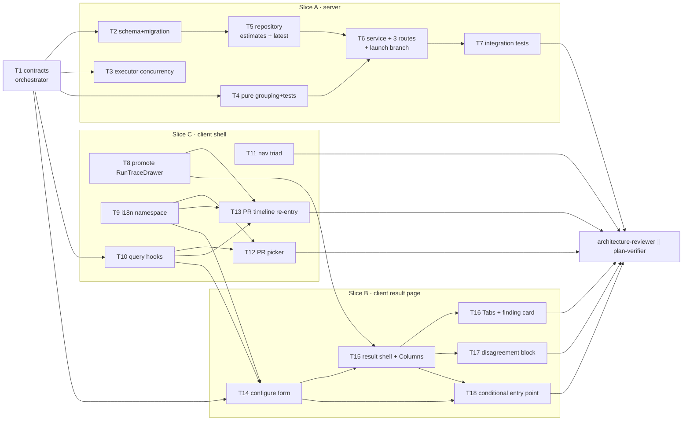

# Implementation Plan: Multi-Agent Review

## Overview

Let a user pick an explicit set of agents, fan them out concurrently over one PR, and read the
result as one addressable page that groups findings by code location so duplicates collapse and
disagreements surface. Server-side this is a schema link, a bounded-concurrency executor, a pure
grouping function, an estimate aggregate, a latest-multi-run resolver and three read routes;
client-side it is a PR-page picker, a PR-timeline re-entry control, a Configure-run form, a two-mode
result page, and a conditional entry point that closes the loop
PR → launch → result → configure → launch again. The client slices build against the **current**
design gallery sources under `scratchpad/design-src/`, which now include the Configure-run screen and
the agent picker.

## Source spec

`/Users/igornegrutsa/Projects/dev-digest/specs/2026-08-02-multi-agent-review.md`
(SPEC-2026-08-02-multi-agent-review, status: approved). Planned against the **updated** revision
carrying US-10 and the navigation-loop delta: changed **AC-22**, new **AC-21a, AC-21b, AC-22a,
AC-22b, AC-22c, AC-33a**, plus six new edge cases.

## Execution mode

**multi-agent (parallel) — exactly 3 implementer agents**, one per slice, using the three
non-overlapping owned-path slices the spec's *Decomposition constraint* already fixes. Chosen by the
user, not negotiated here.

| Slice | Agent | Owns |
|---|---|---|
| **A — Server** | implementer #1 | schema link + migration, executor concurrency, pure grouping, estimate aggregate, **latest-multi-run resolution**, multi-run service/routes, launch agent-set handling |
| **B — Client · result page** | implementer #2 | Configure-run form, multi-run result page (Columns + Tabs), disagreement block, **the conditional entry point** |
| **C — Client · picker, contracts consumers, shell** | implementer #3 | PR-page agent picker, **PR-page timeline re-entry control**, query hooks, nav-entry triad, i18n namespace, trace-drawer promotion |

**Slice C owns the PR page** — it already holds `RunReviewDropdown` (T12) and the drawer promotion
that edits `page.tsx` (T8). The delta's PR-page control (AC-21a/AC-21b) therefore goes to **slice C
as T13**, not slice B, so no two implementers ever touch
`client/src/app/repos/[repoId]/pulls/[number]/`.

**One task is a hard serialization point and does not parallelize: T1, the vendored
`@devdigest/shared` contract edit.** Both client slices and the server slice type their code against
the new `MultiRunDocument` / `AgentRunEstimate` / `LatestMultiRunResponse` / `RunRequest.agentIds`
shapes, so nothing can start until T1 has landed in *both* copies. T1 is therefore Phase 0, owned by
**orchestrator/human** (the repo's `Do-not-touch (without coordination)` rule covers
`src/vendor/shared/`, and a one-sided edit has previously shipped undetected past typecheck — see
`client/INSIGHTS.md` 2026-07-29). Do not pretend it fans out; run it first, verify both copies diff
clean, then launch the three implementers.

## Route shape (settled — the delta made the index conditional)

| URL | Renders | ACs |
|---|---|---|
| `/multi-agent-review` | **Conditional entry point.** One round trip to the latest-multi-run resolver scoped to the active repository: a resolved multi-run → the **result view**, rendered inline; an explicit empty result → the **Configure-run form**, rendered inline. | AC-22, AC-22a, AC-22b |
| `/multi-agent-review/configure` | The Configure-run form, **always**, regardless of how many multi-runs exist. The nav-independent address AC-22c requires and the target of the result toolbar's `⚙ Configure run`. | AC-22c, AC-33a |
| `/multi-agent-review/[multiRunId]` | The result view for one explicit multi-run id. Shareable, reloadable, 404 on an unresolvable/cross-workspace id. | AC-32, AC-64 |

Sidebar entry href = `/multi-agent-review` (the conditional entry point) — so returning users land on
their last result, which is the whole point of the delta.

Two decisions worth stating, both deliberate:

- **The entry point renders inline; it does NOT redirect to `/multi-agent-review/<id>`.** A redirect
  would break the back button: from a result the user presses Back, lands on `/multi-agent-review`,
  and is immediately pushed forward again — an inescapable loop. Rendering the same `MultiRunView`
  component inline satisfies AC-22a's "the same view served for an explicit multi-run URL" without
  that trap. The consequence for file layout: **`MultiRunView` lives at
  `client/src/app/multi-agent-review/_components/MultiRunView/`, one level above the `[multiRunId]`
  segment**, because two route segments consume it.
- **`/multi-agent-review/configure` is a static segment sitting beside the dynamic
  `[multiRunId]` segment.** Next.js App Router resolves static segments before dynamic ones, so
  `configure` can never be swallowed by `[multiRunId]`; and since every multi-run id is a UUID, no
  real id can ever collide with the literal `configure`.

## Requirements (verified)

Restated from the spec, grouped by AC block. Every `AC-N` id below is carried verbatim into the
tasks' `Acceptance` fields for traceability.

- **R1 — Concurrent execution** (AC-1 – AC-5): fan out N agent jobs concurrently, bounded by a named
  constant defaulting to 4; preserve per-agent failure isolation; load shared pre-work (diff +
  intent) exactly once.
- **R2 — Cross-agent grouping** (AC-6 – AC-15): a pure, zero-I/O function forms connected components
  of same-file/overlapping-line-range findings, labels each group deterministically, emits one
  verdict cell per participating agent (`flagged` / `did_not_flag` / `no_result`), flags conflicts,
  and orders groups by file then min start line.
- **R3 — PR-page agent picker** (AC-16 – AC-21): right-aligned dropdown, one row per **enabled**
  agent with a history-derived duration hint (`—` when absent), a `Select all` / `Clear` toggle link,
  a count-aware run button that is disabled at 0, and a `Configure agents…` footer.
- **R3a — PR-page re-entry into a prior multi-run** (AC-21a, AC-21b): where a PR already has ≥1
  multi-run, the PR page's **run-history/timeline** surface — not the toolbar — offers a control
  that opens the **most recent** multi-run's result view without launching anything.
- **R4 — Configure-run form** (AC-22, AC-23 – AC-31): Step 1 PR selector scoped to the active
  repository, Step 2 agent cards with per-agent duration/cost estimates averaged over that agent's
  own successful runs (per-metric denominators, `—` when absent), and a
  `≈ max · sum · parallel fan-out` aggregate. Shown at the entry point **only when the active
  repository has no previous multi-run**.
- **R4a — Conditional landing and the way back** (AC-22a, AC-22b, AC-22c, AC-33a): with ≥1 previous
  multi-run the entry point shows the most recent result instead of a blank form; a server affordance
  resolves "most recent multi-run for a scope" in one round trip, returning an explicit empty result
  with a **2xx, not a 404**; the form stays reachable at an explicit address; and the result
  toolbar's `⚙ Configure run` is the single path back to launching another run.
- **R5 — Results, Columns mode** (AC-32 – AC-38): reloadable URL addressed by multi-run id, toolbar +
  sub-row + breadcrumb, one accent-topped column per agent with score ring, finding cards, footer
  with `View trace` and `N findings`, live refresh while non-terminal, refresh stops when all
  terminal.
- **R6 — Trace/live-log reuse** (AC-39 – AC-42): open the **existing** run-trace drawer scoped to the
  requested run; no second drawer/log UI; SSE endpoint, replay buffer and live-log primitive
  untouched.
- **R7 — Navigation** (AC-43 – AC-45): exactly one new sidebar entry under `GLOBAL`, key consistent
  across the nav definition / shell i18n / active-route resolver, offered in the command palette.
- **R8 — Results, Tabs mode** (AC-46 – AC-52): per-agent tab bar with score badges, agent summary
  card, collapsible finding cards with description + `SUGGESTED FIX`, action row
  `Accept · Dismiss · Learn (disabled) · Turn into eval case` on existing endpoints, positional
  accent palette.
- **R9 — Disagreement block** (AC-53 – AC-59): rendered in both modes, group cards with per-agent
  verdict cells in agent order, `Show only conflicts` toggle, explicit empty state.
- **R10 — Attribution and persistence** (AC-60 – AC-64): one multi-run record per explicit-set
  launch with every created run linked to it; finding → agent attribution answerable from stored
  data; reject unresolvable/cross-workspace/disabled agent ids; dedupe repeated ids; 404 on an
  unresolvable multi-run.
- **R11 — Hard constraints** (spec Non-goals + AC-51a): `server/src/modules/reviews/service.ts` and
  `server/src/modules/reviews/findings.ts` must not appear in the diff; no `learn` finding action; no
  new finding-action endpoint; `ci/`, `agent-runner/`, `reviewer-core/`, `mcp-server/` and `e2e/`
  untouched; only the one sanctioned nav entry added; **no second "start new review" button**
  (AC-33a).
- **R12 — Non-functional**: concurrency cap named constant; launch route keeps its 10 req/min limit;
  zero new LLM calls; result document < 300ms p95 (6 agents × 50 findings, local Postgres); ~2s
  bounded live refresh; estimates from ONE grouped aggregate query per request; WCAG 2.1 AA (named
  checkboxes, programmatic segmented-control/toggle state, no status by colour alone); migration
  generated then applied, never hand-authored.

## Open questions & recommendations

All six questions from the first revision were **confirmed by the coordinator**; they are recorded
here as settled decisions rather than open items.

- **Confirmed — route shape**, with the entry point now conditional per the delta. See the *Route
  shape* section above for the settled three-URL layout and the two implementation decisions
  (inline render over redirect; static `configure` beside dynamic `[multiRunId]`).
- **Confirmed — the `last_summary` contract gap.** AC-28 requires each agent card to render "a
  one-line muted summary… from that agent's most recent review summary", but the spec's estimate
  contract listed only id, name, the two averages and the two counts. T1 adds
  `last_summary: string | null`; T5 sources it inside the same grouped aggregate, so the
  single-query NFR still holds.
- **Confirmed — agent order is `agent_runs.ran_at ASC, agent_runs.id ASC`.** The spec forbids further
  structural change to `multi_agent_runs`, so there is no column to store the user's checkbox order
  in. This ordering is deterministic and, because all three views read the single server-ordered
  `agents` array, automatically consistent — which is all AC-52/AC-59 require.
- **Confirmed — Tabs mode gets its own `MultiAgentFindingCard`**, not the PR page's `FindingCard`.
  AC-50 requires the same *endpoints via the existing hooks*, not the same component; reusing
  `FindingCard` would mean a slice-B implementer editing a slice-C-owned PR-page component, and
  Screen 5's collapsed row differs from it anyway. The promotion cost is deliberately not paid.
- **Confirmed — promote `RunTraceDrawer` to `client/src/components/RunTraceDrawer/` (T8).** Verified
  it depends only on `@devdigest/ui`, `@devdigest/shared`, `@/lib/hooks/trace`, `@/lib/hooks/reviews`
  and its own folder, with exactly one consumer
  (`client/src/app/repos/[repoId]/pulls/[number]/page.tsx`). Precedent:
  `client/src/components/EvalCaseEditor/`.
- **Confirmed — no security-reviewer and no test-writer pass**, with the caveat retained: **add a
  security pass if the implemented diff escapes the envelope described here.** That envelope is:
  zero prompts and zero model calls; LLM text rendered as escaped React text; no auth, no secrets, no
  file handling; one new client-supplied input (the `agentIds` array) whose access-control story is
  already AC-62 and is pinned by an integration test in T7; one new write (a grouping row); and three
  new read routes that are all workspace-scoped DB reads. The delta adds only a fourth read path
  (latest-multi-run resolution), workspace-scoped and repo/PR-narrowed like the rest — it does not
  widen the envelope. Instead of a test-writer pass, every implementer keeps the existing lanes green
  as part of its own acceptance (`cd server && pnpm exec vitest run --exclude '**/*.it.test.ts'` and
  `cd client && pnpm test`), and the pure grouping function arrives **with its own unit tests written
  by its implementer** (T4), because the spec states it as a directly unit-testable pure function.

Three notes raised by the newer design gallery, which now contains the Configure-run screen and the
picker that the previous iteration lacked:

- **⚠ Conflict, decided in favour of the design — the launch-button label is conditional, where
  AC-19 reads as unconditional.** AC-19 says the picker renders "a full-width primary action button
  labelled `Run multi-agent review (N)`". Both design sources instead vary the label by count:
  the picker (`components2.jsx:24-65`) uses `Select an agent` → `Run <agent name>` →
  `Run multi-agent review (N)`, and the Configure-run screen (`screen_multiagent.jsx:107`) uses
  `Select agents` → `Run 1 agent` → `Run multi-agent review (N)`. I have encoded the **design's**
  behaviour in T12 and T14 per the coordinator's instruction, because it is strictly more
  informative, it still satisfies AC-19's stated observable at N ≥ 2 ("checking and unchecking a row
  updates N immediately") and AC-20's disabled-at-zero requirement, and the gallery is newer than the
  screenshots the spec was written from. **Flagging it explicitly so `plan-verifier` does not score
  it as an AC-19 miss** — if you would rather the spec win, T12 and T14 each need one line changed
  and AC-19's literal label restored.
- **Note — the picker's enabled-only listing is a spec-sanctioned narrowing, not a conflict.**
  AC-17 ("one row per **enabled** agent in the workspace") and the design
  (`AGENTS.filter(a => a.enabled)`) agree. But today's `RunReviewDropdown` deliberately lists *every*
  agent including disabled ones, with an explicit comment saying so
  (`RunReviewDropdown.tsx:51-53`), so an existing "run a disabled agent ad hoc" affordance is being
  removed. T12 calls this out so it happens deliberately.
- **Note — the design's `Select all` / `Clear` link is a toggle**, not the always-`Clear` link the
  first revision of this plan described. Because the picker pre-selects every enabled agent on open,
  the default state shows `Clear` — which is exactly what AC-16 describes and what AC-21 requires it
  to do. The two are compatible; T12 encodes the toggle.

And one note from the delta, not a question:

- **Note — the latest-multi-run resolver deliberately returns 2xx + `null`, never 404.** AC-22b makes
  this explicit so the client picks its landing state in one round trip; 404 stays reserved for an
  unresolvable or cross-workspace **explicit** id (AC-64). T6 and T7 both pin the distinction, since
  conflating the two is the obvious implementation slip here.

## Affected packages & contracts

- **`server` (`@devdigest/api`)** — one nullable schema column + generated migration; a new
  `src/modules/multi-runs/` module (pure grouping, repository, service, routes, helpers) exposing
  **three** read routes (`GET /multi-runs/:id`, `GET /multi-runs/latest`, `GET /agent-estimates`); a
  concurrency constant + bounded-pool change in the reviews run-executor; an additive `multiRunId`
  parameter on the agent-run repository; one branch added to the existing `POST /pulls/:id/review`
  handler in `reviews/routes.ts`.
- **`client` (`@devdigest/web`)** — new `/multi-agent-review` route tree (conditional entry point +
  explicit configure form + result view); the PR-page run-review control becomes a multi-select agent
  picker; the PR-page timeline gains a re-entry control; new query hooks; nav-entry triad; new i18n
  namespace; `RunTraceDrawer` promoted from the PR route's `_components/` to `src/components/`.
- **Contracts (vendored `@devdigest/shared`, two-sided, orchestrator/human — T1):**
  `RunRequest.agentIds?`, `ReviewRunResponse.multi_run_id?`, new `AgentRunEstimate`, new
  `MultiRunDocument` (+ `MultiRunAgent`, `MultiRunGroup`, `MultiRunVerdictCell`, `MultiRunTotals`),
  and new `LatestMultiRunRef` / `LatestMultiRunResponse`.
- **Untouched by this plan (enforced per-task):** `ci/`, `agent-runner/`, `reviewer-core/`,
  `mcp-server/`, `e2e/`, `server/src/modules/reviews/service.ts`,
  `server/src/modules/reviews/findings.ts`, the SSE endpoint, the run-bus replay buffer and
  `client/src/vendor/ui/LiveLogStream.tsx`.

## Architecture changes

**Server (onion layering).**

- `server/src/db/schema/runs.ts` — infrastructure. `agent_runs` gains
  `multi_run_id uuid NULL REFERENCES multi_agent_runs(id) ON DELETE SET NULL` + an index. Nullable
  because every legacy and pre-existing row has none and no backfill is performed.
- `server/src/modules/reviews/constants.ts` — `AGENT_FANOUT_CONCURRENCY = 4` (AC-2, AC-3), with the
  spec's rationale recorded in the doc comment.
- `server/src/modules/reviews/concurrency.ts` — **new, domain core (pure).** A tiny
  `runBounded(items, limit, fn)` worker-pool helper with zero I/O, so the concurrency semantics
  themselves are unit-testable without a database, an LLM or a Fastify instance.
- `server/src/modules/reviews/run-executor.ts` — application ring. The sequential
  `for (const { agent, runId } of jobs)` loop (lines 128–155) becomes a `runBounded(...)` call. The
  shared pre-work (diff load at :102–111, intent lookup at :114–126) already sits **before** the loop
  and stays there — AC-5 is structurally satisfied today and must remain so.
- `server/src/modules/multi-runs/` — **new feature module**, registered statically in
  `server/src/modules/index.ts` (no autoload):
  - `grouping.ts` + `grouping.test.ts` — **domain core**: pure, zero-I/O, no `container`.
  - `helpers.ts` — domain core: DTO mapping only.
  - `repository.ts` — infrastructure: the only file here importing Drizzle; every query
    workspace-scoped. Owns the estimate aggregate **and** the latest-multi-run resolution for both
    scopes.
  - `service.ts` — application: launch orchestration, document assembly, estimates, latest
    resolution; pulls adapters off `container`; throws typed errors from `platform/errors.ts`.
  - `routes.ts` — transport: zod params/querystring, `getContext`, delegate to `service.*` only
    (never `repo.*` — `server/INSIGHTS.md` 2026-07-29).
  - `constants.ts` — literals.
- `server/src/modules/reviews/routes.ts` — transport only. The launch handler gains an `agentIds`
  branch that delegates to `MultiRunService.launch`. **`reviews/service.ts` is not touched**, so the
  new resolve/create/link logic lives in the new module rather than extending `resolveTargets` /
  `runReview` (AC-51a makes "the diff touches neither file" an observable).

**Client (RSC boundaries).**

- `client/src/app/multi-agent-review/page.tsx` (conditional entry point),
  `client/src/app/multi-agent-review/configure/page.tsx` (explicit form) and
  `client/src/app/multi-agent-review/[multiRunId]/page.tsx` (explicit result) — thin route segments;
  the interactive work lives in `'use client'` leaf components under
  `client/src/app/multi-agent-review/_components/`, matching the `/conventions` and `/eval`
  precedents.
- `client/src/app/multi-agent-review/_components/MultiRunView/` and `.../ConfigureRunView/` — both
  sit at the route-tree level, **not** inside `[multiRunId]/`, because the conditional entry point
  and the explicit routes both consume them.
- `client/src/components/RunTraceDrawer/` — `RunTraceDrawer` promoted out of the PR route's private
  `_components/` now that it has a second consumer (colocation → promote-on-share).
- Data access: TanStack Query hooks in `client/src/lib/hooks/multi-runs.ts` only; **no raw `fetch`
  in components**. Strings via `useTranslations("multiAgent")`.

**Design source of truth for the client slices.** The decompressed design sources live in

```
/private/tmp/claude-501/-Users-igornegrutsa-Projects-dev-digest/cf0fdcdb-e3aa-495a-b832-d7facbdfa3fe/scratchpad/design-src/
```

**⚠ The earlier single-file extract at `scratchpad/screen_multiagent.design.jsx` is OBSOLETE — do not
open it.** It was taken from a previous gallery iteration; the user has since replaced the gallery,
and every path below supersedes it.

| File | What it defines | Used by |
|---|---|---|
| `screen_multiagent.jsx` | `AgentFindingMini`, `AgentColHeader`, `ConflictsSection`, `MetaRow`, `ColumnsView`, `TabsView`, **`PersonaPickCard` (:93)**, **`RunConfig` (:107)**, `ScreenMultiAgent` (incl. the toolbar `⚙ Configure run` button at :168 and the "No agents selected" empty state at :163) | T14, T15, T16, T17 |
| `components2.jsx` | **`RunReviewDropdown` (:24-65)** — the PR-page agent picker | T12 |
| `primitives.jsx`, `kit2.jsx` | design-side definitions of `CircularScore`, `SectionLabel`, `MonoLink`, `Toggle`, `EmptyState`, `SEV`, `Button`, `Dropdown` — consult when a token or prop is ambiguous | T12, T14–T17 |
| `findings.jsx` | the design's finding card | T16 |
| `chrome.jsx` | `AppFrame`, breadcrumb and sidebar chrome | T11, T14, T15 |
| `screen_pr_detail.jsx` | the PR page, incl. its toolbar and timeline | T12, T13 |

**The new iteration closes the gap the first revision of this plan flagged: it now contains the
Configure-run screen and the picker, so the screenshots and the design source no longer disagree on
structure.** Treat the design sources as authoritative for **both structure and styling values**,
with the spec's ACs authoritative for behaviour — and with the three explicit exceptions below.

**Three things in the design sources are stale and must NOT be copied** (each is repeated as a
per-task gotcha):

1. `MetaRow` (`screen_multiagent.jsx:49`) still reads **`fan-out via worktrees`** — the spec mandates
   `parallel fan-out` (AC-33 + the deviations section). → T15.
2. `ConflictsSection` (`screen_multiagent.jsx:38`) still renders `t.note` on **non-flagging** cells —
   the spec's accepted deviation says `did not flag` / `no result` carry no rationale line. → T17.
3. `RunConfig` (`screen_multiagent.jsx:109`) filters the PR dropdown with
   `window.PR_LIST.filter((p) => p.status !== "stale")` — **copying this makes the feature
   unverifiable in this repo**, because the verification PR (#1 of repo
   `d487c285-9e41-403a-8506-5b2b88c1670b`) is itself `stale`. → T14.

Every primitive the design uses already exists — `CircularScore`, `SectionLabel`, `MonoLink`,
`Toggle`, `EmptyState`, `SEV` (`client/src/vendor/ui/primitives/`), `Icon`
(`client/src/vendor/ui/icons.tsx`), `Tabs`, `Dropdown`, `Checkbox`, `Button`
(`client/src/vendor/ui/kit/`) — so **no new `vendor/ui` primitive may be authored**; the single
sanctioned `vendor/ui` edit in this whole plan is the one nav entry in T11.

**Task DAG.**



## Phased tasks

### Phase 0 — Contracts (blocking; nothing else may start)

- **T1 — Vendored `@devdigest/shared` contract additions, both copies in lock-step**
  - **Action:** Edit **both** vendored copies identically.
    In `contracts/platform.ts` (line ~276): `RunRequest` gains
    `agentIds: z.array(z.string()).optional()`. Keep `agentId` and `all` unchanged — resolution
    precedence is documented as `agentIds` (non-empty) → `agentId` → `all`.
    In `contracts/review-api.ts` (line ~52): `ReviewRunResponse` gains
    `multi_run_id: z.string().nullish()`; add
    `AgentRunEstimate` (`agent_id`, `agent_name`, `avg_duration_ms` nullable, `avg_cost_usd`
    nullable, `duration_sample_count`, `cost_sample_count`, `last_summary` nullable);
    `MultiRunVerdictCell` (`agent_id`, `verdict: z.enum(['flagged','did_not_flag','no_result'])`,
    `severity` nullish, `rationale` nullish, `finding_id` nullish);
    `MultiRunGroup` (`file`, `line`, `label`, `conflict: z.boolean()`, `cells: MultiRunVerdictCell[]`);
    `MultiRunAgent` (`agent_id` nullable, `agent_name`, `run_id`, `status`, `duration_ms` nullish,
    `cost_usd` nullish, `score` nullish, `summary` nullish, `findings: FindingRecord[]`);
    `MultiRunTotals` (`max_duration_ms` nullish, `total_cost_usd` nullish, `agent_count`);
    `MultiRunDocument` (`id`, `ran_at`, `pr: { id, number, title }`, `agents: MultiRunAgent[]`,
    `groups: MultiRunGroup[]`, `totals: MultiRunTotals`);
    **and, for the delta (AC-22b):** `LatestMultiRunRef` (`id`, `pr_id`, `pr_number`, `pr_title`,
    `ran_at`) plus `LatestMultiRunResponse` (`multi_run: LatestMultiRunRef.nullable()`) — the
    wrapper object is what makes "no multi-run for this scope" an explicit, typed **2xx** answer
    rather than an error or a bare `null` body.
    Export every new type from the package barrel in both copies.
  - **Package:** server + client (vendored, two-sided)
  - **Type:** core
  - **Owner:** orchestrator/human
  - **Skills to use:** zod, typescript-expert
  - **Owned paths:** `server/src/vendor/shared/contracts/platform.ts`,
    `client/src/vendor/shared/contracts/platform.ts`,
    `server/src/vendor/shared/contracts/review-api.ts`,
    `client/src/vendor/shared/contracts/review-api.ts`, plus each copy's barrel index if the new
    types need re-export
  - **Depends-on:** none
  - **Risk:** medium
  - **Known gotchas:** the two copies are hand-maintained and NOT auto-synced — a whole type has
    previously been found missing from the client side with nothing failing typecheck
    (`client/INSIGHTS.md` 2026-07-29; `server/INSIGHTS.md` 2026-06-19). Diff the files, don't assume.
    Use `.nullish()` (not `.nullable()`) for fields added to contracts that may be parsed from
    already-persisted rows (`server/INSIGHTS.md` 2026-06-19). Adding a **required** field to a
    vendored contract breaks client test fixtures built from a `Partial<>` helper with `TS2719`
    (`client/INSIGHTS.md` 2026-06-19) — every field added here is optional/nullish, keep it that way.
  - **Acceptance:** `diff server/src/vendor/shared/contracts/platform.ts client/src/vendor/shared/contracts/platform.ts`
    and the same for `review-api.ts` show **no differences other than comments**;
    `cd server && pnpm typecheck` and `cd client && pnpm typecheck` both pass. Traces to R4a, R10,
    the spec's Contracts section, and unblocks AC-18/22a/22b/26/27/28/30/31/32/33/34/46/52/53-59/60.

### Phase 1 — Server slice (A) ∥ Client shell slice (C) — these two slices run concurrently

#### Slice A — server (implementer #1, tasks run in order within the slice)

- **T2 — `agent_runs → multi_agent_runs` link + generated migration**
  - **Action:** In `server/src/db/schema/runs.ts` add to `agentRuns` (defined at lines 8–33):
    `multiRunId: uuid('multi_run_id').references(() => multiAgentRuns.id, { onDelete: 'set null' })`
    — nullable, forward-referencing the `multiAgentRuns` table declared later in the same file (the
    arrow-function reference form handles the ordering). Add an index on `multi_run_id` for
    lookup-by-multi-run. Leave the rest of `multi_agent_runs` (lines 43–52) as-is. Then run
    `cd server && pnpm db:generate` followed by `pnpm db:migrate`.
    `ON DELETE SET NULL` (not cascade) so deleting a grouping row can never destroy run history.
  - **Package:** server
  - **Type:** backend
  - **Owner:** implementer
  - **Skills to use:** drizzle-orm-patterns, postgresql-table-design, onion-architecture
  - **Owned paths:** `server/src/db/schema/runs.ts`, `server/src/db/migrations/` (generated output
    only)
  - **Depends-on:** T1
  - **Risk:** low
  - **Known gotchas:** migrations are **NOT** applied on boot — schema change → `pnpm db:generate` →
    `pnpm db:migrate`. **Never hand-author the SQL**, even with Docker down: without the matching
    `meta/00NN_snapshot.json` the next `db:generate` re-emits the same column and the hand-written
    file gets discarded (`server/INSIGHTS.md` 2026-06-19). Postgres does not auto-index FK columns —
    the index is required, not optional. `multi_agent_runs.pr_id` is already `NOT NULL` and
    references `pull_requests`, which is what makes the repo-scoped latest resolution in T5 a plain
    join with **no** further schema change.
  - **Acceptance:** a new `server/src/db/migrations/00NN_*.sql` plus its `meta/00NN_snapshot.json`
    and a new `meta/_journal.json` entry exist and were produced by `pnpm db:generate` (not typed by
    hand); `pnpm db:migrate` applies without error against the running Postgres; `\d agent_runs`
    shows `multi_run_id uuid` nullable with the FK and the index; `pnpm typecheck` passes. Traces to
    AC-60, R12 (migration discipline).

- **T3 — Bounded-concurrency fan-out in the run executor**
  - **Action:** Add `export const AGENT_FANOUT_CONCURRENCY = 4;` to
    `server/src/modules/reviews/constants.ts`, with a doc comment recording AC-3's rationale (4 is
    the design's canonical fan-out so the common case runs in one full-parallelism wave, while a
    "Run all" over a larger roster stays bounded to 4 simultaneous LLM calls — inside a single
    provider key's budget and far below the route's 10 req/min limit). Add a new pure helper
    `server/src/modules/reviews/concurrency.ts` exporting
    `runBounded<T>(items: T[], limit: number, fn: (item: T) => Promise<void>): Promise<void>` — a
    worker pool that never runs more than `limit` tasks at once and never rejects (each task's own
    error handling is the caller's). Replace the sequential loop in
    `server/src/modules/reviews/run-executor.ts` (lines 128–155) with a `runBounded(jobs,
    AGENT_FANOUT_CONCURRENCY, …)` call whose body is the **existing** per-job block verbatim —
    same start log, same `await this.runOneAgent(...)`, same `try/catch` that distinguishes
    `RunCancelledError` from a failure and only logs (because `runOneAgent` already persisted the
    failure status, error text and trace). Do **not** move the diff load (:102–111) or the intent
    lookup (:114–126) — they are already before the loop and must stay there. Correct the stale
    "map-reduces each agent" doc comment (:57–59) to describe the bounded fan-out. Write
    `server/src/modules/reviews/concurrency.test.ts`.
  - **Package:** server
  - **Type:** backend
  - **Owner:** implementer
  - **Skills to use:** typescript-expert, onion-architecture
  - **Owned paths:** `server/src/modules/reviews/constants.ts`,
    `server/src/modules/reviews/concurrency.ts`,
    `server/src/modules/reviews/concurrency.test.ts`,
    `server/src/modules/reviews/run-executor.ts`
  - **Depends-on:** none (independent of T2; sequenced inside slice A only because one implementer
    owns the slice)
  - **Risk:** medium
  - **Known gotchas:** **Verified safe, do not "fix" it** — `RunLogger`
    (`server/src/platform/run-logger.ts:36-47`) is immutable and `forRun()` returns a *new* instance,
    and `runOneAgent` already narrows the fanned-out pre-work logger to its own run at
    `run-executor.ts:173` (`parentLog.forRun(runId, { agent: agent.name })`); `RunBus` buffers per
    runId. So concurrent jobs cannot interleave each other's live logs or traces, and **no logging
    change is needed**. `failAll` (the shared-pre-work failure path) is outside the loop and stays
    sequential. Everything else in `run-executor.ts` (per-run repo writes, run-bus channels, run ids)
    is already per-job.
  - **Acceptance:** `cd server && pnpm exec vitest run --exclude '**/*.it.test.ts'` is green and
    includes new `concurrency.test.ts` cases asserting: (a) with 6 instrumented tasks and
    `limit = 4`, the observed maximum simultaneous in-flight count is exactly 4 and never 5
    **(AC-2)**; (b) 6 tasks of ~50ms each complete in roughly two waves, not six serial ones, with
    recorded start/end intervals overlapping **(AC-1)**; (c) one rejecting task does not prevent the
    other five from running to completion **(AC-4)**; (d) `AGENT_FANOUT_CONCURRENCY === 4` and is
    referenced by the executor, not inlined **(AC-3)**. AC-5's "diff loaded once" is asserted in T7.

- **T4 — The pure cross-agent grouping function + its unit tests**
  - **Action:** Create `server/src/modules/multi-runs/grouping.ts` — **pure, zero I/O, no
    `container`, no Drizzle, no `process.env`** — exporting the grouping computation over an ordered
    list of participating agents (agent id, run status) and their findings. Implement, in order:
    co-location = exactly-equal `file` AND overlapping closed integer `[start_line, end_line]` ranges
    (**AC-6**); groups = connected components of that relation within a file, i.e. transitive
    (**AC-7**); group line = min `start_line` (**AC-8**); label = title of the highest-severity
    finding, ties broken by highest `confidence`, then lowest `start_line`, then the agent's index in
    the multi-run's agent order, then finding id (**AC-9**); one cell per participating agent in
    agent order (**AC-10**); a flagging agent's verdict = severity of its own highest-severity
    finding in that group plus a one-line rationale from that same finding (**AC-11**); successful
    terminal run + no finding → `did_not_flag` (**AC-12**); failed / cancelled / still-running →
    `no_result`, a distinct state (**AC-13**); conflict = ≥2 distinct verdict values among agents
    with a successful terminal run, counting `did_not_flag` as one value and excluding `no_result`
    entirely (**AC-14**); one group per location with ≥1 finding, ordered by `file` ascending then
    group line ascending (**AC-15**). Add `server/src/modules/multi-runs/types.ts` for the internal
    input shapes and a local severity-rank helper. Also create
    `server/src/modules/multi-runs/constants.ts` for any literals. Write
    `server/src/modules/multi-runs/grouping.test.ts`.
  - **Package:** server
  - **Type:** core
  - **Owner:** implementer
  - **Skills to use:** typescript-expert, onion-architecture
  - **Owned paths:** `server/src/modules/multi-runs/grouping.ts`,
    `server/src/modules/multi-runs/grouping.test.ts`, `server/src/modules/multi-runs/types.ts`,
    `server/src/modules/multi-runs/constants.ts`
  - **Depends-on:** T1
  - **Risk:** low
  - **Known gotchas:** the overlap rule must mirror `rangesOverlap` in
    `server/src/modules/eval/scoring.ts:23-29` (`aLo <= bHi && bLo <= aHi` after min/max
    normalisation) — that function is module-private and **not exported**, so re-implement it locally
    with a comment citing the source rather than exporting it across modules or touching
    `reviewer-core`. Findings' `severity`/`category` come back from the DB as `text`, so cast to the
    contract enums when mapping. No semantic, textual, embedding or LLM similarity is permitted —
    same-file + line-overlap and nothing else.
  - **Acceptance:** `cd server && pnpm exec vitest run --exclude '**/*.it.test.ts'` green, with cases
    covering at minimum: `[1,5]`/`[6,10]` → two groups and `[1,5]`/`[5,10]` → one group **(AC-6)**;
    the exact A`[10,20]`–B`[18,30]`–C`[28,40]` chain → one group **(AC-7)** reporting line 10
    **(AC-8)**; a deliberately tied group yielding the same label across repeated runs and across
    shuffled input orderings **(AC-9)**; a four-agent multi-run yielding four cells in every group
    **(AC-10)**; an agent with a `warning` and a `suggestion` in one group yielding a single
    `WARNING` cell **(AC-11)**; a successful zero-finding agent → `did_not_flag` **(AC-12)**; a
    failed agent → `no_result`, never `did_not_flag` **(AC-13)**; the four AC-14 conflict cases
    (`{WARNING,SUGGESTION}` → conflict, `{WARNING,did not flag}` → conflict, `{W,W,W}` → not,
    `{WARNING,no result}` → not) **(AC-14)**; three distinct locations → three groups in file/line
    order **(AC-15)**; two findings from the same agent in one group → one cell **(edge case)**;
    a single-agent multi-run → every group has one cell and can never be a conflict **(edge case)**.

- **T5 — Multi-run repository: estimates aggregate + latest-multi-run resolution**
  - **Action:** Create `server/src/modules/multi-runs/repository.ts` (the only file in this module
    importing Drizzle; every query workspace-scoped) with:
    `createMultiRun(workspaceId, prId)`;
    `getMultiRun(workspaceId, id)` returning null when unresolvable or cross-workspace;
    `runsForMultiRun(multiRunId)` joining `agent_runs` → `agents` → `reviews` → `findings`, ordered
    `agent_runs.ran_at ASC, agent_runs.id ASC` (the authoritative agent order);
    `estimatesForWorkspace(workspaceId)` computing, in **ONE grouped aggregate query** over
    `agent_runs` for that workspace restricted to the successful terminal status (`'done'`, the value
    the executor persists at `run-executor.ts:304-315`): `avg(duration_ms)`, `avg(cost_usd)`,
    `count(duration_ms)`, `count(cost_usd)` grouped by `agent_id` (Postgres `avg`/`count` already
    ignore NULLs, which is exactly AC-26's differing-denominator semantics), left-joined to every
    enabled agent so history-less agents come back with nulls, plus each agent's newest
    `reviews.summary` for `last_summary`;
    **and, for the delta,** `latestMultiRun(workspaceId, scope)` where `scope` is
    `{ repoId }` **or** `{ prId }` — join `multi_agent_runs` → `pull_requests` (and, for the repo
    scope, filter on `pull_requests.repo_id`), filter `multi_agent_runs.workspace_id`, order
    `multi_agent_runs.ran_at DESC, multi_agent_runs.id DESC`, `LIMIT 1`, and return the row's id, its
    PR's id/number/title and its timestamp — or `null` when the scope has none **(AC-22b, AC-21b)**.
    Extend `server/src/modules/reviews/repository/run.repo.ts` **and** the facade
    `server/src/modules/reviews/repository.ts` so `createAgentRun` accepts an optional `multiRunId`.
  - **Package:** server
  - **Type:** backend
  - **Owner:** implementer
  - **Skills to use:** drizzle-orm-patterns, postgresql-table-design, onion-architecture
  - **Owned paths:** `server/src/modules/multi-runs/repository.ts`,
    `server/src/modules/reviews/repository/run.repo.ts`,
    `server/src/modules/reviews/repository.ts`
  - **Depends-on:** T2
  - **Risk:** medium
  - **Known gotchas:** `createAgentRun`'s `values` shape is declared in **two** places that must
    match — the repo function and the facade wrapper — and adding a field to one without the other
    fails typecheck (`server/INSIGHTS.md` 2026-06-19). Do **not** issue one estimate query per agent:
    the NFR requires a single grouped aggregate per request. `latestMultiRun` orders by the
    **multi-run's own** `ran_at`, not by any `agent_runs` timestamp — AC-22b and AC-21b both say so
    explicitly, and the two can differ. Tie-break on `id DESC` so "newest" is deterministic when two
    multi-runs share a timestamp. Returning `null` here is a normal result, **not** an error — the
    404-vs-empty distinction is enforced one layer up in T6. Do not touch
    `server/src/modules/reviews/service.ts`.
  - **Acceptance:** `cd server && pnpm typecheck` passes; behaviour is asserted by T7. A grep of
    `repository.ts` confirms exactly one aggregate statement backs `estimatesForWorkspace`
    **(R12: estimates cost)**, and that `latestMultiRun` issues one `LIMIT 1` query per call.
    Traces to AC-21b, AC-22b, AC-26, AC-27, AC-60, and the agent-order decision behind AC-52/AC-59.

- **T6 — Multi-run service, three routes, module registration, and the launch agent-set branch**
  - **Action:** Create `server/src/modules/multi-runs/service.ts`:
    `launch(workspaceId, prId, agentIds, logger)` — dedupe the incoming ids to a set **(AC-63)**;
    resolve them against `container.agentsRepo.listEnabled(workspaceId)` and, if any id fails to
    resolve to an enabled agent in that workspace, throw a typed 4xx from `platform/errors.ts`
    **before creating anything** **(AC-62)**; then create one `multi_agent_runs` row and one
    `agent_runs` row per resolved agent carrying `multiRunId` **(AC-60)**; then fire
    `ReviewRunExecutor.executeRuns(...)` fire-and-forget exactly as the existing path does (response
    returns immediately with run ids + `multi_run_id`).
    `getDocument(workspaceId, multiRunId)` — 404 via `NotFoundError` when unresolvable or belonging
    to another workspace **(AC-64)**; otherwise assemble the `MultiRunDocument` by feeding the
    repository's ordered runs/findings through `grouping.ts` and computing totals (max duration
    across completed runs, summed cost, agent count). An in-progress multi-run returns a **complete**
    document with non-terminal run states — never a partial or fabricated one.
    `estimates(workspaceId)` — pass through to the repository.
    `latestMultiRun(workspaceId, scope)` — pass through, mapping "no multi-run" to
    `{ multi_run: null }` and **never** to a thrown `NotFoundError` **(AC-22b)**.
    Create `server/src/modules/multi-runs/helpers.ts` (pure DTO mapping) and
    `server/src/modules/multi-runs/routes.ts` with **three** routes:
    `GET /multi-runs/:id` (404 on unresolvable/cross-workspace),
    `GET /multi-runs/latest` with a zod **querystring** schema accepting exactly one of
    `repoId` / `prId` (reject a request supplying both or neither with a typed 400) and always
    answering **2xx** with `{ multi_run: … | null }`, and
    `GET /agent-estimates`. All three are DB-only reads: no per-route rate-limit override, they
    inherit the global bucket. Routes call `service.*` only, never `repo.*`. Register the module in
    `server/src/modules/index.ts`.
    Finally, in `server/src/modules/reviews/routes.ts`, the `POST /pulls/:id/review` handler parses
    the extended `RunRequest` and, **when `agentIds` is present and non-empty**, delegates to
    `MultiRunService.launch` and returns `{ pr_id, runs, reviews: [], multi_run_id }`; otherwise the
    existing `service.resolveTargets` / `service.runReview` path runs byte-for-byte unchanged and
    returns no `multi_run_id`. Keep the route's existing `config: { rateLimit: { max: 10, timeWindow:
    '1 minute' } }` exactly as it is.
  - **Package:** server
  - **Type:** backend
  - **Owner:** implementer
  - **Skills to use:** fastify-best-practices, zod, onion-architecture, typescript-expert
  - **Owned paths:** `server/src/modules/multi-runs/service.ts`,
    `server/src/modules/multi-runs/helpers.ts`, `server/src/modules/multi-runs/routes.ts`,
    `server/src/modules/multi-runs/index.ts`, `server/src/modules/index.ts`,
    `server/src/modules/reviews/routes.ts`
  - **Depends-on:** T4, T5
  - **Risk:** high
  - **Known gotchas:** **`server/src/modules/reviews/service.ts` and
    `server/src/modules/reviews/findings.ts` must not appear in the diff at all** — AC-51a makes that
    an observable, which is precisely why the new resolve/create/link logic lives in this module
    instead of extending `resolveTargets`/`runReview`. Do **not** add a `learn` finding action and do
    **not** add any finding-action endpoint. **Do not conflate the two "not found" shapes:** an empty
    *scope* on `GET /multi-runs/latest` is a 2xx with `multi_run: null` (AC-22b), while an
    unresolvable *explicit id* on `GET /multi-runs/:id` is a 404 (AC-64) — this is the single most
    likely slip in this task. `schema.querystring` with a zod schema is supported under
    `fastify-type-provider-zod`; `context/routes.ts` is the in-repo precedent
    (`server/INSIGHTS.md` 2026-07-18). Feature modules are registered **statically** in
    `modules/index.ts` — there is no autoload. Routes must never build error responses by hand;
    throw the typed error and let the central handler serialize it. ESM: relative imports carry the
    `.js` extension. Cross-workspace rejection is the feature's access-control boundary — a foreign
    id must produce a rejection, never a silently skipped agent — and the latest-resolution route is
    workspace-scoped for the same reason.
  - **Acceptance:** `cd server && pnpm typecheck` passes and
    `pnpm exec vitest run --exclude '**/*.it.test.ts'` stays green;
    `git diff --name-only` lists **neither** `server/src/modules/reviews/service.ts` **nor**
    `server/src/modules/reviews/findings.ts` **(AC-51a)**, and lists nothing under `ci/`,
    `agent-runner/`, `reviewer-core/`, `mcp-server/` or `e2e/` **(R11)**. Behaviour asserted in T7.
    Traces to AC-21b, AC-22b, AC-26, AC-27, AC-32, AC-60, AC-62, AC-63, AC-64.

- **T7 — Server integration tests**
  - **Action:** Write `server/src/modules/multi-runs/multi-runs.it.test.ts` (colocated beside the
    module; the integration lane picks it up by the `.it.test` filename filter). Boot with
    `buildApp({ config: config(), db, overrides })` and drive over `app.inject`, following
    `server/src/modules/eval/eval.it.test.ts` as the precedent. Cover:
    a four-agent launch creating exactly one `multi_agent_runs` row with exactly four `agent_runs`
    rows referencing it **(AC-60)**; an `agentIds` containing an id from a second workspace, and one
    naming a disabled agent, each returning 4xx with **zero** runs created **(AC-62)**; the same id
    posted three times creating one run **(AC-63)**; a multi-run seeded under a second workspace
    returning 404 **(AC-64)**; a legacy `{ agentId }` and a legacy `{ all: true }` launch creating
    **no** multi-run row and returning no `multi_run_id` **(AC-60, edge case)**; the estimate route
    over seeded runs with a known value mix including an agent whose `cost_usd` is entirely null so
    the two averages have different denominators **(AC-26)**, and a history-less agent reporting
    both metrics absent **(AC-27)**; a query joining findings → review → run → agent returning the
    producing agent for every finding in a multi-run **(AC-61)**.
    **Delta coverage (AC-22b, AC-21b):** seed three multi-runs across two repositories and assert
    `GET /multi-runs/latest?repoId=…` returns the newest one **of the requested repository**; a
    repository with none returns **2xx with `multi_run: null`, not 404**; a PR seeded with three
    multi-runs returns the newest via `GET /multi-runs/latest?prId=…` **(AC-21b)**; a `repoId` from a
    second workspace resolves to the empty result rather than leaking another workspace's multi-run;
    and supplying both or neither scope parameter is a typed 400.
    Also add an executor test proving an instrumented diff loader is invoked **exactly once** for an
    N-agent fan-out and that the existing fail-all-on-diff-failure behaviour still holds **(AC-5)**,
    plus a three-agent fan-out where one agent throws yielding one `failed` and two `completed` runs,
    each with its own trace **(AC-4)**.
  - **Package:** server
  - **Type:** backend
  - **Owner:** implementer
  - **Skills to use:** fastify-best-practices, drizzle-orm-patterns, typescript-expert
  - **Owned paths:** `server/src/modules/multi-runs/multi-runs.it.test.ts`,
    `server/src/modules/reviews/run-executor-fanout.it.test.ts`
  - **Depends-on:** T3, T6
  - **Risk:** medium
  - **Known gotchas:** integration files **must** end in `*.it.test.ts` or the unit lane will run
    them without Docker. `LocalNoAuthProvider.currentWorkspace()` always resolves the workspace
    literally named `'default'`, so a cross-workspace test needs no header manipulation — just seed
    the resource under a second, differently-named workspace and call the route normally
    (`server/INSIGHTS.md` 2026-07-12). A test that polls a run to terminal then immediately fetches
    its trace can 404 under parallel lane load, because `completeAgentRun` (:304) lands before
    `saveRunTrace` (:354) — poll `run_traces` or retry (`server/INSIGHTS.md` 2026-07-18). Seed the
    three multi-runs with **distinct, explicit** `ran_at` values rather than relying on
    `defaultNow()`, or the "newest wins" assertions become timing-dependent. Inject a throwing LLM
    double via `ContainerOverrides.llm` to prove the read routes make zero model calls (R12).
  - **Acceptance:** `cd server && pnpm exec vitest run .it.test` green (Docker up), and
    `cd server && pnpm exec vitest run --exclude '**/*.it.test.ts'` still green. Traces to AC-4,
    AC-5, AC-21b, AC-22b, AC-26, AC-27, AC-60, AC-61, AC-62, AC-63, AC-64.

#### Slice C — client picker, timeline re-entry, hooks and shell (implementer #3, runs concurrently with slice A)

- **T8 — Promote `RunTraceDrawer` to a shared component**
  - **Action:** Move the whole folder
    `client/src/app/repos/[repoId]/pulls/[number]/_components/RunTraceDrawer/` (including
    `_components/` — `FindingsSection`, `PromptBlock`, `PromptModalBody`, `ToolCallRow`, `TraceBody`,
    `TraceSection`, `atoms.tsx` — plus `constants.ts`, `helpers.ts`, `styles.ts`, `index.ts` and
    `RunTraceDrawer.test.tsx`) to `client/src/components/RunTraceDrawer/`, and update the single
    consumer's import in `client/src/app/repos/[repoId]/pulls/[number]/page.tsx`. **No behavioural
    change of any kind** — this is a relocation so the multi-run result page can consume the same
    component instead of importing across a route's private folder.
  - **Package:** client
  - **Type:** ui
  - **Owner:** implementer
  - **Skills to use:** frontend-architecture, next-best-practices, react-best-practices
  - **Owned paths:** `client/src/components/RunTraceDrawer/**`,
    `client/src/app/repos/[repoId]/pulls/[number]/_components/RunTraceDrawer/**` (removed),
    `client/src/app/repos/[repoId]/pulls/[number]/page.tsx`
  - **Depends-on:** none
  - **Risk:** low
  - **Known gotchas:** verified before planning — the drawer imports only `react`, `next-intl`,
    `@devdigest/ui`, `@devdigest/shared`, `@/lib/hooks/trace`, `@/lib/hooks/reviews` and its own
    folder, and `page.tsx` is its only consumer, so the move is mechanical. **AC-42 is a hard
    constraint:** do not modify the SSE endpoint, the run-bus replay buffer, `useRunEvents`
    (`client/src/lib/hooks/reviews.ts:168-216`) or `client/src/vendor/ui/LiveLogStream.tsx`.
    Precedent for the promotion: `client/src/components/EvalCaseEditor/`.
  - **Acceptance:** `cd client && pnpm typecheck` and `cd client && pnpm test` both pass with the
    relocated `RunTraceDrawer.test.tsx` running at its new path;
    `grep -rn "_components/RunTraceDrawer" client/src` returns nothing; `git diff` shows no change to
    the SSE hook or the live-log primitive **(AC-42)**. Unblocks AC-39, AC-40, AC-41.

- **T9 — New i18n namespace `multiAgent` (complete, then frozen)**
  - **Action:** Create `client/messages/en/multiAgent.json` containing the **complete** key set for
    all four surfaces, so no other task ever has to edit this file concurrently. Take the copy
    verbatim from the spec's ACs. Minimum key groups and names (extend within a group only if a
    string is genuinely missing):
    `picker.*` — `heading` ("Pick agents to run"), `clear` ("Clear"), `run`
    ("Run multi-agent review ({count})"), `configureAgents` ("Configure agents…"), `noEstimate`
    ("—"), `empty`;
    `timeline.*` **(new, for AC-21a)** — `openMultiRun` ("Open multi-agent result"),
    `multiRunLabel` ("Multi-agent review");
    `configure.*` — `breadcrumbRoot` ("Multi-Agent Review"), `breadcrumb` ("Configure run"), `title`
    ("Run a Multi-Agent Review"), `subtitle` ("Pick a pull request and choose which agents to fan out
    — they run in parallel and you compare their findings side by side."), `step1`
    ("Pull request"), `selectPr` ("Select a pull request…"), `step2` ("Agents to run"), `selectAll`
    ("Select all"), `emptyTitle` ("Pick a pull request first"), `emptyBody` ("Choose which PR to
    review above, then select the agents to run on it."), `run`, `aggregate`
    ("≈ {duration} · {cost} · parallel fan-out"), `noEstimate`;
    `result.*` — `title` ("Multi-Agent Review"), `configureRun` ("Configure run"), `selectedAgents`
    ("{count} selected agents · parallel"), `viewColumns` ("Columns"), `viewTabs` ("Tabs"), `subRow`
    ("{count} agents · parallel fan-out · {duration} · {cost}"), `viewTrace` ("View trace"),
    `findingsCount` ("{count} findings"), `suggestedFix` ("Suggested fix"), `confidence`
    ("{pct}% conf"), `actions.accept`/`actions.dismiss`/`actions.learn`/`actions.evalCase`
    ("Accept"/"Dismiss"/"Learn"/"Turn into eval case"), `learnTooltip` (indicating it arrives with
    the Memory feature);
    `disagree.*` — `heading` ("Where agents disagree"), `showOnlyConflicts` ("Show only conflicts"),
    `didNotFlag` ("did not flag"), `noResult` ("no result"), `emptyTitle`, `emptyBody`.
  - **Package:** client
  - **Type:** ui
  - **Owner:** implementer
  - **Skills to use:** frontend-architecture
  - **Owned paths:** `client/messages/en/multiAgent.json`
  - **Depends-on:** none
  - **Risk:** low
  - **Known gotchas:** i18n namespaces need **no registration** — `client/src/i18n/request.ts` merges
    every `messages/en/*.json` via `readdirSync`, so dropping the file in is the entire step
    (`client/INSIGHTS.md` 2026-07-18). **From the moment this task completes the file is frozen**:
    slice B (T14–T18) and T12/T13 consume it read-only, and any missing key must be added by the
    orchestrator between phases — never by a concurrently-running implementer. The `timeline.*` group
    exists so T13 can label the PR-timeline control **without** touching `messages/en/prReview.json`
    (a second `useTranslations("multiAgent")` call inside `RunHistory` is fine).
  - **Acceptance:** the file is valid JSON with no duplicate keys; `cd client && pnpm test` stays
    green; running the app emits no `MISSING_MESSAGE` for the `multiAgent` namespace. Unblocks
    AC-16 – AC-59 copy.

- **T10 — Query hooks: `useMultiRun`, `useLatestMultiRun`, `useAgentEstimates`, `agentIds` on `useRunReview`**
  - **Action:** Create `client/src/lib/hooks/multi-runs.ts` with
    `useMultiRun(multiRunId)` — `queryKey: ["multi-run", multiRunId]`, `queryFn` →
    `api.get<MultiRunDocument>(\`/multi-runs/${multiRunId}\`)`, `enabled: !!multiRunId`, and
    `refetchInterval` computed from the data: **~2000ms while any agent's run status is
    non-terminal, and `false` once every run has reached a terminal status** **(AC-37, AC-38)**;
    `useAgentEstimates()` — `queryKey: ["agent-estimates"]`, `queryFn` →
    `api.get<AgentRunEstimate[]>("/agent-estimates")`;
    **and, for the delta,** `useLatestMultiRun(scope: { repoId?: string; prId?: string })` —
    `queryKey: ["multi-run-latest", scope.repoId ?? null, scope.prId ?? null]`, `queryFn` →
    `api.get<LatestMultiRunResponse>("/multi-runs/latest?…")`, `enabled` only when exactly one scope
    value is present. Because the server answers 2xx with `{ multi_run: null }`, **"no multi-run" is
    a successful query result, not an error state** — consumers branch on `data.multi_run`, never on
    `isError` **(AC-22b)**. Invalidate `["multi-run-latest"]` in `useRunReview`'s `onSuccess` so a
    fresh launch immediately becomes the latest for both scopes.
    In `client/src/lib/hooks/reviews.ts`, extend `RunReviewInput` (lines 118–122) with
    `agentIds?: string[]` and include it in the POST body when non-empty; the mutation's typed
    response already carries the new nullish `multi_run_id`. **Do not remove `agentId` or `all`** —
    the legacy paths stay for backward compatibility. Add `client/src/lib/hooks/multi-runs.test.tsx`.
  - **Package:** client
  - **Type:** ui
  - **Owner:** implementer
  - **Skills to use:** react-best-practices, frontend-architecture, react-testing-library,
    typescript-expert
  - **Owned paths:** `client/src/lib/hooks/multi-runs.ts`,
    `client/src/lib/hooks/multi-runs.test.tsx`, `client/src/lib/hooks/reviews.ts`
  - **Depends-on:** T1
  - **Risk:** low
  - **Known gotchas:** this repo has **no** `useApiQuery`/`useApiMutation` wrapper — use `useQuery` /
    `useMutation` directly over the `api` client in `client/src/lib/api.ts`, matching
    `client/src/lib/hooks/onboarding.ts`. The working hook-test harness is `renderHook` with a
    `QueryClientProvider` wrapper built from `new QueryClient({ defaultOptions: { queries: { retry:
    false } } })`, mocking the single `@/lib/api` seam via `vi.mock` — **msw is not installed**
    (`client/INSIGHTS.md` 2026-07-18). Polling must be bounded: an always-on interval violates R12.
  - **Acceptance:** `cd client && pnpm test` green, including tests that: a document whose runs are
    all terminal yields `refetchInterval === false` **(AC-38)** while a document with any
    non-terminal run yields ~2000 **(AC-37)**; `useRunReview` sends `agentIds` in the body when
    supplied and omits it otherwise; and `useLatestMultiRun` surfaces a `{ multi_run: null }`
    response as a **successful** query with `data.multi_run === null`, not as an error **(AC-22b)**.
    `pnpm typecheck` passes.

- **T11 — Nav entry triad + command palette**
  - **Action:** In `client/src/vendor/ui/nav.ts`, append **one** new `NavGroup`
    `{ section: "GLOBAL", items: [{ key: "multi-agent", label: "Multi-Agent Review", icon: "Cpu",
    href: "/multi-agent-review", gKey: "m" }] }` — **only** that entry; do not add the design's
    `Memory`, `Agent Performance` or `CI Runs` items **(AC-43)**. The href points at the
    **conditional entry point**, which is what makes a returning user land on their last result
    **(AC-22a)**. Add the matching
    `{ keys: "g m", label: "Go to Multi-Agent Review", group: "Navigation" }` to the `SHORTCUTS`
    array in the same file, and verify `gKey: "m"` collides with none of the existing p/o/x/s/a/c/e.
    In `client/src/components/app-shell/helpers.ts`, add
    `if (pathname.startsWith("/multi-agent-review")) return "multi-agent";` to `activeKeyFor`
    (lines 26–40), placed before the generic checks — one prefix test covers all three URLs, so the
    sidebar entry stays highlighted on the entry point, the configure form and a result alike. The
    command palette needs no change — it derives go-to commands from `NAV` via `t(\`nav.${it.key}\`)`
    in `client/src/components/app-shell/hooks/useShellCommands.ts:24` **(AC-45)**.
  - **Package:** client
  - **Type:** ui
  - **Owner:** implementer
  - **Skills to use:** frontend-architecture, next-best-practices
  - **Owned paths:** `client/src/vendor/ui/nav.ts`,
    `client/src/components/app-shell/helpers.ts`, `client/messages/en/shell.json` (only if a key
    proves missing — see gotchas)
  - **Depends-on:** none
  - **Risk:** medium
  - **Known gotchas:** **`client/messages/en/shell.json` already ships `"multi-agent": "Multi-Agent
    Review"` under `nav` (pre-scaffolded, currently unconsumed) — reuse that exact key rather than
    inventing `multi-agent-review`.** This is precisely the trap that bit this repo before: adding
    `key: "onboarding"` while `shell.json` and `helpers.ts` already used `onboarding-tour` produced a
    `MISSING_MESSAGE: shell.nav.onboarding` on **every** page (the palette builds nav commands
    globally) and a sidebar item that never highlighted — **invisible to both `pnpm typecheck` and
    `pnpm test`**, caught only by reading the browser console (`client/INSIGHTS.md` 2026-07-18).
    The nav key (`multi-agent`) and the URL (`/multi-agent-review`) deliberately differ — same
    pattern as `onboarding-tour` → `/repos/:repoId/onboarding`. `NavGroup.section` is a raw string,
    not an i18n key; `"GLOBAL"` matches the existing `commandPalette.globalGroup` value.
    `client/src/vendor/ui/` is a do-not-touch-without-coordination path; this single nav entry is the
    one edit the spec sanctions.
  - **Acceptance:** `cd client && pnpm typecheck` and `pnpm test` green; manual browser check
    (folded into the verification section below): exactly one new sidebar entry appears under
    `GLOBAL` **(AC-43)**; navigating to `/multi-agent-review`, `/multi-agent-review/configure` and a
    result URL all highlight it and the console is free of `MISSING_MESSAGE` **(AC-44)**; `⌘K` lists
    "Go to Multi-Agent Review" and navigating via it works **(AC-45)**.

- **T12 — PR-page agent picker**
  - **Action:** Rework
    `client/src/app/repos/[repoId]/pulls/[number]/_components/RunReviewDropdown/` into the
    multi-select picker. **Design source (structure + styling):
    `/private/tmp/claude-501/-Users-igornegrutsa-Projects-dev-digest/cf0fdcdb-e3aa-495a-b832-d7facbdfa3fe/scratchpad/design-src/components2.jsx`,
    `RunReviewDropdown` at lines 24–65.** The trigger stays the existing `Run Review` button
    (`Sparkles` + `ChevronDown`), so the PR toolbar keeps exactly three buttons as AC-21a requires.
    Encode, from that source:
    **chrome** — panel `width: 288`, `borderRadius: 10`, `1px solid var(--border-strong)`,
    `boxShadow: "0 14px 40px rgba(0,0,0,.4)"`, anchored `position: absolute; top: calc(100% + 6px);
    right: 0` **(AC-16, right-aligned + anchored)**; header `padding: "11px 14px 8px"` with the label
    at `fontSize: 11 / fontWeight: 700 / textTransform: uppercase / letterSpacing: "0.05em" /
    color: var(--text-muted)` **(AC-16)**; rows `padding: "8px 14px"` with a `var(--bg-hover)` hover,
    a 16×16 checkbox (`borderRadius: 4`, `1.5px` border, `var(--accent)` fill when on, `Check` at 11),
    a `Cpu` icon at 14, the agent name at `13 / 500`, and a right-aligned monospace duration hint at
    `10.5` **(AC-17)**; footer `Configure agents…` at `padding: "9px 14px"` with a `Settings` icon at
    13, separated by a top border **(AC-21)**.
    **behaviour** —
    (a) list **only enabled agents** (`AGENTS.filter(a => a.enabled)`) **(AC-17)**;
    (b) **pre-select every enabled agent on open** (`useState(enabled.map(a => a.id))`) — the dropdown
    never opens empty;
    (c) the header's right-hand link is a **toggle**: it reads `Select all` normally and `Clear` when
    everything is already selected, and clicking it selects-all / unchecks-every-row respectively
    **(AC-16, AC-21)** — because of (b) the default state on open is all-selected, so the link shows
    `Clear` exactly as AC-16 describes;
    (d) the launch button label is **conditional**: `Select an agent` (disabled) at 0
    **(AC-20)**, `Run <that agent's name>` at exactly 1, and `Run multi-agent review (N)` at 2+
    **(AC-19)**; the icon is `Play` at 1 and `Users` at 2+. **This wording is deliberately NOT the
    same as the Configure-run page's** (`Run 1 agent` there) — two different surfaces, two different
    strings; do not unify them.
    The duration hint is sourced from `useAgentEstimates()`, rendering `—` where the agent has no
    estimate — never a fabricated number, and never the design's hard-coded `~6s` **(AC-18)**.
    On launch call `useRunReview().mutate({ prId, agentIds })` and, on success,
    `router.push(\`/multi-agent-review/${res.multi_run_id}\`)` **(AC-32)**. Reuse the existing
    `useAgents()` hook. Add/extend the colocated component test.
  - **Package:** client
  - **Type:** ui
  - **Owner:** implementer
  - **Skills to use:** react-best-practices, frontend-architecture, react-testing-library,
    next-best-practices
  - **Owned paths:**
    `client/src/app/repos/[repoId]/pulls/[number]/_components/RunReviewDropdown/**`
  - **Depends-on:** T9, T10
  - **Risk:** medium
  - **Known gotchas:** the `@devdigest/ui` `Checkbox` renders `role="checkbox"` + `aria-checked` but
    has **no accessible name unless the optional `label` prop is passed** — R12's accessibility
    requirement makes passing it mandatory here, and tests that forget it must select by row order
    (`client/INSIGHTS.md` 2026-07-18, `client/src/vendor/ui/kit/Checkbox.tsx:25-29`). This project's
    client tests use `fireEvent` exclusively — **`@testing-library/user-event` is not installed**, so
    following the generic RTL template's `userEvent` default hits a module-resolution error
    (`client/INSIGHTS.md` 2026-07-12). Reuse `Dropdown` and `Checkbox` from
    `client/src/vendor/ui/kit/`; author no new primitive. Do not remove the hook's `agentId`/`all`
    support. This control **launches**; the re-entry control that opens a prior multi-run without
    launching is T13's, and lives in the timeline, not here — **the toolbar must not grow a fourth
    button** (AC-21a rationale). **Intentional narrowing, spec-sanctioned:** today's
    `RunReviewDropdown` deliberately lists *every* agent including disabled ones so a disabled agent
    can be run ad hoc — see its own comment at `RunReviewDropdown.tsx:51-53`. AC-17 ("one row per
    **enabled** agent in the workspace") and the design (`AGENTS.filter(a => a.enabled)`) **agree**
    that the new picker is enabled-only, so this is not a spec/design conflict — but it does remove an
    existing affordance, so remove it deliberately rather than by accident. Edge case: a workspace
    with zero enabled agents renders an empty list with the button disabled and reading
    `Select an agent`.
  - **Acceptance:** `cd client && pnpm test` green with tests asserting: the dropdown opens with
    **every enabled agent already checked** and a disabled agent absent from the list **(AC-17)**;
    the header link reads `Clear` in that all-selected state and `Select all` once something is
    unchecked, and clicking it in the `Clear` state returns N to 0 **(AC-16, AC-21)**; the launch
    button reads `Select an agent` and is disabled and inert at N = 0 **(AC-20)**, `Run <name>` at
    N = 1, and `Run multi-agent review (N)` with a live-updating count at N ≥ 2 **(AC-19)**; and an
    agent with no estimate renders `—` **(AC-18)**. `pnpm typecheck` passes. Chrome verified against
    `components2.jsx:24-65` in the manual pass.

- **T13 — PR-page timeline re-entry into a prior multi-run** *(new — delta AC-21a/AC-21b)*
  - **Action:** Add the re-entry control to the PR page's **run-history/timeline** surface,
    `client/src/app/repos/[repoId]/pulls/[number]/_components/RunHistory/RunHistory.tsx`. That
    component is strictly presentational (props-only, `runs`/`commits`/`onOpenTrace`/`onGoToReview`/
    `onDelete`/`findingsByRunId`), so keep it that way: add two **optional** props —
    `latestMultiRun?: LatestMultiRunRef | null` and `onOpenMultiRun?: (multiRunId: string) => void` —
    and render a timeline entry only when `latestMultiRun` is non-null **(AC-21a)**. Thread the data
    from every parent that renders `RunHistory` —
    `client/src/app/repos/[repoId]/pulls/[number]/page.tsx` and
    `client/src/app/repos/[repoId]/pulls/[number]/_components/FindingsTab/FindingsTab.tsx` — each
    calling `useLatestMultiRun({ prId })` and navigating with
    `router.push(\`/multi-agent-review/${id}\`)`. Activating it **must not create a run** — it is a
    pure navigation **(AC-21a)**. The server already returns the newest by the multi-run's own
    timestamp, so the client does no ordering of its own **(AC-21b)**. Label the entry from the
    frozen `multiAgent` namespace's `timeline.*` keys via a second
    `useTranslations("multiAgent")` call. Extend `RunHistory.test.tsx`.
  - **Package:** client
  - **Type:** ui
  - **Owner:** implementer *(slice C — it already owns the PR page via T8 and T12; assigning this to
    slice B would put two implementers in `client/src/app/repos/[repoId]/pulls/[number]/`)*
  - **Skills to use:** react-best-practices, frontend-architecture, react-testing-library,
    next-best-practices
  - **Owned paths:**
    `client/src/app/repos/[repoId]/pulls/[number]/_components/RunHistory/**`,
    `client/src/app/repos/[repoId]/pulls/[number]/_components/FindingsTab/FindingsTab.tsx`,
    `client/src/app/repos/[repoId]/pulls/[number]/page.tsx`
  - **Depends-on:** T8 (which already edits `page.tsx` — strictly ordered inside slice C so the two
    never race on that file), T9, T10
  - **Risk:** low
  - **Known gotchas:** **the control belongs in the timeline, not the toolbar** — AC-21a says so
    explicitly, and the toolbar already carries `View on GitHub`, `Run Review` and `Compose review`.
    `RunHistory` early-returns `null` when it has neither runs nor commits
    (`RunHistory.tsx:108`) — a PR whose only history is a multi-run must still render the entry, so
    fold `latestMultiRun` into that guard. Keep both new props **optional** so neither existing
    consumer breaks. Do not add keys to `messages/en/prReview.json`; `multiAgent.timeline.*` is
    already reserved by T9. `fireEvent`, not `userEvent`.
  - **Acceptance:** `cd client && pnpm typecheck` and `pnpm test` green, with tests asserting: a PR
    with a prior multi-run renders the timeline entry and activating it navigates to that multi-run's
    result URL while issuing **zero** mutation calls **(AC-21a)**; a PR with none renders no such
    entry **(AC-21a)**; and the entry targets exactly the id the server returned as latest, with no
    client-side re-ordering **(AC-21b)**.

### Phase 2 — Client result page (slice B, implementer #2) — runs concurrently with the tails of slices A and C

- **T14 — Configure-run form at its explicit address**
  - **Action:** Create `client/src/app/multi-agent-review/configure/page.tsx` (thin segment) plus
    `client/src/app/multi-agent-review/_components/ConfigureRunView/` with its own `styles.ts`,
    `helpers.ts`, and the shared `client/src/app/multi-agent-review/_components/constants.ts`.
    **This address always renders the form, regardless of how many multi-runs exist** **(AC-22c)**.
    Render: breadcrumb `Multi-Agent Review › Configure run`, H1 `Run a Multi-Agent Review`, the muted
    sub-line, content column ~730px left-aligned **(AC-22)**; Step 1 as numbered circle `1` +
    `Pull request` above a select-style button with a git-pull-request icon and chevron reading
    `Select a pull request…`, offering the pull requests of the **currently active repository**
    resolved via the existing `useActiveRepo()` precedent (`client/src/lib/repo-context.tsx:58-60` —
    URL → `localStorage` `dd-repo` → first repo), with no cross-repository picker **(AC-23)**; while
    no PR is chosen, a dimmed Step 2 circle and an empty-state card with a centred icon, the bold
    line `Pick a pull request first` and the muted body line **(AC-24)**; once chosen, Step 1
    collapses to `#<number> · <title>` and Step 2 becomes a header row `Agents to run` + blue
    `Select all`, followed by one card per enabled agent stacked with ~12px gaps **(AC-25)**; each
    card = checkbox · agent icon in a tinted rounded square · semibold name with a one-line muted
    summary from `last_summary` (omit the line entirely when absent, never placeholder text) ·
    right-aligned monospace `<duration> · <cost>` **(AC-28)**; selected cards get a 1px border and a
    filled checkbox in that agent's accent colour, unselected a neutral grey border and empty
    checkbox **(AC-29)**; estimates from `useAgentEstimates()` with `—` for any absent metric
    **(AC-26, AC-27)**; to the right of `Run multi-agent review (N)` a muted monospace
    `≈ <max duration> · <sum cost> · parallel fan-out` where duration is the **maximum** and cost the
    **sum** across selected agents, excluding agents lacking that estimate **(AC-30)**, rendering `—`
    rather than `0` when no selected agent has an estimate for a metric **(AC-31)**. Launch via
    `useRunReview({ prId, agentIds })` then `router.push` to `/multi-agent-review/<multi_run_id>`
    **(AC-32)**. Put the fixed positional accent palette (AC-52) in the shared `_components/
    constants.ts` so T15–T17 reuse it: four accent slots (red, amber, blue, purple) indexed by
    position, with a neutral grey fallthrough for the fifth and beyond.
    **Design source (structure + styling):
    `/private/tmp/claude-501/-Users-igornegrutsa-Projects-dev-digest/cf0fdcdb-e3aa-495a-b832-d7facbdfa3fe/scratchpad/design-src/screen_multiagent.jsx`,
    `RunConfig` at line 107 and `PersonaPickCard` at line 93.** Encode from it:
    page `padding: "24px 28px 40px", maxWidth: 720, margin: "0 auto"` (satisfies AC-22's "~730px,
    left-aligned within it"); H1 at `fontSize: 22 / fontWeight: 700 / letterSpacing: "-0.02em"`, the
    sub-line at `fontSize: 13 / var(--text-secondary) / marginTop: 4 / marginBottom: 22`
    **(AC-22)**; **step circles** 22px round, `background: var(--accent-bg)` +
    `color: var(--accent-text)` when active and `var(--bg-hover)` + `var(--text-muted)` when the
    step is gated, with the step label at `13.5 / 600` **(AC-23, AC-24)**; step content indented
    `marginLeft: 32`; the gated empty state as a **dashed** card —
    `padding: "34px 20px", borderRadius: 10, border: "1px dashed var(--border-strong)",
    background: var(--bg-elevated), textAlign: center`, a 42px `borderRadius: 11` icon tile holding
    `GitPullRequest` at 21, the bold line at `fontSize: 14 / 600`, and the muted body at
    `12.5 / maxWidth: 320` **(AC-24)**; agent cards at `padding: "12px 14px", borderRadius: 9`,
    `gap: 8` between them, with an 18×18 checkbox at `borderRadius: 5` and a `1.5px` border, the
    selected card taking `border: 1px solid <accent>` and `background: <accent> + "12"` and the
    unselected `1px solid var(--border)` on `var(--bg-elevated)` **(AC-29)**, a 30px `borderRadius: 8`
    agent-icon tile tinted `<accent> + "1f"`, the name at `13.5 / 600`, the muted summary at
    `11.5 / marginTop: 3`, and a right-aligned monospace `<duration>s · $<cost>` at `10.5`
    **(AC-28)**.
    Two behaviours the screenshots did not show and that must be implemented:
    (a) **`Select all` is a toggle** — it reads `Select all` normally and **`Clear all`** once every
    agent is selected, and is only rendered after a PR is chosen **(AC-25)**;
    (b) the **launch button label is conditional** — `Select agents` (disabled) at 0, **`Run 1 agent`
    at exactly 1**, and `Run multi-agent review (N)` at 2+ **(AC-30 button; see the conflict note
    under Open questions)**. Note this differs from T12's picker wording on purpose.
    The estimate line renders **only when a PR is chosen AND ≥1 agent is selected**, and computes
    `MAX(duration)` / `SUM(cost)` — confirming the spec's AC-30 rule **(AC-30, AC-31)**.
  - **Package:** client
  - **Type:** ui
  - **Owner:** implementer
  - **Skills to use:** react-best-practices, frontend-architecture, next-best-practices,
    react-testing-library, typescript-expert
  - **Owned paths:** `client/src/app/multi-agent-review/configure/page.tsx`,
    `client/src/app/multi-agent-review/_components/ConfigureRunView/**`,
    `client/src/app/multi-agent-review/_components/constants.ts`
  - **Depends-on:** T1, T9, T10
  - **Risk:** medium
  - **Known gotchas:** **🚩 Do not copy the design's PR filter.** `RunConfig` builds its dropdown as
    `window.PR_LIST.filter((p) => p.status !== "stale")` (`screen_multiagent.jsx:109`). The
    verification PR in this repo — **PR #1 of repo `d487c285-9e41-403a-8506-5b2b88c1670b` — has
    status `stale`**, so copying that filter literally renders an **empty PR selector** and makes the
    entire feature unverifiable end to end. The real selector **must not filter by status**; if some
    filtering is later wanted it must still include `stale`. AC-23 says only "the pull requests of
    the currently active repository" — no status filter is specified or permitted.
    The obsolete extract at `scratchpad/screen_multiagent.design.jsx` had no Configure-run page; the
    **current** source (`design-src/screen_multiagent.jsx`, `RunConfig` :107) does — use it, and
    ignore the older file entirely.
    `ConfigureRunView` must live at the **route-tree** `_components/`, not under `configure/`,
    because T18's conditional entry point renders it too. This segment must **never** consult the
    latest-multi-run resolver — that branch belongs to T18 alone; conflating them breaks AC-22c.
    Data access strictly through `useAgentEstimates()` / the existing pulls hook — no raw `fetch` in
    components. Every checkbox needs an explicit `label` for its accessible name. `fireEvent`, not
    `userEvent`. Author no new `vendor/ui` primitive — `Checkbox`, `Dropdown`, `EmptyState` and
    `Icon` all exist.
  - **Acceptance:** `cd client && pnpm typecheck` and `pnpm test` green, with tests asserting: the
    no-PR-selected empty state renders its icon, bold line and muted line **(AC-24)**; the exact
    aggregate from the spec's worked example — agents estimated at 8.2s/$0.06, 6.0s/$0.05, 4.1s/$0.04
    and 5.0s/$0.05 render `≈ 8.2s · $0.20 · parallel fan-out` **(AC-30)**; selecting only
    history-less agents renders `≈ — · — · parallel fan-out` **(AC-31)**; a freshly created agent's
    card shows `—` and never `0s` or `$0.00` **(AC-27)**; an agent that has never produced a review
    renders no summary line at all **(AC-28)**; the `configure` segment renders the form with no
    call to the latest-multi-run resolver **(AC-22c)**; the launch button reads `Select agents`
    (disabled) at 0, `Run 1 agent` at 1 and `Run multi-agent review (N)` at 2+; the `Select all` link
    flips to `Clear all` once everything is selected and back again **(AC-25)**; the estimate line is
    absent until both a PR and ≥1 agent are chosen **(AC-30)**; and **a PR whose status is `stale` is
    present and selectable in the Step 1 dropdown** — the design's `status !== "stale"` filter must
    not appear anywhere in the diff **(AC-23)**.

- **T15 — Result view shell + Columns mode**
  - **Action:** Create `client/src/app/multi-agent-review/[multiRunId]/page.tsx` (thin segment) plus
    `client/src/app/multi-agent-review/_components/MultiRunView/` (with
    `_components/ColumnsView/`, `styles.ts`, `helpers.ts`). **`MultiRunView` takes a `multiRunId`
    prop and lives at the route-tree `_components/`, not under `[multiRunId]/`,** because T18 renders
    it from the entry point as well. Address the page by the multi-run id so it is reloadable and
    shareable, rebuilding live state from the fetched document on reload **(AC-32)**; a document the
    server 404s renders a not-found state **(AC-64)**. Toolbar: secondary `⚙ Configure run` button
    that **navigates to `/multi-agent-review/configure`** and is the **single** path from a result
    back to launching another run — no second "start new review" control anywhere on the page
    **(AC-33a)**; H1 `Multi-Agent Review`; muted `<N> selected agents · parallel`; right-aligned
    segmented control `Columns | Tabs`; sub-row with `#<number>  <title>` left and muted
    `<N> agents · parallel fan-out · <total duration> · <total cost>` right; breadcrumb
    `Multi-Agent Review › #<number>` **(AC-33)**. Columns mode: one equal-width column per
    participating agent, in the document's agent order, as a card with a 2px top border in that
    agent's accent colour; header carries agent icon + name, a second muted monospace
    `<duration> · <cost>` line, and a right-aligned `CircularScore` ring whose colour follows the
    score band **(AC-34)**; each finding is a card with severity icon, title clamped to two lines,
    muted monospace `file.ts:line`, and a left accent bar coloured by severity **(AC-35)**; column
    footer has `View trace` left and muted `<N> findings` right **(AC-36)**. Live state: reflect each
    agent's status in its column header and refresh automatically while any run is non-terminal
    **(AC-37)**, stopping entirely once all are terminal **(AC-38)** — both come free from
    `useMultiRun`'s bounded `refetchInterval`. `View trace` opens the promoted
    `@/components/RunTraceDrawer` scoped to that column's `run_id` **(AC-39, AC-40)**, which streams
    the live log through the existing SSE endpoint and replay buffer so a log opened late still shows
    its earlier lines **(AC-41)**.
  - **Package:** client
  - **Type:** ui
  - **Owner:** implementer
  - **Skills to use:** react-best-practices, frontend-architecture, next-best-practices,
    react-testing-library, typescript-expert
  - **Owned paths:** `client/src/app/multi-agent-review/[multiRunId]/**`,
    `client/src/app/multi-agent-review/_components/MultiRunView/**`
  - **Depends-on:** T1, T8, T9, T10, T14
  - **Risk:** medium
  - **Known gotchas:** **design source:
    `/private/tmp/claude-501/-Users-igornegrutsa-Projects-dev-digest/cf0fdcdb-e3aa-495a-b832-d7facbdfa3fe/scratchpad/design-src/screen_multiagent.jsx` —
    `AgentColHeader` (:12), `AgentFindingMini` (:3), `ColumnsView` (:53), `MetaRow` (:44) and the
    toolbar/empty-state in `ScreenMultiAgent` (:163, :168). The older
    `scratchpad/screen_multiagent.design.jsx` is obsolete — do not open it.** Styling authority
    (30px agent square at radius 8 with `color + "1f"` tint, 12.5px semibold name,
    10.5px muted mono meta line, `CircularScore` size 32 stroke 3.5; finding card `padding: "8px
    10px"`, `borderRadius: 6`, `borderLeft: "2px solid " + severityColor`, 12px/600 title, 10.5px
    mono file:line; column card `borderRadius: 9`, header `padding: 12` with `borderTop: "2px solid "
    + accent`, footer `padding: "9px 12px"`; grid `repeat(cols, minmax(220px, 1fr))` gap 12 with
    horizontal scroll past 5 columns). The toolbar's `⚙ Configure run` button styling is in the
    source verbatim: `padding: "5px 10px", borderRadius: 7, border: "1px solid var(--border)",
    background: "var(--bg-surface)", color: var(--text-secondary), fontSize: 12, fontWeight: 600`
    with a `Settings` icon at 14 **(AC-33, AC-33a)**. The source also carries a `No agents selected`
    `EmptyState` with a `Configure run` CTA (:163) — reuse it for a multi-run whose participating
    agent list is somehow empty. **🚩 One thing in the source is stale: `MetaRow` (:49) still reads
    `fan-out via worktrees` — the sub-row must read `parallel fan-out`** (AC-33 + the spec's
    deviations section). `⚙ Configure run` must target the explicit `/multi-agent-review/configure`
    address, **not**
    `/multi-agent-review` — routing it at the entry point would bounce a user with a prior multi-run
    straight back to the result they just left. Reuse `CircularScore`, `MonoLink`, `SEV` and `Icon`
    as-is; add nothing to `vendor/ui`. **AC-42:** do not touch the SSE endpoint, the replay buffer or
    `LiveLogStream`. The segmented control must expose its selected state programmatically (R12).
  - **Acceptance:** `cd client && pnpm typecheck` and `pnpm test` green, with tests asserting: a
    four-agent document renders four columns in document order with per-agent accent colours from the
    positional palette **(AC-34, AC-52)**; each column footer shows `View trace` and the correct
    `N findings` **(AC-36)**; an agent that completed with zero findings renders an empty findings
    area and `0 findings` **(edge case)**; activating `View trace` on the third column mounts the
    shared `RunTraceDrawer` with that column's run id — asserted against the same component the PR
    page uses, with no new trace/log component existing anywhere in the diff **(AC-39, AC-40)**; the
    toolbar contains **exactly one** control leading back to configuration and it targets
    `/multi-agent-review/configure` **(AC-33a)**.

- **T16 — Tabs mode + the multi-agent finding card**
  - **Action:** Add `_components/MultiRunView/_components/TabsView/` with an `AgentSummaryCard` and a
    `MultiAgentFindingCard`. Tab bar: one tab per participating agent with agent icon, name and a
    score badge, active tab underlined in that agent's accent colour **(AC-46)**. Beneath it, an
    agent summary card with a left accent border containing a large `CircularScore` ring, the agent
    name in the accent colour, the run's summary text, and on the right a `View trace` link plus muted
    monospace `<duration> · <cost>` **(AC-47)**. Findings render as collapsible cards with a
    severity-coloured left accent bar; the collapsed row shows the severity icon, bold title, a small
    category chip, and a second line with monospace `file:line` plus a coloured-dot `<N>% conf`
    indicator, chevron on the right **(AC-48)**. Expanded, the card adds the description paragraph
    with inline code as monospace chips and — only where the finding carries one — a small-caps muted
    `SUGGESTED FIX` label with the fix text **(AC-49)**. The expanded action row is
    `Accept · Dismiss · Learn · Turn into eval case`, all small and secondary/ghost-styled, with
    `Accept`/`Dismiss` wired to the existing `useFindingAction()` and `Turn into eval case` to the
    existing `useCreateEvalCaseFromFinding()` — the same requests the PR page's finding card issues,
    with no new endpoint **(AC-50)**. `Learn` renders **disabled** with an accessible tooltip saying
    it arrives with the Memory feature and issues no request; `Reply to author` does not exist at all
    **(AC-51)**.
  - **Package:** client
  - **Type:** ui
  - **Owner:** implementer
  - **Skills to use:** react-best-practices, frontend-architecture, react-testing-library,
    typescript-expert
  - **Owned paths:** `client/src/app/multi-agent-review/_components/MultiRunView/_components/TabsView/**`
  - **Depends-on:** T15
  - **Risk:** medium
  - **Known gotchas:** **design source:
    `/private/tmp/claude-501/-Users-igornegrutsa-Projects-dev-digest/cf0fdcdb-e3aa-495a-b832-d7facbdfa3fe/scratchpad/design-src/screen_multiagent.jsx`,
    `TabsView`; the finding card's own design lives in `design-src/findings.jsx`. The older
    `scratchpad/screen_multiagent.design.jsx` is obsolete — do not open it.** Styling authority
    (tab button `padding: "12px
    16px"` with a 2px accent bottom border and `marginBottom: -1`; summary card `padding: "14px
    16px"`, `borderRadius: 9`, `borderLeft: "3px solid " + accent`, `CircularScore` size 44; content
    column `maxWidth: 760`, card gap 10). The source renders `window.FindingCard` here — we
    deliberately build a route-local card instead (confirmed by the coordinator) rather than editing
    the slice-C-owned PR-page `FindingCard`; **AC-50 requires the same endpoints via the existing
    hooks, not the same component**. A conditionally-rendered modal/portal must **not** be nested
    inside any ancestor that conditionally gets `opacity`/`filter`/`transform` — `position: fixed`
    escapes `overflow: hidden` but **not** an ancestor's opacity, which is exactly how the PR-page
    `EvalCaseEditor` shipped visibly broken (`client/INSIGHTS.md` 2026-07-30); render any modal this
    card opens as a **sibling** of the card root. `fireEvent`, not `userEvent`. A finding accepted or
    dismissed here **remains visible** with its state carried — it is never removed from the document
    (edge case).
  - **Acceptance:** `cd client && pnpm typecheck` and `pnpm test` green, with tests asserting: a
    finding with no suggestion renders no `SUGGESTED FIX` block **(AC-49)**; `Accept`, `Dismiss` and
    `Turn into eval case` invoke the same existing hooks/endpoints as the PR page **(AC-50)**; the
    `Learn` control is present, programmatically disabled, carries an accessible tooltip, and
    interacting with it records **zero** network calls **(AC-51)**; no `Reply to author` control
    exists anywhere **(AC-51)**; and `git diff` shows no server-side finding-action change
    **(AC-51a)**.

- **T17 — "Where agents disagree" block**
  - **Action:** Add `_components/MultiRunView/_components/ConflictsSection/` and render it **below
    the results in both Columns and Tabs mode** **(AC-53)**. Header uses `SectionLabel` with a pulse
    icon and the small-caps muted `Where agents disagree`, plus a right-aligned `Show only conflicts`
    label and `Toggle` **(AC-53)**. Each group is a bordered card whose header strip carries a `<>`
    icon, the group location in monospace (`src/middleware/ratelimit.ts:28`) and then the group label
    in normal text **(AC-54)**. The body is a grid with one cell per participating agent — agent name
    in small muted type, then the verdict line, then, **only where that agent flagged**, one line of
    muted rationale **(AC-55)**. Verdict rendering: a flagging agent gets a severity-coloured dot plus
    the uppercase severity; `did not flag` gets a grey dot plus that lowercase text; `no result` gets
    a grey dot plus that text **(AC-56)**. With the toggle on, display only groups the server marked
    `conflict: true` **(AC-57)**. When no participating agent produced any finding, render an explicit
    empty state rather than an empty bordered container **(AC-58)**. Cells render in the document's
    agent order, identical to the column order **(AC-59)**. The client **renders** the server-computed
    groups; it never recomputes them.
  - **Package:** client
  - **Type:** ui
  - **Owner:** implementer
  - **Skills to use:** react-best-practices, frontend-architecture, react-testing-library
  - **Owned paths:** `client/src/app/multi-agent-review/_components/MultiRunView/_components/ConflictsSection/**`
  - **Depends-on:** T15
  - **Risk:** low
  - **Known gotchas:** **design source:
    `/private/tmp/claude-501/-Users-igornegrutsa-Projects-dev-digest/cf0fdcdb-e3aa-495a-b832-d7facbdfa3fe/scratchpad/design-src/screen_multiagent.jsx`,
    `ConflictsSection` at line 38. The older `scratchpad/screen_multiagent.design.jsx` is obsolete —
    do not open it. 🚩 That source still renders `t.note` for non-flagging agents — do not copy
    that.** The spec's one accepted deviation is that `did not flag` and `no result`
    cells carry **no** rationale line, because no such artifact exists in the data and manufacturing
    it would cost one LLM call per agent per group. Take the source's styling only (group card
    `borderRadius: 8` with a `10px 14px` header strip, body `display: grid` /
    `gridTemplateColumns: repeat(n, 1fr)` / `gap: 1` over a `--border` background so the 1px gap
    reads as cell dividers, cell `padding: "10px 14px"`, 7px round dot, 11px uppercase verdict with
    `letterSpacing: 0.03em`). R12 accessibility: **every verdict conveyed by a coloured dot must also
    be conveyed by its adjacent text** — no status by colour alone — and the toggle needs a
    programmatic label and state. `Toggle`, `SectionLabel`, `EmptyState`, `Icon` and `SEV` all exist;
    add nothing to `vendor/ui`.
  - **Acceptance:** `cd client && pnpm typecheck` and `pnpm test` green, with tests asserting: the
    block renders in **both** view modes **(AC-53)**; a fixture with one unanimous group and one
    mixed group shows two groups with the toggle off and one with it on **(AC-57)**; a
    zero-finding document renders the readable "no findings to compare" state **(AC-58)**; the Nth
    cell of every group corresponds to the Nth column **(AC-59)**; a non-flagging cell renders the
    grey dot and text with **no** rationale line **(AC-56, deviation)**; a failed agent's cell reads
    `no result`, never `did not flag` **(AC-13, AC-56)**.

- **T18 — Conditional entry point at `/multi-agent-review`** *(new — delta AC-22/AC-22a/AC-22b)*
  - **Action:** Create `client/src/app/multi-agent-review/page.tsx` — a thin segment whose client
    leaf resolves the landing state in **one round trip**: call `useLatestMultiRun({ repoId })` with
    the active repository from `useActiveRepo()`; while it is loading, render a neutral loading
    state; when `data.multi_run` is non-null, render `<MultiRunView multiRunId={data.multi_run.id} />`
    **(AC-22a)**; when it is `null`, render `<ConfigureRunView />` **(AC-22)**. **Render inline —
    do not `router.push`/`redirect` to `/multi-agent-review/<id>`**: a redirect makes the browser
    Back button bounce the user straight forward again from any result page, an inescapable loop.
    "No multi-run" arrives as a **successful** query with `multi_run: null`, never as an error, so
    the empty branch must not be reached via `isError` **(AC-22b)**.
  - **Package:** client
  - **Type:** ui
  - **Owner:** implementer
  - **Skills to use:** react-best-practices, frontend-architecture, next-best-practices,
    react-testing-library
  - **Owned paths:** `client/src/app/multi-agent-review/page.tsx`,
    `client/src/app/multi-agent-review/_components/EntryPointView/**`
  - **Depends-on:** T14, T15
  - **Risk:** medium
  - **Known gotchas:** the latest multi-run may still be **running** — that is not a reason to fall
    back to the form. `MultiRunView` opens it in its live state and keeps refreshing until every run
    is terminal (edge case → AC-22a, AC-37, AC-38). Likewise an **all-runs-failed** multi-run is
    still the most recent and therefore still the landing target: every column renders its failed
    state, every group cell reads `no result`, and the user escapes via `⚙ Configure run` (edge case
    → AC-22a, AC-13, AC-33a). **Do not redirect or blank an open result when the active repository
    changes** — a result is addressed by its own id; only the *next* visit to this entry point
    resolves against the newly active repo (edge case → AC-22b, AC-32). This segment is the **only**
    place the resolver drives a branch; `/multi-agent-review/configure` must stay unconditional
    (AC-22c). Rendering two large subtrees behind one condition is a legitimate branch, not a
    "wrapper component" smell — keep the branch in this leaf and pass nothing else down.
  - **Acceptance:** `cd client && pnpm typecheck` and `pnpm test` green, with tests asserting: with
    `{ multi_run: null }` the entry point renders the Configure-run form's H1 and sub-line
    **(AC-22)**; with a resolved multi-run it renders the result view for that id and **not** the
    form **(AC-22a)**; the empty branch is driven by `data.multi_run === null` on a successful query,
    not by an error state **(AC-22b)**; a resolved multi-run whose runs are all non-terminal still
    renders the result view **(edge case)**; and no navigation/redirect is issued in either branch
    **(back-button safety)**.

### Phase 3 — Review gate

- **G1 — `architecture-reviewer` ∥ `plan-verifier`, run in parallel over the full diff**
  - **Action:** Dispatch both agents concurrently. `architecture-reviewer` checks the diff against
    the onion-architecture rules (server: `routes → service → repository`, pure `grouping.ts` with no
    I/O, no Drizzle outside `repository.ts`, no `process.env`) and the frontend-architecture rules
    (colocation, no cross-route-private imports, hooks not raw fetch, no business logic in JSX,
    `MultiRunView`/`ConfigureRunView` correctly hoisted to the route-tree `_components/` now that two
    segments consume each). `plan-verifier` checks every requirement and every `AC-N` in this plan
    against the code, with a fresh unbiased view — pass it only this plan and the diff.
  - **Package:** — · **Type:** — · **Owner:** orchestrator/human
  - **Depends-on:** T7, T11, T12, T13, T16, T17, T18
  - **Risk:** low
  - **Known gotchas:** no `security-reviewer` and no `test-writer` pass is planned — see the
    confirmed Note under *Open questions & recommendations* for the envelope, and add a security pass
    if the implemented diff escapes it.
  - **Acceptance:** both agents report no blocking findings, or every blocking finding is fixed and
    re-reviewed. Traces to all of R1 – R12.

## Testing strategy

Implementers run these; the planner ran none.

- **Server unit (no Docker):** `cd server && pnpm exec vitest run --exclude '**/*.it.test.ts'` —
  must stay green for every slice-A task. New unit files: `reviews/concurrency.test.ts` (T3),
  `multi-runs/grouping.test.ts` (T4). Integration files **must** end in `*.it.test.ts` or this lane
  will run them without a database.
- **Server integration (Docker up):** `cd server && pnpm exec vitest run .it.test` — new
  `multi-runs/multi-runs.it.test.ts` and `reviews/run-executor-fanout.it.test.ts` (T7), including the
  latest-multi-run scope/empty-result assertions.
- **Client (vitest + jsdom + RTL):** `cd client && pnpm test` — must stay green for every slice-B and
  slice-C task. New tests: `lib/hooks/multi-runs.test.tsx` (T10), the picker test (T12), the extended
  `RunHistory.test.tsx` (T13), and colocated component tests for the configure form, the result shell
  + columns, tabs, the disagreement block and the conditional entry point (T14–T18). Use `fireEvent`;
  `@testing-library/user-event` is **not** installed.
- **Typecheck:** `cd server && pnpm typecheck` and `cd client && pnpm typecheck` after T1 and at the
  end of every task.
- **Migration:** `cd server && pnpm db:generate` then `pnpm db:migrate` in T2 only. Never hand-author
  SQL; migrations are not applied on boot.
- **Not planned:** no e2e flow (`e2e/` is out of scope per the spec's Cross-module section), no
  test-writer pass.

## Risks & mitigations

- **T1 lands on only one side of the vendored contract** (has happened before, undetected by
  typecheck) → T1's acceptance is a literal `diff` of the two files, not a typecheck.
- **The 404-vs-empty distinction gets conflated** — the resolver returning 404 for an empty scope
  would make the entry point render an error instead of the form → AC-22b states it, T6's gotchas
  call it the most likely slip in that task, and T7 asserts both shapes explicitly.
- **The entry point is implemented as a redirect** and traps the Back button → T18's action text
  mandates inline rendering and states the failure mode; T18's acceptance asserts no navigation is
  issued in either branch.
- **`⚙ Configure run` is pointed at `/multi-agent-review`** instead of the explicit configure
  address, bouncing the user back to the result they just left → called out in T15's gotchas and
  asserted in T15's acceptance.
- **The concurrency change corrupts interleaved live logs or traces** → verified before planning that
  `RunLogger` is immutable, `runOneAgent` narrows via `forRun(runId)` at `run-executor.ts:173`, and
  `RunBus` buffers per runId; T3's task text records this so the implementer doesn't "fix" what isn't
  broken, and T7 pins per-agent failure isolation and single-diff-load behaviour.
- **A concurrent fan-out trips a provider's per-key rate limit** → the cap is 4 (AC-2/AC-3) and the
  launch route keeps its existing 10 req/min override; accepted risk per the spec's Non-functional
  section.
- **The nav triad breaks silently past typecheck and tests** → T11 reuses the pre-existing
  `shell.nav.multi-agent` key and its acceptance includes an explicit browser-console check; AC-44
  exists precisely because this has bitten the repo before.
- **Slices B and C collide on the i18n namespace** → T9 authors the complete key set (now including
  `timeline.*` for T13) in Phase 1 and the file is frozen thereafter; any gap is filled by the
  orchestrator between phases.
- **Two implementers end up in the PR page** → the delta's PR-page control is assigned to slice C
  (T13), which already owns that folder via T8 and T12; slice B never enters
  `client/src/app/repos/`.
- **`reviews/service.ts` gets edited "just a little"** and breaks AC-51a → the launch branch is
  implemented in the new module, and T6's acceptance is a `git diff --name-only` assertion.
- **An implementer opens the obsolete design extract** (`scratchpad/screen_multiagent.design.jsx`,
  which has no Configure-run screen and no picker) instead of the current `design-src/` sources →
  the *Design source of truth* section and every client task (T12, T14–T17) name the new path and
  mark the old file obsolete in bold.
- **The design's stale copy gets rendered verbatim** (`fan-out via worktrees` in `MetaRow:49`,
  a rationale line on non-flagging cells in `ConflictsSection:38`) → both are listed as numbered
  stale items in the design section and repeated as per-task gotchas in T15 and T17, with the spec's
  ACs named as authoritative.
- **🚩 The design's `status !== "stale"` PR filter gets copied and empties the PR selector** — the
  verification PR (#1 of `d487c285-9e41-403a-8506-5b2b88c1670b`) *is* stale, so this single copied
  line would make the whole feature unverifiable end to end → T14's first gotcha forbids it, T14's
  acceptance asserts the filter appears nowhere in the diff, and manual step 2a checks PR #1 is
  selectable before anything else is exercised.
- **AC-19's literal label vs the design's conditional labels** → resolved in favour of the design and
  flagged explicitly under Open questions so `plan-verifier` does not score it as an AC-19 miss.
- **Estimates degrade into N queries** as the agent roster grows → T5's acceptance requires a single
  grouped aggregate statement.

## Manual verification (after the implementers finish)

Run `./scripts/dev.sh` (client :3000, API :3001, Postgres in Docker). Use demo repo
`d487c285-9e41-403a-8506-5b2b88c1670b`, PR **#1** "feat(notes): add notes search and create"
(20 persisted findings across severities), with the 5 enabled agents (General Reviewer, Performance
Reviewer, Test Quality Reviewer, Security Reviewer, API Contract Reviewer) — enough to exercise a
3–5 agent fan-out and produce overlapping findings for the disagreement block.

**Do steps 1–3 before launching anything**, while the repository still has zero multi-runs.

1. **Sidebar + palette** — one new `GLOBAL › Multi-Agent Review` entry, nothing else from the
   design's GLOBAL list; it highlights when active; `⌘K` offers "Go to Multi-Agent Review"; **the
   browser console is clean** (no `MISSING_MESSAGE`). → AC-43, AC-44, AC-45.
2. **Entry point with no history** — click the sidebar entry. With zero multi-runs it renders the
   **Configure-run form**: breadcrumb, H1, sub-line, dimmed Step 2 (grey circle) and the **dashed**
   "Pick a pull request first" card. → AC-22, AC-24.
2a. **🚩 The stale PR is selectable** — open the Step 1 dropdown and confirm **PR #1
   ("feat(notes): add notes search and create") is listed and can be chosen**. Its status is
   `stale`, and the design source filters those out; if the selector is empty or missing PR #1, the
   implementer copied `PR_LIST.filter(p => p.status !== "stale")` and everything downstream is
   unverifiable. Then confirm Step 2 lights up, `Select all` appears, and selecting/deselecting
   flips it to `Clear all`. → AC-23, AC-25.
3. **PR page with no history** — open PR #1: the timeline shows **no** multi-agent entry, and the
   toolbar still has exactly its three buttons. → AC-21a.
4. **PR-page picker** — open `Run Review`. It opens with **all five enabled agents already
   checked**, so the header link reads `Clear` and the button reads
   `Run multi-agent review (5)`. Uncheck agents down to one: the link flips to `Select all` and the
   button reads `Run <that agent's name>`. Uncheck the last one: the button reads `Select an agent`
   and is disabled. An agent with no completed history shows `—`, never a number. If the workspace
   has a disabled agent, confirm it is **absent** from the list.
   → AC-16 – AC-21 (see the conditional-label note under Open questions).
5. **Launch 4 agents and watch it** — the page navigates to `/multi-agent-review/<id>`; columns
   transition running → completed **independently and without any manual reload**; open DevTools
   Network and confirm polling **stops** once the last run settles. → AC-32, AC-37, AC-38.
6. **Timing sanity** — a 4-agent fan-out takes roughly as long as the slowest agent, not the sum.
   → AC-1, AC-3.
7. **Reload mid-fan-out** — refresh the URL while runs are in flight; the page rebuilds live state
   from the persisted rows and resumes refreshing. → AC-32, AC-37.
8. **Columns mode** — four accent-topped columns with score rings and `<duration> · <cost>`; finding
   cards with severity accent bars and `file:line`; footers reading `View trace` / `N findings`; the
   sub-row reads **`parallel fan-out`**, not "worktrees". → AC-33 – AC-36.
9. **Trace** — click `View trace` on the **third** column: the drawer that opens is the same one the
   PR page uses, showing the **third** agent's run id, model and stats, with its live log replayed
   from the first line. → AC-39, AC-40, AC-41.
10. **Tabs mode** — tab bar with score badges and accent underline; summary card; expand a finding and
    confirm the description, the `SUGGESTED FIX` block only where a suggestion exists, and the action
    row. Click `Accept` and `Turn into eval case` and confirm in Network that they hit
    `POST /findings/:id/accept` and `POST /findings/:id/eval-case` — the **existing** endpoints.
    Confirm `Learn` is visibly disabled with a tooltip and fires **zero** requests, and that no
    `Reply to author` control exists. → AC-46 – AC-51.
11. **Accepted finding persists** — after accepting, confirm it still appears in its column, its tab
    and its disagreement group on the next refresh, carrying its accepted state. → edge case.
12. **Disagreement block** — present in **both** modes; group headers show `file:line` + label; each
    group has one cell per agent in the same order as the columns; a flagging agent shows a
    severity dot + uppercase severity + one rationale line, while `did not flag` cells show the grey
    dot and text with **no** rationale line; toggling `Show only conflicts` hides the unanimous
    groups. → AC-53 – AC-59.

**Now verify the closed loop — this is the delta's whole point.**

13. **Entry point with history** — click the sidebar `Multi-Agent Review` entry again. It lands on
    the **result you just produced**, not a blank form, and the URL stays `/multi-agent-review`.
    → AC-22a, AC-22b.
14. **Back button is not trapped** — from that landing, navigate into any other page and press Back
    a couple of times: you move through history normally and are never bounced forward into the
    result. → AC-22a (inline-render decision).
15. **The way back to a fresh run** — from the result, click `⚙ Configure run`: it navigates to
    `/multi-agent-review/configure` and renders the **form**, even though the repository now has a
    multi-run. Confirm the toolbar has exactly one such control and no separate "Start New Review"
    button exists. → AC-22c, AC-33a.
16. **Close the loop** — pick PR #1 in the form, select 3 agents, launch: you land on the **new**
    multi-run's result. Click the sidebar entry once more — it now lands on this newer one, not the
    first. → AC-22a, AC-21b (newest-wins ordering), AC-32.
17. **PR-page re-entry** — go back to PR #1 and look at the run-history/timeline: it now offers the
    multi-agent entry. Activate it — it opens the **most recent** multi-run's result and, in DevTools
    Network, issues **no** `POST /pulls/:id/review`. → AC-21a, AC-21b.
18. **Older multi-runs are URL-only** — paste the *first* multi-run's URL directly: it still renders
    correctly, proving older ones stay reachable by id while the entry points target the newest.
    → AC-21b, AC-32, edge case.
19. **Live latest** — launch a fan-out, and while it is still running click the sidebar entry: it
    lands on that in-flight multi-run in its live state and keeps refreshing, rather than falling
    back to the form. → AC-22a, AC-37, AC-38, edge case.
20. **Repo switch does not hijack an open result** — while viewing a multi-run, switch the active
    repository from the shell: the open result is **not** redirected or blanked. Then click the
    sidebar entry: it now resolves against the newly active repository (its own latest, or the form
    if it has none). → AC-22b, AC-32, edge case.
21. **Failure path** — cancel one in-flight run: its column shows the failed/cancelled state with its
    error, every other column completes normally, and its group cells read **`no result`**, never
    `did not flag`. → AC-4, AC-13, AC-37.
22. **Rejection path** — with DevTools, POST `/pulls/<pr>/review` with an `agentIds` containing a
    bogus UUID: expect a 4xx and **no** new runs on the page. → AC-62.
23. **Empty scope is not an error** — call `GET /multi-runs/latest?repoId=<a repo with no multi-run>`
    directly: expect **200** with `{"multi_run": null}`, not a 404. Then call
    `GET /multi-runs/<bogus-uuid>`: expect **404**. → AC-22b vs AC-64.
24. **Legacy path untouched** — trigger a single-agent review the old way and confirm the PR page
    behaves exactly as before, with no multi-run row created. → AC-60, edge case.

## Red-flags check

- [x] Every requirement (and every spec AC, including the delta's AC-21a/21b/22a/22b/22c/33a) maps to
      a task — R1→T3/T7, R2→T4, R3→T12, R3a→T13 (+T5/T6/T7 server side), R4→T14, R4a→T5/T6/T7/T15/T18,
      R5→T15, R6→T8/T15, R7→T11, R8→T16, R9→T17, R10→T5/T6/T7, R11→per-task guardrails + T6/T15/T16
      acceptance, R12→T2/T3/T5/T10/T12/T14/T17
- [x] No specification was authored or edited — the updated approved spec was taken as input; the one
      contract gap found (`last_summary`) was raised as a recommendation and confirmed, not a spec edit
- [x] Execution mode is recorded (multi-agent, 3 implementers) and the plan is shaped for it; the
      delta's new PR-page work was assigned to the slice that already owns the PR page
- [x] Dependencies form a DAG (no cycles) — see the Mermaid diagram
- [x] (multi-agent) Concurrent tasks have non-overlapping Owned paths — slice A is `server/**`
      only; slice C owns `client/src/components/RunTraceDrawer/**`, the PR route
      (`RunReviewDropdown/**`, `RunHistory/**`, `FindingsTab.tsx`, `page.tsx`),
      `client/src/lib/hooks/**`, `client/messages/en/*.json`, `client/src/vendor/ui/nav.ts`,
      `client/src/components/app-shell/helpers.ts`; slice B owns
      `client/src/app/multi-agent-review/**` only. `client/messages/en/multiAgent.json` is written
      once by T9 in Phase 1 and read-only thereafter. Inside slice C, T13 depends on T8 so the two
      never race on `page.tsx`
- [x] Every Acceptance is measurable — a named test case, a command result, or a specific observable
- [x] Vendored-contract work (T1) is owned by orchestrator/human, run in a blocking Phase 0, not by
      a parallel implementer; the one sanctioned `vendor/ui` edit (T11) is a single nav entry;
      no e2e task exists (e2e is out of scope per the spec)
- [x] No tests, builds, typechecks or migrations were run during planning
- [x] Any model-generated structure the UI/code parses is a typed output-schema field, not a prose
      formatting rule — **not applicable: this feature adds zero prompts and zero model calls**;
      every structure the UI parses (groups, verdict cells, estimates, totals, the latest-multi-run
      reference) is computed in code and typed in the vendored contracts
