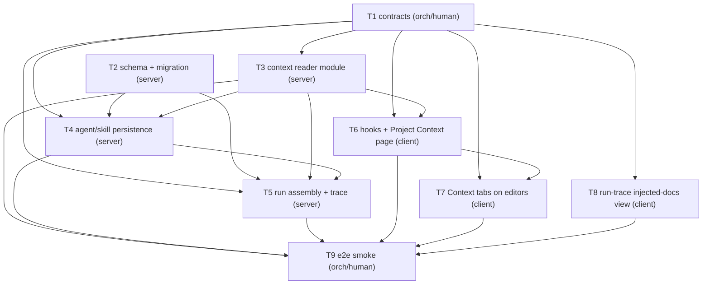

# Implementation Plan: Project Context Folder

## Overview
Lets a user manually attach a repository's markdown documents (specs/docs/insights) to an
agent or skill so they steer reviews. Attachment stores ordered **paths, not text**; at run
time the server reads current content from the reviewed PR's clone and feeds it into the
existing-but-unused `reviewer-core` `## Project context` untrusted slot. Adds zero new LLM
calls; the run trace records which documents were injected, each one's estimated token size,
and any skips.

## Source spec
`specs/2026-07-18-project-context-folder.md` (SPEC-2026-07-18-project-context-folder, approved).

## Execution mode
multi-agent (parallel) — chosen by the user. Plan is shaped into phases with a strict
dependency DAG, non-overlapping `Owned paths`, contracts defined first, and cross-surface
tasks (server vs client) that run concurrently once contracts land.

## Requirements (verified)
Restated from the spec; AC-N ids carried verbatim as traceability keys.

- **R1 (AC-1, AC-3):** Project Context page lists every `.md` in the active repo's clone
  whose path contains a configured context-root dir (default `specs`,`docs`,`insights`) at
  any depth, with repo-relative path + root badge; non-configured folders excluded.
- **R2 (AC-2):** Selecting a listed document renders its markdown read-only in a preview pane.
- **R3 (AC-4):** No clone (`clonePath` null, e.g. seeded `acme/payments-api`) → 200 empty
  inventory with an explanatory empty state, never 5xx.
- **R4 (AC-5, AC-6):** Toggling a doc on in an agent's / skill's Context tab persists its
  repo-relative **path** in that entity's ordered attached list — path only, never text.
- **R5 (AC-7):** A skill's attached documents are inherited by every agent using the skill.
- **R6 (AC-8):** Run assembly order = agent's own docs (listed order) then skill-inherited
  (skills in link order, each skill's docs in listed order), each distinct path once,
  first occurrence wins.
- **R7 (AC-9):** Drag-reorder persists and changes the injected block order on later runs.
- **R8 (AC-10, AC-11):** On a run with a non-empty set, read each doc's current content from
  the reviewed PR's clone and pass as `specs` into the existing `## Project context` slot,
  each wrapped untrusted (`wrapUntrusted`) behind the injection guard.
- **R9 (AC-12, AC-13):** Trace records, per injected doc, repo-relative path + estimated
  token size; run-trace view shows path + token size of each; the Prompt-assembly `specs`
  block is expandable and copyable.
- **R10 (AC-14):** Context tab shows a deterministic estimated total token count for the
  attached set, computed from document content length, updating as docs are toggled.
- **R11 (AC-15):** Zero LLM/model calls to list, preview, attach, reorder, estimate, or
  inject documents.
- **R12 (AC-16):** A missing/unreadable attached path at run time is skipped (recorded with
  path + reason), the rest inject, the run completes normally.
- **R13 (AC-17):** Empty assembled set → prompt has no `## Project context` block, byte-for-
  byte unchanged from today (`prompt_assembly.specs` null).
- **R14 (AC-18):** A doc over the per-document cap (default 64 KB UTF-8) is truncated at the
  cap, marked in the injected block and the trace, tokens counted over the truncated content.
- **R15 (AC-19):** A path resolving outside the clone (absolute, `..`, escaping symlink) is
  refused — rejected at save time and skipped at run time; no file outside the clone is read.
- **R16 (non-functional):** One deterministic estimator (`~ceil(len/4)`) used for BOTH the
  editor set estimate and the trace per-doc size, so numbers are comparable. Workspace
  tenancy respected. Markdown rendered through the sanitizing `Markdown` primitive.

## Open questions & recommendations
- Q: none blocking — the spec resolved D1–D7 and lists no open questions.
- **Rec (storage decision, resolved):** Store `context_documents` as a **JSONB `string[]`
  column** on both `agents` and `skills` (`jsonb('context_documents').$type<string[]>()`),
  matching the existing `skills.evidence_files` precedent. Do **not** use a join table — the
  `agent_skills` join table exists only because skills are shared entities needing per-agent
  order; attached paths are bare strings owned by a single entity. (Grounded in
  `server/src/db/schema/skills.ts:19`, `agents.ts:51-63`.)
- **Rec (trace decision, resolved):** Keep `specs_read: string[]` (now populated with
  injected paths, feeding the existing chip display) and add a NEW `.nullish()`
  `specs_injected` field for per-doc `{path, tokens, status}` — never change the element type
  of `specs_read`, because `run_traces.trace` is persisted JSON and old rows must keep
  parsing (INSIGHTS 2026-06-19).
- **Rec (persistence endpoints):** Mirror the Skills-tab convention — dedicated
  `POST /agents/:id/context-documents` and `POST /skills/:id/context-documents` that take the
  full ordered path array per change, rather than overloading the agent/skill PUT. Agent
  attachment changes snapshot a new `agent_versions` config (D6); skill attachment changes do
  **not** bump the skill body version (parallel to `evidence_files`).
- **Rec (back-compat on versioned config):** `AgentVersionConfig.context_documents` is
  snapshotted into persisted `agent_versions.config_json`; give it `.default([])`/`.nullish()`
  so pre-existing version rows still parse — same rule as the trace field.

## Affected packages & contracts
- **server (`@devdigest/api`)** — new `modules/context/` reader; new JSONB columns +
  migration; agent/skill persistence; run-executor assembly + trace population; config keys.
- **client (`@devdigest/web`)** — Project Context page; Context tab on agent + skill editors;
  run-trace injected-docs display; new hooks + i18n.
- **reviewer-core (`@devdigest/reviewer-core`)** — **no code change** (verified): `spec-${i}`
  `wrapUntrusted` → `## Project context` → `assembly.specs` is fully wired
  (`reviewer-core/src/prompt.ts:116-153,172`; `src/review/run.ts:61,132,143`). Reuse-only.
- **Contracts (vendored `@devdigest/shared`, two-sided lock-step, `orchestrator/human`):**
  `knowledge.ts` (Agent + Skill gain `context_documents`; `AgentVersionConfig` gains it),
  `trace.ts` (new nullish `specs_injected`), new `contracts/context.ts` (inventory item +
  listing envelope), plus `index.ts` re-export. Applied to BOTH
  `server/src/vendor/shared/` and `client/src/vendor/shared/`.

## Architecture changes
- **New server feature module** `server/src/modules/context/` (onion: `routes.ts` →
  `service.ts` → git adapter via `container.git`; pure `helpers.ts` + `constants.ts`),
  registered statically in `server/src/modules/index.ts`.
- **Pure domain helpers** in `server/src/modules/context/helpers.ts` (no I/O): `approxTokens`
  (`Math.ceil(len/4)`), `truncateToBytes` (64 KB cap + marker), `isPathSafe` (lexical: reject
  absolute / `..` / non-relative). Reused by the reader (T3), save-time validation (T4), and
  run assembly (T5) — keeps the single estimator/guard in one ring.
- **New config keys** in the server config loader: `contextRoots`
  (default `['specs','docs','insights']`), `contextDocMaxBytes` (default `65536`).
- **New client route** `client/src/app/context/` (workspace-level, repo-scoped via
  `useActiveRepo()`, mirroring `/conventions`).
- **New Context tab** on the agent editor and skill editor, mirroring the existing Skills tab
  (`'use client'` leaf components; three-place tab registration each).

## Phased tasks

Concurrency: **T1 ∥ T2** (Phase 1). Once T1 lands, **T3 (server) ∥ T6 ∥ T8 (client)** run
concurrently across surfaces; T7 follows T6; T4 then T5 sequence the server backend. Client
tasks (own `client/**`) never overlap server tasks (own `server/**`).

### Phase 1 — Contracts & schema (foundation)

- **T1**
  - **Action:** Apply the vendored contract changes to BOTH vendor copies in lock-step.
    In `contracts/knowledge.ts`: add `context_documents: z.array(z.string()).nullish()` to
    `Agent` and to `Skill`; add `context_documents: z.array(z.string()).default([])` to
    `AgentVersionConfig` (persisted config — must be back-compat). In `contracts/trace.ts`:
    keep `specs_read: z.array(z.string())`; add new
    `specs_injected: z.array(z.object({ path: z.string(), tokens: z.number().int(), status: z.enum(['injected','truncated','skipped_missing']) })).nullish()`
    to `RunTrace`. New file `contracts/context.ts`: `DocumentInventoryItem`
    `{ path: string, root: string, token_estimate: number }` and a listing envelope
    `{ repo_id: string, has_clone: boolean, count: number, items: DocumentInventoryItem[] }`;
    export it from both `index.ts` barrels.
  - **Package:** server + client (vendored shared)
  - **Type:** core (contract)
  - **Owner:** orchestrator/human  (vendored two-sided change — never a parallel implementer)
  - **Skills to use:** zod, typescript-expert
  - **Owned paths:** `server/src/vendor/shared/contracts/knowledge.ts`,
    `server/src/vendor/shared/contracts/trace.ts`,
    `server/src/vendor/shared/contracts/context.ts`, `server/src/vendor/shared/index.ts`,
    `client/src/vendor/shared/contracts/knowledge.ts`,
    `client/src/vendor/shared/contracts/trace.ts`,
    `client/src/vendor/shared/contracts/context.ts`, `client/src/vendor/shared/index.ts`
  - **Depends-on:** none
  - **Risk:** medium
  - **Known gotchas:** Vendored shared is TWO hand-synced copies — the only intended diff is
    comments (server INSIGHTS 2026-06-19). New persisted fields MUST be `.nullish()`/`.default`
    or old `run_traces.trace` / `agent_versions.config_json` rows fail `.parse` (server
    INSIGHTS 2026-06-19). Adding a required field to a vendored contract breaks client test
    `Partial<>` fixtures with TS2719 (client INSIGHTS 2026-06-19) — the fixtures are updated
    by the consuming tasks.
  - **Acceptance:** `cd server && pnpm typecheck` and `cd client && pnpm typecheck` both pass;
    the two `knowledge.ts`, two `trace.ts`, two `context.ts`, and two `index.ts` copies are
    byte-identical except comments (verify with a diff). Traces R4, R9, and the whole
    contract surface.

- **T2**
  - **Action:** Add `contextDocuments` JSONB column to the `agents` and `skills` Drizzle
    tables as `jsonb('context_documents').$type<string[]>()` (nullable), matching the
    `skills.evidenceFiles` precedent. Generate + apply the migration.
  - **Package:** server
  - **Type:** backend (schema)
  - **Owner:** implementer
  - **Skills to use:** drizzle-orm-patterns, postgresql-table-design
  - **Owned paths:** `server/src/db/schema/agents.ts`, `server/src/db/schema/skills.ts`,
    `server/src/db/migrations/**` (new generated `00NN_*.sql` + `meta/00NN_snapshot.json` +
    `meta/_journal.json`)
  - **Depends-on:** none
  - **Risk:** low
  - **Known gotchas:** Migrations are NOT applied on boot — schema edit → `pnpm db:generate`
    → `pnpm db:migrate` (server INSIGHTS: NEVER hand-author the SQL, or the next generate
    re-emits the column). This schema uses JSONB for all arrays; no `text[]`.
  - **Acceptance:** `cd server && pnpm db:generate` emits one migration adding
    `context_documents` to both tables; `pnpm db:migrate` applies cleanly against the running
    Postgres; `pnpm typecheck` passes. Traces R4.

### Phase 2 — Server backend

- **T3**
  - **Action:** Create the `modules/context/` reader (onion module registered in
    `modules/index.ts`). Pure `helpers.ts`: `approxTokens(len)=Math.ceil(len/4)`,
    `truncateToBytes(content, cap)` returning `{ text, truncated }` with a visible marker,
    `isPathSafe(path)` (lexical reject of absolute paths, `..` segments, non-relative).
    `constants.ts` + config keys `contextRoots` (default `['specs','docs','insights']`) and
    `contextDocMaxBytes` (default `65536`) in the server config loader. `service.ts`: list the
    inventory via `container.git.listFiles(repo)` filtered to `.md` whose path segments
    include a configured root, mapping each to `DocumentInventoryItem` (read content for the
    `token_estimate`, or 0 when unreadable); return an empty envelope with `has_clone:false`
    when the repo has no clone (AC-4). Preview endpoint reads one doc via
    `container.git.readFile` (path re-checked with `isPathSafe`; workspace-scoped).
    `routes.ts`: `GET` inventory + `GET` preview for the active repo, zod-validated,
    `getContext(app.container, req)` for tenancy.
  - **Package:** server
  - **Type:** backend
  - **Owner:** implementer
  - **Skills to use:** onion-architecture, fastify-best-practices, zod, security, typescript-expert
  - **Owned paths:** `server/src/modules/context/**`, `server/src/modules/index.ts`,
    `server/src/platform/config.ts` (config loader — the file that defines `cloneDir`)
  - **Depends-on:** T1
  - **Risk:** medium
  - **Known gotchas:** The conventions extractor already reads clone content via
    `git.listFiles` (`git ls-files`, honors `.gitignore`) + `git.readFile`, falling back to
    `code_chunks` only for the un-cloned demo repo — but that sampler excludes `.md`, so it is
    NOT directly reusable (spec + server INSIGHTS 2026-06-27). `acme/payments-api` has
    `clonePath: null` and can never produce a clone (server INSIGHTS 2026-07-15) — this is the
    AC-4 empty-state case. Grepping for LLM identifiers to prove zero-LLM is fragile — assert
    via control flow / a throwing double, not grep (server INSIGHTS 2026-07-12).
  - **Acceptance:** New `server/test/context.it.test.ts` passes under
    `cd server && pnpm exec vitest run .it.test`: (a) inventory for a cloned repo returns
    `.md` files under configured roots with paths + badges, excludes a non-configured folder
    (AC-1, AC-3); (b) a repo with no clone returns 200 + empty `has_clone:false` envelope,
    not 5xx (AC-4); (c) with an always-throwing LLM injected via `ContainerOverrides.llm`, the
    inventory + preview endpoints still return 200 (AC-15); (d) a crafted `../../etc/passwd`
    preview request is refused, no outside file read (AC-19). Traces R1, R2, R3, R11, R15, R16.

- **T4**
  - **Action:** Persist ordered `context_documents` on agents and skills. In the agents
    module: read/write the `context_documents` column; include it in the `AgentVersionConfig`
    snapshot written to `agent_versions.config_json` (so an attachment change snapshots a new
    version, D6); add `POST /agents/:id/context-documents { paths: string[] }` taking the full
    ordered set. In the skills module: read/write the column; add
    `POST /skills/:id/context-documents { paths: string[] }`; do **NOT** bump the skill body
    version (parallel to `evidence_files`, D6). Both routes reject any path failing
    `isPathSafe` (imported from `modules/context/helpers.ts`) with a `ValidationError` at save
    time (AC-19). Surface `context_documents` on the `Skill` and `Agent` DTOs.
  - **Package:** server
  - **Type:** backend
  - **Owner:** implementer
  - **Skills to use:** onion-architecture, fastify-best-practices, drizzle-orm-patterns, zod, security
  - **Owned paths:** `server/src/modules/agents/**`, `server/src/modules/skills/**`
  - **Depends-on:** T1, T2, T3
  - **Risk:** medium
  - **Known gotchas:** `evidence_files` is the exact persistence precedent (JSONB `string[]`,
    order implicit) — mirror `SkillsRepository.update`'s handling. The Skills tab persists the
    FULL ordered set per change via a dedicated endpoint (`setSkills`) — mirror that shape.
    `AgentVersionConfig.context_documents` is persisted JSON — snapshot writer must default it
    for old rows (paired with T1).
  - **Acceptance:** New `server/test/context-persistence.it.test.ts` passes under
    `pnpm exec vitest run .it.test`: (a) POST agent context-documents then reload → paths
    persist, stored config holds path strings not bodies, and a new `agent_versions` row is
    written (AC-5); (b) POST skill context-documents persists with NO new skill body version
    (AC-6, D6); (c) reorder persists across reload (AC-9 storage half); (d) a POST with an
    absolute / `..` path is rejected with a validation error (AC-19). `pnpm typecheck` passes.
    Traces R4, R7, R15.

- **T5**
  - **Action:** Assemble and inject at run time. Add a pure assembly helper (dedup + order per
    AC-8; per-doc `truncateToBytes` at `contextDocMaxBytes`; `approxTokens` over injected
    content; `isPathSafe` skip) — place it in `modules/reviews/` (e.g.
    `context-assembly.ts`) importing the pure primitives from `modules/context/helpers.ts`. In
    `run-executor.ts`: build the set = agent's own `context_documents` (listed order) then
    enabled-skill inherited docs (skills in link order, each in listed order), dedup
    first-occurrence; read each via `container.git.readFile`; on missing/unreadable/unsafe,
    skip + record `status:'skipped_missing'`; on oversized, truncate + `status:'truncated'`;
    pass the resulting `specs: string[]` into `reviewPullRequest` (conditional spread, like
    `skills`); populate `specs_read` (injected paths) and the new `specs_injected`
    (`{path,tokens,status}`) in BOTH trace-assembly spots (success ~L319 AND failure/cancel
    ~L468). Surface each skill's `context_documents` on the `linkedSkills` result so inherited
    docs are reachable. Empty set → omit `specs` entirely (AC-17, byte-for-byte unchanged).
  - **Package:** server
  - **Type:** backend
  - **Owner:** implementer
  - **Skills to use:** onion-architecture, typescript-expert, security
  - **Owned paths:** `server/src/modules/reviews/**`
  - **Depends-on:** T1, T2, T3, T4
  - **Risk:** high
  - **Known gotchas:** Wiring mirrors the skills path exactly — `this.agents.linkedSkills(id)`
    → filter `enabled` → map (server INSIGHTS 2026-06-26); a DISABLED skill's docs are omitted.
    `RunTrace.stats`/trace is assembled in TWO spots in `run-executor.ts` (success ~L319 and
    error/fallback ~L468) — both must set `specs_read` + `specs_injected` (server INSIGHTS
    2026-06-19). reviewer-core needs no change — `specs` is fully wired to `spec-${i}`
    `wrapUntrusted` → `## Project context` (AC-11) and returns `assembly.specs` (AC-10/13).
  - **Acceptance:** New/extended `server/test/*.it.test.ts` under `pnpm exec vitest run .it.test`:
    (a) an agent with own + skill-inherited docs injects them deduped in AC-8 order, verified
    against `prompt_assembly.specs` and `specs_read` (AC-7, AC-8, AC-10); (b) each injected doc
    sits in an `<untrusted source="spec-i">` block (AC-11); (c) `specs_injected` lists per-doc
    path + token size + status, and a since-deleted path shows `skipped_missing` while others
    still inject and the run completes (AC-12, AC-16); (d) an oversized doc is `truncated` with
    tokens over the truncated length (AC-18); (e) empty set → `prompt_assembly.specs` is null,
    run unchanged (AC-17); (f) with a throwing LLM double the assembly step itself still runs
    (AC-15). `pnpm typecheck` passes. Traces R5, R6, R8, R9, R11, R12, R13, R14, R15, R16.

### Phase 3 — Client

- **T6**
  - **Action:** Add TanStack Query hooks `lib/hooks/context.ts`: `useContextInventory(repoId)`
    (`['context-inventory', repoId]`), `useContextDocumentPreview(repoId, path)`
    (`['context-preview', repoId, path]`, enabled when path set),
    `useSetAgentContextDocuments(agentId)`, `useSetSkillContextDocuments(skillId)` (each POSTs
    the full ordered `paths` set and invalidates the entity + its inventory), via the `api.*`
    wrapper in `lib/api.ts`. Build the Project Context page: thin `app/context/page.tsx` →
    `_components/ProjectContextView/` using `useActiveRepo()` for the repo, listing inventory
    rows (path + root badge), a read-only preview pane rendering the selected doc through the
    `@devdigest/ui` `Markdown` primitive, and an explanatory empty state when
    `has_clone:false` (AC-4). All strings via `useTranslations('context')` from a new
    `messages/en/context.json`.
  - **Package:** client
  - **Type:** ui
  - **Owner:** implementer
  - **Skills to use:** next-best-practices, frontend-architecture, react-best-practices, security
  - **Owned paths:** `client/src/lib/hooks/context.ts`, `client/src/app/context/**`,
    `client/messages/en/context.json`
  - **Depends-on:** T1, T3
  - **Risk:** medium
  - **Known gotchas:** A workspace-level repo-scoped page gets the repo from `useActiveRepo()`
    (`lib/repo-context`), like `/conventions` (client INSIGHTS 2026-06-27). The `Markdown`
    primitive (react-markdown v9) sanitizes URLs by default — untrusted repo markdown is
    XSS-safe with no extra config (client INSIGHTS 2026-06-26). Data fetching goes through
    `lib/hooks/`, not raw fetch (client CLAUDE.md). Query keys live in the hooks, not
    `lib/api.ts` (which is only the typed `apiFetch`/`api.*` wrapper).
  - **Acceptance:** `cd client && pnpm typecheck` and `pnpm test` pass; a
    `ProjectContextView.test.tsx` (MSW-mocked inventory) covers: inventory loads with paths +
    badges and a click renders the markdown preview (AC-1, AC-2); a `has_clone:false` response
    renders the empty state, not an error (AC-4). Traces R1, R2, R3, R16.

- **T7**
  - **Action:** Add a `Context` tab to the agent editor and the skill editor, mirroring the
    Skills tab (drag handle + native HTML5 drag reorder, checkbox attach/detach,
    name + folder path + root badge, "Filter documents…" search, per-row preview, and a
    deterministic `≈ N tokens` footer for the attached set summing `token_estimate`). Agent
    side: register in the THREE places — `VALID_TABS` in `app/agents/[id]/page.tsx`, `TABS` in
    `AgentEditor/constants.ts`, render switch in `AgentEditor.tsx` — and add a `ContextTab`
    under `AgentEditor/_components/ContextTab/`, persisting via `useSetAgentContextDocuments`.
    Skill side: mirror in `VALID_SKILL_TABS` (`app/skills/[id]/page.tsx`), the skill editor's
    `TABS`/constants, its render switch, and a `ContextTab` under the skill editor, persisting
    via `useSetSkillContextDocuments`. Reuse the T6 hooks and `messages/en/context.json`; add
    only `editor.tabs.context` labels to `messages/en/agents.json` and
    `messages/en/skills.json`.
  - **Package:** client
  - **Type:** ui
  - **Owner:** implementer
  - **Skills to use:** next-best-practices, frontend-architecture, react-best-practices
  - **Owned paths:** `client/src/app/agents/[id]/page.tsx`,
    `client/src/app/agents/[id]/_components/AgentEditor/**`,
    `client/src/app/skills/[id]/page.tsx`,
    `client/src/app/skills/[id]/_components/SkillEditor/**`,
    `client/messages/en/agents.json`, `client/messages/en/skills.json`
  - **Depends-on:** T1, T6
  - **Risk:** medium
  - **Known gotchas:** Adding a tab touches THREE agreeing places (`VALID_TABS`,
    `TABS` array, render switch) — miss one and `?tab=context` silently falls back to config
    (client INSIGHTS 2026-06-26). The Skills tab persists the FULL ordered array per change via
    `useSetAgentSkills`; mirror that. This project's client tests use `fireEvent`, NOT
    `userEvent` (not installed) (client INSIGHTS 2026-07-12). Native HTML5 drag is not
    keyboard-accessible — deferred per D7; toggling + preview MUST stay keyboard-operable.
  - **Acceptance:** `cd client && pnpm typecheck` and `pnpm test` pass; a
    `ContextTab.test.tsx` (MSW-mocked) covers: toggling a doc persists the full ordered set
    (AC-5/AC-6 UI half), reorder emits the new order (AC-9 UI half), and the footer shows a
    `≈ N tokens` total that updates on toggle (AC-14). Traces R4, R7, R10.

- **T8**
  - **Action:** Extend the run-trace view to display injected documents. In
    `RunTraceDrawer/_components/TraceBody/`, render `trace.specs_injected` in the Configuration
    section — one entry per injected doc showing repo-relative path, token size, and status
    (`injected`/`truncated`/`skipped_missing`) — while keeping the existing `specs_read` chip
    display. Confirm the Prompt-assembly `specs` `PromptBlock` (already wired) renders the
    injected `## Project context` block expandably/copyably (AC-13) and update it only if
    needed. Add the trace labels to `messages/en/runs.json`.
  - **Package:** client
  - **Type:** ui
  - **Owner:** implementer
  - **Skills to use:** next-best-practices, react-best-practices, frontend-architecture
  - **Owned paths:**
    `client/src/app/repos/[repoId]/pulls/[number]/_components/RunTraceDrawer/**`,
    `client/messages/en/runs.json`
  - **Depends-on:** T1
  - **Risk:** low
  - **Known gotchas:** `specs_read` already renders as chips and the `specs` `PromptBlock`
    already exists in `TraceBody.tsx` — this is additive display of the new `specs_injected`
    field, not new plumbing. A vendored-contract `Partial<>` test fixture needs the new field
    defaulted (`specs_injected: null`) to avoid TS2719 (client INSIGHTS 2026-06-19).
  - **Acceptance:** `cd client && pnpm typecheck` and `pnpm test` pass; extend
    `RunTraceDrawer.test.tsx` so a trace with `specs_injected` renders each doc's path + token
    size + status, and the `specs` PromptBlock's copy control works (AC-12, AC-13). Traces R9.

### Phase 4 — Full-stack verification

- **T9**
  - **Action:** Add a deterministic e2e smoke flow: on a cloned repo, attach a `.md` document
    to an agent via its Context tab, run a review, and confirm the run trace shows the
    injected document with its token size and the `## Project context` block. Requires the full
    stack running.
  - **Package:** e2e
  - **Type:** e2e
  - **Owner:** orchestrator/human  (e2e needs the full stack — no pipeline implementer owns it)
  - **Skills to use:** —
  - **Owned paths:** `e2e/**`
  - **Depends-on:** T3, T4, T5, T6, T7, T8
  - **Risk:** low
  - **Known gotchas:** The seeded `acme/payments-api` has no clone — the e2e must target a
    genuinely cloned repo, or it exercises only the AC-4 empty state.
  - **Acceptance:** the e2e spec runs green against the running stack; the trace step asserts
    one injected doc with a token count. Traces R8, R9 end-to-end. (Optional — dispatch only
    if an e2e lane is wanted for this feature.)

## Testing strategy
- **Server unit** (`cd server && pnpm exec vitest run --exclude '**/*.it.test.ts'`): pure
  helpers — `approxTokens`, `truncateToBytes`, `isPathSafe`, and the AC-8 dedup/order assembly
  function (T3, T5).
- **Server integration** (`cd server && pnpm exec vitest run .it.test`; files MUST end
  `*.it.test.ts`): inventory/preview endpoints incl. no-clone + traversal (T3), agent/skill
  persistence + versioning (T4), run injection incl. dedup/order, skip, truncate, empty-set,
  and the AC-15 throwing-LLM-double proof (T5).
- **Client** (`cd client && pnpm test`, vitest + jsdom + RTL, `fireEvent` not `userEvent`):
  `ProjectContextView` (T6), `ContextTab` (T7), `RunTraceDrawer` extension (T8) with MSW.
- **e2e** (`e2e/`, orchestrator/human): the T9 attach→run→trace smoke.
- Test authoring may be delegated to `test-writer`; implementers run the named suites as their
  acceptance check. No tests were run during planning.

## Risks & mitigations
- **Persisted-JSON back-compat** (trace + agent_versions) → all new fields `.nullish()`/
  `.default([])`; contract task (T1) verified against `.parse` of an old-shaped fixture.
- **Path traversal / arbitrary file read (AC-19)** → single lexical `isPathSafe` guard at save
  time (T4) AND before every clone read (T3, T5); run-time symlink escape handled as a skip.
- **Silent LLM introduction (AC-15)** → throwing-LLM-double integration assertions on both the
  reader endpoints (T3) and the assembly step (T5); verify by control flow, not grep.
- **AC-17 byte-for-byte no-context regression** → empty set omits `specs` entirely (conditional
  spread), asserted against a null `prompt_assembly.specs`.
- **Vendored-copy drift** → T1 is a single orchestrator/human lock-step task; downstream tasks
  never edit `vendor/shared`.
- **Server backend serialization (T3→T4→T5)** → accepted; it is a genuine data dependency
  (helpers → persistence read methods → run assembly). Cross-surface client work (T6/T8) runs
  concurrently to keep wall-clock down.

## Red-flags check
- [x] Every requirement (and every spec AC-N) maps to a task — R1-R16 / AC-1..AC-19 traced
      across T1-T8 (see per-task Acceptance).
- [x] No specification was authored or edited — the spec is input; only this plan was written.
- [x] Execution mode is recorded (multi-agent) and the plan is phased with a DAG + owned paths.
- [x] Dependencies form a DAG (no cycles) — see the mermaid graph.
- [x] (multi-agent) Concurrent tasks have non-overlapping Owned paths — server `server/**` vs
      client `client/**`; within server T3/T4/T5 own disjoint module trees and are dependency-
      ordered; within client T6/T7/T8 own disjoint routes + disjoint i18n namespaces.
- [x] Every Acceptance is measurable — named test files / commands / observable trace fields.
- [x] Vendored-contract (T1) and e2e (T9) tasks are owned by orchestrator/human.
- [x] No tests or builds were run during planning.
