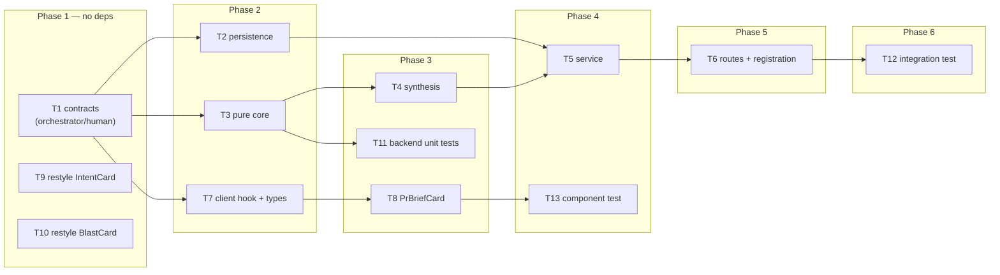

# Implementation Plan: Why + Risk Brief

## Overview
Assemble five already-computed PR signals (Intent, Blast Radius, Smart Diff group counts, the
live linked-issue fetch, and a bounded slice of the repo's Context-Folder docs) into exactly
**one** new structured model call that produces a per-PR brief — `what`, `why`, `risk_level`,
grounded `risks[]`, and a "read these first" `review_focus[]` — cached per PR so reopening a PR
costs zero model calls. Renders as a new `PrBriefCard` on the PR Overview tab. A user-approved,
non-spec addendum in the same pass restyles the two existing Overview cards (`IntentCard`,
`BlastCard`) to match the new card's visual language, presentation-only.

## Source spec
`specs/2026-07-18-why-risk-brief.md` (SPEC-2026-07-18-why-risk-brief, **status: draft** — planned
against as-is per instruction; not edited). Its `AC-1`…`AC-20` are the traceability keys used
throughout Part A of this plan. The spec's two open design forks (reuse the existing `Risk`
element + the registered `risk_brief` `FeatureModelId`; extend the existing `pr_brief.json` blob)
are settled inputs, not re-litigated here.

## Execution mode
multi-agent (parallel) — explicitly chosen by the user, following the precedent set by Blast
Radius, Smart Diff, and Onboarding Tour in this codebase. Contracts land first (T1) so the server
chain and the client chain proceed concurrently behind it; the visual-polish addendum (T9, T10)
has zero dependency on the contract and starts immediately alongside T1.

## Requirements (verified)
- **R1 (AC-1):** Recompute assembles the 5 existing inputs and produces the brief via exactly
  **one** new `completeStructured` call (proven with a recording LLM double).
- **R2 (AC-2):** Intent/blast are read from their persisted stores; smart-diff/linked-issue are
  read via their existing zero-/live paths — no additional intent/blast/smart-diff model call.
- **R3 (AC-3):** Reading an existing brief costs **zero** model calls (proven with an
  always-throwing LLM double still returning 200).
- **R4 (AC-4):** No brief ever computed → read returns `200` with a null body, not `404`.
- **R5 (AC-5):** Every `risks[].file_refs` entry and every `review_focus[].file` is grounded to a
  path in the PR's diff files or blast-map files; a fabricated path is dropped (a risk keeps empty
  `file_refs`; a focus item with no valid file is dropped entirely).
- **R6 (AC-6):** The assembled model input never contains full file-diff bodies (patches/hunks) —
  only summaries/counts.
- **R7 (AC-7):** Assembled model input stays ≤ **8,000 tokens** (~1 token/4 chars) via hard
  per-input caps that sum under budget by construction.
- **R8 (AC-8):** Missing persisted intent → still a best-effort brief (derive `what`/`why` from
  the remaining inputs), not an error.
- **R9 (AC-9):** Degraded/absent blast map → still a brief, grounding in diff files at minimum.
- **R10 (AC-10):** No linked issue and/or no context docs → still a brief, no error.
- **R11 (AC-11):** The single model call failing → a deterministic degraded brief skeleton with a
  reason, never a 5xx.
- **R12 (AC-12):** Context-Folder doc selection is a **deterministic** bounded heuristic (no
  extra model call), each doc capped at the brief's own tight cap.
- **R13 (AC-13):** No usable repo clone → omit the context-docs input, still produce a brief,
  never surface the clone-read failure as an error.
- **R14 (AC-14):** Overview tab renders a brief card showing `what`, `why`, risk-level indicator,
  `risks[]`, and `review_focus[]`.
- **R15 (AC-15):** Risk level is conveyed by colour **and** a text label (never colour alone).
- **R16 (AC-16):** A `review_focus` file reference is an actionable control that jumps to it —
  in-app scroll when the file is in the PR's diff, else the GitHub blob at that line — reusing
  the Overview tab's existing `onJumpToCode` wiring.
- **R17 (AC-17):** No brief yet → empty state with a Compute/Regenerate CTA; recompute in flight →
  non-duplicable in-progress state.
- **R18 (AC-18):** A degraded brief renders its available content plus an explanatory degraded
  badge + reason, never a blank error state.
- **R19 (AC-19):** A Regenerate action re-runs the one synthesis call, overwrites the cached
  brief, and the client writes the fresh brief straight into its cache.
- **R20 (AC-20):** A PR outside the caller's workspace → both read and recompute resolve
  not-found, never leaking another workspace's brief.

(All 20 requirements above are as stated in the spec's own accepted defaults; none rest on an
unconfirmed answer that changes this plan's shape — see Open questions & recommendations for the
implementation-level decisions this plan makes on the spec's behalf.)

## Addendum: visual polish (not spec-tracked)
User-approved, out-of-band request — presentation-only, no contract/behavior/test-surface change
beyond confirming existing tests still pass.
- **AD-1:** Restyle `IntentCard` (in-scope/out-of-scope lists) to the same visual language as the
  new `PrBriefCard` — colored check/x list headers, bordered list rows.
- **AD-2:** Restyle `BlastCard` (+ its private `SymbolRow`) to the same visual language — bordered
  caller rows, color-differentiated endpoint vs. cron badges.

## Open questions & recommendations
The spec's own six `NEEDS CLARIFICATION` items already carry an explicit "default assumed" this
plan follows as-is (draft status, planned per instruction). Restated for visibility, not blocking:
- Q: are `what`/`why` synthesized fresh by the one call, or surfaced from `intent.intent`? →
  spec default: synthesized fresh, with intent as one input when present. This plan follows that
  default (T4/T5); the *skeleton/degraded* fallback (T3) derives `what` from `intent.intent` or
  the PR title as a best-effort, never-fabricated value — that fallback path is this plan's own
  addition, not a re-litigation of the spec's default for the normal path.
- Q: is `risk_level` model-produced or a deterministic floor? → spec default: model-produced. This
  plan's degraded skeleton (T3, only reached on total model failure) uses a fixed neutral
  `'medium'` — an honest "we don't know, be cautious" value, not a computed floor.
- Q: exact context-doc selection heuristic/caps? → spec default: ≤3 docs, architecture/
  invariant/convention-named preferred, smallest-first, ≤~3K tokens total. This plan pins exact
  numbers (T3): `CONTEXT_DOC_MAX_COUNT=3`, `CONTEXT_DOC_MAX_CHARS=4000`/doc (~1000 tokens ×3 ≈
  3000 tokens), matching the spec's recommended allocation.
- Q: does a missing intent/blast cascade its own recompute? → spec default: no, degrade instead
  (preserves "exactly one new call"). Followed as-is (T5 never calls `IntentService.recompute`/
  `BlastService.recompute`).
- Q: hard recompute latency budget? → spec: none beyond the token budget. Not addressed by this
  plan beyond the existing synchronous-call profile shared with intent/blast/onboarding.
- Q: name the shared `pr_brief.json` persistence seam? → spec default: accept extending the
  existing seam for this feature; naming decided separately. **This plan's recommendation: do NOT
  name/refactor the seam now** — T2 adds a fourth sibling key (`why_risk`) exactly like `blast`
  did, and the seam-naming question stays parked in `server/INSIGHTS.md` Open Questions
  (2026-07-15) for a future, dedicated decision. Renaming it here would be an uninstructed
  refactor of `intent`/`blast`'s existing, working persistence path.

This plan's own implementation-level decisions (not spec gaps — ordinary planner judgment calls,
documented here for traceability):
- **Rec-1 (module naming):** new server module is `server/src/modules/why-risk-brief/` and routes
  are `/pulls/:id/why-risk-brief` (+ `/recompute`) — distinct from the already-used
  `risk_brief` `FeatureModelId` string and the `pr_brief.json` blob name, mirroring the existing
  precedent where the module folder is a short name distinct from its `FeatureModelId`
  (`blast_radius` id → `modules/blast/`; `review_intent` id → `modules/intent/`).
- **Rec-2 (`degraded_reason` mechanism):** implemented as a **server-composed, free-text
  sentence** rendered directly on the client (mirrors `onboarding`'s pattern), NOT a stable
  enum-key resolved via client-side i18n (`blast`'s pattern). Rationale: a key-based approach
  requires the server's set of reason strings and the client's i18n keys to be kept in lock-step
  across two parallel tasks (T5 and T8) — free text removes that cross-task coupling entirely,
  at the cost of no client-side translation of the reason (acceptable; the badge label itself is
  still a translated string).
- **Rec-3 (`PrBrief.risks` reconciliation):** per the spec's explicit "recommendation to the
  planner," T1 narrows `PrBrief.risks` from the wrapper type `Risks` (`{ risks: Risk[] }`) to
  `z.array(Risk)` directly, so the dormant slot's shape matches what this feature actually
  produces. Confirmed safe: `PrBrief` is parsed nowhere in the repo (only comment/barrel
  references — verified by grep across `server/src` and `client/src`), so this is a zero-risk
  type-only edit with no persisted-row migration concern. The now-more-clearly-unused `Risks`
  wrapper type is left defined (harmless, pre-existing, not introduced by this feature) rather
  than deleted, to keep T1 minimal.
- **Rec-4 (`SmartDiffService` cross-import):** T5 calls `new SmartDiffService(this.container).get(...)`
  directly, per the task's own grounding note. This is the first direct feature-module→
  feature-module Service call in the codebase (prior cross-module reuse was limited to the shared
  `ReviewRepository`). It's read-only, already zero-LLM, and creates no cycle — flagged here for
  an architecture-reviewer pass as a deliberate, spec-directed exception, not an oversight.

## Affected packages & contracts
- **server** (`@devdigest/api`) — new module `src/modules/why-risk-brief/` (routes, service,
  synthesis, pure core); extends `src/modules/reviews/repository/pull.repo.ts` +
  `src/modules/reviews/repository.ts` with a `why_risk` sibling key on `pr_brief.json`; one-line
  static registration in `src/modules/index.ts`. No DB migration (JSONB column already exists).
- **client** (`@devdigest/web`) — new `PrBriefCard` (+ hook, + i18n keys), wired into
  `OverviewTab.tsx`; addendum restyles `IntentCard`/`BlastCard`/`SymbolRow` (presentation-only).
- **Contracts:** vendored `brief.ts` (both copies) — new `WhyRiskBrief`, new `ReviewFocusItem`,
  `PrBrief.risks` narrowed from `Risks` to `z.array(Risk)`. Two-sided, **orchestrator/human**
  (T1). No change to `platform.ts` (`risk_brief` `FeatureModelId` already registered).
- **reviewer-core** (`@devdigest/reviewer-core`) — **no changes.** Consumed as-is: `wrapUntrusted`
  via the existing `server/src/platform/prompt.ts` re-export shim, `LLMProvider`/`ChatMessage`
  types via `@devdigest/shared`. `groundFindings()` is not invoked by this feature (its inputs
  aren't `Finding[]`); the new grounding logic (AC-5) is a separate, purpose-built helper.
- **mcp-server / e2e** — not affected; no task in either package.

## Architecture changes
- `server/src/modules/why-risk-brief/routes.ts` — transport ring; new Fastify plugin, registered
  statically in `server/src/modules/index.ts` (`GET /pulls/:id/why-risk-brief`,
  `POST /pulls/:id/why-risk-brief/recompute`).
- `server/src/modules/why-risk-brief/service.ts` — application ring; orchestrates the 5 reads +
  the one LLM call; pulls `container.llm`, `container.github` off the container, never `new`s an
  adapter, never reads `process.env`.
- `server/src/modules/why-risk-brief/synthesize.ts` — application ring; the one
  `completeStructured` call.
- `server/src/modules/why-risk-brief/assemble.ts`, `helpers.ts`, `constants.ts` — domain core;
  pure, zero I/O (prompt-input assembly + caps, grounding, context-doc selection heuristic,
  degraded-skeleton builder, smart-diff count summarizer).
- `server/src/modules/reviews/repository/pull.repo.ts` + `.../repository.ts` — infrastructure
  ring; extends the established `pr_brief.json` read-merge-write with a `why_risk` sibling key,
  mirroring `upsertBriefBlast`/`getBriefBlast` verbatim.
- Client: `PrBriefCard` is a new `'use client'` leaf under `OverviewTab/_components/` (RSC
  boundary unchanged — `OverviewTab.tsx` is already `'use client'`); data logic lives in
  `client/src/lib/hooks/why-risk-brief.ts`, never in JSX.

## Phased tasks

### Phase 1 — Foundations (3 concurrent tracks, zero dependencies)

- **T1**
  - **Action:** In BOTH `server/src/vendor/shared/contracts/brief.ts` and
    `client/src/vendor/shared/contracts/brief.ts` (byte-identical edits): (1) add
    `export const ReviewFocusItem = z.object({ file: z.string(), line: z.number().int().nullish(), reason: z.string() }); export type ReviewFocusItem = z.infer<typeof ReviewFocusItem>;`
    directly below the existing `Risks` block; (2) add
    `export const WhyRiskBrief = z.object({ what: z.string(), why: z.string(), risk_level: RiskSeverity, risks: z.array(Risk), review_focus: z.array(ReviewFocusItem), degraded: z.boolean(), degraded_reason: z.string().nullable() }); export type WhyRiskBrief = z.infer<typeof WhyRiskBrief>;`
    directly below the new `ReviewFocusItem` block; (3) change the existing `PrBrief` object's
    `risks: Risks` field to `risks: z.array(Risk)` (leave `intent`, `blast`, `history` fields and
    the now-unused `Risks` type declaration untouched — do not delete `Risks`, do not touch
    `PrHistory`/`history`). No other file changes — `vendor/shared/index.ts` in both packages
    already does `export * from './contracts/brief.js'`, so no barrel edit is needed, and
    `platform.ts`'s `risk_brief` `FeatureModelId` entry already exists (do not re-add it).
  - **Package:** server + client
  - **Type:** core (shared contract)
  - **Owner:** orchestrator/human (vendored two-copy sync — never a parallel implementer)
  - **Skills to use:** zod, typescript-expert
  - **Owned paths:** `server/src/vendor/shared/contracts/brief.ts`,
    `client/src/vendor/shared/contracts/brief.ts`
  - **Depends-on:** none
  - **Risk:** low
  - **Known gotchas:** editing one copy does not update the other — hand-sync, verify with
    `diff` afterward. `PrBrief` is parsed nowhere in the repo (verified by grep — only
    comment/barrel references), so narrowing `risks`'s type has no persisted-row migration
    concern; this is a pure type-shape edit, not a runtime behavior change.
  - **Acceptance:** `cd server && pnpm typecheck` and `cd client && pnpm typecheck` both pass;
    `diff server/src/vendor/shared/contracts/brief.ts client/src/vendor/shared/contracts/brief.ts`
    shows no delta. Traces R1–R20 (blocks all Part A tasks).

- **T9**
  - **Action:** Restyle `client/src/app/repos/[repoId]/pulls/[number]/_components/OverviewTab/_components/IntentCard/IntentCard.tsx`
    and its colocated `styles.ts`, presentation-only, no prop/hook/behavior/data change:
    (1) In the `IntentList` sub-component, replace the current bare uppercase text label with an
    icon + label header — a green `CheckCircle` (`color: "var(--ok)"`) before the "In scope"
    label, a red `XCircle` (`color: "var(--crit)"`) before the "Out of scope" label — matching
    the "✓ green-check header … ✗ red-x header" two-column checklist pattern already used
    conceptually for in-scope/out-of-scope. Both icons come from the existing `Icon` registry
    (`@devdigest/ui`), rendered inline at `size={13}` before the label text, no new primitive.
    (2) Wrap each list item (currently a bare `<li>` + "•" dot) in a bordered row — border
    `1px solid var(--border)`, `borderRadius: 8`, `padding: "6px 10px"`, background
    `var(--bg-elevated)` — mirroring the `pathRow`/`readingRow` style objects in
    `client/src/app/repos/[repoId]/onboarding/_components/OnboardingView/styles.ts` (read that
    file for the exact reference shape; do not copy it verbatim, colocate an equivalent object in
    `IntentCard/styles.ts`). Leave the existing italic summary-quote block (`s.summary`)
    unchanged — it already matches the target visual language. Do not touch `SectionLabel`,
    `Card`, `Button`, `EmptyState`, or any other `@devdigest/ui` primitive — this task's owned
    paths are the two IntentCard files only.
  - **Package:** client
  - **Type:** ui
  - **Owner:** implementer
  - **Skills to use:** react-best-practices, frontend-architecture
  - **Owned paths:**
    `client/src/app/repos/[repoId]/pulls/[number]/_components/OverviewTab/_components/IntentCard/IntentCard.tsx`,
    `.../IntentCard/styles.ts`
  - **Depends-on:** none
  - **Risk:** low
  - **Known gotchas:** no existing `IntentCard.test.tsx` in this repo (verified) — there is no
    automated regression to preserve for this file; do not create a new test file (addendum
    explicitly excludes new tests). Keep all currently-rendered text (`t("block.intent")`,
    `t("card.recompute")`, `t("card.recomputing")`, `t("unavailable")`, `t("unavailableHint")`)
    and the `IntentList` label prop values unchanged, since a future test could reasonably query
    them by text/role.
  - **Acceptance:** `cd client && pnpm typecheck` and `cd client && pnpm build` both succeed
    (no existing test file to run for this component). Traces AD-1.

- **T10**
  - **Action:** Restyle
    `client/src/app/repos/[repoId]/pulls/[number]/_components/OverviewTab/_components/BlastCard/BlastCard.tsx`,
    its private child `SymbolRow.tsx`, and their shared `styles.ts`, presentation-only, no
    prop/hook/behavior/data change (`SymbolRow` is included because it is BlastCard's own private
    sub-component with no other consumer — verified by its file location under `BlastCard/` — so
    restyling "BlastCard" as a user-facing unit naturally includes it; this is not scope creep
    beyond the two files the user named, it's the one component that renders BlastCard's actual
    row content): (1) In `SymbolRow.tsx`, wrap each caller row (`s.callerRow`, currently an
    unbordered flat button) in the same bordered-row treatment as T9 — border
    `1px solid var(--border)`, `borderRadius: 8`, subtle background differentiation from the
    parent `symbolBody` — mirroring `OnboardingView/styles.ts`'s `pathRow` pattern (read that file
    for the exact reference shape; colocate an equivalent in `BlastCard/styles.ts`, do not import
    across folders). (2) In `SymbolRow.tsx`, color-differentiate the two `Badge` usages that
    currently render with no explicit `color`/`bg` (both fall back to the same default gray): give
    the `endpoints_affected` badges `color="var(--sugg)" bg="var(--sugg-bg)"` (blue, route-style)
    and the `crons_affected` badges `color="var(--warn)" bg="var(--warn-bg)"` (amber) — this is the
    concrete fix for "a distinctly-colored pill for a cron/scheduled item, visually distinguishing
    route-triggered vs. time-triggered callers." Do not change the `icon` props (`Globe`/`Clock`
    are already correct) or any badge text. Do not touch `@devdigest/ui`'s `Badge` component
    itself — only the call-site props in `SymbolRow.tsx`.
  - **Package:** client
  - **Type:** ui
  - **Owner:** implementer
  - **Skills to use:** react-best-practices, frontend-architecture
  - **Owned paths:**
    `client/src/app/repos/[repoId]/pulls/[number]/_components/OverviewTab/_components/BlastCard/BlastCard.tsx`,
    `.../BlastCard/SymbolRow.tsx`, `.../BlastCard/styles.ts`
  - **Depends-on:** none
  - **Risk:** low
  - **Known gotchas:** `BlastCard.test.tsx` EXISTS and asserts on exact visible text
    ("Recompute", "Partial index", caller button `name` regex
    `/webhooksHandler.*webhooks\.ts:45/`, the `title` attribute containing "GitHub") and on
    `screen.getAllByText("2")` for the stats row — none of these are text/role changes in this
    task's scope, but do not rename any badge/button/stat text, and do not change the caller
    button's accessible name (`name`) or its `title` attribute while adding the border style.
  - **Acceptance:** `cd client && pnpm typecheck` passes; `cd client && pnpm test -- BlastCard`
    (the existing `BlastCard.test.tsx` suite) stays green with zero assertion changes. Traces AD-2.

### Phase 2 — Backend core + client scaffolding (3 concurrent tracks, depend on T1)

- **T2**
  - **Action:** In `server/src/modules/reviews/repository/pull.repo.ts`, add two functions
    directly below the existing `upsertBriefBlast`/`getBriefBlast` pair, mirroring their
    read-merge-write shape verbatim but keyed `why_risk` instead of `blast`:
    `export async function upsertBriefWhyRisk(db: Db, prId: string, brief: WhyRiskBrief): Promise<void>`
    (select existing `pr_brief` row, spread its `json` with `{ ...existing, why_risk: brief }`,
    `insert().onConflictDoUpdate` exactly like `upsertBriefBlast`) and
    `export async function getBriefWhyRisk(db: Db, prId: string): Promise<WhyRiskBrief | undefined>`
    (select the row, read `.json.why_risk`, `WhyRiskBrief.parse` it if present). Import
    `WhyRiskBrief` from `@devdigest/shared` alongside the existing `BlastRadius`/`Intent` import.
    Then in `server/src/modules/reviews/repository.ts`, add the matching facade methods
    `upsertBriefWhyRisk(prId, brief)` / `getBriefWhyRisk(prId)` in the `// ---- brief (blast
    radius) ----` section (rename or extend that comment block to cover both), delegating to
    `pullRepo.upsertBriefWhyRisk`/`pullRepo.getBriefWhyRisk` exactly like the existing blast pair.
  - **Package:** server
  - **Type:** backend
  - **Owner:** implementer
  - **Skills to use:** onion-architecture, drizzle-orm-patterns, zod, typescript-expert
  - **Owned paths:** `server/src/modules/reviews/repository/pull.repo.ts`,
    `server/src/modules/reviews/repository.ts`
  - **Depends-on:** T1
  - **Risk:** low
  - **Known gotchas:** `pr_brief.json` is a single JSONB blob shared across features — always
    spread the EXISTING row's `json` before setting the new key, or a concurrent write to a
    sibling key (e.g. `blast`) is silently clobbered (same shape `upsertBriefBlast` already
    guards against — copy that shape, don't simplify it). If `WhyRiskBrief` ever gains a new
    REQUIRED field later, use `.nullish()` for it or already-persisted `why_risk` rows will fail
    to parse on read (server/INSIGHTS.md 2026-06-19 — the `run_traces.trace` lesson); not
    triggered by this task's initial fields, noted for future maintainers.
  - **Acceptance:** `cd server && pnpm typecheck` passes; `getBriefWhyRisk` returns `undefined`
    for a PR with no `why_risk` key and a parsed `WhyRiskBrief` after `upsertBriefWhyRisk`;
    `upsertBriefWhyRisk` twice in a row does not drop a previously-written `blast` sibling key
    (spot-checked by reading the row's `json` after both calls). Traces R3, R4, R19.

- **T3**
  - **Action:** Create three new files under `server/src/modules/why-risk-brief/`.
    `constants.ts`: the system-prompt instruction text for the one synthesis call (English-only;
    produce `what` 1–2 sentences, `why` 1–2 sentences, `risk_level` exactly one of
    `high`/`medium`/`low`, `risks[]` as `{kind,title,explanation,severity,file_refs}` citing ONLY
    files from a supplied "allowed files" list — never invent a path, `review_focus[]` as
    `{file,line?,reason}` ordered most-important-first, same allowed-files constraint, capped at
    a small count e.g. up to 8 items; never fabricate when a section's source input is absent);
    and named cap constants: `INTENT_MAX_CHARS = 3200`, `BLAST_MAX_CHARS = 4800`,
    `SMART_DIFF_MAX_CHARS = 1200`, `LINKED_ISSUE_MAX_CHARS = 6000`, `CONTEXT_DOC_MAX_CHARS = 4000`,
    `CONTEXT_DOC_MAX_COUNT = 3` (worst-case sum ≈ 27,200 chars ≈ 6,800 tokens at ~4 chars/token,
    leaving headroom under the AC-7 8,000-token ceiling for the system prompt + PR title);
    `DEGRADED_SKELETON_RISK_LEVEL: RiskSeverity = 'medium'`; and
    `LLM_FAILURE_REASON = "The risk brief could not be generated; showing a deterministic
    best-effort summary."` (mirrors `onboarding/service.ts`'s `LLM_FAILURE_REASON` pattern).
    `helpers.ts` (pure, zero I/O, unit-tested by T11):
    `buildGroundingSet(files: {path: string}[], blast: BlastRadius | undefined): Set<string>`
    (union of `files.map(f=>f.path)` plus, when `blast` is defined, every
    `changed_symbols[].file` and `downstream[].callers[].file`);
    `groundBrief(raw: {what:string;why:string;risk_level:RiskSeverity;risks:Risk[];review_focus:ReviewFocusItem[]}, groundingSet: Set<string>)`
    returning the same shape with each risk's `file_refs` filtered to `groundingSet` membership
    (risk itself always kept, even with empty `file_refs`) and `review_focus` filtered to items
    whose `file` is in `groundingSet` (non-members dropped entirely) — this is AC-5's grounding
    gate; it is NOT `reviewer-core`'s `groundFindings()` (different input shape — `Risk`/
    `ReviewFocusItem` are not `Finding` objects and this check is file-membership, not
    diff-hunk-line intersection) — name it distinctly so it's never confused with that gate;
    `selectContextDocs(items: DocumentInventoryItem[], maxDocs: number): DocumentInventoryItem[]`
    (deterministic: partition into "name matches `/architecture|invariant|convention/i`" vs. not,
    architecture-named group first, ascending `token_estimate` as the tiebreak within each group,
    return the first `maxDocs`); `buildDegradedSkeleton(prTitle: string, intent: Intent |
    undefined, reason: string): WhyRiskBrief` (never-fabricate: `what`/`why` derive from
    `intent.intent` when present, else a static honest sentence referencing `prTitle`; `risk_level:
    DEGRADED_SKELETON_RISK_LEVEL`; `risks: []`; `review_focus: []`; `degraded: true;
    degraded_reason: reason`); `summarizeSmartDiffCounts(smartDiff: SmartDiff): {role:
    SmartDiffRole; count: number}[]` (pure map over `smartDiff.groups`). `assemble.ts` (pure):
    `export interface BriefInputs { prTitle: string; intent: Intent | undefined; blast: BlastRadius
    | undefined; smartDiffCounts: {role: SmartDiffRole; count: number}[]; linkedIssue: IssueMeta |
    null; contextDocs: {path: string; content: string}[] }` and
    `export function buildBriefMessages(inputs: BriefInputs): ChatMessage[]` — builds a system
    message from `constants.ts`'s prompt text plus a user message assembling each section only
    when its source input is present (mirrors `reviewer-core/src/prompt.ts`'s "omitted entirely
    when undefined" convention for the `## Intent` section), truncating `intent.intent` at
    `INTENT_MAX_CHARS`, `blast.summary` at `BLAST_MAX_CHARS`, the smart-diff counts line at
    `SMART_DIFF_MAX_CHARS`, the linked issue's combined title+body at `LINKED_ISSUE_MAX_CHARS`,
    using `truncateToBytes` imported from `server/src/modules/context/helpers.ts` (that module's
    own doc comment invites cross-module reuse: "deliberately importable from any module … so
    there is exactly ONE estimator"), and wrapping every untrusted span (`intent.intent`, blast
    summary text, linked-issue title/body, each context doc's content) via `wrapUntrusted(label,
    content)` imported from `server/src/platform/prompt.ts` before it enters the user message.
    Each `contextDocs[i].content` is assumed ALREADY capped at `CONTEXT_DOC_MAX_CHARS` by the
    caller (T5) — `assemble.ts` does not re-truncate it, only wraps it. `assemble.ts` NEVER reads
    or references `PrFile.patch` or any diff hunk — enforces AC-6 by construction (there is no
    diff-body input to this function at all).
  - **Package:** server
  - **Type:** backend (core)
  - **Owner:** implementer
  - **Skills to use:** onion-architecture, zod, security, typescript-expert
  - **Owned paths:** `server/src/modules/why-risk-brief/constants.ts`,
    `server/src/modules/why-risk-brief/helpers.ts`, `server/src/modules/why-risk-brief/assemble.ts`
  - **Depends-on:** T1
  - **Risk:** medium (the grounding + cap-budget logic is the security/correctness core of the
    feature)
  - **Known gotchas:** these three files must stay zero-I/O (no `container`, no `fetch`, no
    `fs`) — anything needing a live read belongs in `service.ts` (T5), not here. The 8,000-token
    ceiling is enforced "by construction" via the named constants above, not a runtime assertion
    inside `assemble.ts` itself — T11's unit test is what actually proves the sum stays under
    budget; if a future cap constant changes, that test is the regression guard.
  - **Acceptance:** `cd server && pnpm typecheck` passes; every exported function takes only
    plain data (no `Container`, no promises returned from I/O) — confirm by inspection that none
    of the three files import from `../../platform/container.js` or any adapter. Full behavioral
    verification is T11's job (Phase 3). Traces R5, R6, R7, R8, R9, R11, R12.

- **T7**
  - **Action:** Create `client/src/lib/hooks/why-risk-brief.ts` mirroring
    `client/src/lib/hooks/blast.ts` exactly:
    `useWhyRiskBrief(prId: string | null | undefined)` (`useQuery`, key
    `["why-risk-brief", prId]`, `queryFn: () => api.get<WhyRiskBrief | null>(\`/pulls/${prId}/why-risk-brief\`)`,
    `enabled: !!prId`) and `useRecomputeWhyRiskBrief(prId: string | null | undefined)`
    (`useMutation`, `mutationFn: () => api.post<WhyRiskBrief>(\`/pulls/${prId}/why-risk-brief/recompute\`, {})`,
    `onSuccess: (data) => qc.setQueryData(["why-risk-brief", prId], data)`). Import `WhyRiskBrief`
    from `@devdigest/shared`. Then extend `client/src/lib/types.ts`'s existing brief-related
    re-export line (currently `export type { PrBrief, SmartDiff, ... } from "@devdigest/shared";`)
    to also re-export `WhyRiskBrief`, `ReviewFocusItem`, `Risk`, `RiskSeverity` (the last two are
    not currently re-exported anywhere in this file — add them, they're needed by T8's
    sub-components).
  - **Package:** client
  - **Type:** ui
  - **Owner:** implementer
  - **Skills to use:** react-best-practices, frontend-architecture, typescript-expert
  - **Owned paths:** `client/src/lib/hooks/why-risk-brief.ts`, `client/src/lib/types.ts`
  - **Depends-on:** T1
  - **Risk:** low
  - **Known gotchas:** this hook file is NOT added to the `client/src/lib/hooks/index.ts` barrel —
    `blast.ts`/`intent.ts`/`onboarding.ts` are all imported directly by their consuming
    components, not via the barrel; follow that precedent, don't add a barrel entry.
  - **Acceptance:** `cd client && pnpm typecheck` passes; the query hook's inferred data type is
    `WhyRiskBrief | null`, the mutation hook's is `WhyRiskBrief`. Traces R1, R3, R19.

### Phase 3 — Synthesis, client card, backend unit tests (3 concurrent tracks)

- **T4**
  - **Action:** Create `server/src/modules/why-risk-brief/synthesize.ts`. Define a local Zod
    schema for the model's structured output (not exported to the shared contract — mirrors
    `blast/summarize.ts`'s local `SummaryOutput` pattern):
    `const GeneratedBrief = z.object({ what: z.string(), why: z.string(), risk_level: RiskSeverity, risks: z.array(Risk), review_focus: z.array(ReviewFocusItem) })`
    (importing `RiskSeverity`/`Risk`/`ReviewFocusItem` from `@devdigest/shared` — no parallel
    "Generated" element types needed since `Risk`'s `kind` field is already loose `z.string()`).
    Export
    `export interface SynthesizeResult { data: z.infer<typeof GeneratedBrief>; tokensIn: number; tokensOut: number; costUsd: number | null }`
    and
    `export async function synthesizeBrief(llm: LLMProvider, model: string, messages: ChatMessage[], sessionId?: string): Promise<SynthesizeResult>`
    that calls `llm.completeStructured({ model, schema: GeneratedBrief, schemaName:
    'WhyRiskBrief', messages, temperature: 0, ...(sessionId ? { sessionId } : {}) })` — this is
    the ONE new model call (AC-1). MUST call `completeStructured`, never `.complete()`. No
    additional injection-guard text is needed beyond `assemble.ts`'s (T3) `wrapUntrusted`
    wrapping — this call is structured-output-only with no tools, the same accepted trust profile
    as `intent/extract.ts` and `blast/summarize.ts` (both already security-reviewed as Low/inert
    for this exact posture); do not add a bespoke injection-guard paragraph, it would duplicate
    an already-accepted pattern.
  - **Package:** server
  - **Type:** backend
  - **Owner:** implementer
  - **Skills to use:** onion-architecture, security, zod, typescript-expert
  - **Owned paths:** `server/src/modules/why-risk-brief/synthesize.ts`
  - **Depends-on:** T3
  - **Risk:** medium (the only LLM-calling file in the feature)
  - **Known gotchas:** `OpenRouterProvider.complete()` is an intentional always-throwing stub —
    only `completeStructured()` is implemented; a module calling `.complete()` instead passes
    every mocked test and only fails live (server/INSIGHTS.md 2026-07-15,
    reviewer-core/INSIGHTS.md 2026-07-15). All 5 output fields (`what`/`why`/`risk_level`/
    `risks`/`review_focus`) are typed Zod schema fields, not prose the client parses out of a
    `body` string — this avoids the onboarding "run-locally commands" lesson
    (server/INSIGHTS.md 2026-07-18) where a prose formatting rule was silently ignored by the
    configured model; there is no equivalent risk here since nothing is asked of the model in
    free-text-that-gets-parsed form.
  - **Acceptance:** `cd server && pnpm typecheck` passes; `GeneratedBrief.parse()` accepts a
    fixture matching the shape above and rejects a `risk_level` outside `high|medium|low`. Full
    behavioral verification (exactly one call, real token/cost passthrough) is T12's job.
    Traces R1, R6.

- **T11**
  - **Action:** Create `server/test/why-risk-brief-helpers.test.ts` (unit lane, mirrors
    `server/test/blast-helpers.test.ts`'s naming/shape) covering, against `helpers.ts`/
    `assemble.ts` directly (no DB, no Fastify, no LLM):
    (1) `buildGroundingSet` returns the union of PR file paths and blast changed-symbol/caller
    files, and returns just the PR files when `blast` is `undefined` (AC-9); (2) `groundBrief`
    drops a fabricated `review_focus` file entirely and keeps a risk with an empty `file_refs`
    array when its only ref is fabricated (AC-5, using the spec's own edge case: "Model returns
    risks/focus items citing only fabricated paths"); (3) `selectContextDocs` prefers an
    architecture/invariant/convention-named doc over a same-size non-matching doc, and returns at
    most `maxDocs` items, stable for a repeated call with the same input (AC-12); (4)
    `buildDegradedSkeleton` never returns a `risk_level` other than `'medium'` and never invents a
    `what`/`why` claim beyond the given `intent`/`prTitle` (AC-11); (5) `buildBriefMessages` never
    contains a substring from a fixture `PrFile.patch`-shaped diff body anywhere in its output
    (AC-6 — feed it inputs that would only be reachable if a caller mistakenly passed patch text,
    and assert it's absent since the function's own input shape has no patch field at all); (6)
    with every cap constant fed a maximally-oversized fixture input (huge issue body, huge context
    doc, long intent/blast summary), the assembled messages' combined character length, divided
    by 4, stays ≤ 8,000 (AC-7 — this is the concrete regression guard for the "by construction"
    budget claim in T3).
  - **Package:** server
  - **Type:** backend (unit test)
  - **Owner:** implementer
  - **Skills to use:** typescript-expert, onion-architecture
  - **Owned paths:** `server/test/why-risk-brief-helpers.test.ts`
  - **Depends-on:** T3
  - **Risk:** low
  - **Known gotchas:** none beyond T3's own (pure functions, no fixtures need a live DB or
    Docker).
  - **Acceptance:** `cd server && pnpm exec vitest run --exclude '**/*.it.test.ts'` passes with
    this file's cases green. Traces R5, R6, R7, R8, R9, R11, R12.

- **T8**
  - **Action:** Create `client/src/app/repos/[repoId]/pulls/[number]/_components/OverviewTab/_components/PrBriefCard/`
    with `PrBriefCard.tsx`, `styles.ts`, `helpers.ts`, `index.ts` (mirrors the `IntentCard`/
    `BlastCard` folder shape exactly). Props:
    `{ prId: string | null; diffPaths: ReadonlySet<string>; onJumpToCode: (path: string, line: number) => void }`
    (same shape as `BlastCard`'s props). `helpers.ts` exports a local map (not a shared
    `@devdigest/ui` primitive):
    `export const RISK_LEVEL: Record<RiskSeverity, { c: string; bg: string; icon: IconName }> = { high: { c: "var(--crit)", bg: "var(--crit-bg)", icon: "AlertOctagon" }, medium: { c: "var(--warn)", bg: "var(--warn-bg)", icon: "AlertTriangle" }, low: { c: "var(--ok)", bg: "var(--ok-bg)", icon: "CheckCircle" } }`
    (uses the same `--ok`/`--ok-bg` CSS variables already defined in both themes in
    `client/src/vendor/ui/styles.css`). `PrBriefCard.tsx`: `const t = useTranslations("brief")`,
    `useWhyRiskBrief(prId)` + `useRecomputeWhyRiskBrief(prId)` from T7's hook file. Three states
    exactly like `IntentCard`/`BlastCard`: loading (`Skeleton`), empty (`EmptyState icon="Shield"
    title={t("unavailable")} body={t("unavailableHint")} cta={...t("card.recompute"/"card.recomputing")}
    onCta={()=>recompute.mutate()} ctaLoading={recompute.isPending}` — AC-17), populated: a
    header row with a `Badge` using `RISK_LEVEL[brief.risk_level]`'s `icon`/`c`/`bg` plus
    `t(\`riskLevel.${brief.risk_level}\`)` as its text label (AC-15 — colour AND text, never
    colour alone) beside a ghost `Button icon="RefreshCw"` recompute control (mirrors
    `IntentCard`/`BlastCard`'s header row); when `brief.degraded`, a banner (icon + `t("degradedBadge")`
    + the raw `brief.degraded_reason` string rendered directly, no i18n lookup on the reason
    itself — mirrors `OnboardingView/styles.ts`'s `degraded`/`degradedHead`/`degradedLabel`/
    `degradedReason` style shape, colocate an equivalent in `PrBriefCard/styles.ts`, AC-18); two
    labeled text blocks for `brief.what` and `brief.why` (small uppercase muted label above each
    paragraph, mirrors `IntentCard/styles.ts`'s `listLabel` treatment — AC-14 needs these as two
    distinct, separately-queryable regions); a Risks sub-section (label reuses the existing
    `t("block.risks")` key) rendering each `Risk` as a bordered row — small `RISK_LEVEL[severity].icon`
    in a colored square (mirrors `OnboardingView/styles.ts`'s `iconBadge` pattern, colocate an
    equivalent sized down for a row context) + bold `title` + muted mono `file_refs` (plain text,
    NOT clickable — only `review_focus` items get the jump affordance, per AC-16's exact scope) +
    a chevron that toggles a local `open` boolean (mirrors `BlastCard/SymbolRow.tsx`'s own
    `const [open, setOpen] = React.useState(...)` per-row pattern) revealing `explanation` when
    open; empty risks → `t("noRisks")` (existing key, reused as-is); a Review Focus sub-section
    (new `t("reviewFocus.title")` label + a count `Badge` showing `brief.review_focus.length`)
    rendering each `ReviewFocusItem` as a row: a `MonoLink` (from `@devdigest/ui`, `onClick`-only,
    no `href`) showing `item.line != null ? \`${item.file}:${item.line}\` : item.file`, `onClick={() => onJumpToCode(item.file, item.line ?? 1)}`
    (defaults to line 1 when `line` is absent — this default lives here, not on the server), then
    a muted em-dash + `item.reason`; empty → new `t("reviewFocus.empty")` key. Wire the card into
    `OverviewTab.tsx`: add `<PrBriefCard prId={prId} diffPaths={diffPaths} onJumpToCode={onJumpToCode} />`
    in its own `<section>` ABOVE the existing `
` (which keeps
    `IntentCard`/`BlastCard` unchanged, side by side, below it) — no change to
    `OverviewTab/styles.ts`. Extend `client/messages/en/brief.json`: add `"whyRisk": "Risk brief"`
    inside the existing `"block"` object; add three new top-level objects —
    `"field": { "what": "What", "why": "Why" }`,
    `"riskLevel": { "high": "High risk", "medium": "Medium risk", "low": "Low risk" }`,
    `"reviewFocus": { "title": "Review focus — read these first", "empty": "No specific files flagged for review." }`
    — and one new top-level string `"degradedBadge": "Degraded"`. Reuse `block.risks`, `noRisks`,
    `unavailable`, `unavailableHint`, `card.recompute`, `card.recomputing` as-is (no edits to
    those keys).
  - **Package:** client
  - **Type:** ui
  - **Owner:** implementer
  - **Skills to use:** react-best-practices, frontend-architecture, next-best-practices,
    typescript-expert
  - **Owned paths:**
    `client/src/app/repos/[repoId]/pulls/[number]/_components/OverviewTab/_components/PrBriefCard/PrBriefCard.tsx`,
    `.../PrBriefCard/styles.ts`, `.../PrBriefCard/helpers.ts`, `.../PrBriefCard/index.ts`,
    `client/src/app/repos/[repoId]/pulls/[number]/_components/OverviewTab/OverviewTab.tsx`,
    `client/messages/en/brief.json`
  - **Depends-on:** T7
  - **Risk:** medium (largest single client task; most AC surface)
  - **Known gotchas:** `client/messages/en/*.json` files are auto-discovered
    (`client/src/i18n/request.ts` merges every file via `readdirSync`) — no registration step
    needed beyond editing the JSON. Keep `MonoLink`'s `onClick` usage (no `href`) — passing an
    `href` would make it render an anchor instead of the in-app jump button this needs.
  - **Acceptance:** `cd client && pnpm typecheck` passes; `client/messages/en/brief.json` remains
    valid JSON. Full behavioral verification (all 5 AC-14 regions render, AC-15/16/17/18 states)
    is T13's job (Phase 4). Traces R14, R15, R16, R17, R18, R19.

### Phase 4 — Service + component test (2 concurrent tracks)

- **T5**
  - **Action:** Create `server/src/modules/why-risk-brief/service.ts`, class
    `WhyRiskBriefService` mirroring `BlastService`'s shape exactly: `constructor(private
    container: Container) { this.repo = new ReviewRepository(container.db); }`.
    `async get(workspaceId: string, prId: string): Promise<WhyRiskBrief | undefined>` —
    `getPull` (throw `NotFoundError` if absent/wrong workspace, AC-20), then
    `this.repo.getBriefWhyRisk(prId)` — zero LLM calls (AC-3). `async recompute(workspaceId:
    string, prId: string, logger?: Logger): Promise<WhyRiskBrief>`: resolve `pull` + `repo`
    (`NotFoundError` on either, AC-20); gather the 5 inputs via `Promise.all` — `this.repo.getIntent(prId)`
    (AC-8: `undefined` tolerated), `this.repo.getBriefBlast(prId)` (AC-9: `undefined` tolerated),
    `new SmartDiffService(this.container).get(workspaceId, prId)` then
    `summarizeSmartDiffCounts(...)` from T3's `helpers.ts` (per the plan's Rec-4 — a deliberate,
    read-only, zero-LLM cross-module Service call), `this.repo.getPrFiles(prId)` (for the
    grounding set), a linked-issue fetch (see below, AC-10), and a context-docs gather (see below,
    AC-12/AC-13). Linked-issue fetch: do NOT call the private `OctokitGitHubClient.resolveLinkedIssue`
    directly — wrap `container.github()` + `gh.getPullRequest({owner: repo.owner, name: repo.name},
    pull.number)` in try/catch, on success return `.linked_issue ?? null`, on any throw
    (no token / offline / GitHub error) return `null` (AC-10) — mirrors the same public call
    `pulls/routes.ts` and `IntentService.resolvePrDetail` already make, just reading a different
    field off the result. Context-docs gather: `const contextService = new ContextService(this.container);
    const inventory = await contextService.inventory(workspaceId, repo.id); if (!inventory.has_clone)
    return []` (AC-13); else `selectContextDocs(inventory.items, CONTEXT_DOC_MAX_COUNT)` (T3), then
    for each selected item, try `await contextService.preview(workspaceId, repo.id, item.path)`,
    on success push `{ path: item.path, content: truncateToBytes(preview.content,
    CONTEXT_DOC_MAX_CHARS).text }` (import `truncateToBytes` from `context/helpers.ts`), on any
    throw (a doc becomes unreadable between the inventory read and the preview read) SKIP that doc
    silently, never propagate — never surface a clone-read failure as an error (AC-13). Build
    `buildGroundingSet(files, blast)` (T3) once from the gathered inputs. Build the fallback FIRST:
    `const skeleton = buildDegradedSkeleton(pull.title, intent, LLM_FAILURE_REASON)` (T3). Then:
    `let brief: WhyRiskBrief; try { const { provider, model } = await resolveFeatureModel(this.container,
    workspaceId, 'risk_brief'); const llm = await this.container.llm(provider); const messages =
    buildBriefMessages({ prTitle: pull.title, intent, blast, smartDiffCounts, linkedIssue, contextDocs });
    const result = await synthesizeBrief(llm, model, messages, \`why-risk-brief:${repo.owner}/${repo.name}#${pull.number}\`);
    const grounded = groundBrief(result.data, groundingSet); brief = { ...grounded, degraded: false,
    degraded_reason: null }; logger?.info({ prId, tokensIn: result.tokensIn, tokensOut: result.tokensOut,
    costUsd: result.costUsd }, 'why-risk-brief: synthesis call complete'); } catch (err) { logger?.warn({
    prId, err }, 'why-risk-brief: synthesis failed; using skeleton'); brief = skeleton; }` (AC-1, AC-11)
    — then `await this.repo.upsertBriefWhyRisk(prId, brief); return brief;` (AC-19). This service
    NEVER calls `IntentService.recompute`/`BlastService.recompute`/`SmartDiffService`'s own
    findings-resolution beyond `.get()` — only reads (AC-2).
  - **Package:** server
  - **Type:** backend
  - **Owner:** implementer
  - **Skills to use:** onion-architecture, fastify-best-practices, security, typescript-expert
  - **Owned paths:** `server/src/modules/why-risk-brief/service.ts`
  - **Depends-on:** T2, T3, T4
  - **Risk:** high (the orchestration point for every AC in this feature; the widest blast
    radius of any single file)
  - **Known gotchas:** `ContextService.preview()` already wraps `container.git.readFile` in
    try/catch internally and converts a throw to `NotFoundError` — this task's OWN try/catch
    around each `.preview()` call is a second, necessary layer (a doc can vanish between the
    `.inventory()` call and the per-doc `.preview()` call, or `.preview()` can throw
    `ValidationError` in an edge case) — do not assume `.inventory()`'s pre-filtering makes
    `.preview()` un-throwable. `SmartDiffService.get()` does 2 DB reads (`getPrFiles`,
    `reviewsForPull`) and returns findings-grouped data this task discards everything from except
    `.groups[].role`/`.files.length` — acceptable per Rec-4, not a bug. Never call `.complete()`
    on the LLM provider (that's inside `synthesize.ts`, T4, but re-confirm nothing in this file
    bypasses it).
  - **Acceptance:** `cd server && pnpm typecheck` passes; unit lane
    (`pnpm exec vitest run --exclude '**/*.it.test.ts'`) stays green (no existing test touches
    this new file yet). Full behavioral verification (all 20 ACs' server-side halves) is T12's
    job (Phase 6). Traces R1, R2, R3, R8, R9, R10, R11, R12, R13, R19, R20.

- **T13**
  - **Action:** Create
    `client/src/app/repos/[repoId]/pulls/[number]/_components/OverviewTab/_components/PrBriefCard/PrBriefCard.test.tsx`,
    following `BlastCard.test.tsx`'s exact harness shape (same relative import depth to
    `messages/en/brief.json`, same `vi.mock` pattern over the hook file, `fireEvent` — see Known
    gotchas — wrapped in `NextIntlClientProvider`). Cover: (1) empty state — no brief yet — shows
    `t("unavailable")` + a CTA, clicking it calls the recompute mutation once (AC-17); (2) a fully
    populated, non-degraded brief renders all five regions from AC-14 — `what` text, `why` text,
    a risk-level badge whose visible text is one of "High risk"/"Medium risk"/"Low risk" (AC-15 —
    assert the text is present, not just a color/class, since color alone must never be the only
    signal), at least one risk row's `title`, and at least one `review_focus` row's `file:line`
    text; (3) clicking a `review_focus` row invokes the `onJumpToCode` prop with that item's exact
    `(file, line)` — and with a fixture item that has no `line`, invokes it with `(file, 1)`
    (AC-16); (4) a `degraded: true` brief renders `t("degradedBadge")` plus the fixture's
    `degraded_reason` string alongside the rest of the content, never a blank state (AC-18); (5)
    while `useRecomputeWhyRiskBrief`'s `isPending` is `true`, the recompute control shows
    `t("card.recomputing")` and cannot be clicked again (AC-17's non-duplicable requirement).
    1–5 tests, following the "fewer, longer flow tests" convention already used by
    `BlastCard.test.tsx`.
  - **Package:** client
  - **Type:** ui (test)
  - **Owner:** implementer
  - **Skills to use:** react-testing-library, typescript-expert
  - **Owned paths:**
    `client/src/app/repos/[repoId]/pulls/[number]/_components/OverviewTab/_components/PrBriefCard/PrBriefCard.test.tsx`
  - **Depends-on:** T8
  - **Risk:** low
  - **Known gotchas:** this codebase's client test suite uses `fireEvent` from
    `@testing-library/react` EXCLUSIVELY — `@testing-library/user-event` is not installed
    (client/INSIGHTS.md 2026-07-12). The generic react-testing-library skill defaults to
    `userEvent`; following that default here hits a module-resolution error — use `fireEvent`,
    matching `BlastCard.test.tsx`/`IntentCard`'s sibling tests exactly.
  - **Acceptance:** `cd client && pnpm test -- PrBriefCard` passes with the new suite green.
    Traces R14, R15, R16, R17, R18.

### Phase 5 — Route wiring

- **T6**
  - **Action:** Create `server/src/modules/why-risk-brief/routes.ts`, default-export Fastify
    plugin mirroring `blast/routes.ts` exactly:
    `app.post('/pulls/:id/why-risk-brief/recompute', { schema: { params: IdParams, body:
    z.object({}) } }, async (req): Promise<WhyRiskBrief> => { const { workspaceId } = await
    getContext(app.container, req); return service.recompute(workspaceId, req.params.id, req.log); })`
    and `app.get('/pulls/:id/why-risk-brief', { schema: { params: IdParams } }, async (req):
    Promise<WhyRiskBrief | null> => { const { workspaceId } = await getContext(app.container, req);
    const brief = await service.get(workspaceId, req.params.id); return brief ?? null; })`
    (AC-4 — `?? null`, never a 404 for "never computed"). Then in `server/src/modules/index.ts`:
    add `import whyRiskBrief from './why-risk-brief/routes.js';` alongside the other module
    imports, and add `whyRiskBrief,` to the exported `modules` registry object (this file is
    touched by no other task in this plan).
  - **Package:** server
  - **Type:** backend
  - **Owner:** implementer
  - **Skills to use:** fastify-best-practices, onion-architecture, zod, typescript-expert
  - **Owned paths:** `server/src/modules/why-risk-brief/routes.ts`, `server/src/modules/index.ts`
  - **Depends-on:** T5
  - **Risk:** low
  - **Known gotchas:** modules are registered statically (no filesystem autoload) — forgetting
    the `modules/index.ts` line makes both routes 404 with no other error signal.
  - **Acceptance:** `cd server && pnpm typecheck` passes; the route table includes both new
    paths (spot-check via `app.printRoutes()` or the existing `routes-smoke.test.ts` pattern if
    it enumerates registered routes). Full HTTP-level proof is T12's job (Phase 6).
    Traces R1, R2, R3, R4, R19, R20.

### Phase 6 — Integration test

- **T12**
  - **Action:** Create `server/test/why-risk-brief.it.test.ts` (integration lane, Docker-gated,
    following `server/test/blast.it.test.ts`'s harness — `startPg`/`dockerAvailable`/`buildApp`/
    `loadConfig`/`seed`/`MockLLMProvider`/`app.inject`). Cover, each as its own `it`: (AC-1)
    recompute on a PR with all 5 inputs available issues exactly one `completeStructured` call —
    inject a RECORDING `LLMProvider` double via `ContainerOverrides.llm` that counts invocations
    and returns a valid `GeneratedBrief`-shaped fixture; assert the count is 1 and the response
    validates against `WhyRiskBrief`. (AC-2) the same recording double proves no OTHER
    `completeStructured` call happens (i.e., recompute does not also trigger an intent/blast/
    smart-diff model call) — the double's call log shows exactly the one `schemaName:
    'WhyRiskBrief'` call, nothing else. (AC-3) with an ALWAYS-THROWING `LLMProvider` double
    injected, a `GET` on a PR that already has a persisted brief (seed one via direct repo call
    or a prior successful recompute against a working double) returns 200 with the cached brief —
    the established throwing-double proof pattern (server/INSIGHTS.md 2026-07-12), not a grep.
    (AC-4) `GET` on a PR that has never had a brief computed returns 200 with a null body. (AC-8)
    recompute on a PR with no persisted intent still returns 200 with a valid, non-degraded
    brief. (AC-9) recompute with an empty/degraded blast (or none persisted) still returns 200,
    and every returned `file_refs`/`review_focus.file` is a member of the PR's diff files. (AC-10)
    recompute on a PR with no linked issue and a repo with no context docs (or no clone, e.g.
    seeded `acme/payments-api`) still returns 200. (AC-11) with the always-throwing double,
    recompute returns 200 with `degraded: true` and a non-null `degraded_reason` — never a 5xx.
    (AC-13) recompute against `acme/payments-api` (`clonePath: null`) returns 200 (the context-docs
    input is silently empty, not an error). (AC-19) recompute persists the fresh brief (a
    subsequent `GET` with the throwing double returns the SAME fresh brief, proving it was
    written, not just returned). (AC-20) seed a second workspace's PR and confirm both `GET` and
    `POST …/recompute` against it from the default workspace resolve not-found.
  - **Package:** server
  - **Type:** backend (integration test)
  - **Owner:** implementer (may be delegated to test-writer)
  - **Skills to use:** fastify-best-practices, drizzle-orm-patterns, typescript-expert
  - **Owned paths:** `server/test/why-risk-brief.it.test.ts`
  - **Depends-on:** T6
  - **Risk:** low
  - **Known gotchas:** integration files MUST end in `*.it.test.ts` (the unit lane excludes the
    glob). `Container`'s `ContainerOverrides.llm: Partial<Record<'openai'|'anthropic'|'openrouter',
    LLMProvider>>` accepts a pre-built provider double per id — this is the concrete,
    deterministic proof technique for "makes zero/one LLM calls," not a grep (a grep can
    false-positive on the identifiers appearing in an explanatory comment,
    server/INSIGHTS.md 2026-07-12). `resolveFeatureModel(..., 'risk_brief')` defaults to
    `openai`/`gpt-4.1` — inject the double under the `openai` key in `ContainerOverrides.llm`.
  - **Acceptance:** `cd server && pnpm exec vitest run .it.test` passes with the
    `why-risk-brief` suite green (Docker up). Traces R1, R2, R3, R4, R8, R9, R10, R11, R13, R19,
    R20.

## Testing strategy
- **Server unit** (no Docker): `cd server && pnpm exec vitest run --exclude '**/*.it.test.ts'` —
  `why-risk-brief-helpers.test.ts` (T11) exercises the pure grounding/cap/selection/skeleton
  logic in isolation.
- **Server integration** (Docker): `cd server && pnpm exec vitest run .it.test` —
  `why-risk-brief.it.test.ts` (T12) proves the HTTP-level contract (AC-1–4, 8–11, 13, 19, 20)
  via recording/throwing `LLMProvider` doubles.
- **Client**: `cd client && pnpm test` — `PrBriefCard.test.tsx` (T13, new) plus
  `BlastCard.test.tsx` (T10, must stay green with zero assertion changes); `cd client &&
  pnpm typecheck` on every client task.
- **Manual/live verification target:** `IgorN/vue-starter-kit` PR #2 (real Blast Radius data — 7
  changed symbols, 7 downstream callers; real Context-Folder docs at
  `specs/architecture-invariants.md` and `docs/architecture.md`). After T6 lands, hit
  `POST /pulls/:id/why-risk-brief/recompute` against this PR and confirm by inspection: every
  `risks[].file_refs`/`review_focus[].file` cites one of the 7 changed or 7 downstream files (not
  a fabricated path), and the `why-risk-brief: synthesis call complete` log line's
  `tokensIn` is consistent with the ≤8,000-token input budget. This is the concrete, real-data
  complement to T11's synthetic-fixture unit test and T12's mocked-double integration test —
  planner does not run this; it's the implementer/orchestrator's live check once T6 is done.
- Planner runs none of the above commands — each is executed by the owning implementer.

## Risks & mitigations
- **`SmartDiffService` cross-module Service import (Rec-4) deepens feature-vertical coupling** →
  read-only call to an already-zero-LLM, already-stateless `.get()`; flagged in T5's Known
  gotchas for an architecture-reviewer pass as a deliberate, spec-directed exception — same
  spirit as the already-accepted shared-`pull.repo.ts`-seam note in server/INSIGHTS.md Open
  Questions (2026-07-15).
- **`pr_brief.json` read-merge-write races under concurrent Regenerate clicks** → the spec
  explicitly accepts last-write-wins, no lock (mirrors `blast`'s existing, already-accepted
  behavior) — not mitigated further by design.
- **8K token budget breach if a future cap is loosened without re-checking the sum** → caps are
  named constants in one file (`constants.ts`, T3), not scattered magic numbers; T11's unit test
  is the regression guard, asserting the assembled worst-case stays ≤8,000 tokens.
- **Live GitHub call for the linked issue adds latency/failure surface to every recompute** →
  same accepted profile as `intent`'s existing live fetch; wrapped in try/catch per AC-10, never
  blocks the brief.
- **Part B (T9/T10) visual changes regress `BlastCard.test.tsx`'s exact-text assertions** → task
  Action explicitly enumerates every string/role the existing test queries and instructs
  preserving them; Acceptance requires the existing suite to stay green with zero assertion
  edits.
- **`PrBrief.risks` type narrowing (T1) touches a contract file with many unrelated exports** →
  confirmed additive/type-only via grep (`PrBrief` parsed nowhere in the repo); `pnpm typecheck`
  across both packages is the acceptance gate; `diff` between the two vendored copies catches
  drift.
- **Context-doc gather (T5) silently drops a doc that becomes unreadable mid-recompute** →
  intentional, per AC-13 ("never surface a clone-read failure as an error"); each `.preview()`
  call is independently try/caught so one bad doc never fails the whole recompute.

## Red-flags check
- [x] Every requirement (R1–R20 / AC-1–AC-20, plus AD-1/AD-2) maps to at least one task (see
      per-task "Traces").
- [x] No specification was authored or edited — the spec was taken as input, planned against
      as-is per instruction (draft status).
- [x] Execution mode is recorded (multi-agent) and the plan is shaped for it — 6 phases, a
      dependency DAG, and 3-way concurrency in Phases 1–3.
- [x] Dependencies form a DAG: T1 → {T2,T3,T7}; T3 → {T4,T11}; T7 → T8; {T2,T4} → T5; T8 → T13;
      T5 → T6; T6 → T12; {T9,T10} depend on nothing. No cycles.
- [x] Concurrent tasks have non-overlapping Owned paths (verified per phase: Phase 1's T1/T9/T10
      touch disjoint files; Phase 2's T2/T3/T7 touch disjoint files; Phase 3's T4/T11/T8 touch
      disjoint files; Phase 4's T5/T13 touch disjoint files; `server/src/modules/index.ts`
      touched only by T6).
- [x] Every Acceptance is measurable (a named command, a test assertion, or an explicitly
      deferred-and-named later task).
- [x] Vendored-contract task (T1) is owned by orchestrator/human, not a parallel implementer; no
      e2e task exists (none of the 20 ACs require it).
- [x] No tests, builds, or typechecks were run during planning.
- [x] Every model-generated field the client parses (`what`/`why`/`risk_level`/`risks`/
      `review_focus`) is a typed field on the `completeStructured` output schema (T4's
      `GeneratedBrief`) — no prose-embedded structure the UI must parse out of free text.
