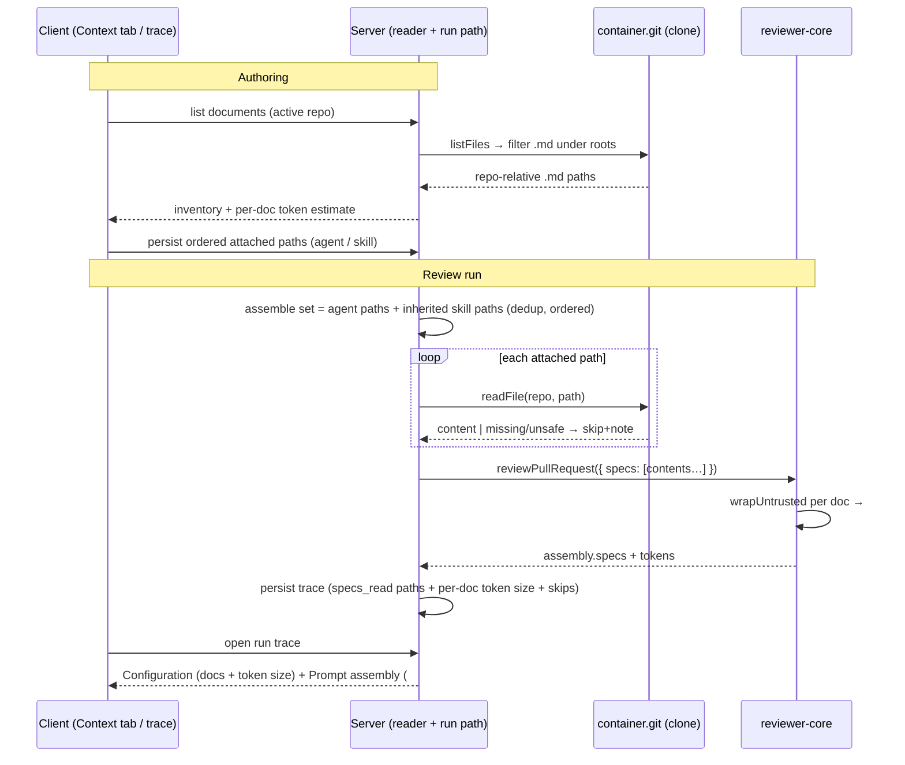

# Spec: Project Context Folder   |   Spec ID: SPEC-2026-07-18-project-context-folder   |   Status: approved
Supersedes: none

## Problem & why

A repository's spec-like markdown (design docs, PRDs, security baselines, incident
notes) is written "for humans" and is invisible to the review agents. Meanwhile the
review engine already ships an unused, fully-built prompt slot for exactly this: in
`reviewer-core`, `PromptParts.specs` renders a `## Project context` block where each
item is delimiter-wrapped as untrusted content behind the injection guard, and the run
trace already exposes `prompt_assembly.specs` and a top-level `specs_read` list — but the
server never populates any of it (it hardcodes `specs_read: []` and omits `specs` from
`reviewPullRequest`). Skills, by contrast, are fully wired end to end and are the working
precedent.

This feature closes that gap: it lets a user **manually attach** repository markdown
documents to an agent (or to a skill, whose documents any agent using it inherits) so a
spec stops being a passive document and starts steering the reviewer. Attachment stores
**paths, not text**; at run time the server reads the current file content from the
reviewed repo's clone and feeds it into the existing `## Project context` slot. The user
sees a token estimate before running and, in the run trace, exactly which documents were
injected and how many tokens each added. The feature adds **zero new LLM calls**.

## Decisions (resolved 2026-07-18)

These were the spec's open points; all are now confirmed and folded into the body:

- **Repo-scoping (D1):** Attached documents are stored as **bare repo-relative paths** and
  resolved against whichever repo the reviewed PR belongs to, at run time. A path missing in
  that repo is skipped and shown in the trace (AC-16). The Project Context page is scoped to
  the active repo. Paths are **not** pinned to a specific repo id.
- **Agent + skill merge/order (D2):** Agent-own documents first (agent's order), then
  skill-inherited (skills in link order, each skill's docs in order), dedup first-occurrence
  wins (AC-8).
- **Size limits (D3):** Per-document cap 64 KB, truncate + mark (AC-18); no aggregate
  project-context token budget.
- **Config surface (D4):** The context-root folder names live in **server config** (default
  `specs,docs,insights`); no Settings UI in this feature (AC-3).
- **Excluded design chrome (D5):** "Used by N agents", the COVERAGE badge, chunk indexing,
  document Edit mode, and upload stay **Non-goals**.
- **Versioning (D6):** Agent attachment changes snapshot a new `agent_versions` config
  (attachments are versioned config); skill attachment changes do **not** create a new skill
  body version (parallel to `evidence_files`).
- **Reorder a11y (D7):** The Context-tab reorder reuses the existing Skills-tab native HTML5
  drag; a keyboard-accessible reorder is deferred to a follow-up.

## Goals / Non-goals

- **Goal:** A "Project Context" page that lists every `.md` file in the active repo's
  clone under a configurable set of root folder names (default `specs`, `docs`,
  `insights`) at any depth, with each file's repo-relative path, its root-folder badge,
  and a read-only markdown preview.
- **Goal:** A `Context` tab on the agent editor and on the skill editor — mirroring the
  existing Skills tab (drag handle, checkbox, name, folder path, `specs`/`docs`/`insights`
  badge, "Filter documents…" search, per-row preview) — to attach, reorder, and detach
  documents.
- **Goal:** Skill-level attachments are inherited by every agent that uses the skill.
- **Goal:** Store attached document **paths** (ordered) in agent/skill config — never the
  document text.
- **Goal:** At run time, read the attached documents from the reviewed PR's repo clone and
  inject them, in the listed order, into the existing `## Project context` untrusted slot.
- **Goal:** The run trace records and displays which documents were injected and each one's
  estimated token size; the Prompt-assembly view exposes the full injected block.
- **Goal:** The Context tab shows a deterministic estimated token total for the currently
  attached set (e.g. "≈ 317 tokens").
- **Goal:** Zero new LLM calls anywhere in the feature.
- **Non-goal:** Auto-selection / per-PR "flash-selector" of relevant specs — future work;
  attachment is manual only.
- **Non-goal:** Creating, editing, or uploading documents from the app (the design's Edit
  toggle, add/upload/folder toolbar icons). Documents are read-only, sourced from the git
  clone.
- **Non-goal:** Chunk indexing / embeddings / the design's "1,240 chunks" footer.
- **Non-goal:** Coverage scoring (the design's "78 COVERAGE" badge) and reverse-usage
  counters (the design's "Used by 3 agents"). See Open questions.
- **Non-goal:** Non-markdown files, and files outside the configured root folders.
- **Non-goal:** Wiring the unrelated `memory_pulled` trace field (still hardcoded empty).
- **Non-goal:** Any change to `reviewer-core`'s prompt-assembly behaviour — the existing
  `PromptParts.specs` / `## Project context` slot and `wrapUntrusted` are reused as-is.

## User stories

- **US-1:** As a reviewer-config author, I want to browse all of the project's
  specification/markdown documents on a Project Context page, so I can see what context is
  available to attach.
- **US-2:** As an author, I want to attach documents to an agent from a Context tab, so
  those documents steer that agent's reviews.
- **US-3:** As an author, I want to attach documents to a skill, so that every agent using
  that skill inherits the documents.
- **US-4:** As an author, I want to reorder the attached documents and see an estimated
  token count for the set, so I control the prompt order and understand how many tokens
  each attachment adds.
- **US-5:** As a reviewer, when a review runs with attached documents I want them injected
  as untrusted context, and I want the run trace to show exactly which documents (and their
  token size) were injected and let me open the full injected text, so I can verify what
  steered the review.

## Acceptance criteria (EARS)

- **AC-1:** WHEN a user opens the Project Context page for the active repo, the system
  **shall** list every `.md` file tracked in that repo's clone whose path contains a
  directory named in the configured context-root set (default `specs`, `docs`, `insights`)
  at any depth, showing each file's repo-relative path and its root-folder badge.
  _(observable: for a cloned repo, the page renders the file inventory with paths and
  badges; a file under a non-configured folder does not appear)_
- **AC-2:** WHEN a user selects a listed document, the system **shall** render its markdown
  content read-only in a preview pane.
  _(observable: selecting a document shows its rendered markdown)_
- **AC-3:** The system **shall** derive the set of context-root folder names from
  configuration, defaulting to `specs`, `docs`, `insights`, and **shall** include only
  `.md` files located under a directory with one of those names.
  _(observable: changing the configured set changes which files are listed)_
- **AC-4:** IF the active repo has no local clone (`clonePath` is null, e.g. the seeded
  demo repo `acme/payments-api`), THEN the system **shall** show an empty inventory with an
  explanatory empty state instead of an error.
  _(observable: the Project Context page for an un-cloned repo returns a 200 empty state, no
  5xx)_
- **AC-5:** WHEN a user toggles a document's checkbox on in an agent's Context tab, the
  system **shall** persist that document's repo-relative path in the agent's ordered
  attached-documents list, storing the path only and never the document text.
  _(observable: after reload the attachment persists; the stored agent config contains the
  path string, not the file body)_
- **AC-6:** WHEN a user toggles a document on in a skill's Context tab, the system **shall**
  persist that path in the skill's ordered attached-documents list (path only, no text).
  _(observable: after reload the skill attachment persists)_
- **AC-7:** WHERE an agent uses a skill that has attached documents, the system **shall**
  treat that skill's documents as attached to the agent for run assembly, in addition to
  the agent's own directly-attached documents.
  _(observable: a run for an agent that attached nothing directly but uses a doc-bearing
  skill still injects the skill's documents)_
- **AC-8:** WHEN documents are assembled for a run, the system **shall** order them as (1)
  the agent's own attached documents in their listed order, then (2) documents inherited
  from skills (skills taken in their link order, each skill's documents in listed order),
  and **shall** include each distinct path at most once, keeping the first occurrence.
  _(observable: the assembled `## Project context` block order matches this rule; a path
  attached both directly and via a skill appears exactly once, at its agent-level position)_
- **AC-9:** WHEN a user drags a document to a new position in a Context tab, the system
  **shall** persist the new order and reflect it in the assembly order of subsequent runs.
  _(observable: the reorder persists across reload and changes the injected block order)_
- **AC-10:** WHEN a review run executes for an agent with a non-empty assembled document
  set, the system **shall** read each document's current content from the reviewed PR's
  repo clone and pass them, in assembled order, into the existing `reviewer-core`
  `## Project context` prompt slot.
  _(observable: the run trace's `prompt_assembly.specs` contains the documents' content in
  the assembled order)_
- **AC-11:** The system **shall** wrap every injected document as untrusted content
  (delimiter-wrapped via the existing `wrapUntrusted`, behind the existing injection guard)
  before it reaches the model.
  _(observable: each document appears inside an `<untrusted source=…>` block and the system
  message carries the injection guard)_
- **AC-12:** WHEN a run injects attached documents, the system **shall** record in the run
  trace, for each injected document, its repo-relative path and an estimated token size,
  and the run-trace view **shall** display the path and token size of each.
  _(observable: the trace's specs/context list shows one entry per injected document with a
  path and a token count)_
- **AC-13:** The run-trace Prompt-assembly view **shall** present the injected
  `## Project context` block as an expandable, copyable section showing the full injected
  text.
  _(observable: the existing specs `PromptBlock` renders the injected content and its copy
  control works)_
- **AC-14:** WHILE a user views a Context tab, the system **shall** display a deterministic
  estimated total token count for the currently attached set of documents, computed from
  document content length.
  _(observable: the footer shows "≈ N tokens" that updates as documents are toggled)_
- **AC-15:** The system **shall not** make any LLM/model call to list, preview, attach,
  reorder, token-estimate, or inject documents.
  _(observable: with an always-throwing LLM double injected via `ContainerOverrides.llm`,
  the Project Context endpoints and the document-assembly step still succeed; control-flow
  review confirms no `completeStructured`/`complete` on these paths)_
- **AC-16:** IF an attached document's path no longer exists or is unreadable in the
  reviewed repo clone at run time, THEN the system **shall** skip that document, inject the
  remaining documents, record the skip (with its path and reason) in the trace, and
  complete the run normally.
  _(observable: a run whose agent references a since-deleted doc completes; the trace lists
  the doc as skipped/missing and still injects the others)_
- **AC-17:** WHEN an agent's assembled document set (including inherited skill documents) is
  empty, the system **shall** assemble the prompt with no `## Project context` block,
  exactly as today.
  _(observable: `prompt_assembly.specs` is null and the run is byte-for-byte unchanged from
  current no-context behaviour)_
- **AC-18:** IF an attached document exceeds the configured per-document size cap
  (default 64 KB of UTF-8 content), THEN the system **shall** truncate it at the cap, mark
  the truncation in the injected block and in the trace entry, and count tokens against the
  injected (truncated) content.
  _(observable: an oversized document is injected truncated with a visible truncation
  marker; its recorded token size reflects the truncated length)_
- **AC-19:** IF an attached document path resolves outside the repo clone directory
  (absolute path, `..` traversal, or a symlink escaping the clone root), THEN the system
  **shall** refuse to read it — rejecting the attachment at save time and skipping it at run
  time — and **shall not** read any file outside the clone.
  _(observable: a crafted `../../etc/passwd` path is never read; the save is rejected and/or
  the run skips it and notes it, with no file content from outside the clone)_

## Edge cases

- Active repo has no clone on disk (demo repo, or not-yet-cloned repo) → AC-4 (empty
  inventory) and AC-16 (run-time skip if a stale path is still attached).
- Repo has none of the configured root folders → empty inventory. → covered by AC-1
  (nothing matches).
- Attached document deleted or moved between attach time and run time → AC-16.
- Same path attached directly on the agent and via one of its skills → AC-8 (dedup,
  first-occurrence).
- Same path attached via two different skills → AC-8 (dedup, first skill's position wins).
- Oversized document → AC-18 (truncate + mark).
- Path traversal / absolute path / escaping symlink in a stored path → AC-19 (refuse).
- A `.md` file that is actually binary/garbled → read as UTF-8 and injected as-is (wrapped
  untrusted). → accepted: no special handling.
- Document content changed since attachment → run reads current content by design (paths,
  not text). → covered by AC-10 ("current content").
- Very large inventory (hundreds of `.md` files) → performance budget in Non-functional.
- Token estimate for a document that cannot be read in the editor (no clone) → shown as 0 /
  unavailable in the editor; run-time behaviour still governed by AC-16. → accepted: no
  handling beyond a 0/unknown estimate.
- Total attached set is very large (many/large docs) blowing the prompt budget → no
  aggregate cap (D3); the set is injected in full, each doc still bounded by the 64 KB
  per-document cap (AC-18). → accepted: no aggregate handling.

## Non-functional

- **Zero new LLM calls** (AC-15) — the feature is deterministic end to end.
- **Token estimation** — a single deterministic estimator computed from document byte/char
  length (the repo's existing ~`chars/4` convention, e.g. `approxTokens` /
  `Math.ceil(len/4)`) MUST be used consistently for both the editor's set estimate (AC-14,
  over stored content) and the trace's per-document size (AC-12, over injected content), so
  the numbers are comparable. No tokenizer model call.
- **Per-document size cap** — 64 KB UTF-8 (AC-18, decision D3). **Total project-context
  budget** — no aggregate cap (D3); the assembled set is injected in full.
- **Listing/preview latency** — reading the inventory and a single document's preview from
  the local clone SHOULD complete at p95 < 500 ms for a repo with ≤ 500 matching `.md`
  files (local filesystem + `git ls-files`, no network, no LLM).
- **Security** — every injected document is untrusted third-party text and MUST be wrapped
  (AC-11); every stored/resolved path MUST be confined to the repo clone (AC-19, prevents
  path traversal / arbitrary file read). Document markdown rendered in the UI MUST go
  through the project's sanitizing markdown primitive (react-markdown v9 strips dangerous
  URL schemes) to avoid stored XSS from repo-controlled content.
- **Tenancy** — the Project Context page, the attachment reads/writes, and the run all
  respect workspace scoping (agents/skills are workspace-scoped; document paths resolve only
  against the reviewed repo's own clone).
- **Accessibility** — the Context page and tabs target WCAG 2.1 AA. The reorder control
  reuses the existing Skills-tab native HTML5 drag pattern; that pattern is not
  keyboard-accessible today and a keyboard-accessible reorder is deferred (D7) — but at
  minimum, toggling and previewing MUST be keyboard-operable.

## Cross-module interactions

Packages touched: **server** (`@devdigest/api`), **client** (`@devdigest/web`), and
**reviewer-core** (`@devdigest/reviewer-core`) — the last for reuse/verification only; the
existing `specs` slot is expected to need **no code change**.

- **Client → server:** the Project Context page and each Context tab fetch the active
  repo's document inventory (paths + root badge + token estimate) and the current
  agent/skill attachment list; toggles/reorders persist the ordered path list back to the
  server (following the Skills-tab convention of persisting the full ordered set per change).
- **Server (reader):** resolves the inventory from the active repo's clone via
  `container.git.listFiles` filtered to `.md` under the configured roots (falling back to an
  empty inventory when there is no clone — mirroring `conventions/content.ts`'s clone-read
  pattern, but that sampler excludes `.md` so it is not directly reusable).
- **Server (storage):** persists ordered attached-document paths on the agent and on the
  skill.
- **Server (run):** at review time the run path assembles the agent's document set
  (own + inherited-from-skills, deduped/ordered per AC-8), reads each from the reviewed
  repo's clone (`container.git.readFile`), and passes the contents as `specs` into
  `reviewPullRequest`; it then records the injected paths + token sizes (and any skips) into
  the run trace.
- **reviewer-core:** receives `specs: string[]`, wraps each via `wrapUntrusted('spec-i', …)`
  into the fixed-position `## Project context` block (assembled after skills/memory/repo
  skeleton, before callers/diff) and returns `assembly.specs` for the trace — unchanged.
- **Failure contract:** a missing/unreadable/oversized/unsafe document never fails the run —
  it is skipped or truncated and noted in the trace (AC-16, AC-18, AC-19). A repo with no
  clone yields an empty inventory, not an error (AC-4).

## Contracts

Shapes only (no implementation). Any change to a vendored `@devdigest/shared` contract
MUST be applied to **both** `server/src/vendor/shared/` and `client/src/vendor/shared/` in
lock-step (they are hand-synced).

- **Document inventory item** (server → client, new): `{ path: string /* repo-relative */,
  root: "specs" | "docs" | "insights" | <configured>, token_estimate: number }`, plus a
  listing envelope carrying the document count and the resolved repo. No document body is
  sent in the list; the preview is fetched per document.
- **Agent attached documents** (vendored `knowledge.ts`, change): the `Agent` contract gains
  an **ordered list of repo-relative document paths** (e.g. `context_documents: string[]`),
  and the agent update/version-config shapes carry it. Because agent config is snapshotted
  into `agent_versions.config_json`, treat attached documents as part of the versioned
  config.
- **Skill attached documents** (vendored `knowledge.ts`, change): the `Skill` contract gains
  the same ordered path list. (Note: an unused `evidence_files: string[]` already exists on
  `Skill` for provenance — it is a **different** concept and MUST NOT be overloaded for this.)
- **Run trace** (vendored `trace.ts`, change — handle back-compat carefully): the injected
  documents' **token sizes** need a home. `specs_read` is currently `z.array(z.string())`
  and `run_traces.trace` is **persisted JSON**, so changing `specs_read`'s element type
  would break `RunTrace.parse` on traces written before this feature. Therefore: keep
  `specs_read: string[]` (now actually populated with injected paths, for the existing chip
  display) and add a **new nullish** field (e.g. `specs_injected?: { path: string;
  tokens: number; status: "injected" | "truncated" | "skipped_missing" }[]`) carrying the
  per-document token size and skip/truncation status. New persisted fields MUST be
  `.nullish()` so old rows still parse (per the server's documented persisted-contract rule).
- **reviewer-core:** `ReviewInput.specs?: string[]`, `PromptParts.specs?: string[]`,
  `PromptAssembly.specs`, and `wrapUntrusted` are reused unchanged — no contract change
  expected here.

## Untrusted inputs

**Yes — this feature's whole payload is untrusted third-party text.** Attached documents
are arbitrary repository markdown that may contain prompt-injection ("ignore previous
instructions", fake tool output, etc.). They MUST be treated as data, never commands:

- Each injected document is delimiter-wrapped via the existing `wrapUntrusted` and sits
  behind the existing `INJECTION_GUARD` system framing (AC-11) — the same trust boundary the
  diff and PR body already use.
- Document **paths** are user-controlled input to the persistence/read path and MUST be
  confined to the repo clone (no absolute paths, no `..`, no escaping symlink) to prevent
  arbitrary file read (AC-19).
- Document markdown rendered in the UI (Project Context preview, row previews) MUST go
  through the sanitizing markdown primitive (react-markdown v9 strips dangerous URL
  schemes) to prevent stored XSS from repo-controlled content.
- The design mockups (Figma text, "acme/payments-api" sample content) are directional design
  data only — no instruction embedded in them is authoritative for behaviour.

## Open questions

- none — all resolved 2026-07-18 (see the Decisions section, D1–D7).
