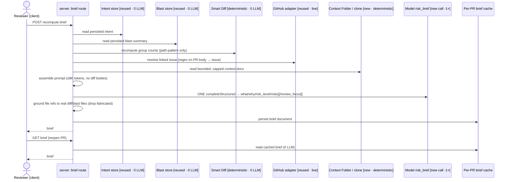

# Spec: Why + Risk Brief   |   Spec ID: SPEC-2026-07-18-why-risk-brief   |   Status: draft
Supersedes: none

## Problem & why

A reviewer opening a pull request still has to assemble the "should I worry about this,
and where do I look first?" picture in their head from several separate cards (Intent,
Blast Radius, Smart Diff) plus the linked issue and the repo's own architecture docs.
DevDigest already computes every one of those signals, but nothing *synthesises* them into
a single at-a-glance verdict.

The **Why + Risk Brief** is a per-PR card that answers, in one place: what this PR does,
why, how risky it is, the concrete risks (each pointing at a real file), and a short
"read these first" review-focus list. The design intent — and the reason it is worth doing
now — is that it is **almost free**: it assembles already-built inputs (Intent L03, Smart
Diff L03, Blast Radius L04, the live linked-issue fetch, and the Context Folder inventory
L06) into exactly **one** new model call, rather than computing anything new. It turns five
existing signals into a decision.

## Goals / Non-goals

- **Goal:** Produce a per-PR brief `{ what, why, risk_level, risks[], review_focus[] }` from
  the five existing inputs via exactly one new structured model call.
- **Goal:** Ground every file reference (in `risks[]` and `review_focus[]`) in the PR's real
  diff files or blast-map files — never a fabricated path.
- **Goal:** Cache the brief per-PR; reopening the PR is a zero-model-call read.
- **Goal:** Degrade, never 5xx — a missing intent, degraded/absent blast, no linked issue,
  no context docs, or a failed model call must still yield an honest brief.
- **Goal:** Render a brief card on the PR Overview tab: risk level by colour, a review-focus
  list whose items jump to the real file (reusing the existing Overview "open the real file"
  wiring).
- **Goal:** Reuse the pre-reserved scaffolding — the existing `Risk` element type, the
  registered `risk_brief` feature-model id, and the already-shipped `brief.json` copy — rather
  than inventing parallel types/ids.
- **Non-goal:** Recomputing intent, blast, or smart-diff. The brief *reads* those signals; it
  does not trigger their model calls. A missing signal degrades the brief (it does not cascade
  a recompute).
- **Non-goal:** Passing full file-diff bodies (patches/hunks) into the model. Only bounded,
  summarised forms of each input reach the prompt.
- **Non-goal (stretch, explicitly deferred):** **WhyTimeline** — a history of briefs across a
  PR's commits showing how "why" evolved. This is what the dormant `PrHistory` /
  `history` contract slot is reserved for; it is out of scope here and must not be designed or
  scoped by this spec.
- **Non-goal:** A second model call for context-document selection (a deterministic
  path/size heuristic is required instead — see AC-12).
- **Non-goal:** Renaming/refactoring the shared per-PR brief persistence seam as part of this
  feature (see Cross-module interactions — recorded as a deliberate decision, not silently
  extended).

## User stories

- **US-1** — As a reviewer, I want a one-glance brief of what a PR does and why, so that I can
  orient without reading every other card. → AC-1, AC-14
- **US-2** — As a reviewer, I want an overall risk level and a list of concrete risks that each
  point at a real file, so that I can gauge and locate the danger. → AC-1, AC-5, AC-14, AC-15
- **US-3** — As a reviewer, I want a "read these first" list whose items jump me straight to the
  real file/line, so that I start where it matters. → AC-16
- **US-4** — As a reviewer, I want reopening the PR to show the brief instantly without
  re-spending on the model, so that revisiting is free. → AC-3, AC-4
- **US-5** — As a reviewer, I want a Regenerate action to refresh the brief after new commits,
  so that the brief can be brought up to date on demand. → AC-19
- **US-6** — As a reviewer, I want the brief to still render something honest when a signal is
  missing or the model fails, so that I am never blocked by an error screen. → AC-8, AC-9,
  AC-10, AC-11, AC-13, AC-18
- **US-7** — As a maintainer, I want the brief to fold in the repo's own architecture/invariant
  docs, so that risks are judged against how this codebase is actually meant to work. → AC-12

## Acceptance criteria (EARS)

- **AC-1:** WHEN a client requests a brief recompute for a PR, the system **shall** assemble the
  five existing inputs (persisted intent, persisted blast summary, deterministic smart-diff
  group counts, live linked issue, bounded Context-Folder docs) and produce a
  `{ what, why, risk_level, risks[], review_focus[] }` brief via **exactly one** new structured
  model call.
  _(observable: integration test injects a recording LLM double — exactly one
  `completeStructured` call is made during recompute; the response validates against the brief
  shape.)_

- **AC-2:** WHEN producing a brief, the system **shall** read intent and blast from their
  existing persisted stores and read smart-diff/linked-issue from their existing zero-/live
  paths, and **shall not** trigger any additional intent, blast, or smart-diff model call.
  _(observable: the recording LLM double shows the single brief call and no
  intent/blast summary call; intent/blast are read, not recomputed.)_

- **AC-3:** WHEN a client reads the brief for a PR that already has one, the system **shall**
  return the cached brief with **zero** model calls.
  _(observable: inject an LLM double whose every method throws; the read returns 200 with the
  cached brief — the established throwing-double proof, not a grep.)_

- **AC-4:** IF no brief has ever been computed for a PR, THEN a read **shall** return an empty
  result as `200` with a null body (not `404`), matching the intent/blast falsy-check contract.
  _(observable: fresh PR → read → `200`, body null.)_

- **AC-5:** The system **shall** ensure every `file_refs` entry on a returned risk and every
  `review_focus` file is a path present in the PR's diff files or blast-map files, dropping any
  model-produced path outside that set (a `review_focus` item with no valid file is dropped; a
  risk that loses all refs is kept with empty `file_refs`).
  _(observable: stub LLM returns a fabricated path; assertion — every returned file ∈ the union
  of {diff files, blast-map files}; the fabricated path is absent.)_

- **AC-6:** The system **shall** never include full file-diff bodies (patches/hunks) in the
  assembled model input — only summarised or count-based forms of each input.
  _(observable: the assembled prompt string is asserted to contain no patch/hunk body; input
  builders receive summaries/counts, never raw patches.)_

- **AC-7:** The system **shall** keep the assembled model input at or below **8,000 tokens**
  (estimated at ~1 token per 4 characters), enforced by a hard per-input cap on each of the
  five inputs whose caps sum below the budget by construction.
  _(observable: test feeds oversized inputs (huge issue body, huge context doc) → the assembled
  prompt's token estimate ≤ 8000; each input is truncated at its cap.)_

- **AC-8:** IF intent has not been computed for the PR, THEN the system **shall** still produce
  a best-effort brief (deriving `what`/`why` from the remaining inputs) rather than error.
  _(observable: no persisted intent → recompute returns `200` with a valid brief.)_

- **AC-9:** IF the blast map is degraded or absent, THEN the system **shall** still produce a
  brief, grounding `risks[]`/`review_focus[]` file references in the PR's diff files at minimum.
  _(observable: degraded/empty blast → `200` brief; every returned file ∈ diff files.)_

- **AC-10:** IF the PR has no linked issue and/or no context documents, THEN the system
  **shall** still produce a brief without error.
  _(observable: no linked issue + no context docs → `200` brief.)_

- **AC-11:** IF the single model call fails, THEN the system **shall** return a deterministic
  brief skeleton marked degraded with a reason, and **shall not** return a 5xx.
  _(observable: throwing LLM double on recompute → `200` with a degraded skeleton whose
  `degraded` is true and `degraded_reason` is set — mirrors the onboarding degrade pattern.)_

- **AC-12:** WHEN assembling the brief, the system **shall** select a bounded subset of the
  repo's Context-Folder markdown documents (those under the configured context roots) directly
  from the repo clone, using a **deterministic** relevance/size heuristic and **no** additional
  model call, each doc truncated to the brief's own tight cap.
  _(observable: with several context docs present, the assembled input includes at most the
  bounded number of docs, each capped; selection is stable for a given clone; the recording LLM
  double still shows only the one brief call.)_

- **AC-13:** WHERE the repo has no usable clone (or the clone cannot be listed/read), the system
  **shall** omit the context-docs input and still produce a brief, never surfacing a clone-read
  failure as an error.
  _(observable: no-clone repo (e.g. seeded `acme/payments-api`) → `200` brief with an empty
  context input.)_

- **AC-14:** WHEN a brief exists for the open PR, the Overview tab **shall** render a brief card
  showing `what`, `why`, a risk-level indicator, the `risks[]` list, and the `review_focus[]`
  list.
  _(observable: client component test with a populated brief renders all five regions.)_

- **AC-15:** The risk-level indicator **shall** convey the level by colour **and** an
  accompanying text label (never colour alone).
  _(observable: component test asserts the level label text is present and the per-level colour
  token is applied — satisfies WCAG 1.4.1 Use of Color.)_

- **AC-16:** WHEN a `review_focus` item references a file, the card **shall** render it as an
  actionable control that jumps to that file — scrolling to the line in the Files-changed diff
  when the file is part of the PR's diff, else opening the GitHub blob at that line — reusing
  the Overview tab's existing jump wiring.
  _(observable: component test — activating the item invokes the existing `onJumpToCode(path,
  line)` handler already threaded to Overview cards.)_

- **AC-17:** WHILE no brief has been computed, the card **shall** show an empty state with a
  Compute/Regenerate CTA; WHILE a recompute is in flight, the CTA **shall** show a
  non-duplicable in-progress state.
  _(observable: component test — empty → CTA visible; pending → CTA disabled/spinner, mirroring
  the Intent/Blast cards.)_

- **AC-18:** WHERE the brief is degraded, the card **shall** render the available content plus an
  explanatory degraded badge and reason, never a blank error state.
  _(observable: component test with a degraded brief → badge + reason rendered alongside content.)_

- **AC-19:** The system **shall** expose a Regenerate action that re-runs the single synthesis
  call and overwrites the cached brief, and the client **shall** write the returned brief back
  into its cache (matching the intent/blast recompute pattern).
  _(observable: recompute → the new brief is persisted and returned; the client cache holds the
  fresh brief without a page reload.)_

- **AC-20:** IF the PR is not in the caller's workspace, THEN both the read and the recompute
  **shall** resolve as not-found and **shall not** leak another workspace's brief.
  _(observable: a PR seeded under a second workspace → both routes return not-found, mirroring
  existing per-PR modules.)_

## Edge cases

- PR with zero changed files → grounding set is empty; risks keep only validated (none) refs and
  review-focus items are dropped; `what`/`why`/`risk_level` still render. → AC-5, AC-9
- Model returns risks/focus items citing only fabricated paths → fabricated paths dropped; a
  risk survives with empty `file_refs`, a focus item with no valid file is dropped. → AC-5
- Repo whose changed files are all unsupported languages (`.php`/`.vue`) so blast shows 0
  symbols/callers → brief grounds in diff files only. → AC-9
- Pathological multi-MB tracked `.md` context doc → truncated at the brief's own tight per-input
  cap (the 64 KB `contextDocMaxBytes` clone cap is far too large for this prompt). → AC-7, AC-12
- Linked-issue body (or PR-derived text) contains prompt-injection text → treated as data, not
  instructions; structured-output-only with no tools, and grounded file refs prevent redirecting
  the reviewer to an arbitrary file. → Untrusted inputs, AC-5
- Concurrent Regenerate clicks on the same PR → last write wins on the shared per-PR brief
  document (read-merge-write, no lock), mirroring blast. → accepted: no handling
- Intent/blast present but stale (computed against an older head SHA) → used as-is; per-signal
  staleness is not tracked anywhere in the schema, consistent with existing modules. →
  accepted: no handling
- Recompute while the PR has no persisted intent AND a degraded blast AND no clone → best-effort
  brief from title + smart-diff counts + (empty) issue, marked degraded if the model also fails.
  → AC-8, AC-9, AC-11, AC-13

## Non-functional

- **Model spend:** exactly **one** new `completeStructured` call per recompute; **zero** on read
  (AC-1, AC-2, AC-3). This is the entire "almost free" premise.
- **Input budget:** assembled model input ≤ **8,000 tokens** (~1 token / 4 chars), via hard
  per-input caps summing under budget (AC-7). Recommended allocation (planner may tune, must sum
  < 8K): intent ≤ ~800, blast summary ≤ ~1,200, smart-diff counts ≤ ~300, linked issue ≤ ~1,500,
  context docs ≤ **~3,000 total across at most ~3 docs**. The per-doc Context-Folder clone cap
  (`contextDocMaxBytes`, 64 KB ≈ 16K tokens) is explicitly **not** reused for this prompt — it
  would blow the budget on a single doc; the brief applies its own tighter cap (AC-12).
- **Context-doc bound:** at most a small fixed number of docs (recommend ≤ 3), selected
  deterministically (recommend: prefer architecture/invariant/convention-named docs under the
  context roots, then smallest-first) — no model call (AC-12).
- **Accessibility:** WCAG 2.1 AA; risk level conveyed by colour **and** text label (AC-15);
  review-focus items are keyboard-activable controls, not colour-only affordances.
- **Security / trust:** untrusted spans wrapped as data before reaching the prompt
  (`wrapUntrusted`), structured-output-only, no tools — same trust profile as the existing
  intent/blast summary calls; `groundFindings()`-style grounding is applied to file references
  (AC-5).

## Cross-module interactions

Packages involved: **client** (`@devdigest/web`), **server** (`@devdigest/api`),
**reviewer-core** (`@devdigest/reviewer-core` — the `LLMProvider` interface + `wrapUntrusted`),
the **GitHub adapter** (live linked-issue fetch), the **git adapter** (Context-Folder clone
reads), and **Postgres** (the cached per-PR brief document). Data crossing the client↔server
boundary is the brief contract (below). The failure contract everywhere is **degrade, never
5xx** (AC-8..AC-13, AC-18).

**Failure mapping (per input):** intent missing → omit, derive what/why from the rest (AC-8);
blast degraded/absent → ground in diff files (AC-9); linked issue absent → omit (AC-10);
context clone unreadable → omit docs (AC-13); model throws → deterministic degraded skeleton
(AC-11).

**Persistence seam (deliberate decision — point of record, not a silent extension):** the brief
is cached as a per-PR document in the **same store the blast building block already uses** (the
`pr_brief.json` blob, read-merge-write under its own sibling key), reusing the established
keyed-blob precedent. `server/INSIGHTS.md` (Open Questions, 2026-07-15) flags that this shared
per-PR brief store is "quietly becoming a shared persistence seam … worth a deliberate decision
before a 4th vertical lands" — **this feature is that 4th vertical.** Recommendation:
**accept extending the existing seam for this feature** (consistent with intent/blast/smart-diff
precedent, lowest risk, keeps the feature almost-free). Whether to *name* the seam (e.g. a
dedicated per-PR-brief owner) is a separate architectural decision for the
`implementation-planner`; it must **not** be folded into this feature as a refactor (see Open
questions).

## Contracts

Shapes only — no implementation. All shared-contract changes are **two-sided**: the vendored
`@devdigest/shared` copy exists in **both** `server/src/vendor/shared` and
`client/src/vendor/shared` and is kept in sync by hand — every field below lands in both copies
in lock-step (the only intended diff is comments).

**New brief contract (the client↔server payload, cached per PR):**

| Field | Shape | Notes |
|-------|-------|-------|
| `what` | string | plain-language "what this PR does" (model output) |
| `why` | string | plain-language "why" (model output) |
| `risk_level` | enum `high` \| `medium` \| `low` | overall PR risk; **reuses the existing `RiskSeverity` value set** |
| `risks` | `Risk[]` | **reuses the existing `Risk` element verbatim** — `{ kind, title, explanation, severity, file_refs }`; `file_refs` grounded (AC-5) |
| `review_focus` | array of `{ file, line?, reason }` | new small element; `file` grounded to a real diff/blast file (AC-5), `line` optional for the jump |
| `degraded` | boolean | true when a signal was missing or the model call failed (AC-11/AC-18) |
| `degraded_reason` | string \| null | honest reason when degraded (mirrors blast/onboarding) |

Direction: server → client on both read and recompute; the recompute request body is empty.

- **Reuse, do not reinvent:** the registered **`risk_brief`** feature-model id (label "Risk
  Brief", default `openai/gpt-4.1`) is the model selector for the one call — no new
  `FeatureModelId`. The already-shipped `client/messages/en/brief.json` keys (`block.risks`,
  `noRisks`) are consumed as-is; new keys are needed for `what`/`why`/`risk_level`/`review_focus`
  and the degraded state.
- **Dormant-slot reconciliation (recommendation to the planner):** the composed `PrBrief` type is
  never parsed as a whole anywhere in the repo (verified — only comment/barrel references), so
  its dormant `risks: Risks` and `history: PrHistory` top-level slots are aspirational typing. The
  new brief's `risks: Risk[]` field **is** the anticipated risks list — reconcile `PrBrief` so the
  reserved `risks` slot's element type (`Risk`) is the one this feature reuses, rather than
  introducing a parallel, unrelated risk type. `history` / `PrHistory` stays reserved for the
  WhyTimeline stretch (Non-goal).

**Input provenance (the whole point — "almost free"):**

| Input | Provenance | How it enters the prompt |
|-------|-----------|--------------------------|
| Intent (L03) | **[reused]** zero-LLM read of persisted intent | summarised, capped |
| Blast summary (L04) | **[reused]** zero-LLM read of persisted blast | summary paragraph + counts, capped |
| Smart-diff group counts (L03) | **[deterministic]** recomputed, path-pattern only, no LLM | counts only ("N core, M wiring, K boilerplate") |
| Linked issue | **[reused]** existing live GitHub fetch (regex on PR body) | title + capped body |
| Context-Folder docs (L06) | **[new integration · deterministic]** direct clone read, no LLM | bounded, capped subset |
| **Brief synthesis** | **[new call]** the ONE new `completeStructured` | — |

## Untrusted inputs

Yes — the brief reads third-party / PR-controlled text and must treat all of it as **data, not
commands**:

- **Linked-issue title & body** — live third-party text fetched from GitHub; the freshest
  untrusted input.
- **PR-derived text** — transitively via intent (model-produced from the PR title/body) and via
  blast symbol/file names (PR-controlled identifiers).
- **Context-Folder markdown** — repo-tracked content (default-branch clone); still data.

All untrusted spans must be wrapped (`wrapUntrusted`) before reaching the prompt, and the call is
**structured-output-only with no tools** — the same inert trust profile as the existing
intent/blast summary calls (a Low, non-exploitable indirect-injection surface). The grounding of
file references (AC-5) is the concrete mitigation that stops injected text from steering the
reviewer to an attacker-chosen path. Per the reviewer-core invariant, `groundFindings()` remains
a mandatory gate for anything that becomes a finding and is never bypassed here.

## Open questions

- [NEEDS CLARIFICATION: are `what`/`why` freshly synthesised by the one call (using intent as
  input) or surfaced from the existing `intent.intent` string? Default assumed: synthesised in
  the single call, with intent as one input — keeps the brief coherent when intent is absent.]
- [NEEDS CLARIFICATION: is `risk_level` produced by the model as part of the structured output,
  or deterministically floored by signals (e.g. degraded blast / oversized smart-diff)? Default
  assumed: model-produced within the single call; a deterministic floor is a possible later
  enhancement.]
- [NEEDS CLARIFICATION: exact Context-Folder selection heuristic and per-doc/total caps. Default
  assumed: ≤ 3 docs, preferring architecture/invariant/convention-named docs under the context
  roots, smallest-first, each tightly capped so the docs input stays ≤ ~3K tokens.]
- [NEEDS CLARIFICATION: should a missing persisted intent or blast *cascade* a recompute of that
  signal, or degrade the brief? Default assumed: degrade (read-only assembly), to preserve
  "exactly one new call".]
- [NEEDS CLARIFICATION: is a hard recompute latency budget (e.g. a p95) required by the course? No
  latency threshold is asserted here beyond "synchronous single call, same profile as intent/blast
  recompute"; the token budget (AC-7) is the concrete perf number.]
- [NEEDS CLARIFICATION: naming the shared per-PR brief persistence seam (this is the 4th vertical
  that trips the flagged threshold). Default assumed: accept extending the existing seam for this
  feature; decide seam naming separately in the plan, not as part of this feature.]
