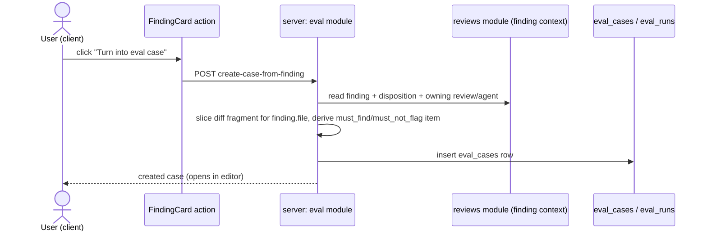
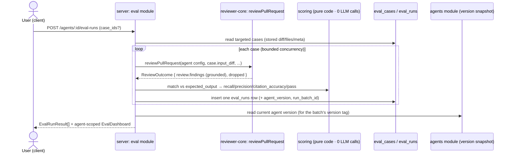

# Spec: Eval Pipeline   |   Spec ID: SPEC-2026-07-29-eval-pipeline   |   Status: draft
Supersedes: none

## Problem & why

The L06 lab already proved the methodology: turn "did the reviewer agent get better or
worse" into a regression-eval harness — a fixed set of cases, a deterministic scorer, and
recall/precision/citation-accuracy numbers that move visibly when the prompt/model/skills
change. That harness lives in the course's own `evals/` package and is exercised by hand.

This feature turns the SAME methodology into a first-class DevDigest product capability, so
any user of the app — not just the course student — can build an eval set and see the effect
of an agent-config change, from the UI, using a dataset that is not invented: it comes from
the real accept/dismiss decisions users already make on findings (L01–L05). An accepted
finding is evidence the agent SHOULD have found it (`must_find`); a dismissed finding is
evidence the agent should NOT have raised it (`must_not_flag` — a confirmed false positive).
Turning either into an eval case in one click, from the finding itself, is what makes the
dataset cheap enough to actually accumulate.

The DB tables (`eval_cases`, `eval_runs`) and the base/API-facing Zod contracts already exist
(pre-scaffolded per the course, `server/src/db/schema/eval.ts` and
`server/src/vendor/shared/contracts/{knowledge,eval-ci}.ts`) — there is currently no server
module implementing eval routes/service/scoring and no client UI (no Evals tab, no Eval
Dashboard). This is a full new build on top of that scaffolding.

## Goals / Non-goals

- **Goal:** Let a user turn any already-decided (accepted or dismissed) finding into an eval
  case in one click, with the expectation type derived from the finding's disposition.
- **Goal:** Let a user hand-author, edit, and delete eval cases for an agent, with a JSON
  expected-output editor that validates as it's typed.
- **Goal:** Run an agent's whole eval case set (or a subset) against FIXED, stored inputs —
  never a live PR re-fetch — so runs across agent-config versions are apples-to-apples.
- **Goal:** Score every run 100% in code — zero LLM/model calls for matching or aggregation;
  the only model call in the whole pipeline is the agent's own normal review-generation call.
- **Goal:** Make the harness demonstrably sensitive: a prompt edit that removes a rule must
  visibly move recall/precision between two runs.
- **Goal:** Surface eval health both locally (an Evals tab on the Agent Editor) and globally
  (a new top-level Eval Dashboard: per-agent trend, a global recent-runs table, a two-run
  comparison with a system-prompt diff).
- **Goal:** Ship `pnpm verify:l06` (server, and client if client tests are load-bearing) as a
  fixed, green test-file list, mirroring the existing `verify:l03` convention.
- **Non-goal:** LLM-as-judge scoring of any kind. Unlike the lab harness (which needed a judge
  because "explained the reason" isn't a substring match), this feature's expectations are
  mechanical file:line claims — matching is a citation/grounding-style computation, not a model
  call.
- **Non-goal:** Re-fetching or re-cloning a real PR/repo during a run. An eval case is a frozen
  snapshot (diff fragment + files + PR meta); the whole point is reproducibility across agent
  versions, which a live fetch would defeat.
- **Non-goal:** Building the "Learn" and "Reply to author" finding actions. The reference
  screenshot shows a five-button row (`Accept / Dismiss / Learn / Turn into eval case / Reply
  to author`), but as of this spec only Accept/Dismiss are implemented in the codebase
  (`FindingCard.tsx`); `FindingActionKind` already reserves `'learn'`/`'reply'` as enum values
  but the service rejects them (`actOnFinding` throws 400 for anything but accept/dismiss —
  `server/src/modules/reviews/findings.ts`). This feature adds ONLY the "Turn into eval case"
  control to that row; it does not build Learn or Reply, and must not assume they exist.
- **Non-goal:** A generalized "agent version rollback" capability. "Promote v7" (see AC-37)
  is scoped to reusing the agent module's EXISTING read-a-version + update-config endpoints;
  no new agent-versioning primitive (e.g. a literal "set current version pointer back") is
  introduced by this feature.
- **Non-goal:** Backfilling historical data for the two proposed `eval_runs` schema additions
  (see *Contracts — proposed additions*). The feature ships forward from whenever those
  columns land; there is no pre-existing `eval_runs` data to migrate.

## User stories

- **US-1** — As a reviewer, I want to turn an accepted or dismissed finding into an eval case
  in one click, so that building a regression set costs me nothing extra on top of triage I
  already do. → AC-1, AC-2, AC-3, AC-4, AC-5, AC-6
- **US-2** — As an agent owner, I want to hand-author and edit eval cases (name, diff, files,
  PR meta, expected findings), so that I can cover scenarios beyond what came from real
  findings. → AC-7, AC-8, AC-9, AC-10
- **US-3** — As an agent owner, I want to run my whole eval set (or one case) against the
  agent's current config with fixed inputs, so that I get a reproducible, comparable score. →
  AC-11, AC-12, AC-13, AC-40
- **US-4** — As an agent owner, I want recall/precision/citation-accuracy computed
  deterministically with zero model spend, so that I trust the numbers and can run evals
  cheaply and often. → AC-14 – AC-21
- **US-5** — As an agent owner, I want a prompt edit to visibly move the score, so that I know
  the harness is actually measuring my agent, not just replaying cached numbers. → AC-22
- **US-6** — As an agent owner, I want an Evals tab on the Agent Editor showing my case list,
  metrics, and quick actions, so that I don't have to leave the editor to check eval health. →
  AC-26, AC-27, AC-28, AC-29
- **US-7** — As a team lead, I want a workspace-wide Eval Dashboard showing every agent's
  trend and a global recent-runs table, so that I can spot a regression across the whole
  workspace, not just one agent at a time. → AC-30, AC-31, AC-32
- **US-8** — As an agent owner, I want to drill into one agent's history, get an automatic
  callout of the most notable recent movement, and compare two runs (metrics + system-prompt
  diff), so that I can decide whether to keep or revert a config change. → AC-33, AC-34,
  AC-35, AC-36, AC-38
- **US-9** — As an agent owner, having compared two versions, I want to promote the better one
  back to current with one action, so that acting on the comparison doesn't require manually
  retyping the old prompt. → AC-37
- **US-10** — As the course grader, I want `pnpm verify:l06` to exist and pass, so that the
  homework is objectively checkable. → AC-23

## Acceptance criteria (EARS)

### Turn a finding into an eval case

- **AC-1:** WHEN a user activates "Turn into eval case" on a finding whose disposition is
  **accepted** (`accepted_at` set, and if `dismissed_at` is also set, `accepted_at` is the
  later of the two timestamps), the system **shall** create an eval case, in one click, whose
  `expected_output` contains exactly one `must_find` item copied from that finding's
  `severity`/`category`/`title`/`file`/`start_line`/`end_line`.
  _(observable: integration test — accept a finding, invoke the action, assert the created
  case's `expected_output` has one `must_find` item matching the finding's fields.)_

- **AC-2:** WHEN a user activates the same action on a finding whose disposition is
  **dismissed** (mirrored tie-break: `dismissed_at` is the later timestamp), the system
  **shall** create an eval case whose `expected_output` contains exactly one `must_not_flag`
  item at that finding's `file`/`start_line`/`end_line` (severity/category/title carried along
  for display only).
  _(observable: integration test — dismiss a finding, invoke the action, assert one
  `must_not_flag` item with matching file/lines.)_

- **AC-3:** WHILE a finding has neither `accepted_at` nor `dismissed_at` set (pending), the
  action **shall** be unavailable and **shall not** create a case.
  _(observable: component test — pending finding renders the control disabled; a direct API
  call for a pending finding is rejected, not silently accepted.)_

- **AC-4:** IF a finding's review has no resolvable owning agent (e.g. `agent_id` is null),
  THEN the action **shall** be unavailable, since an eval case requires an owner agent
  (`owner_kind: 'agent'`).
  _(observable: component/integration test — a finding from an agent-less run renders/returns
  the action as unavailable.)_

- **AC-5:** The created case's `input_diff` **shall** be the diff fragment scoped to the
  finding's own file (not the PR's whole diff), and `input_meta` **shall** capture a bounded,
  point-in-time snapshot of PR title/repo/base-and-head SHA — fixed at creation time and never
  re-fetched afterward.
  _(observable: test asserts `input_diff` contains only hunks for the finding's file; editing
  or re-syncing the source PR afterward does not change the case's stored fields.)_

- **AC-6:** The created case **shall** be immediately editable (name, input, expected output)
  through the Eval case editor — the one-click create is not a dead-end; no separate required
  modal is needed to produce a usable, runnable case, but every field remains changeable
  afterward.
  _(observable: component test — after create, opening the case in the editor shows populated,
  editable fields.)_

### Eval case editor

- **AC-7:** The editor **shall** validate `expected_output` as a JSON array of expectation
  items, each carrying at least `type` (`must_find` | `must_not_flag`), `file`, and
  `start_line` (an omitted `end_line` defaults to `start_line`), and **shall** show a visible
  valid/invalid-JSON indicator that gates Save.
  _(observable: component test — malformed JSON shows the invalid indicator and disables Save;
  a corrected array re-enables it.)_

- **AC-8:** WHEN the "Run on save" toggle is on and the user saves, the system **shall**
  persist the case AND immediately trigger exactly one run of that case, and **shall** reflect
  the fresh result in the inline status strip without a page reload.
  _(observable: component/integration test — save with the toggle on triggers one run request
  and the strip updates from its result.)_

- **AC-9:** WHILE at least one run exists for a case, the editor **shall** show "Last run
  passed/failed · expected N finding(s), got M · duration · cost", where N is the case's own
  `expected_output` length and M/pass/duration/cost come from the case's latest run.
  _(observable: component test with a populated latest run renders all four fragments.)_

- **AC-10:** WHILE no run has ever happened for a case, the status strip **shall** be omitted
  entirely (not rendered as a failed/zeroed state).
  _(observable: component test — a case with no runs shows no status strip.)_

### Eval-run execution

- **AC-11:** WHEN `POST /agents/:id/eval-runs` is invoked (optionally scoped to a subset of
  case ids), the system **shall** execute the agent's CURRENT configuration
  (provider/model/system_prompt/strategy/linked skills) against every targeted case's stored
  `input_diff`/`input_files`/`input_meta` — **never** a live PR fetch — and **shall** persist
  exactly one `eval_runs` row per case executed.
  _(observable: integration test — recompute against a seeded case set; assert one new
  `eval_runs` row per targeted case, and that no repo/PR-fetch adapter is called.)_

- **AC-12:** The system **shall** execute each case through the SAME review-execution path
  used for a live PR review (mode selection, prompt assembly, the mandatory citation-grounding
  gate), so recall/precision/citation_accuracy reflect genuine agent behaviour rather than a
  parallel reimplementation.
  _(observable: a case whose stored diff is large/multi-file triggers the same map-reduce
  behaviour a live review of an equivalent diff would.)_

- **AC-13:** The response **shall** include the per-case results and an aggregate scoped to
  the agent, reusing the existing `EvalRunResult`/`EvalDashboard` shapes rather than an
  unrelated ad-hoc response type.
  _(observable: response schema validates against `EvalRunResult[]` + `EvalDashboard`.)_

- **Edge case (folded into AC-11):** WHEN the targeted case set is empty (agent has zero eval
  cases, or an empty `case_ids` filter resolves to nothing), the system **shall** persist
  nothing and return an empty aggregate, not an error.

### Scoring (zero LLM calls — the crux of the feature)

- **AC-14:** The system **shall** compute `citation_accuracy` for a case as
  `kept / (kept + dropped)`, where `kept` is the count of findings the review engine's
  citation-grounding gate retained for that case and `dropped` is the count it rejected —
  reusing that existing gate, not a reimplementation — and **shall** define this ratio as
  `1.0` when `kept + dropped == 0`.
  _(observable: unit test feeds a known kept/dropped split and asserts the exact ratio; a
  zero-findings case asserts `1.0`.)_

- **AC-15:** The system **shall** compute `recall` for a case as
  `(# must_find items matched) / (# must_find items total)`, defined as `1.0` when there are
  zero `must_find` items in that case's `expected_output`.
  _(observable: unit test — a case with 2 must_find items and 1 matched asserts `0.5`; a
  must_not_flag-only case asserts `1.0`.)_

- **AC-16:** A `must_find` item **shall** count as matched when at least one grounded
  (kept) produced finding has the same `file` and a line range `[start_line, end_line]` that
  intersects the item's `[start_line, end_line]` as a closed integer interval — the identical
  intersection semantics the review engine's own citation-grounding gate already uses.
  _(observable: unit test mirrors the grounding gate's own range-intersection test cases —
  adjacent-but-non-overlapping ranges do not match; any single overlapping line does.)_

- **AC-17:** The system **shall** compute `precision` for a case as
  `(# grounded produced findings backed by ≥1 must_find item) / (# grounded produced findings
  total)`, defined as `1.0` when zero findings were produced.
  _(observable: unit test — 3 produced findings, 1 backed, asserts `1/3`; zero produced
  findings asserts `1.0`.)_

- **AC-18:** A grounded produced finding that is **not** backed by any `must_find` item
  **shall** count against precision — whether or not it also matches a `must_not_flag` item.
  Matching a `must_not_flag` item is reported (for the UI/trace) as "confirmed noise"; an
  unbacked finding matching no expectation at all is reported as "unbacked extra" — both debit
  precision identically.
  _(observable: unit test — an unbacked finding matching no expectation at all reduces
  precision exactly like one matching a `must_not_flag` item.)_

- **AC-19:** A case's overall `pass` **shall** be `true` if and only if `recall == 1.0 AND
  precision == 1.0` for that case (every `must_find` matched, and no unbacked/confirmed-noise
  finding was produced).
  _(observable: unit test table covering the four recall/precision boundary combinations.)_

- **AC-20:** Scoring (matching, recall/precision/citation_accuracy computation, and case
  `pass`/`fail`) **shall** make **zero** calls to any LLM/model provider; the only model call
  anywhere in a run is the agent's own review-generation call already covered by AC-12.
  _(observable: unit tests for the scoring functions take already-produced findings as plain
  data — no `LLMProvider` parameter reaches them at all.)_

- **AC-21:** Given a Container `LLMProvider` double whose every method throws, invoking a run
  batch **shall** still succeed end-to-end for the scoring/aggregation step once the (mocked)
  review-generation call has returned its findings — i.e. nothing downstream of "findings
  produced" ever calls the double.
  _(observable: integration test using the same throwing-double technique as
  `server/test/smart-diff.it.test.ts` — inject a double whose every method throws for calls
  made AFTER the review call is stubbed/returns, and assert the run still scores and persists
  correctly.)_

### Sensitivity (the harness must actually measure the agent)

- **AC-22:** Editing an agent's `system_prompt` to remove a rule the case set exercises,
  followed by two consecutive `POST /agents/:id/eval-runs` invocations against the same case
  set (one before, one after the edit), **shall** produce different recall and/or precision
  aggregate values between the two runs.
  _(observable: integration test — a `MockLLMProvider`/`ContainerOverrides` double returns a
  degraded finding set for the "after" prompt; the two runs' persisted aggregates differ.)_

### Seed data & coverage

- **AC-23:** A `verify:l06` script **shall** exist in `server/package.json` (and in
  `client/package.json` if client-side tests are load-bearing for these ACs) and **shall**
  pass, running a fixed list of test files covering at minimum: the matching/scoring formulas
  (AC-14–AC-19), the zero-LLM-calls proof (AC-20/AC-21), and the prompt-sensitivity property
  (AC-22).
  _(observable: `pnpm verify:l06` exits 0 in both server and client, as applicable.)_

- **AC-24:** The system **shall** support an agent's eval case set growing to **at least 8**
  cases with no artificial cap, and the seeded demo workspace **shall** ship at least one
  agent whose eval case set already contains ≥8 cases spanning both expectation types, so the
  bar is demonstrable without manual authoring during grading/review.
  _(observable: seed script produces an agent with `cases_total >= 8` and at least one
  `must_find` and one `must_not_flag` case present; no case-count limit is enforced anywhere.)_

- **AC-25:** Both a `must_find` case and a `must_not_flag` case **shall** be independently
  creatable (one click), editable, runnable, and correctly scored end-to-end.
  _(observable: one integration test per expectation type covering create → run → score.)_

### Agent Editor — Evals tab

- **AC-26:** WHEN the Evals tab is opened for an agent, the system **shall** render
  recall/precision/citation-accuracy/traces-passed metric tiles with their delta vs the
  previous run batch, sourced from that agent's `EvalDashboard`.
  _(observable: component test with a populated dashboard renders four tiles + deltas.)_

- **AC-27:** The tab **shall** render the agent's eval-cases list, each row showing a
  pass/fail icon derived from that case's latest run (a distinct neutral icon when the case has
  never run), an "expected N finding(s), got M" subtitle, a severity/category badge, and
  per-row run/edit/delete controls.
  _(observable: component test — rows render all five elements for run/never-run cases.)_

- **AC-28:** The tab **shall** provide a "Run all evals" action (a run batch over every case in
  the set, no `case_ids` filter) and a "+ New eval case" action that opens the case editor for
  a fresh, empty case (either expectation type selectable) scoped to this agent.
  _(observable: component test — both actions are present and wired; "Run all evals" issues an
  unscoped run-batch request.)_

- **AC-29:** The tab **shall** provide a "View full dashboard →" link that navigates to this
  agent's drill-in view on the standalone Eval Dashboard.
  _(observable: component test — the link's target resolves to the agent's dashboard route.)_

### Eval Dashboard

- **AC-30:** The system **shall** register a top-level sidebar nav item "Eval Dashboard" under
  the existing "SKILLS LAB" section, reusing the already-scaffolded `eval` nav key (the
  `shell.nav.eval` i18n string and the `activeKeyFor` `/eval` match already exist, unused,
  ahead of this feature).
  _(observable: the sidebar renders the item under SKILLS LAB; navigating to its route
  highlights it active; the command palette lists it with no missing-message warning.)_

- **AC-31:** WHEN the Eval Dashboard's top-level view loads, the system **shall** render, per
  agent with at least one run batch: a sparkline trend, current recall/precision/citation-
  accuracy, and "last run vN · date · P/Q pass"; an agent with zero run batches **shall**
  render a neutral empty state, not an error or a zeroed chart.
  _(observable: component test — populated agent renders all fields; a never-run agent renders
  the empty state.)_

- **AC-32:** The top-level view **shall** render a workspace-wide "Recent eval runs · all
  agents" table (one row per run batch across every agent) and a "Run all agents" action that
  triggers one run batch per enabled agent that has at least one eval case (agents with zero
  cases are skipped, not errored).
  _(observable: component/integration test — the table lists batches from ≥2 agents; "Run all
  agents" issues one run-batch request per eligible agent.)_

- **AC-33:** WHEN a user drills into one agent, the system **shall** render
  recall/precision/citation-accuracy tiles with deltas vs the previous run batch, a
  metric-trend line chart over recent run batches, and a "Recent runs" table (one row per run
  batch) with a version tag, its metrics, pass count, and cost.
  _(observable: component test with ≥3 run batches renders tiles, chart, and table rows with
  all listed fields.)_

- **AC-34:** The drill-in **shall** render a deterministic, code-generated (never
  model-generated) one-line alert naming the metric with the largest signed delta between the
  two most recent run batches and its direction (e.g. "Precision dipped 2pts on v7 — …"), and
  **shall** render no alert when fewer than two run batches exist.
  _(observable: unit test over the alert-selection function with a fixed set of deltas asserts
  the correct metric/direction is chosen and the message is built by string interpolation, not
  a model call.)_

- **AC-35:** The "Recent runs" table **shall** let the user select exactly two rows via
  checkboxes to enable "Compare runs"; selecting a third row **shall** deselect the
  first-selected row (oldest selection is replaced, keeping the invariant "at most 2
  selected"), and "Compare runs" **shall** stay disabled until exactly 2 are selected.
  _(observable: component test — selecting a 3rd checkbox drops the 1st; Compare stays disabled
  at 0/1 selections and enables at exactly 2.)_

- **AC-36:** The "Compare runs" modal, given two selected run batches, **shall** show
  recall/precision/citation-accuracy/cost deltas (older→newer by `ran_at`, each with a
  directional indicator) and a system-prompt diff view between the two batches' snapshotted
  agent-version system prompts, with changed lines highlighted.
  _(observable: component test with two fixture batches renders four deltas + a highlighted
  diff.)_

- **AC-37:** The modal **shall** provide a "Promote v‹N›" action per compared version that
  applies that version's snapshotted configuration as the agent's CURRENT configuration
  (producing a new version snapshot whose config equals the promoted one) — reusing the
  agents module's existing read-a-version-snapshot and update-config capabilities; this feature
  introduces no new agent-versioning primitive.
  _(observable: integration test — "Promote v‹N›" on an older batch results in the agent's
  current config matching that version's snapshot and a new version row being recorded.)_

- **AC-38:** IF the two selected run batches were executed against the SAME agent version (no
  prompt/config change between them), THEN the system-prompt diff view **shall** show an
  explicit "no change" state rather than an empty/blank diff.
  _(observable: component test — two same-version batches render "no change", not a blank
  panel.)_

### In-flight state & tenancy

- **AC-39:** IF an eval case or eval run does not belong to the caller's workspace, THEN
  reading, running, updating, or deleting it **shall** resolve as not-found and **shall not**
  leak another workspace's data.
  _(observable: a case/run seeded under a second workspace → every route returns not-found,
  mirroring existing per-resource modules.)_

- **AC-40:** WHILE a run batch is already in flight for an agent, "Run all evals" / a per-case
  "run" control / "Run all agents" **shall** show a non-duplicable in-progress state
  (disabled/spinner) rather than allowing a second overlapping batch to start, mirroring the
  Intent/Blast/Brief recompute CTA convention.
  _(observable: component test — triggering while pending shows disabled/spinner; a second
  click issues no second request.)_

## Edge cases

- A finding with BOTH `accepted_at` and `dismissed_at` set → disposition resolved by whichever
  timestamp is later. → AC-1, AC-2
- Concurrent "Turn into eval case" clicks on the same finding → may create two similar cases;
  no dedup is guaranteed (mirrors the accepted last-write-wins precedent for concurrent
  per-PR-document writes elsewhere in this codebase). → accepted: no handling
- A finding whose file has an empty/degenerate diff fragment (e.g. a rename with no line
  changes) → the created case is still creatable; its own citation-grounding may drop
  everything on run, which is a legitimate (if uninformative) score, not an error. → AC-14
- `expected_output` edited to an empty array `[]` (a pure "expect nothing" probe case) →
  `recall = 1.0` (no must_find items), `precision` is whatever the produced-findings/backed
  ratio computes to (every produced finding is unbacked) — a deliberate, useful false-positive
  probe, not a bug. → AC-15, AC-17
- A produced finding whose file:line overlaps BOTH a `must_find` item AND a `must_not_flag`
  item in the same (contradictory, hand-authored) case → counted as backed; `must_find` wins
  the tie-break. The system does not reject contradictory hand-authored expectations. →
  accepted: no handling beyond this tie-break rule (AC-16/AC-18)
- `POST /agents/:id/eval-runs` targets a `case_ids` value containing an id from a DIFFERENT
  agent's set → that id is ignored (not executed, not erroring the whole batch). → accepted:
  no handling beyond silent exclusion
- Two run batches selected for comparison where one predates the `run_batch_id`/`agent_version`
  schema additions (see *Contracts — proposed additions*) → out of scope; this feature ships
  forward with no pre-existing `eval_runs` data to backfill. → accepted: no handling
- An agent is deleted after some of its eval cases/runs exist → cascades via the existing FK
  (`eval_cases.owner_id` is NOT an FK — it's a bare uuid keyed by `owner_kind`/`owner_id`, so
  no DB-level cascade fires on agent delete); orphaned cases become unreachable through the
  Agent Editor (no owning agent to open the tab from) but are not otherwise cleaned up. →
  accepted: no handling (flagged, not silently "fixed" — the given schema has no FK here to
  enforce cascade; a cleanup job is out of scope)

## Non-functional

- **Model spend:** exactly one agent review-generation call per case per run batch (identical
  cost profile to a live PR review of an equivalent-sized diff); scoring/aggregation makes
  **zero** additional calls (AC-14–AC-21, the hard "zero LLM calls" requirement).
- **Batch concurrency:** a run batch over N cases **shall** bound concurrent in-flight
  case-review calls to avoid overwhelming the LLM provider — recommend reusing this
  repository's existing `p-queue` dependency (already a `server` dependency) at a concrete cap
  of **≤ 4 concurrent** case reviews per batch.
- **Accessibility:** WCAG 2.1 AA. Pass/fail icons and Compare-modal delta indicators **shall**
  convey state by icon/arrow **and** text label, never colour alone (mirrors the existing
  risk-level convention in this codebase).
- **Security / trust:** an eval case's stored `input_diff`/`input_meta` may carry third-party
  PR-author text (title, description) exactly as a live review does; the review-generation
  call under eval goes through the SAME `wrapUntrusted`/structured-output-only/grounding-gate
  path as a live review (AC-12) — no new trust surface. `expected_output`/case name/notes are
  reviewer-authored, never sent to any LLM prompt (scoring is code-only, AC-20), so they carry
  no injection risk regardless of content.

## Cross-module interactions

Packages involved: **client** (`@devdigest/web` — FindingCard action, Eval case editor, Agent
Editor Evals tab, Eval Dashboard + Compare-runs modal) and **server** (`@devdigest/api` — a new
`eval` module: routes/service/repository/scoring, reusing `@devdigest/reviewer-core`'s
`reviewPullRequest` + `groundFindings` for execution, and the `agents` module's existing
version-snapshot/update endpoints for "Promote"). `reviewer-core` is consumed unchanged (no new
engine capability — this feature is a new CALLER of `reviewPullRequest`, exactly like a live
PR review, just fed a stored diff instead of a live one).

**Failure contract:** a run batch never partially corrupts state — each targeted case's
review call and scoring either succeeds and persists its `eval_runs` row, or that one case is
recorded as a failed/degraded row (mirrors the rest of this codebase's "degrade per unit, don't
5xx the whole request" convention); an empty target set returns an empty aggregate, not an
error (edge case under AC-11).

## Contracts

Shapes only — no implementation. All `@devdigest/shared` changes are two-sided: the vendored
copy exists in **both** `server/src/vendor/shared` and `client/src/vendor/shared`, kept in sync
by hand — every field below lands in both copies in lock-step.

**Reused as-is (given, non-negotiable):**

| Contract | Role in this feature |
|---|---|
| `eval_cases` / `eval_runs` (DB schema) | persistence, with the additions below |
| `EvalCase`, `EvalCaseInput`, `EvalOwnerKind` | case CRUD payload/read shape |
| `EvalRun`, `EvalPerTrace` | the per-case run result shape (`recall`/`precision`/`citation_accuracy`/`traces_passed`/`traces_total`/`per_trace`) |
| `EvalRunRecord` | one persisted `eval_runs` row, as returned by the API — used by the case editor's "Last run" status strip |
| `EvalRunResult` | `{ run_id, case_id, result: EvalRun }` — the per-case element of a run-batch response |
| `EvalTrendPoint`, `EvalDashboard` | dashboard aggregate — see proposed extension below |
| `Finding` (`start_line`/`end_line`) | the shape produced findings and `expected_output` items both key off, for line-range matching |

**Expectation item shape (informal — carried inside `expected_output: z.unknown()`, not itself
Zod-validated server-side beyond "is a JSON array"):**

| Field | Shape | Notes |
|---|---|---|
| `type` | enum `must_find` \| `must_not_flag` | drives AC-15/AC-17 matching |
| `file` | string | matched against a produced finding's `file` |
| `start_line` | int | required |
| `end_line` | int | optional; defaults to `start_line` when omitted |
| `severity`/`category`/`title` | optional | display-only for `must_not_flag`; carried through for `must_find` but NOT part of the pass/fail match rule (file:line only) |

**Contracts — proposed additions (gap found — flagged, not silently patched):**

The given `eval_runs` schema is one row per (case, execution) with no notion of a *batch*
(the set of case-rows produced by one `POST /agents/:id/eval-runs` call) and no record of
which **agent version** (system-prompt snapshot) produced it. Both are required by this
feature's Dashboard/Compare-runs requirements (a "Recent runs" table with one row per BATCH,
a version tag per row, and a system-prompt diff between two batches) and neither exists in the
given schema/contracts:

1. **`eval_runs.run_batch_id`** (uuid) — shared by every case-row inserted by the same
   `POST /agents/:id/eval-runs` invocation. Needed to group per-case rows into one selectable
   "run" for the Recent Runs table / trend chart / Compare action.
2. **`eval_runs.agent_version`** (integer) — the agent's `agents.version` at the moment the
   batch ran (i.e. the `agent_versions.version` whose `config_json.system_prompt` produced this
   run). `agents.version` alone is not enough because it's mutable going forward; the run must
   pin the version it actually tested, exactly the way `agent_versions` already pins config
   snapshots.
3. **API-facing:** extend `EvalTrendPoint` with `run_id` (the batch id) and `agent_version`,
   and use this extended shape (rather than the per-case `EvalRunRecord[]`) for
   `EvalDashboard.recent_runs`, so the trend chart and the Recent Runs table share one
   per-batch aggregate shape with a stable, checkbox-selectable identity. `EvalRunRecord`
   remains as-is for the case editor's per-case "Last run" strip.
4. **New request shape** for `POST /agents/:id/eval-runs` (no existing contract covers this new
   route): `{ case_ids?: string[] }` — omitted/empty means "every case in the set".
5. **New request/response shape** for the one-click "create case from finding" action (no
   existing contract covers deriving a case from a finding — `EvalCaseInput` requires the
   caller to already know `input_diff`/`expected_output`, which this action derives
   server-side): request `{ finding_id }` (or path-scoped), response the created `EvalCase`.

These are recommendations for the `implementation-planner` to size and land (schema migration
+ two-sided vendored-contract edit); the planner may choose different field names, but the
underlying gap (no batch grouping, no version pin) must be closed one way or another before
AC-33/AC-35/AC-36/AC-37 are buildable.

**Reused, not reinvented (agents module — no new capability needed):**

- `GET /agents/:id/versions/:version` (existing) supplies the snapshotted `system_prompt` for
  the Compare-runs diff view, keyed by the proposed `eval_runs.agent_version`.
- `PUT /agents/:id` (existing) is how "Promote v‹N›" is applied — feeding that version's
  snapshotted config back in as an update, which the existing version-bump/snapshot mechanism
  (`AgentsRepository.update` → `snapshotVersion`) records as a new version automatically.

## Untrusted inputs

Yes, indirectly. An eval case's stored `input_diff`/`input_meta` can carry third-party,
PR-author-controlled text (diff content, PR title/description) exactly as a live review does.
When a case is executed (AC-12), that text reaches the SAME review-generation path a live
review uses — `wrapUntrusted`, structured-output-only, no tools, and the mandatory
citation-grounding gate — so no new trust surface is introduced by running it as an eval case
instead of a live PR.

Everything else in this feature (case name, notes, hand-authored `expected_output`) is
reviewer-authored, not third-party, and — critically — **never reaches any LLM prompt at all**:
scoring is code-only (AC-20), so even a maliciously-crafted `expected_output` string has no
prompt-injection surface; at worst it's rendered as inert JSON/text in the editor UI.

## Open questions

- [NEEDS CLARIFICATION: exact tie-break when a run batch's `case_ids` targets a mix of valid
  and cross-agent/invalid ids — default assumed: silently exclude invalid ones, run the valid
  subset (edge cases section).]
- [NEEDS CLARIFICATION: the "most notable movement" alert (AC-34) — default assumed: the
  single metric (recall/precision/citation_accuracy) with the largest absolute signed delta
  between the two most recent batches, phrased deterministically from that value; no weighting
  between metrics is proposed beyond "largest magnitude wins".]
- [NEEDS CLARIFICATION: whether `verify:l06`'s client-side lane is load-bearing (i.e. whether
  any of AC-26–AC-38 are asserted only by a client component test) — default assumed: yes,
  mirroring `verify:l03`'s existing client+server split, since several ACs (AC-27, AC-31,
  AC-34, AC-35) are UI-rendering behaviour not exercisable server-side alone.]
- [NEEDS CLARIFICATION: naming/shape of the two proposed `eval_runs` contract additions
  (`run_batch_id`, `agent_version`) and whether `EvalDashboard.recent_runs`'s element type
  should be changed in place or a new type introduced — flagged as a gap above; the
  `implementation-planner` should make the final call on field names and migration shape.]
- [NEEDS CLARIFICATION: orphaned eval cases after their owning agent is deleted (edge cases
  section) — default assumed: accepted, no cleanup job in scope for this feature; revisit only
  if it proves confusing in practice.]
