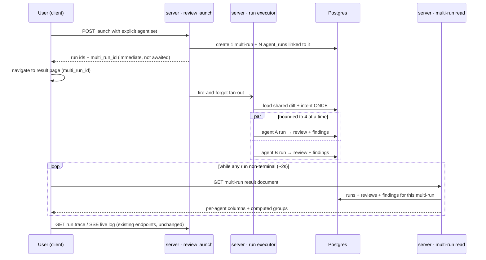

# Spec: Multi-Agent Review   |   Spec ID: SPEC-2026-08-02-multi-agent-review   |   Status: approved
Supersedes: none

## Problem & why

A real pull request is heterogeneous — it carries security, performance and domain-logic
risk at the same time. Today DevDigest makes the user pick **one** agent (or "all") from a
dropdown on the PR page and then reads each agent's review in isolation. One agent means one
focus, so the user is forced to guess up front which lens matters for this PR.

Running several specialised agents over the same PR in one pass removes that guess. But
naively fanning out creates three new problems, and this feature exists to solve all three:

1. **Duplicate noise.** Three agents will independently find the same obvious bug. Without
   grouping, the user reads three near-identical findings, concludes the tool is padding, and
   stops trusting it.
2. **Invisible disagreement.** The genuinely interesting signal is where agents *differ* at
   the same code location — one says `WARNING`, another says `SUGGESTION`, a third says
   nothing. Today that comparison is impossible without opening several reviews side by side.
3. **A blind wait.** Several agents with no live window is minutes of staring at a spinner.
   The user needs to see who finished, who is still thinking, and who died.

Attribution ("which agent found this") is kept in the data as the raw material for a future
Per-Agent Stats capability — this feature does not build those statistics, it makes them
possible.

Two pieces of scaffolding already exist and are deliberately reused: `POST /pulls/:id/review`
already resolves a set of target agents, creates one `agent_runs` row per agent, returns
immediately and executes in the background with per-agent failure isolation; and the run
trace / live-log stack (SSE endpoint with replay buffer, trace drawer, live-log primitive) is
complete. The `multi_agent_runs` table exists as a four-column stub that **nothing currently
reads or writes**, and there is no link from `agent_runs` to it.

One premise from the original brief was verified false and is corrected here: the existing
executor runs agents **sequentially** (`for (const job of jobs) { await runOneAgent(...) }`),
not in parallel, despite a doc-comment claiming it "map-reduces each agent". Making the
fan-out genuinely concurrent is therefore in scope (see AC-1 – AC-5).

## Goals / Non-goals

- **Goal:** Let a user pick an explicit set of agents and run them over one PR in a single
  action, from two entry points — a quick picker on the PR page and a dedicated Configure-run
  page.
- **Goal:** Execute the selected agents **concurrently**, bounded by a fixed concurrency cap,
  with the existing per-agent failure isolation preserved.
- **Goal:** Show a pre-run estimate derived only from that agent's own past runs — no
  invented numbers, no price table.
- **Goal:** Group the runs of one fan-out under a single multi-run record, so the result is
  one addressable, shareable, reloadable page.
- **Goal:** Group findings across agents by code location (same file + overlapping line
  range) so duplicates read as "the same place" and disagreements become visible.
- **Goal:** Preserve finding → agent attribution in the persisted data.
- **Goal:** Close the navigation loop — PR → launch → result → configure → launch again — and
  make re-entry from the sidebar land on the last result rather than a blank form.
- **Goal:** Show live per-agent status, cost and duration while the fan-out runs, and give a
  trace link from every agent's column/tab that opens the **existing** run-trace drawer.
- **Non-goal:** Touching `ci/` or `agent-runner/`. Neither is read, modified, or referenced.
- **Non-goal:** The Compose Review drawer. That surface curates findings before publishing a
  review to GitHub; it is a different job and is not modified.
- **Non-goal:** Per-Agent Stats (cost/quality leaderboards, per-agent trend charts). This
  feature only preserves the attribution data those statistics will later need.
- **Non-goal:** Any semantic or model-based similarity. Grouping is same-file +
  line-range-overlap and nothing else. No text heuristic, no embedding, no LLM judge.
- **Non-goal:** A per-model or hardcoded price/duration table as an estimate fallback. An
  agent with no history shows `—`.
- **Non-goal:** Implementing the `Learn` action. It is rendered as a **disabled** control with
  a tooltip indicating it arrives with the Memory feature — it is a deliberate hook for a
  future lesson and must be visible, not absent — but it issues no request and has no server
  behaviour. `Reply to author` is dropped entirely: it requires GitHub write-back, which is
  out of scope.
- **Non-goal / hard constraint:** `server/src/modules/reviews/service.ts` and
  `server/src/modules/reviews/findings.ts` are **read-only for this feature**. `actOnFinding`
  **must not** be extended to accept a `learn` action, and no new finding-action endpoint is
  added. The client reuses `POST /findings/:id/accept`, `POST /findings/:id/dismiss` and the
  existing create-eval-case-from-finding route (`server/src/modules/eval/routes.ts:58`)
  verbatim, through the existing hooks.
- **Non-goal:** Adding the rest of the design's `GLOBAL` sidebar section (`Memory`,
  `Agent Performance`, `CI Runs`). Only the in-scope `Multi-Agent Review` entry is added.
- **Non-goal:** Changing how a single agent's review is produced — prompt assembly, the
  citation-grounding gate, and the untrusted-input wrapping are untouched.
- **Non-goal:** A cross-PR or historical multi-run browser. A multi-run is reachable by its
  own URL and from the run that created it; there is no "all past multi-runs" index.

## User stories

- **US-1** — As a reviewer on a PR page, I want to tick the agents I care about and launch
  them in one click, so that I stop having to choose a single lens up front. → AC-16 – AC-21
- **US-2** — As a reviewer, I want a dedicated Configure-run page where I pick a PR and see
  each agent's typical time and cost before committing, so that I know what a fan-out will
  cost me. → AC-22 – AC-31
- **US-3** — As a reviewer, I want the selected agents to actually run at the same time, so
  that a four-agent review takes about as long as the slowest agent, not the sum of all four.
  → AC-1 – AC-5
- **US-4** — As a reviewer watching a fan-out, I want live per-agent status, so that I can see
  who finished, who is still working and who failed instead of staring at one spinner. →
  AC-32 – AC-38
- **US-5** — As a reviewer reading results, I want a per-agent column view and a per-agent
  tab view with expandable finding detail, so that I can either compare breadth or go deep on
  one agent. → AC-32 – AC-38, AC-46 – AC-52
- **US-6** — As a reviewer, I want findings at the same code location collapsed into one
  group showing every agent's verdict — including "did not flag" — so that duplicates stop
  reading as noise and disagreements become obvious. → AC-6 – AC-15, AC-53 – AC-59
- **US-7** — As a product owner, I want every finding to keep a durable link to the agent and
  run that produced it, so that Per-Agent Stats can later be built without a backfill. →
  AC-60, AC-61
- **US-8** — As a reviewer, I want the same run-log/trace sidebar I already use on the PR
  page, opened from any agent's column or tab, so that I do not learn a second UI. → AC-39 –
  AC-42
- **US-9** — As a user, I want Multi-Agent Review reachable from the sidebar and the command
  palette, so that I can start a run without first navigating to a PR. → AC-43 – AC-45
- **US-10** — As a reviewer returning to the app, I want the Multi-Agent Review entry to take me
  to my most recent result rather than a blank form, a clear way back to a fresh configuration,
  and a way to reopen a PR's existing multi-run without re-running it, so that the loop
  PR → launch → result → configure → launch again is closed. → AC-21a, AC-21b, AC-22, AC-22a,
  AC-22b, AC-22c, AC-33a

## Acceptance criteria (EARS)

### Concurrent execution

- **AC-1**: WHEN the background executor is given N queued agent jobs for one PR, the system
  **shall** start those jobs concurrently rather than awaiting each one before starting the
  next. _(observable: a unit/integration test with N instrumented agent executions records
  overlapping start/end intervals; total wall clock approximates the slowest job, not the
  sum)_
- **AC-2**: The system **shall** bound the number of simultaneously executing agent jobs to a
  fixed cap defined as a **named constant**, not an inline literal. _(observable: the constant
  exists and is referenced by the executor; a test with more jobs than the cap observes at
  most `cap` overlapping executions at any instant)_
- **AC-3**: The concurrency cap **shall** default to **4**. _(observable: the named constant's
  value is 4. Rationale to record alongside it: 4 is the design's canonical fan-out size, so
  the common case runs in one wave at full parallelism, while a "Run all" over a larger agent
  roster is still bounded to 4 simultaneous LLM calls — well inside a single provider key's
  concurrency budget and far below the route's existing 10 requests/minute limit)_
- **AC-4**: IF one agent job throws, is cancelled, or fails, THEN the system **shall** still
  run and complete every other job in the fan-out, and **shall** persist that job's own
  failure status, error text and trace exactly as it does today. _(observable: an integration
  test where one of three agents throws yields one `failed` run and two `completed` runs, each
  with its own trace)_
- **AC-5**: The system **shall** load the shared pre-work — the PR diff and the previously
  computed intent — **once** before the fan-out begins, and **shall not** load it per agent.
  IF the shared diff load fails, THEN every queued run **shall** be marked failed with that
  reason, as today. _(observable: a test with an instrumented diff loader records exactly one
  invocation for an N-agent fan-out; the existing fail-all-on-diff-failure test still passes)_

### Cross-agent grouping

The grouping computation is a **pure, zero-I/O function** over the multi-run's runs and their
findings, so it is directly unit-testable without a database.

- **AC-6**: The system **shall** consider two findings co-located WHEN their `file` values are
  exactly equal AND their closed integer line ranges `[start_line, end_line]` overlap, using
  the same semantics as the existing overlap rule — adjacent non-overlapping ranges
  (`[1,5]`/`[6,10]`) do **not** overlap; a single shared boundary line (`[1,5]`/`[5,10]`)
  does. No other similarity signal **shall** be used. _(observable: unit tests over the
  boundary cases; the rule mirrors `server/src/modules/eval/scoring.ts`'s `rangesOverlap`,
  lines 23-29, which itself documents that it faithfully mirrors reviewer-core's private
  `rangeIntersects` — reviewer-core is not modified)_
- **AC-7**: The system **shall** form groups as the **connected components** of the
  co-location relation within each file — i.e. co-location is applied transitively, so
  findings A`[10,20]`, B`[18,30]` and C`[28,40]` form **one** group even though A and C do not
  overlap each other. _(observable: a unit test with that exact three-finding chain returns
  exactly one group containing all three)_
- **AC-8**: The system **shall** identify a group's location as its `file` plus the **minimum
  `start_line`** across the group's findings. _(observable: the group for the chain in AC-7
  reports line 10; rendered as `src/middleware/ratelimit.ts:28` in the UI)_
- **AC-9**: The system **shall** label a group with the `title` of its **highest-severity**
  finding, breaking ties by highest `confidence`, then lowest `start_line`, then the agent's
  position in the multi-run's agent order, then finding id — so the label is fully
  deterministic. _(observable: a unit test with a deliberately tied group returns the same
  label across repeated runs and across input orderings)_
- **AC-10**: The system **shall** emit one verdict cell per **participating agent** of the
  multi-run — every agent in the fan-out, in the multi-run's agent order — for every group,
  including agents that contributed no finding to that group. _(observable: a four-agent
  multi-run yields four cells in every group)_
- **AC-11**: WHERE an agent contributed at least one finding to a group, the system **shall**
  set that agent's verdict to the **severity of its highest-severity finding in that group**
  and attach a one-line rationale derived from that same finding. _(observable: an agent with
  a `warning` and a `suggestion` in one group renders a single `WARNING` cell)_
- **AC-12**: WHERE an agent's run in this multi-run reached a **successful terminal status**
  and contributed no finding to a group, the system **shall** set that agent's verdict to
  `did not flag`. _(observable: the cell renders a grey dot and the text `did not flag`)_
- **AC-13**: WHERE an agent's run in this multi-run did **not** reach a successful terminal
  status — failed, cancelled, or still running — the system **shall** set that agent's verdict
  to `no result`, which is a distinct state from `did not flag`. _(observable: a group cell
  for a failed agent renders `no result`, never `did not flag`; asserted by unit test)_
- **AC-14** _(revised 2026-08-02 after live review)_: The system **shall** mark a group as a
  **conflict** WHEN the number of distinct severities among the agents that **flagged** the
  location is 2 or more. Agents in `did not flag` and agents in `no result` **shall both** be
  excluded from this computation. _(observable: `{CRITICAL, SUGGESTION}` → conflict;
  `{WARNING, WARNING, WARNING}` → not a conflict; `{CRITICAL, did not flag, did not flag}` →
  **not** a conflict; `{WARNING, no result}` → not a conflict)_

  **Why this changed.** The original rule counted `did not flag` as a verdict, so a location
  raised by one agent and missed by the others was a conflict. On real runs that made **every**
  group a conflict (6 of 6 and 11 of 11 in the verification runs), which turned
  `Show only conflicts` into a no-op. With specialised agents, silence normally means "that
  reviewer wasn't looking at this dimension", not "that reviewer disagrees" — so silence is no
  longer a verdict. A location flagged by exactly one agent is a **unique find**: still shown in
  the block with its `did not flag` cells, just not counted as a disagreement.
- **AC-15**: The system **shall** produce a group for **every** code location where at least
  one participating agent flagged a finding, and **shall** order groups by `file` ascending
  then by the group's minimum `start_line` ascending. _(observable: a multi-run with findings
  at three distinct locations returns three groups in file/line order)_

### Screen 1 — PR page agent picker

- **AC-16**: WHEN the user opens the `Run Review` control on a PR page, the system **shall**
  present a right-aligned dropdown anchored under that control, headed `PICK AGENTS TO RUN`
  in small uppercase muted letter-spaced type on the left with a blue `Clear` link on the
  right. _(observable: the rendered dropdown matches Screen 1 field-for-field)_
- **AC-17**: The system **shall** render one row per enabled agent in the workspace, each row
  carrying a checkbox on the left, an agent icon, the agent name, and a right-aligned muted
  monospace duration hint (`~6s`). _(observable: a workspace with two enabled agents renders
  two rows in that layout)_
- **AC-18**: The system **shall** derive each row's duration hint from that agent's own run
  history per AC-26, and WHERE an agent has no history **shall** render `—` in the hint
  position. _(observable: an agent with zero completed runs shows `—`, never a fabricated
  number)_
- **AC-19**: The system **shall** render a full-width primary action button labelled
  `Run multi-agent review (N)` where N is the live count of checked agents. _(observable:
  checking and unchecking a row updates N immediately)_
- **AC-20**: IF zero agents are checked, THEN the system **shall** disable the run button.
  _(observable: with N=0 the button is disabled and clicking it starts nothing)_
- **AC-21**: The system **shall** render a muted footer row with a gear icon labelled
  `Configure agents…`, and the `Clear` link **shall** uncheck every row. _(observable: both
  controls are present and `Clear` sets N to 0)_
- **AC-21a**: WHERE a pull request already has at least one multi-run, the PR page **shall**
  offer a control that opens that multi-run's result view **without launching anything**, and
  that control **shall** live in the PR page's existing run-history/timeline surface rather
  than the PR toolbar. Rationale to record: the timeline is already the DB-backed, newest-first
  "every past run" surface whose rows already open a run's trace, so a multi-run entry is the
  same gesture on the same surface; the toolbar is already occupied by `View on GitHub`,
  `Run Review` and `Compose review` and must not grow a fourth button. _(observable: on a PR
  with a prior multi-run the timeline offers the entry and activating it renders that
  multi-run's result view with no new run created; on a PR with none, no such entry appears)_
- **AC-21b**: WHERE a pull request has several multi-runs, the control in AC-21a **shall**
  target the **most recent** one by the multi-run's own timestamp. _(observable: a PR seeded
  with three multi-runs opens the newest)_

### Screens 2 & 3 — Configure run page

- **AC-22**: WHEN the user navigates to the Multi-Agent Review entry point and the active
  repository has **no** previous multi-run, the system **shall** show the Configure-run form:
  breadcrumb `Multi-Agent Review › Configure run`, H1 `Run a Multi-Agent Review`, and the muted
  sub-line "Pick a pull request and choose which agents to fan out — they run in parallel and
  you compare their findings side by side." _(observable: on a repository with zero multi-runs
  the entry point renders those three elements; content column ~730px, left-aligned within it)_
- **AC-22a**: WHEN the user navigates to the Multi-Agent Review entry point and the active
  repository has **at least one** previous multi-run, the system **shall** show the **most
  recent** multi-run's result view — the same view served for an explicit multi-run URL — and
  **shall not** show an empty Configure-run form. _(observable: after launching a multi-run,
  clicking the sidebar entry lands on that multi-run's results, not a blank form)_
- **AC-22b**: The system **shall** expose a server affordance that resolves the most recent
  multi-run for a scope — ordered by the multi-run's own timestamp, newest first — returning an
  explicit "none" result rather than an error when the scope has no multi-run, so the client
  can choose between the two landing states in a single round trip. Resolution **shall** be
  workspace-scoped, and **shall** be further narrowed to the active repository. _(observable:
  an integration test seeding three multi-runs across two repositories returns the newest one
  of the requested repository; a repository with none returns the "none" result with a 2xx,
  not a 404)_
- **AC-22c**: The system **shall** keep the Configure-run form reachable at an explicit,
  directly navigable address, so that landing on a result (AC-22a) never makes starting a new
  run unreachable. _(observable: navigating to the configure address always renders the form
  regardless of how many multi-runs exist)_
- **AC-23**: The system **shall** render Step 1 as a numbered circle `1` plus the label
  `Pull request`, below which sits a select-style button with a git-pull-request icon and a
  chevron, reading `Select a pull request…` until a PR is chosen. The selectable pull requests
  **shall** be those of the **currently active repository**, resolved by the existing
  workspace-level-page precedent (URL → stored preference → first repository); this page does
  not offer a cross-repository picker. _(observable: matches Screen 2; switching the active
  repository changes the offered pull requests)_
- **AC-24**: WHILE no pull request is selected, the system **shall** dim the Step 2 numbered
  circle and render, in place of the agent list, an empty-state card with a centred icon, the
  bold line `Pick a pull request first`, and the muted line "Choose which PR to review above,
  then select the agents to run on it." _(observable: matches Screen 2)_
- **AC-25**: WHEN a pull request is selected, the system **shall** replace the Step 1 control
  with `#<number> · <title>` and render Step 2 as a header row with `Agents to run` on the
  left and a blue `Select all` link on the right, followed by one card per enabled agent
  stacked with ~12px gaps. _(observable: matches Screen 3)_
- **AC-26**: The system **shall** compute an agent's duration estimate as the **average
  `duration_ms` over that agent's own successfully completed past runs** in the workspace, and
  its cost estimate as the **average `cost_usd`** over the same set of runs, each average
  ignoring rows where the respective value is null — so the two averages may have different
  denominators. No per-model table, price list, or cross-agent fallback **shall** be used.
  _(observable: a unit/integration test seeds runs with a known mix of values and asserts both
  averages, including the differing-denominator case)_
- **AC-27**: IF an agent has no run with a non-null value for a given metric, THEN the system
  **shall** report that metric as absent and the UI **shall** render `—` for it. _(observable:
  a freshly created agent's card shows `—`, never `0s` or `$0.00`)_
- **AC-28**: The system **shall** render each agent card as: checkbox · agent icon in a tinted
  rounded square · semibold agent name with a one-line muted summary beneath it taken from
  that agent's most recent review summary · right-aligned monospace `<duration> · <cost>`.
  _(observable: matches Screen 3; an agent that has never produced a review renders no summary
  line rather than placeholder text)_
- **AC-29**: The system **shall** render a selected card with a 1px border and a filled
  checkbox in that agent's accent colour, and an unselected card with a neutral grey border
  and an empty checkbox. _(observable: matches Screen 3's Security/Performance/Junior
  Mentor/Customer-Facing selected vs Architecture unselected)_
- **AC-30**: The system **shall** render, to the right of the `Run multi-agent review (N)`
  button, a muted monospace aggregate reading `≈ <max duration> · <sum cost> · parallel
  fan-out`, where the duration is the **maximum** estimate across selected agents and the cost
  is the **sum** of their estimates, with agents lacking an estimate excluded from that
  aggregate. _(observable: selecting agents estimated at 8.2s/$0.06, 6.0s/$0.05, 4.1s/$0.04
  and 5.0s/$0.05 renders `≈ 8.2s · $0.20 · parallel fan-out`)_
- **AC-31**: IF no selected agent has an estimate for a metric, THEN the system **shall**
  render `—` for that metric in the aggregate rather than `0`. _(observable: selecting only
  history-less agents shows `≈ — · — · parallel fan-out`)_

### Screen 4 — results, Columns mode

- **AC-32**: WHEN a multi-agent run is launched from either entry point, the system **shall**
  navigate to a result page addressed by that multi-run's own id, so the page is reloadable
  and shareable. _(observable: reloading the URL mid-run restores the same page and live
  state)_
- **AC-33**: The system **shall** render the result toolbar as: a secondary `⚙ Configure run`
  button, the H1 `Multi-Agent Review`, the muted `<N> selected agents · parallel`, and a
  right-aligned segmented control `Columns | Tabs`; beneath it a sub-row with
  `#<number>  <title>` on the left and the muted right-side summary
  `<N> agents · parallel fan-out · <total duration> · <total cost>`. Breadcrumb reads
  `Multi-Agent Review › #<number>`. _(observable: matches Screen 4, with the sub-row wording
  corrected per the deviation section)_
- **AC-33a**: WHEN the user activates the result toolbar's `⚙ Configure run` button, the system
  **shall** navigate to the Configure-run form (AC-22c), which is the single path from a result
  back to launching another multi-run. The design's `Configure run` label **shall** be used —
  the screenshots are authoritative on copy — and **no** second "start new review" button
  **shall** be added, because this one control already performs that job. _(observable:
  activating it renders the Configure-run form; the result toolbar contains exactly one such
  control)_
- **AC-34**: The system **shall** render, in Columns mode, one equal-width column per
  participating agent as a card with a 2px top border in that agent's accent colour; the
  column header carries the agent icon and name, a second muted monospace line
  `<duration> · <cost>`, and a right-aligned circular score ring showing that run's score with
  the ring colour following the score band. _(observable: matches Screen 4's four columns)_
- **AC-35**: The system **shall** render each finding inside a column as a card with a
  severity icon, the finding title clamped to two lines, the `file.ts:line` in muted monospace,
  and a left accent bar coloured by severity. _(observable: matches Screen 4)_
- **AC-36**: The system **shall** render a column footer with a `View trace` link on the left
  and the muted `<N> findings` on the right. _(observable: matches Screen 4)_
- **AC-37**: WHILE any run in the multi-run has not reached a terminal status, the system
  **shall** reflect each agent's live status in its column header and **shall** refresh that
  state automatically without a manual reload. _(observable: launching a fan-out shows columns
  transitioning running → completed independently, without user action)_
- **AC-38**: WHEN every run in the multi-run has reached a terminal status, the system
  **shall** stop refreshing. _(observable: no further network polling after the last run
  settles)_

### Run trace and live log reuse

- **AC-39**: The system **shall** open the **existing** run-trace drawer — the same component
  used on the PR page, with its configuration, stats, prompt-assembly, live log and copy-raw-
  output affordances — when `View trace` is activated from any column or tab. No second
  drawer, log viewer, or trace UI **shall** be introduced. _(observable: the drawer rendered
  on the multi-agent page is the same component instance type as the PR page's; asserted by a
  component test and by the absence of any new trace/log component)_
- **AC-40**: The system **shall** open that drawer scoped to the specific agent run whose
  column/tab requested it. _(observable: opening from the third column shows the third
  agent's run id, model and stats)_
- **AC-41**: WHILE the requested run is still executing, the drawer **shall** stream its live
  log through the existing SSE endpoint and replay buffer, so a log opened late still shows
  earlier lines. _(observable: opening the drawer several seconds into a run shows the run's
  full log from its first line)_
- **AC-42**: The system **shall not** modify the SSE endpoint, its replay buffer, or the
  live-log primitive. _(observable: the diff touches none of them)_

### Navigation

- **AC-43**: The system **shall** add exactly one sidebar entry, `Multi-Agent Review`, under a
  `GLOBAL` section, and **shall not** add the design's other GLOBAL entries. _(observable: the
  sidebar shows one new entry)_
- **AC-44**: The system **shall** keep that entry's key consistent across all three places the
  key is consumed — the vendored nav definition, the shell i18n messages, and the active-route
  resolver — so no `MISSING_MESSAGE` warning is emitted and the entry highlights when active.
  _(observable: navigating to the page highlights the sidebar entry and the browser console
  is clean; this triad has previously broken silently past typecheck and tests)_
- **AC-45**: WHEN the user opens the command palette, the system **shall** offer the new entry
  as a go-to command. _(observable: the palette lists `Multi-Agent Review` and navigating via
  it works)_

### Screen 5 — results, Tabs mode

- **AC-46**: WHEN the user selects `Tabs` in the segmented control, the system **shall**
  render a tab bar with one tab per participating agent, each showing the agent icon, name and
  a score badge, with the active tab underlined in that agent's accent colour. _(observable:
  matches Screen 5's `Security 38`, `Performance 64`, `Junior Mentor 72`, `Customer-Facing 58`)_
- **AC-47**: The system **shall** render, beneath the tab bar, an agent summary card with a
  left accent border containing a large circular score ring, the agent name in the accent
  colour, that run's summary text, and on the right a `View trace` link plus the muted
  monospace `<duration> · <cost>`. _(observable: matches Screen 5)_
- **AC-48**: The system **shall** render the active agent's findings as collapsible cards with
  a left accent bar coloured by severity; the collapsed row shows the severity icon, bold
  title, a small category chip, and a second line with `file:line` in monospace plus a
  coloured-dot `<N>% conf` confidence indicator, with a chevron on the right. _(observable:
  matches Screen 5)_
- **AC-49**: WHEN a finding card is expanded, the system **shall** additionally show the
  finding's description paragraph with inline code rendered as monospace chips, and — WHERE
  the finding carries a suggestion — a small-caps muted `SUGGESTED FIX` label with the fix
  text. _(observable: matches Screen 5; a finding with no suggestion renders no `SUGGESTED
  FIX` block)_
- **AC-50**: An expanded finding card **shall** render the action row `Accept` · `Dismiss` ·
  `Learn` · `Turn into eval case`, all small and secondary/ghost-styled, with `Accept`,
  `Dismiss` and `Turn into eval case` wired to the **existing** finding endpoints through the
  existing hooks. _(observable: those three actions issue the same requests as the PR page's
  finding card; no new endpoint is called)_
- **AC-51**: The system **shall** render `Learn` in a **disabled** state carrying a tooltip
  indicating it arrives with the Memory feature, and that control **shall** issue no request
  when interacted with; `Reply to author` **shall** be absent entirely. _(observable: the
  `Learn` control is present and programmatically disabled with an accessible tooltip; a test
  interacting with it records zero network calls; no `Reply to author` control exists)_
- **AC-51a**: The system **shall not** add or extend any server-side finding action. The
  review module's finding-action service and helper remain unmodified and `learn` is **not**
  accepted as an action value. _(observable: the diff touches neither
  `server/src/modules/reviews/service.ts` nor `server/src/modules/reviews/findings.ts`, and
  the set of accepted finding actions is unchanged)_
- **AC-52**: The system **shall** assign each agent an accent colour from a fixed client-side
  palette indexed by that agent's position in the multi-run's agent order, requiring no schema
  change and no per-agent colour storage. _(observable: the first four agents of a multi-run
  render red, amber, blue, purple in that order, matching Screen 3/4/5; a fifth falls through
  to the neutral grey slot)_

### "Where agents disagree" block

- **AC-53**: The system **shall** render the disagreement block below the results in **both**
  Columns and Tabs mode, headed `WHERE AGENTS DISAGREE` in small caps muted type with a pulse
  icon, and a right-aligned `Show only conflicts` label plus toggle switch. _(observable:
  present in both modes, matching Screens 4 and 5)_
- **AC-54**: The system **shall** render each group as a bordered card whose header strip
  carries a `<>` icon, the group location in monospace (`src/middleware/ratelimit.ts:28`), and
  then the group label in normal text. _(observable: matches Screen 4's `Magic number 3600`)_
- **AC-55**: The system **shall** render the group body as a grid with one cell per
  participating agent, each cell showing the agent name in small muted type, then a verdict
  line, then — WHERE the agent flagged — one line of rationale in muted text. _(observable:
  matches Screen 4's three-column group body)_
- **AC-56**: The system **shall** render a flagging agent's verdict line as a severity-coloured
  dot plus the uppercase severity (`SUGGESTION`, `WARNING`), a `did not flag` verdict as a grey
  dot plus the lowercase text `did not flag`, and a `no result` verdict as a grey dot plus the
  text `no result`. _(observable: matches Screen 4's second group — Customer-Facing `WARNING`,
  Performance and Security `did not flag`)_
- **AC-57**: WHILE `Show only conflicts` is enabled, the system **shall** display only groups
  marked as conflicts per AC-14, thereby hiding exactly the groups where every agent that ran
  successfully reported the same severity — the pure duplicates. _(observable: a fixture with
  one unanimous group and one mixed group shows two groups with the toggle off and one with it
  on)_
- **AC-58**: IF no participating agent produced any finding, THEN the system **shall** render
  an explicit empty state for the block rather than an empty bordered container. _(observable:
  a zero-finding multi-run shows a readable "no findings to compare" state)_
- **AC-59**: The system **shall** render a group's cells in the multi-run's agent order,
  identical to the column order in Columns mode. _(observable: the Nth cell in every group
  corresponds to the Nth column)_

### Attribution and persistence

- **AC-60**: WHEN a fan-out is launched with an explicit agent set, the system **shall** create
  exactly one multi-run record and **shall** link every `agent_runs` row created by that
  request to it. _(observable: after a four-agent launch, one multi-run row exists and exactly
  four run rows reference it)_
- **AC-61**: The system **shall** preserve each finding's link to the agent and run that
  produced it, such that "which agent found this" is answerable from stored data alone with no
  recomputation. _(observable: a query joining findings → review → run → agent returns the
  producing agent for every finding in a multi-run)_
- **AC-62**: The system **shall** reject a launch request whose agent set contains an id that
  does not resolve to an enabled agent in the caller's workspace. _(observable: an
  integration test posting an agent id from another workspace receives a 4xx and creates no
  runs)_
- **AC-63**: The system **shall** treat a repeated agent id within one request as a single
  target. _(observable: posting the same id three times creates one run, not three)_
- **AC-64**: IF a multi-run id does not resolve within the caller's workspace, THEN the system
  **shall** respond 404. _(observable: an integration test seeding a multi-run under a second
  workspace receives 404)_

## Edge cases

- Agent with no completed run history → estimate metric absent → UI renders `—`; the agent is
  excluded from the aggregate. → AC-27, AC-18
- Every selected agent lacks history → aggregate renders `—`, not `0`. → AC-31
- Agent has completed runs but every `cost_usd` is null (unpriced provider) → duration
  estimate present, cost estimate absent, denominators differ. → AC-26, AC-27
- A run fails mid-flight → its column shows the failed state with its error; every other
  column completes normally; its group cells read `no result`. → AC-4, AC-13, AC-37
- A run is cancelled by the user → same as failure: `no result`, other agents unaffected. →
  AC-13, AC-4
- Shared pre-work (diff load) fails → every queued run is marked failed and the page shows all
  columns failed with the same reason. → AC-5
- An agent completes with zero findings → its column renders an empty findings area and
  `0 findings` in the footer; it still contributes `did not flag` cells to every group. →
  AC-12, AC-36
- No participating agent produced any finding → no groups; the disagreement block shows an
  explicit empty state. → AC-58
- Exactly one agent selected → a single column/tab; every group has one flagged cell and can
  never be a conflict (one severity), so `Show only conflicts` hides all groups. → AC-14, AC-57
- Every location is raised by exactly one agent (the common case with specialised agents) → no
  group is a conflict and `Show only conflicts` hides all of them. This is correct, not a bug:
  the block still lists the locations with the toggle off, and the toggle only earns its keep
  when two agents grade the same line differently. → AC-14, AC-57
- Findings whose ranges overlap only transitively (A–B, B–C, not A–C) → one group. → AC-7
- Two findings in the same file whose ranges do **not** overlap → two separate groups. → AC-6
- Two findings from the **same** agent in one group → that agent gets one cell using its
  highest-severity finding. → AC-11
- Adjacent-but-not-overlapping ranges (`[1,5]`, `[6,10]`) → separate groups; shared boundary
  line (`[1,5]`, `[5,10]`) → one group. → AC-6
- PR whose workspace has no enabled agents → the picker and Step 2 render an empty agent list
  and the run button is disabled at `(0)`. → AC-20
- User checks agents then unchecks all → run button disabled; `Clear` produces the same state.
  → AC-20, AC-21
- Selected agent count exceeds the concurrency cap → jobs run in waves; the `≈` estimate stays
  the maximum single-agent duration and is therefore a **lower bound** in this case. Accepted:
  the value is prefixed `≈` and the imprecision is not corrected. → AC-2, AC-30
- Duplicate agent ids in one request → deduplicated to one run each. → AC-63
- Agent id from another workspace, or a disabled agent → request rejected, no runs created. →
  AC-62
- Multi-run id not found or belonging to another workspace → 404. → AC-64
- User reloads or navigates back mid-fan-out → the page rebuilds live state from persisted run
  rows and resumes refreshing. → AC-32, AC-37
- A finding is accepted or dismissed from the Tabs-mode detail view → it **remains visible** in
  its column, its tab and its disagreement group on the next refresh, carrying its
  accept/dismiss state; it is never removed from the result document. → AC-50, Contracts
- User interacts with the disabled `Learn` control → nothing happens and no request is issued.
  → AC-51
- User lands on the entry point while the most recent multi-run is **still running** → the
  result view opens in its live state and keeps refreshing until every run is terminal; it is
  not suppressed in favour of the Configure form. → AC-22a, AC-37, AC-38
- The most recent multi-run is one whose runs **all failed** → it is still the most recent, so
  it is still the landing target; every column renders its failed state and every group cell
  reads `no result`. The user reaches a fresh configuration via `⚙ Configure run`. → AC-22a,
  AC-13, AC-33a
- A PR has several multi-runs → the PR-page entry targets the most recent by timestamp; older
  ones remain reachable only by their own URL. → AC-21b
- User switches the active repository while viewing a multi-run belonging to another repository
  → the currently open multi-run view is addressed by its own id and **shall not** be
  redirected or blanked mid-view; the next visit to the entry point resolves against the newly
  active repository instead. → AC-22a, AC-22b, AC-32
- Active repository has multi-runs but the user explicitly navigates to the configure address →
  the form renders, never the latest result. → AC-22c
- An agent is deleted after a multi-run completes → the run row's agent reference is already
  nullable (`on delete set null`); the column falls back to the run's stored provider/model
  identity. Accepted: no historical agent-name snapshot is introduced.
- A legacy `agent_runs` row predating this feature has no multi-run link → it is simply not
  part of any multi-run; no backfill is performed. Accepted: no handling.
- A single-agent run launched through the **legacy** `agentId` or `all` path → no multi-run
  record is created and existing PR-page behaviour is byte-for-byte unchanged. → AC-60

## Non-functional

- **Concurrency cap: 4 simultaneous agent jobs**, as a named constant (AC-2, AC-3). This is
  the mitigation for the accepted risk that N simultaneous LLM calls can hit a provider's
  per-key rate limit.
- **Accepted side effect of AC-1:** the existing "Run all" path becomes concurrent too. This
  is intended and safe because the executor already isolates failures per agent with a
  per-job try/catch, and each job already owns its own run id, its own run-bus channel and its
  own persisted trace — nothing is shared across jobs except the read-only pre-work loaded
  once before the fan-out (AC-5).
- **Rate limiting:** the launch route keeps its existing tighter per-route limit (10
  requests/minute), which already exists because a single call fans out to expensive LLM runs.
  It is not loosened. The new read routes are DB-only and inherit the global bucket.
- **No new LLM calls.** This feature adds zero model calls of its own: grouping, estimates and
  aggregates are computed 100% in code.
- **Read latency:** the multi-run result document **shall** be served in under 300ms at p95
  for a multi-run of up to 6 agents × up to 50 findings each, on local Postgres.
- **Live refresh:** while any run is non-terminal the result page refreshes at a fixed
  interval of ~2s and stops entirely once all runs are terminal (AC-38) — bounded, not
  unbounded polling.
- **Estimates cost:** per-agent averages **shall** be served from a single grouped aggregate
  query per request, not one query per agent.
- **Accessibility (WCAG 2.1 AA):** every agent checkbox in the picker and on the agent cards
  carries an accessible name (the shared checkbox primitive renders no accessible name unless
  one is supplied); the `Columns | Tabs` segmented control exposes its selected state
  programmatically; the `Show only conflicts` switch has a programmatic label and state; every
  verdict that is conveyed by a coloured dot is **also** conveyed by its adjacent text, so no
  status is communicated by colour alone.
- **Migration discipline:** the schema change is generated with the ORM's generate step and
  applied with the migrate step — never hand-authored SQL, and migrations are not applied on
  boot.

## Cross-module interactions

Packages involved: **server** (`@devdigest/api`) and **client** (`@devdigest/web`), plus the
hand-vendored `@devdigest/shared` contracts that exist as two synchronized copies. `ci/`,
`agent-runner/`, `reviewer-core/`, `mcp-server/` and `e2e/` are untouched.

**What crosses the boundary.** Client → server: the explicit agent-id set on launch, and the
multi-run id on read. Server → client: one result document containing per-agent run state
(status, duration, cost, score, summary), that agent's findings with full attribution, and the
server-computed groups with per-agent verdict cells.

**Failure contract.** A launch is accepted or rejected atomically — a rejected agent set
creates no runs (AC-62). Once accepted, individual agent failure is **not** a request failure:
the launch has already returned, and failure surfaces as that run's persisted status, visible
as a failed column and `no result` cells (AC-4, AC-13). A failed shared pre-work step fails
every run in the fan-out with the same reason (AC-5). Read routes return 404 for an
unresolvable or cross-workspace multi-run (AC-64) and never partially fabricate a document —
an in-progress multi-run returns a complete document with non-terminal run states.

**Finding actions cross no new boundary.** The Tabs-mode action row reuses the existing
finding endpoints exactly as the PR page does — accept, dismiss, and create-eval-case-from-
finding — through the existing client hooks. No new server surface is added for finding
actions, and the review module's finding-action service and helper are read-only for this
feature (AC-51a). `Learn` is a disabled client-only affordance that never reaches the server.

**Grouping placement.** Groups are computed **server-side by a pure, I/O-free function** over
already-loaded runs and findings, so they are unit-testable without a database and identical
in both view modes. The client renders them; it does not recompute them.

## Contracts

Shapes only — no implementation. **Every contract change below lands in BOTH vendored copies
of `@devdigest/shared` in lock-step** (`server/src/vendor/shared/` and
`client/src/vendor/shared/`). These are hand-maintained copies resolved by tsconfig path
alias, not auto-synced; a whole type has previously been found missing from one side with
nothing failing typecheck, so the two files must be diffed directly, not assumed synced.

**Changed — the review launch request.** The existing request contract carries an optional
single `agentId` and an optional `all` flag. It gains one optional field:

| Field | Direction | Optionality | Note |
|---|---|---|---|
| `agentIds` | client → server | optional, array of agent ids | the explicit multi-agent set |

Resolution precedence **shall** be: a non-empty `agentIds` wins; otherwise `agentId`;
otherwise `all`. `agentId` and `all` are retained unchanged for backward compatibility so
every existing caller keeps working.

**Changed — the review launch response.** Gains one optional field carrying the created
multi-run's id (absent/null when the request came through the legacy single-agent or
`all` path, per AC-60).

**New — per-agent run estimate.** One entry per enabled agent: the agent's id and name, an
optional average duration, an optional average cost, and the count of runs each average was
computed from (so the UI can distinguish "no history" from "history with null values"). Both
averages are nullable — that nullability is what renders `—` (AC-27).

**New — latest-multi-run resolution.** A read affordance answering "what is the most recent
multi-run for this scope", used by the entry-point landing decision (AC-22a/AC-22b) and by the
PR page's entry into a prior result (AC-21a/AC-21b). It takes a scope — the active repository
for the entry point, a single pull request for the PR page — and returns either the resolved
multi-run's identity (at minimum its id, its pull request's number and title, and its
timestamp) **or** an explicit empty result. An empty scope is a normal 2xx answer, not a 404;
404 remains reserved for an unresolvable or cross-workspace **explicit** multi-run id (AC-64).
Both scopes are workspace-scoped like every other read.

**New — multi-run result document.** One document per multi-run:

- multi-run identity and timestamp;
- the PR's identity (id, number, title) for the breadcrumb and sub-row;
- an **ordered** list of participating agents — this order is authoritative for column order,
  tab order, group-cell order **and** accent-colour assignment (AC-52, AC-59). Each entry
  carries the agent's id and name, its run id, run status, optional duration, optional cost,
  optional score, an optional run summary, and that run's findings with their existing
  finding fields (severity, category, title, file, line range, confidence, rationale,
  optional suggestion, and accept/dismiss state);
- the computed groups: for each, the file, the group line, the label, a conflict flag, and an
  ordered list of one verdict cell per participating agent — each cell carrying the agent id,
  a verdict discriminator (`flagged` / `did_not_flag` / `no_result`), an optional severity,
  an optional one-line rationale, and an optional producing-finding id for linking;
- run totals: maximum duration across completed runs, summed cost, agent count.

**Data model change (server persistence).** `agent_runs` gains a **nullable** reference to
`multi_agent_runs`, with an index for lookup by multi-run. Nullable because every pre-existing
row and every legacy single-agent run has none, and no backfill is performed. The existing
`multi_agent_runs` stub table is otherwise left as-is — the link column is the only structural
change this feature needs. The migration is generated, not hand-written, and is not applied on
boot.

**Client conventions the UI must follow.** All data access goes through TanStack Query hooks
rather than raw fetch in components; user-facing strings live in a new i18n namespace file
under the messages directory (namespaces need no registration — every message file in the
locale directory is merged automatically); page-specific components colocate under the route's
private `_components` folder with their own styles/constants/helpers; the run-trace drawer and
score-ring components are consumed as-is from their existing locations, not copied.

## Untrusted inputs

Yes — this feature displays LLM-generated finding text (`title`, `rationale`, `suggestion`)
that is derived from PR-controlled diff content and PR bodies. It is **data, never
instructions**:

- No new prompt is assembled and no new model call is made by this feature, so the existing
  untrusted-input wrapping and the mandatory citation-grounding gate on the per-agent review
  path are untouched and continue to run before any finding reaches this UI.
- All finding text is rendered as escaped React text or through the existing sanitizing
  markdown primitive; no raw-HTML injection path is introduced.
- The **group label** (AC-9) is copied verbatim from a finding title, i.e. from model output
  influenced by PR content. It is display-only text, never interpolated into a prompt, a
  query, a URL, or a command.
- The one new client-supplied input is the `agentIds` array on launch. It must be validated as
  well-formed ids and resolved **only** against enabled agents in the caller's workspace before
  any run is created (AC-62) — this is the access-control boundary for the feature, and the
  reason a cross-workspace id must produce a rejection rather than a silently skipped agent.
- The multi-run read route must be workspace-scoped for the same reason, returning 404 rather
  than another workspace's document (AC-64).

## Deliberate deviations from the design

Exactly two, both explicitly accepted; everything else must match the screens field-for-field.

- **"did not flag" cells carry no rationale line.** The design shows explanatory text beside a
  non-flagging agent (`No perf impact.`, `No security impact.`). That text exists nowhere in
  the data — an agent that did not flag a location produced no artifact about it — and
  manufacturing it would cost one LLM call per agent per group, which contradicts this
  feature's zero-new-model-calls goal. Non-flagging cells therefore render the grey dot and
  `did not flag` only. Flagging cells do show a one-line truncation of the finding's real
  rationale (AC-11, AC-56).
- **The results sub-row reads `parallel fan-out`, not the design's `fan-out via worktrees`.**
  The design's wording is factually wrong for this implementation: the only git-worktree usage
  anywhere in this repository is developer-agent isolation
  (`.claude/agents/implementation-planner.md:82`), and the review pipeline uses none. The diff
  is loaded **once** before the fan-out via a read-only `git diff base...head` (AC-5), and
  per-agent access to the clone is `readFile` only — so concurrent reads are inherently safe
  and no worktree isolation is needed. The sub-row therefore reads
  `<N> agents · parallel fan-out · <duration> total · $<cost>` (AC-33).

Related, and also accepted: **accent colours are stable per multi-run, not globally per
agent** (AC-52). Because the palette is indexed by position in the multi-run's agent order, the
same agent can appear red in one multi-run and amber in another if a different set was
selected. This buys zero schema change and no migration for colour, and is accepted for now.

## Decomposition constraint

This spec is written to be implementable as **three non-overlapping owned-path slices**, so at
most three implementer agents run without collision:

1. **Server** — the schema link + migration, the multi-run service/routes, the pure grouping
   function, the estimate aggregate, the launch-request agent-set handling, **and the executor
   concurrency change**. Keeping the concurrency change inside this slice guarantees only one
   implementer touches the run executor.
2. **Client — result page** — the Configure-run page and the multi-run result page in both
   modes, plus the disagreement block.
3. **Client — picker, shared contracts and shell** — the PR-page agent picker, the vendored
   contract edits in both copies, the query hooks, the nav-entry triad, and the i18n
   namespace.

## Open questions

None — all prior clarifications are resolved and folded into the criteria above:

- The Configure-run PR selector is scoped to the currently active repository (AC-23).
- The results sub-row reads `parallel fan-out` (AC-33, and the deviations section).
- Launching from the PR-page picker navigates to the multi-run result page (AC-32).
- Accepted/dismissed findings remain visible with their state carried (Edge cases, Contracts).
- The action row is `Accept · Dismiss · Learn (disabled) · Turn into eval case`, with no
  server-side finding-action change (AC-50, AC-51, AC-51a).
