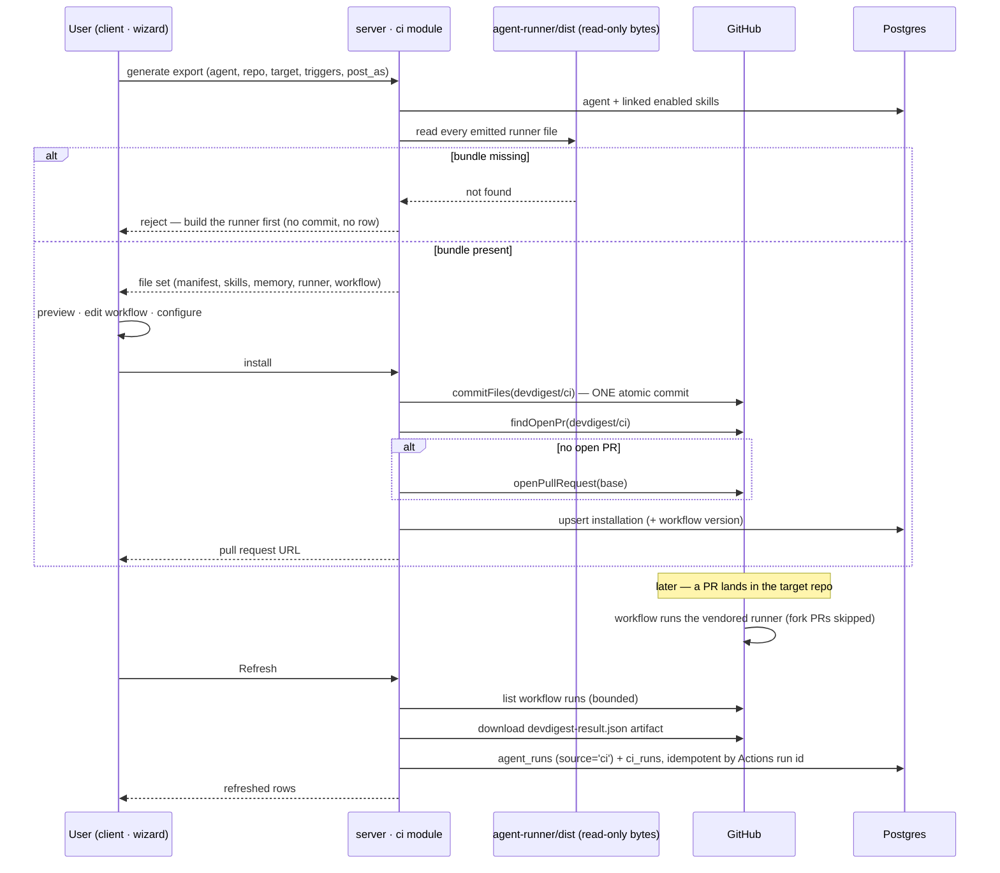

# Spec: Export to CI   |   Spec ID: SPEC-2026-08-03-export-to-ci   |   Status: approved
Supersedes: none

## Problem & why

A reviewer agent that only exists on one laptop is not a team tool. Everything DevDigest can
do today — tune a system prompt, attach skills, pin a gate policy — dies at the edge of the
studio. The moment the agent runs automatically on every pull request in a repository, it stops
being one person's experiment and becomes shared infrastructure.

A "tuned agent" is technically four things: **model + system prompt + linked skills +
settings**. Export serialises exactly those four into a **manifest** — YAML at
`.devdigest/agents/<slug>.yaml` — validated by the **same Zod schema** in the studio and in the
CI runner. One contract, two consumers. There is no "slightly different prompt in CI": the
artifact the runner reads is byte-for-byte the artifact the studio wrote.

Three things make this feature more than a file generator:

1. **It changes the threat model.** In earlier lessons the "lethal trifecta" did not apply to
   local DevDigest: the agent read an untrusted diff and had a powerful engine, but there was no
   exfiltration channel. In CI the channel appears — the same agent reads an untrusted diff
   **and** holds write access to a public pull request, in a runner that can reach the network.
   The generated workflow is therefore the security boundary, and it must be stricter than the
   design mock-up, not equal to it.
2. **The exported config must be reviewed like code.** Nothing lands on the default branch.
   The wizard commits to a `devdigest/ci` branch and opens a pull request.
3. **The runner ships in the PR.** The workflow does **not** reference an external marketplace
   action. The whole reviewer — `reviewer-core` plus the shared contracts, ncc-bundled — is
   vendored into the same pull request and executed directly. What runs is what was reviewed.

**What already exists and is deliberately reused.** The `agent-runner` package is complete and
frozen: it loads and Zod-validates the manifest, reads the linked skills, runs the identical
`reviewer-core` pipeline (`assemblePrompt` / `wrapUntrusted` / `groundFindings`), computes a
deterministic verdict and exit code against the manifest's `ci_fail_on`, posts to the PR, and
writes `devdigest-result.json`. Its `resolvePostAs` already reads `DEVDIGEST_POST_AS` (default
`github_review`), which closes the open question its own author recorded — **zero changes to
`agent-runner` are needed**. The `ci_installations` and `ci_runs` tables have existed since the
initial migration. The `ExportWizardSteps` primitive and the entire
`client/messages/en/ci.json` namespace are pre-scaffolded and unconsumed.

**What exists but is unproven.** The GitHub adapter *contains* `commitFiles` (documented as an
atomic, branch-creating, idempotent Git Data API sequence: blobs → tree → commit → ref),
`openPullRequest` and `findOpenPr` — but **all three have zero callers anywhere in the
repository**. This feature is their **first production consumer**. They are therefore
unverified code that happens to be written, not a trusted building block: their documented
branch-creation, fast-forward and PR-reuse behaviour is a claim in a doc-comment, not an
observed fact. Every acceptance criterion that depends on them (AC-27 – AC-33) is written to be
**verified against a real GitHub repository**, not asserted from a mock alone. A mocked test
proves the ci module calls them correctly; only a real repository proves they work. If reality
diverges from the doc-comments, fixing the adapter is **in scope for this feature** — it is the
consumer that discovers the defect.

**What does not exist.** `server/src/modules/ci/` does not exist — every line of server behaviour
here is new. `ci_installations` and `ci_runs` have **zero readers and zero writers**. The server
has **no GitHub Actions API usage at all**. There is no `/ci-runs` route, no CI tab on the agent
editor, and no `CI Runs` entry in the sidebar's `NAV` array (though the `shell.json` message and
the active-route resolver are already pre-seeded with the `ci-runs` key).

## Goals / Non-goals

- **Goal:** A 4-step Export Wizard (Target → Preview → Configure → Install) launched from
  `Add to CI` on the agent's CI tab, which produces a complete, self-contained CI installation.
- **Goal:** Serialise the agent to a manifest validated by the **same** `AgentManifest` Zod
  schema the runner uses, so studio and CI cannot drift.
- **Goal:** Generate a workflow that is **strictly more secure than the design preview** —
  minimal permissions, secrets from Actions secrets only, no fork-PR execution, no
  comment-driven trigger — and that a user can read line by line and explain.
- **Goal:** Install by committing atomically to a `devdigest/ci` branch and opening a pull
  request. Nothing is ever written to the default branch.
- **Goal:** Ship the bundled `agent-runner` inside the same pull request and invoke it directly.
  No marketplace action, no external `uses:` beyond GitHub's own first-party actions.
- **Goal:** Pull CI results back on an explicit **Refresh** — read GitHub Actions workflow runs,
  download the `devdigest-result.json` artifact, and write both a `ci_runs` row **and** an
  `agent_runs` row with `source='ci'`, reusing the existing run model rather than a parallel one.
- **Goal:** A CI Runs page listing runs that arrived from GitHub, and a CI tab on the agent page
  showing per-repository installations, run history and a `Fail CI on` selector.
- **Non-goal / hard constraint:** **`agent-runner/` is read-only.** Not one file in it is
  created, edited or deleted. The same applies to `reviewer-core/`. The server consumes the
  runner's built `dist/` output as opaque bytes.
- **Non-goal / hard constraint:** the multi-runs module and the PR page/timeline are off-limits.
  `server/src/modules/multi-runs/`, `server/src/modules/reviews/`,
  `client/src/app/multi-agent-review/` and `client/src/app/repos/[repoId]/pulls/` are **not
  touched** by this feature.
- **Non-goal:** CircleCI, Jenkins and Generic CLI generation. All four target cards render per
  the design, but only GitHub Actions produces files; the other three are visibly unavailable
  and cannot be selected (AC-64, AC-65).
- **Non-goal:** Webhook-based ingest. A webhook cannot be verified from a local machine, so the
  only ingest path is a pull triggered by Refresh.
- **Non-goal:** Manual upload of a result file. There is no file-upload ingest path.
- **Non-goal:** A parallel CI run model. Ingest writes through `agent_runs` with `source='ci'`;
  `ci_runs` carries only the CI-specific columns the existing run model has no home for.
- **Non-goal:** Memory. `.devdigest/memory.jsonl` is exported as an **empty file** because the
  design's file tree lists it and the path must exist before a later lesson fills it. The runner
  does not read it today (there is no reference to `memory.jsonl` anywhere in
  `agent-runner/src/`).
- **Non-goal:** Publishing the runner bundle to a registry, versioning it, or diffing an
  installed bundle against the local one. Each export commits the current local bundle.
- **Non-goal:** Blocking merges. The feature *explains* how (set `Fail CI on`, then add a
  required status check in the repo's branch protection) but configures no branch protection
  itself.
- **Non-goal:** Reconciling the other pre-existing divergences between the two vendored
  `@devdigest/shared` copies (`adapters.ts`, `knowledge.ts`, `productionize.ts`, `trace.ts`).
  Only `contracts/eval-ci.ts` is reconciled here (see *Contracts*).
- **Non-goal:** Pruning the dead `publishDialog` i18n key group. See AC-83.

## User stories

- **US-1** — As an agent author, I want to open a wizard from my agent's CI tab and pick a CI
  target, so that deploying the agent is a guided flow rather than hand-written YAML.
  → AC-62 – AC-68
- **US-2** — As an agent author, I want to see every file that will ship — the manifest, the
  skills, the memory file, the runner and the workflow — and edit the workflow before it lands,
  so that nothing is committed to my repo behind my back. → AC-7 – AC-16, AC-69 – AC-72
- **US-3** — As an agent author, I want to choose the PR triggers and how results are posted,
  and to be told how to actually block a merge, so that the automation matches how my team
  works. → AC-73 – AC-76
- **US-4** — As an agent author, I want the install to open a pull request rather than push to
  main, so that the CI configuration is reviewed like any other code. → AC-27 – AC-33, AC-77
- **US-5** — As a security-conscious engineer, I want to read the generated workflow and be able
  to justify every line — permissions, secret handling, fork behaviour, trigger surface — so
  that adding an LLM to CI does not open an exfiltration channel. → AC-17 – AC-26
- **US-6** — As a team member, I want a CI Runs page showing every review that ran in CI, with
  the PR, repository, agent, verdict, findings, cost, duration and a link to the Actions job, so
  that CI reviews are as visible as local ones. → AC-45 – AC-53
- **US-7** — As an agent author, I want the agent's CI tab to show where it is installed, with
  status and workflow version, its CI run history, and a `Fail CI on` selector, so that I can
  manage its deployments from one place. → AC-54 – AC-61
- **US-8** — As a product owner, I want CI runs recorded in the **existing** run model
  (`agent_runs`, `source='ci'`), so that every future per-agent statistic covers CI and local
  runs without a second pipeline or a backfill. → AC-34 – AC-44
- **US-9** — As a user, I want CI Runs reachable from the sidebar and the command palette.
  → AC-79, AC-80

## Acceptance criteria (EARS)

### Data model and contracts

- **AC-1**: The system **shall** persist one CI installation per (agent, repository) pair, and a
  repeated export for the same pair **shall** update that record rather than create a second
  one. _(observable: exporting the same agent to the same repo twice leaves exactly one
  installation row; a database-level uniqueness constraint on the pair exists)_
- **AC-2**: The system **shall** extend the CI installation record to carry, at minimum: the
  chosen `post_as`, the chosen trigger set, the base branch, the **pinned manifest path**, the
  workflow file path, a monotonically increasing **workflow version**, the export pull-request
  URL, and the timestamp of the last successful ingest. _(observable: after an export every one
  of those values is readable from the persisted installation, and the CI tab renders the
  workflow version)_
- **AC-3**: The system **shall** pin the manifest path at first install and **shall** reuse that
  exact path on every subsequent export of the same installation, even after the agent has been
  renamed. _(observable: renaming an agent and re-exporting produces a commit that touches the
  original `.devdigest/agents/<slug>.yaml` path and creates no second manifest file; the
  manifest's `name:` field carries the new name. Rationale: the runner hard-fails when
  `.devdigest/agents/` contains more than one `*.yaml`, and the commit API can add or replace
  files but cannot delete them)_
- **AC-4**: The system **shall** extend the CI run record to carry, at minimum: the owning
  workspace, a nullable reference to the `agent_runs` row it produced, the source GitHub Actions
  run identifier, a snapshot of the agent name, a snapshot of the pull-request title, the run
  duration, and the per-severity finding counts (critical / warning / suggestion) that the CI
  Runs table renders. _(observable: the CI Runs table renders every design column — including the
  three-severity findings cell — from persisted columns with no live GitHub call)_
- **AC-5**: The system **shall** treat the GitHub Actions run identifier as the ingest
  idempotency key, so re-running Refresh over already-ingested runs creates no duplicate rows.
  _(observable: an integration test invoking Refresh three times against the same fixture
  produces exactly one `ci_runs` row and one `agent_runs` row per workflow run)_
- **AC-6**: Every schema change in AC-1 – AC-5 **shall** be produced by the ORM's generate step
  and applied by its migrate step, never hand-authored, and **shall not** be applied on boot.
  _(observable: the diff adds generated SQL under the migrations directory and no
  hand-edited SQL; the app still boots against an unmigrated database exactly as before)_

### The exported file set

- **AC-7**: WHEN an export is generated for a GitHub Actions target, the system **shall**
  produce exactly this file set and no other: the agent manifest at the installation's pinned
  `.devdigest/agents/<slug>.yaml`; one `.devdigest/skills/<slug>.md` per linked **enabled**
  skill; an empty `.devdigest/memory.jsonl`; every file emitted into the runner's build output
  directory, copied verbatim under `.devdigest/runner/`; and the workflow at
  `.github/workflows/devdigest-review.yml`. _(observable: a generation test asserts the exact
  path list for an agent with two skills)_
- **AC-8**: The system **shall** serialise the manifest so that it validates against the
  **same** `AgentManifest` schema the runner uses, carrying the agent's name, provider, model,
  system prompt, the ordered slugs of its linked enabled skills, its strategy, and its
  `ci_fail_on`. _(observable: a test parses the generated YAML with the shared `AgentManifest`
  schema and it succeeds; a deliberately corrupted field fails the same schema)_
- **AC-9**: The system **shall not** write any secret, API key, or token into the manifest or
  any other generated file. _(observable: a test scans every generated file for the configured
  secret values and for the known secret-name patterns and finds none)_
- **AC-10**: The system **shall** derive each file slug from the corresponding entity's name as
  a lowercase, ASCII, hyphen-separated identifier, and WHERE two linked skills would derive the
  same slug **shall** disambiguate deterministically by link order. _(observable: two skills
  named `Secret Leakage Gate` and `secret-leakage gate` produce two distinct, stable filenames
  across repeated generations, and the manifest's `skills` list matches those filenames exactly)_
- **AC-11**: IF an entity's name yields an empty slug, THEN the system **shall** substitute a
  deterministic fallback identifier rather than emitting a file with an empty name.
  _(observable: an agent named only with non-ASCII characters still generates a valid,
  reproducible manifest path)_
- **AC-12**: WHERE an agent has no linked enabled skills, the system **shall** generate no skill
  files and **shall** emit an empty `skills` list in the manifest. _(observable: the generated
  YAML parses cleanly under `AgentManifest` and the exported file set contains no
  `.devdigest/skills/` entry)_
- **AC-13**: The system **shall** copy the runner build output byte-for-byte and **shall not**
  rewrite, minify, rename or reassemble it. _(observable: a test asserts the exported
  `.devdigest/runner/` bytes equal the source build output bytes for every emitted file)_
- **AC-14**: The system **shall** ship **every** file the runner build emits, not only its entry
  file. _(observable: the export includes the entry module, its lazily-imported chunk, and the
  `{"type":"module"}` package marker. Rationale: the bundle resolves its lazy chunk at runtime
  with a relative `import("./" + chunkId + ".index.js")`, so a single-file export would crash the
  moment that code path is reached)_
- **AC-15**: IF the runner build output directory is missing, empty, or unreadable when an export
  is requested, THEN the system **shall** reject the export with an explicit, actionable error
  naming the build step, and **shall not** commit anything, open a pull request, or write an
  installation row. _(observable: on a fresh clone — where the build output is git-ignored and
  therefore genuinely absent — the export request returns an error whose message names the
  runner build command; the repository receives no commit and no installation row exists)_
- **AC-15a**: IF **any** file in the runner build output cannot be read, THEN the system **shall**
  fail the **whole** export and **shall never** commit a partial `.devdigest/runner/` directory.
  _(observable: a test that makes one emitted file unreadable produces a failed export with zero
  commits — not a commit carrying the remaining files. Rationale: this is the single worst
  failure mode in the feature. A pull request containing the entry module without its lazily
  imported chunk **installs perfectly cleanly**, reviews as correct, merges, and then crashes at
  runtime inside the user's CI on the first PR that reaches that code path — a failure that
  surfaces far from its cause, in someone else's repository, with no signal pointing back here.
  Shipping nothing is always better than shipping most of the bundle)_
- **AC-16**: The system **shall** generate `.devdigest/memory.jsonl` as a zero-byte file.
  _(observable: the file is present in the export with empty contents and the manifest does not
  reference it)_

### The generated workflow — security

These criteria are the point of the feature. Each one is independently observable by reading or
parsing the generated YAML.

- **AC-17**: The generated workflow **shall** declare a top-level `permissions:` block granting
  exactly `contents: read` and `pull-requests: write`, and no other permission. _(observable: a
  test parses the generated YAML and asserts the permissions map equals exactly those two
  entries. Note: this is a deliberate divergence — the design preview has no `permissions:` block
  at all, which silently inherits the repository's default token scope)_
- **AC-18**: The generated workflow **shall** obtain the model API key and the GitHub token
  **only** from `secrets.*` interpolation in the job's `env:` block. _(observable: the YAML
  contains no literal key material; every credential-shaped value is a `${{ secrets.… }}`
  expression)_
- **AC-19**: The generated workflow **shall** pass the chosen `post_as` value to the runner as
  the `DEVDIGEST_POST_AS` job environment variable, and **shall not** carry it in the manifest.
  _(observable: the generated `env:` block contains `DEVDIGEST_POST_AS` set to the configured
  value; the manifest contains no `post_as` key. Rationale: the runner already resolves
  `DEVDIGEST_POST_AS` with a `github_review` default, so no runner change is required)_
- **AC-20**: The generated workflow **shall** guard the review job so it does not execute for a
  pull request whose head repository differs from the workflow's own repository — i.e. **a fork
  PR does not run the review at all**. _(observable: the job carries a condition comparing the PR
  head repository full name to the workflow repository; a test asserts the condition's presence
  and exact form. Rationale: GitHub deliberately withholds repository secrets from `pull_request`
  runs originating in a fork, so the job could only ever start with an empty API key and fail
  confusingly. Skipping is the honest behaviour and states the boundary explicitly rather than
  relying on a GitHub default)_
- **AC-21**: The generated workflow's `on:` block **shall** contain only `pull_request`, and
  **shall never** contain `pull_request_target`, `issue_comment`, `pull_request_review_comment`,
  or `workflow_run`. _(observable: a test asserts the trigger key set equals `{pull_request}`;
  comment text therefore has no path to starting a run. Rationale: `pull_request_target` runs
  with a privileged token in the base-repo context, which is exactly the escalation this feature
  must not create; comment triggers make attacker-authored text a command channel)_
- **AC-22**: The generated workflow's checkout step **shall** disable credential persistence, so
  the job token is not left in the working tree for a later step to read. _(observable: the
  checkout step carries `persist-credentials: false`)_
- **AC-23**: The generated workflow **shall** invoke the vendored runner directly by path and
  **shall not** reference any third-party or marketplace action; the only `uses:` entries
  permitted are GitHub's own first-party `actions/*`. _(observable: a test asserts every `uses:`
  value starts with `actions/` and that no `uses:` names a DevDigest action)_
- **AC-24**: The generated workflow **shall** bound the review job with an explicit
  `timeout-minutes`. _(observable: the job carries a timeout; a runner that hangs cannot occupy
  a runner indefinitely)_
- **AC-25**: The generated workflow **shall** declare a per-pull-request concurrency group with
  in-progress cancellation, so a rapid series of pushes does not fan out into parallel paid model
  calls on the same PR. _(observable: the YAML carries a `concurrency` block keyed by the PR
  number with `cancel-in-progress: true`)_
- **AC-26**: The generated workflow **shall** upload `devdigest-result.json` as a build artifact
  under a fixed, known name, unconditionally (including when the review step failed), with
  compression disabled and a non-fatal "no files found" behaviour. _(observable: the upload step
  is present with a stable artifact name, an always-run condition, and no-compression; a run
  whose review step hard-failed still completes without the upload step erroring)_

**The generated workflow, in full.** `{TRIGGERS}` and `{POST_AS}` are the only values the
Configure step substitutes; `{WORKFLOW_VERSION}` is the installation's version counter. Every
comment below ships in the generated file — the user must be able to explain every line.

```yaml
# Generated by DevDigest · Export to CI · workflow v{WORKFLOW_VERSION}
# Safe to edit: re-exporting this agent replaces this file.
name: DevDigest Review

# ONLY pull_request. Never pull_request_target (it would run with a privileged
# token in the base-repo context) and never issue_comment or any other
# comment-driven trigger — comment text is attacker-controlled input, never a
# command channel.
on:
  pull_request:
    types: [{TRIGGERS}]

# Least privilege. contents:read to check out .devdigest/, pull-requests:write
# to post the review. Nothing wider "just in case".
permissions:
  contents: read
  pull-requests: write

# One review in flight per PR; a new push cancels the previous run.
concurrency:
  group: devdigest-review-${{ github.event.pull_request.number }}
  cancel-in-progress: true

jobs:
  review:
    # A PR from a fork receives NO repository secrets, so the review could only
    # start with an empty API key and fail. Skip it outright and say so.
    if: github.event.pull_request.head.repo.full_name == github.repository
    runs-on: ubuntu-latest
    timeout-minutes: 15
    steps:
      - name: Check out the pull request
        uses: actions/checkout@v4
        with:
          # Do not leave the job token in .git/config for a later step to read.
          persist-credentials: false

      - name: Set up Node
        uses: actions/setup-node@v4
        with:
          node-version: 22

      - name: Run DevDigest review
        # The reviewer is vendored in this repository under .devdigest/runner/
        # and was reviewed in the same pull request that added this file. No
        # marketplace action, so nothing outside this repo can change what runs.
        # The runner takes no CLI flags — everything is passed as env.
        run: node .devdigest/runner/index.js
        env:
          # Credentials come from this repository's Actions secrets ONLY. They
          # appear in no committed file and in no agent manifest.
          OPENROUTER_API_KEY: ${{ secrets.OPENROUTER_API_KEY }}
          GITHUB_TOKEN: ${{ secrets.GITHUB_TOKEN }}
          GITHUB_REPOSITORY: ${{ github.repository }}
          PR_NUMBER: ${{ github.event.pull_request.number }}
          DEVDIGEST_POST_AS: {POST_AS}

      - name: Upload result
        if: always()
        uses: actions/upload-artifact@v4
        with:
          name: devdigest-result
          path: devdigest-result.json
          if-no-files-found: warn
          compression-level: 0
```

### Install — commit and pull request

Every criterion in this group rides on `commitFiles`, `findOpenPr` and `openPullRequest`, which
have **no existing callers** (see *What exists but is unproven*). A mock only proves the ci
module calls them with the right arguments; it cannot prove they behave as their doc-comments
claim. Each observable below therefore names a **real-repository** verification as its primary
evidence, with the mocked assertion as a secondary regression guard. A single throwaway GitHub
repository exercised once, end to end, satisfies all of them together.

- **AC-27**: WHEN the user confirms `Open a PR with these files`, the system **shall** write all
  generated files as **one atomic commit** onto the branch `devdigest/ci`, creating that branch
  from the configured base when it does not exist. _(observable: against a real repository, the
  branch is created and its history shows exactly one new commit containing every generated
  file — not one commit per file, and not a partial tree)_
- **AC-28**: The system **shall never** commit to the repository's default branch.
  _(observable: an integration test with a mocked GitHub client asserts every commit targets
  `devdigest/ci`; the default branch's tip is unchanged)_
- **AC-29**: WHERE the `devdigest/ci` branch already exists, the system **shall** advance it with
  a new commit layered on its current tip rather than failing or discarding unrelated files.
  _(observable: against a real repository, a second export onto the existing branch preserves an
  unrelated file added to that branch between the two exports and adds the new commit on top —
  this is the specific behaviour a mock cannot demonstrate, since it depends on the adapter
  genuinely reading the existing tree as its base)_
- **AC-30**: WHERE an open pull request already exists for `devdigest/ci`, the system **shall**
  reuse it and **shall not** attempt to open a second one; the response **shall** carry that
  existing pull request's URL. _(observable: against a real repository, a second export returns
  the first PR's URL and the repository still shows exactly one open PR for the branch; the
  mocked test additionally asserts zero additional create-PR calls)_
- **AC-31**: WHERE no open pull request exists for `devdigest/ci`, the system **shall** open one
  against the configured base branch. _(observable: against a real repository, exactly one pull
  request appears with the configured base, and its URL is persisted on the installation)_
- **AC-32**: WHEN an install completes, the system **shall** persist or update the installation
  record (AC-1, AC-2) and increment its workflow version. _(observable: a second export of the
  same pair leaves one row whose workflow version has increased by one)_
- **AC-33**: IF the commit or the pull-request call fails, THEN the system **shall** surface the
  underlying failure to the user and **shall not** record a successful installation.
  _(observable: a mocked GitHub failure yields a 4xx/5xx with a readable message and no
  installation row, or an unchanged pre-existing row)_

### Ingest — pull on Refresh

- **AC-34**: WHEN the user activates **Refresh**, the system **shall** pull results from GitHub
  by listing the workflow runs of the installed workflow, downloading the
  `devdigest-result.json` artifact of each not-yet-ingested run, and persisting the result.
  _(observable: an integration test with a mocked GitHub client observes the list-runs call, the
  artifact download, and the resulting rows)_
- **AC-35**: The system **shall not** ingest via a webhook and **shall not** accept an uploaded
  result file. _(observable: no webhook route and no upload route exists; the diff introduces
  neither)_
- **AC-36**: WHEN a result is ingested, the system **shall** write an `agent_runs` row with
  `source='ci'` carrying that run's agent, duration, cost and findings count, **and** a `ci_runs`
  row linked to it. _(observable: after ingest, a query for `agent_runs` with `source='ci'`
  returns the run, and its `ci_runs` row references it)_
- **AC-37**: The system **shall not** introduce a second, parallel run model for CI.
  _(observable: no new "ci run execution" table is added; `ci_runs` holds only the CI-specific
  columns `agent_runs` has no home for)_
- **AC-38**: WHERE the ingested pull-request number resolves to a pull request already known to
  the workspace for that repository, the system **shall** link the `agent_runs` row to it;
  otherwise it **shall** leave that link empty and still persist the run. _(observable: ingesting
  a result for an un-imported PR still yields both rows, with the pull-request reference null)_
- **AC-39**: The system **shall** validate every downloaded artifact against the shared
  `CiResultArtifact` schema before persisting anything from it. _(observable: a malformed
  artifact fixture is rejected and produces no row)_
- **AC-40**: IF a workflow run has no `devdigest-result.json` artifact — because the review step
  hard-failed, was skipped as a fork PR, or was cancelled — THEN the system **shall** record the
  run with a `failed` (or, for a skipped job, a non-ingested) outcome derived from the workflow
  run's own conclusion, and **shall not** abort the whole Refresh. _(observable: a fixture batch
  containing one artifact-less run and two good runs ingests all three deterministically and
  reports the artifact-less one as failed)_
- **AC-41**: IF the artifact is present but malformed, oversized, or not extractable, THEN the
  system **shall** record that run as `failed` with a readable reason and continue with the rest
  of the batch. _(observable: a truncated-archive fixture yields one failed row and does not
  prevent the other runs from ingesting)_
- **AC-42**: IF no GitHub token is configured, THEN Refresh **shall** fail with the existing
  configuration-error contract naming `GITHUB_TOKEN`, and **shall** change no data.
  _(observable: with the secret cleared, Refresh returns the configuration error and the run
  tables are unchanged)_
- **AC-43**: IF the configured GitHub token is rejected by the Actions API for insufficient
  scope, THEN the system **shall** surface a distinct, actionable error stating that the token
  needs **Actions read** access in addition to repository access, rather than a generic failure.
  _(observable: a mocked 403 from the Actions API produces an error message naming the missing
  Actions read permission; the export/commit path, which does not need that scope, keeps working)_
- **AC-44**: The system **shall** bound one Refresh to a fixed maximum number of workflow runs
  per installation, defined as a **named constant**. _(observable: the constant exists and is
  referenced by the ingest path; a fixture with more runs than the cap ingests exactly the cap's
  worth, newest first)_

### Screen — CI Runs page

- **AC-45**: The system **shall** serve a CI Runs page headed `CI Runs` with the muted sub-line
  `Agent reviews executed inside CI · not local runs`, using the pre-scaffolded `ci.runs.*`
  messages. _(observable: matches the CI Runs screen; no `MISSING_MESSAGE` warning is emitted)_
- **AC-46**: The system **shall** render the runs table with the design's columns in the design's
  order: `Timestamp`, `Pull request`, `Agent`, `Source`, `Dur.`, `Findings`, `Cost`, `Status`,
  and a trailing action cell. _(observable: matches the CI Runs screen field-for-field)_
- **AC-47**: The system **shall** render the `Pull request` cell as the monospace accent-coloured
  `#<number>` followed by the pull-request title, truncated with an ellipsis, and WHERE no title
  is known **shall** render `#<number>` alone rather than placeholder text. _(observable: a run
  ingested for an un-imported PR shows the number with no fabricated title)_
- **AC-48**: The system **shall** render the `Findings` cell as one severity-coloured
  icon-plus-count pair per non-zero severity among critical, warning and suggestion, and as `—`
  when all three are zero or unknown. _(observable: matches the design's `CIFindingsCell`; a
  zero-finding run renders `—`, never `0`)_
- **AC-49**: The system **shall** render the `Status` cell as a dotted badge using the design's
  three states — `Succeeded`, `No findings`, `Failed` — plus `Running` for a workflow run that
  has not yet concluded, each drawn from the pre-scaffolded `ci.runs.status.*` messages.
  _(observable: matches the design; the four states are distinguishable by text, not only colour)_
- **AC-50**: The system **shall** render the trailing action cell as a link that opens the GitHub
  Actions job for that run in a new tab. _(observable: the link's target is the workflow run's
  GitHub URL as persisted at ingest)_
- **AC-51**: The system **shall** render the filter chip row from the design — a date-range chip,
  an agent chip, a repository chip, a status chip and a source chip — using the pre-scaffolded
  `ci.runs.filters.*` messages. _(observable: matches the design's chip row)_
- **AC-52**: The system **shall** render a `Refresh` control that triggers the GitHub pull of
  AC-34, and **shall** show a distinct in-progress state while that pull is running.
  _(observable: activating Refresh issues the ingest request and the control renders its
  `ci.runs.refreshing` state until it settles)_
- **AC-53**: IF the workspace has no CI runs at all, THEN the system **shall** render the
  design's empty state — icon, `No CI runs yet`, the explanatory body, and a call to action that
  leads to setting up CI for an agent — instead of an empty table shell. _(observable: matches
  the design's empty CI Runs screen)_

### Screen — agent CI tab

- **AC-54**: The system **shall** add a `CI` tab to the agent editor, positioned last, and
  **shall** keep its key consistent across all three places an agent-editor tab key is consumed —
  the route's valid-tab list, the editor's tab constant, and the editor's render switch — so the
  tab is reachable by direct URL and renders when selected. _(observable: navigating directly to
  the agent page with the CI tab selected renders the CI tab; this triad has previously broken
  silently past typecheck)_
- **AC-55**: WHERE the agent has no CI installation, the CI tab **shall** render the design's
  empty state — icon, `Not in CI yet`, the explanatory body, and an `Add to CI` action that opens
  the Export Wizard. _(observable: matches the design's `CITab` empty branch)_
- **AC-56**: WHERE the agent has at least one installation, the CI tab **shall** render the
  header row `CI deployment` with a dotted badge reading the active-repository count, and the
  right-aligned `Update CI config` and `Add to CI` actions. _(observable: matches the design)_
- **AC-57**: The system **shall** render one row per installation carrying the repository full
  name in monospace, the target-type badge, a status badge derived from that installation's most
  recent CI run, the workflow version, and a relative "last activity" timestamp. _(observable:
  matches the design's repository rows, extended with the workflow version)_
- **AC-58**: WHERE an installation has no ingested run yet, its status **shall** render as an
  explicit pending state rather than a success or failure. _(observable: a freshly installed
  repository shows the pending state until the first Refresh ingests a run)_
- **AC-59**: The system **shall** render the `Fail CI on` card with the design's three options —
  `Critical`, `Warning +`, `Never` — bound to the agent's existing gate-policy field, and
  changing it **shall** persist immediately. _(observable: matches the design; reloading the page
  preserves the selection)_
- **AC-60**: WHERE the agent's gate policy has changed since the most recent export of an
  installation, the CI tab **shall** show an explicit drift notice on that installation stating
  that CI still runs the previously exported policy until the agent is re-exported.
  _(observable: changing `Fail CI on` on an installed agent surfaces the notice; re-exporting
  clears it. Rationale: the gate policy travels inside the committed manifest, so a studio-side
  change has no effect in CI until a new pull request lands — silently implying otherwise would
  be a lie)_
- **AC-61**: The system **shall** render a trailing dashed `Add repository` control that opens
  the Export Wizard. _(observable: matches the design)_

### Screen — the Export Wizard

- **AC-62**: WHEN the wizard opens, the system **shall** render it as a modal of width 720
  titled `Export to CI` with the subtitle `Run <agent name> automatically on pull requests`, a
  four-label step indicator (`Target`, `Preview`, `Configure`, `Install`) reusing the existing
  `ExportWizardSteps` primitive, and a footer carrying `Back` (from step 2 onward) and
  `Continue` / `Install`. _(observable: matches the design's `ExportWizard`; no second step
  indicator component is introduced)_
- **AC-63**: The system **shall** render the Target step as a two-column grid of four cards —
  GitHub Actions, CircleCI, Jenkins, Generic CLI — each with its icon tile, name and description
  from the pre-scaffolded `ci.exportWizard.targets.*` messages, with a `recommended` badge on
  GitHub Actions. _(observable: matches the design's `CI_TARGETS` grid)_
- **AC-64**: The system **shall** render the CircleCI, Jenkins and Generic CLI cards in a
  visibly unavailable state — reduced-emphasis text and icon, a `coming soon` marker in place of
  the `recommended` badge slot, and a non-interactive cursor — and **shall** expose them as
  programmatically disabled. _(observable: matches the design's layout with the three cards
  visually de-emphasised; each is `disabled`/`aria-disabled` and carries an accessible
  explanation)_
- **AC-65**: IF the user activates a CircleCI, Jenkins or Generic CLI card, THEN the system
  **shall** leave the selection on GitHub Actions and **shall not** advance the wizard.
  _(observable: a test clicking each disabled card records no selection change and no step
  change)_
- **AC-66**: The system **shall** require a target repository chosen from the **repositories
  already in the caller's workspace**, presented with the pre-scaffolded
  `ci.exportWizard.repoLabel` / `repoHint` copy. _(observable: the control offers only workspace
  repositories; a repository outside the workspace cannot be selected. Rationale and deviation:
  the pre-scaffolded copy implies free text, but a free-text repository would let any caller aim
  the server's GitHub token at any repository that token can write to — the target is therefore
  constrained to the workspace, and the copy is reused for a constrained control)_
- **AC-67**: IF the agent's provider is not the one the runner can execute, THEN the system
  **shall** block the export at the Target step with an explicit inline explanation and **shall**
  disable `Continue`. _(observable: an agent configured for a provider the runner does not
  construct cannot be exported, and the message names the required provider. Rationale: the
  runner unconditionally constructs an OpenRouter provider from `OPENROUTER_API_KEY`, so any
  other provider would produce a confusing runtime failure inside someone else's CI)_
- **AC-68**: IF the chosen repository already has an installation for a **different** agent,
  THEN the system **shall** block the export with an explicit explanation and **shall not**
  commit anything. _(observable: attempting to install a second agent into an already-installed
  repository is refused with a message naming the installed agent. Rationale: the runner
  hard-fails when `.devdigest/agents/` holds more than one manifest, and the commit path cannot
  delete the existing one — so one agent per repository is a hard limit of this iteration, not a
  UI preference)_
- **AC-69**: The system **shall** render the Preview step as a two-pane layout — a
  `FILES TO CREATE` tree on the left over the exact file set of AC-7, and the selected file's
  contents on the right with its path in monospace in the pane header. _(observable: matches the
  design's `EXPORT_TREE` / preview pane)_
- **AC-70**: The system **shall** render the workflow file with an `editable` badge and allow the
  user to edit its contents in place; every other file **shall** be read-only.
  _(observable: only the workflow pane accepts input; the manifest, skills, memory and runner
  panes do not)_
- **AC-71**: The system **shall not** render the runner bundle's contents; those tree entries
  **shall** show a size/binary placeholder instead. _(observable: selecting a runner file shows
  the placeholder and the browser does not receive ~1.6 MB of bundle text)_
- **AC-72**: IF the user edits the workflow and then changes any Configure-step option, THEN the
  system **shall** regenerate the workflow from the new configuration and **shall** show an
  explicit inline notice that the manual edit was replaced. _(observable: editing then changing a
  trigger yields regenerated YAML plus the notice — the edit is never silently discarded and
  never silently retained)_
- **AC-73**: The system **shall** render the Configure step's `Trigger` field as chips for
  `pull_request:opened`, `pull_request:synchronize` and `pull_request:reopened`, with the first
  two active by default and `reopened` optional. _(observable: matches the design; the generated
  `types:` list reflects the active chips)_
- **AC-74**: The system **shall** keep `pull_request:opened` and `pull_request:synchronize`
  mandatory, so the trigger set can never become empty. _(observable: those two chips cannot be
  deselected; only `reopened` toggles)_
- **AC-75**: The system **shall** render `Post results as` as three radio options — `GitHub
  review` (marked `recommended`), `PR comment`, and `None (exit code only)` — defaulting to
  `GitHub review`, and **shall** state that it is the only option that yields a verdict.
  _(observable: matches the design; the chosen value reaches the workflow as `DEVDIGEST_POST_AS`
  per AC-19)_
- **AC-76**: The system **shall** render the design's information card explaining that blocking
  merges requires setting `Fail CI on` and adding a required status check in the repository's
  branch protection, and that no GitHub App is needed. _(observable: matches the design's info
  card copy)_
- **AC-77**: The system **shall** render the Install step's primary card `Open a PR with these
  files`, marked `recommended`, naming the target repository and the file count, which performs
  the install of AC-27 – AC-33 and, on success, surfaces the resulting pull-request URL.
  _(observable: matches the design; the success state offers a link to the opened PR)_
- **AC-78**: The system **shall** render the secondary `Copy files as a zip` card as the degraded
  manual path, producing an archive of the same generated file set without contacting GitHub.
  _(observable: the download contains exactly the AC-7 file set and a mocked GitHub client records
  zero calls)_

### Navigation and i18n

- **AC-79**: The system **shall** add exactly one sidebar entry, `CI Runs`, under the existing
  `GLOBAL` section, and **shall** keep its key consistent across the nav definition, the shell
  messages and the active-route resolver. _(observable: the entry highlights when the CI Runs
  page is open and the console emits no `MISSING_MESSAGE`; the shell message and the resolver
  entry for this key already exist and must be matched, not duplicated)_
- **AC-80**: WHEN the user opens the command palette, the system **shall** offer `CI Runs` as a
  go-to command. _(observable: the palette lists it and navigating via it works)_
- **AC-81**: The system **shall** consume the pre-scaffolded `ci` message namespace rather than
  introducing a parallel namespace for the same strings. _(observable: the CI screens read from
  the existing `ci` namespace; no second CI message file is created)_
- **AC-82**: The system **shall not** rename or repurpose any existing key in the `ci` namespace;
  new strings **shall** be added as new keys. _(observable: the diff to the message file is
  additive)_
- **AC-83**: The `publishDialog` key group **shall** remain unused and unreferenced, and
  **shall not** be deleted. _(observable: no component reads `ci.publishDialog.*`; the keys stay
  in place. Rationale: it is a rudiment of an earlier, simpler publish flow that the wizard
  replaces; pruning dead i18n is a separate housekeeping concern and deleting it here would widen
  this feature's diff for no behavioural gain)_

## Edge cases

- **Runner bundle was never built.** `agent-runner/dist/` is git-ignored, so **every fresh clone
  starts without it** — this is the default state of a new checkout, not a rare accident. The
  observable failure is a missing/empty build-output directory at export time. The export is
  rejected with an actionable error naming the build command; nothing is committed, no PR is
  opened, and no installation row is written. → AC-15
- **Runner bundle is partially readable** → the export fails whole; **a partial
  `.devdigest/runner/` directory is never committed**. Shipping the entry module without its
  lazily imported chunk would produce a PR that installs cleanly, reviews as correct, and then
  crashes at runtime in the user's CI — the worst failure mode available here, because it
  surfaces in someone else's repository with nothing pointing back at this export. → AC-15a
- **Runner bundle emits more than one file** — today three: the entry module, a lazily imported
  chunk, and a `{"type":"module"}` marker → all emitted files ship under `.devdigest/runner/`,
  discovered by reading the directory rather than by a hard-coded list, since the chunk's name is
  build-generated and can change. A single-file export would break the runtime relative chunk
  import. → AC-14, AC-13
- **No GitHub token configured** → export and Refresh both fail with the existing configuration
  error contract naming `GITHUB_TOKEN`; no partial state. → AC-42, AC-33
- **Token lacks Actions read scope** → export/commit still works; Refresh fails with a distinct
  message naming the missing Actions permission. → AC-43
- **Fork pull request** → the workflow job is skipped by its own condition; no secrets are
  exposed and no review runs. Refresh sees a skipped workflow run with no artifact and records it
  as non-ingested rather than failed. → AC-20, AC-40
- **`devdigest/ci` branch already exists** → the commit is layered onto its tip; unrelated files
  on that branch survive. → AC-29
- **A pull request for `devdigest/ci` is already open** → it is reused and its URL returned; no
  second PR. → AC-30
- **The `devdigest/ci` branch exists but its PR was merged or closed** → a new pull request is
  opened for the same branch. → AC-31
- **Repository has no `OPENROUTER_API_KEY` Actions secret set** → the workflow still installs; the
  CI job fails at the first model call and Refresh ingests it as a failed run. The Install step
  states the secret must be added. Accepted: the studio does not and cannot verify the target
  repository's secrets. → AC-40, AC-77
- **Artifact missing** (review step hard-failed, cancelled, or job skipped) → the run is recorded
  from the workflow run's own conclusion and the batch continues. → AC-40
- **Artifact malformed, oversized, or not extractable** → that run is recorded as failed with a
  reason; the rest of the batch ingests. → AC-39, AC-41
- **Agent has no linked skills** → no skill files; manifest carries an empty `skills` list, which
  the runner's schema accepts. → AC-12
- **Agent has linked skills that are disabled** → they are excluded from both the manifest and
  the exported files, matching how a local run assembles skills. → AC-7
- **Two linked skills derive the same slug** → deterministic disambiguation by link order; the
  manifest list and the filenames stay in agreement. → AC-10
- **Agent or skill name yields an empty slug** → deterministic fallback identifier. → AC-11
- **Agent is renamed after installation** → the pinned manifest path is reused; no second
  manifest file appears; the manifest's `name` field updates. → AC-3
- **A second, different agent is exported to an already-installed repository** → refused with an
  explanation. One agent per repository is a hard limit this iteration. → AC-68
- **Agent's provider is not the one the runner constructs** → export blocked at the Target step
  with an explanation. → AC-67
- **The user changes `Fail CI on` after installing** → the studio value updates immediately, the
  installation shows a drift notice, and CI keeps the previously exported policy until
  re-export. → AC-59, AC-60
- **The user edits the workflow YAML then goes back and changes a trigger** → the workflow is
  regenerated and an explicit notice says the manual edit was replaced. → AC-72
- **Ingested result references a pull request that was never imported into DevDigest** → both
  rows are still written, with an empty pull-request link and `#<number>` rendered without a
  title. → AC-38, AC-47
- **Refresh run twice over the same workflow runs** → idempotent; no duplicate rows. → AC-5
- **An installation accumulates more workflow runs than the per-refresh cap** → the newest cap's
  worth ingest; the remainder ingest on subsequent refreshes. → AC-44
- **An agent is deleted after installation** → the installation cascades away with the agent
  (existing foreign-key behaviour); already-ingested `ci_runs` rows survive with their snapshotted
  agent name and their `agent_runs` row's nullable agent reference. Accepted: no historical
  installation record is retained.
- **The workspace has installations but no ingested run yet** → the CI Runs page shows its empty
  state; each installation shows the pending status. → AC-53, AC-58
- **A workflow run is still in progress at Refresh time** → it is recorded/rendered as `Running`
  and re-checked on the next Refresh. → AC-49
- **A CircleCI / Jenkins / Generic CLI card is clicked** → nothing happens; the wizard does not
  advance and the selection stays on GitHub Actions. → AC-65
- **The exported PR itself triggers the workflow** → the review runs but the diff excludes
  DevDigest's own exported paths, because the runner already strips them before parsing.
  Accepted: no additional path filter is added to the workflow.
- **A CI run's cost is unknown** (provider exposes no usage) → the `Cost` cell renders `—`,
  never `$0.00`. → AC-46
- **A CI run reports zero findings across all severities** → the `Findings` cell renders `—` and
  the status renders `No findings`. → AC-48, AC-49
- **The agent's gate policy is the fourth stored value (`any`) rather than one of the design's
  three options** → the `Fail CI on` selector renders with no option active until the user picks
  one; the stored value is not silently rewritten. Accepted: the design offers three options and
  the fourth is not reachable from this surface. → AC-59

## Non-functional

- **Least privilege is a hard requirement, not a default.** The generated workflow's permission
  set is exactly `contents: read` + `pull-requests: write` (AC-17). This is a deliberate,
  security-driven divergence from the design preview, which declares no `permissions:` block at
  all and therefore inherits whatever the repository's default token scope happens to be.
- **No secret ever reaches a committed file.** Credentials exist only as `${{ secrets.… }}`
  expressions in the workflow (AC-18) and are asserted absent from every generated file (AC-9).
- **Fork isolation is explicit.** Fork PRs are skipped by an in-workflow condition (AC-20) rather
  than relying on GitHub's implicit secret withholding.
- **The trigger surface is `pull_request` only** (AC-21). No comment-driven trigger and no
  `pull_request_target`, so attacker-authored text has no path to starting a run.
- **Generation latency:** producing the full file set (excluding the runner byte copy and any
  network call) **shall** complete in under 500 ms at p95 for an agent with up to 10 linked
  skills.
- **Install latency:** the full install — generate, commit, resolve-or-open PR — **shall**
  complete in under 10 s at p95 against a responsive GitHub API, and the client **shall** render
  a distinct in-progress state for its whole duration.
- **Ingest bounds:** one Refresh **shall** process at most a named-constant number of workflow
  runs per installation (AC-44), **shall** reject any downloaded artifact larger than 256 KB as
  malformed (AC-41), and **shall** complete in under 20 s at p95 for a full cap-sized batch.
- **Rate limiting:** the export/install route and the ingest route each **shall** carry an
  explicit per-route limit no looser than 6 requests/minute, because both make outbound
  authenticated GitHub calls. Read routes inherit the global bucket.
- **CI Runs read latency:** the runs list **shall** be served in under 300 ms at p95 for up to
  200 rows on local Postgres.
- **Client refresh semantics:** the CI Runs page auto-refreshes its **read** of the local table
  every 30 s while mounted and the tab is visible, and stops when hidden. The **pull from
  GitHub** happens only on an explicit Refresh (AC-34, AC-52). The design's `auto-refresh on`
  indicator therefore describes the local re-read, not a background GitHub poll — this nuance is
  recorded so the indicator is not read as a promise the feature does not keep.
- **Repository payload size:** each export adds roughly 1.6 MB of runner bundle to the target
  repository. This is the accepted cost of a self-contained, reviewable runner with no
  marketplace dependency, and it is stated on the Install step.
- **No new model calls.** This feature makes zero LLM calls of its own. Every model call happens
  inside the target repository's CI, paid for by that repository's own secret.
- **Accessibility (WCAG 2.1 AA):** the wizard's step indicator exposes the current step
  programmatically; disabled target cards are `disabled`/`aria-disabled` with an accessible
  explanation of why (AC-64); the `Fail CI on` segmented control exposes its selected state; the
  editable workflow field has an accessible label; every status conveyed by a coloured dot or
  severity colour in the CI Runs table is **also** conveyed by adjacent text (AC-48, AC-49); the
  modal traps focus and is dismissible by keyboard.
- **Migration discipline:** schema changes are produced by the ORM's generate step and applied by
  its migrate step; migrations are not applied on boot and the generated SQL is never hand-edited
  (AC-6).

## Cross-module interactions

Packages involved: **server** (`@devdigest/api`) and **client** (`@devdigest/web`), plus the
hand-vendored `@devdigest/shared` contracts that exist as two copies. **`agent-runner/` and
`reviewer-core/` are read-only inputs** — the server reads the runner's build output as bytes and
imports nothing from it. `mcp-server/` and `e2e/` are untouched. The third party in this
interaction is **GitHub** — both as a write target (branch, commit, pull request) and as a read
source (Actions workflow runs and artifacts).



**What crosses each boundary.**

- *Client → server:* the export request (agent id, target repository, target type, trigger set,
  `post_as`, base branch, and the optionally hand-edited workflow contents); the install
  confirmation; the Refresh trigger; and read requests for installations and runs.
- *Server → client:* the generated file set (path + contents + editability per file), the
  installation record with its pull-request URL and workflow version, and the CI run rows.
- *Server → GitHub:* one atomic commit onto `devdigest/ci`, a pull-request creation, and read
  calls against the Actions runs/artifacts API.
- *Server → filesystem:* a read-only read of the runner build output. Nothing is written there.
- *GitHub → server:* workflow-run metadata and the `devdigest-result.json` artifact — **untrusted
  input**, validated before use.

**Failure contract.**

- Generation is all-or-nothing: a missing **or partially readable** runner bundle, a blocked
  provider, or a repository already claimed by another agent rejects the whole request and writes
  nothing (AC-15, AC-15a, AC-67, AC-68). "Partially readable" is called out separately because a
  half-shipped bundle is the one failure that would *succeed* here and fail later, in someone
  else's CI.
- Install is transactional from the user's perspective: the commit is a single atomic commit; if
  the commit or the PR call fails, no successful installation is recorded (AC-27, AC-33). The
  three adapter methods this relies on have never run in production (see *What exists but is
  unproven*), so this contract is a **requirement to be demonstrated against a real repository**,
  not an inherited guarantee; repairing the adapter if it does not hold is in scope.
- Ingest is per-run resilient: one unreadable artifact or one artifact-less workflow run fails
  only that run and never aborts the batch (AC-40, AC-41). A missing token or an
  insufficient-scope token fails the whole Refresh with a specific, actionable error and changes
  no data (AC-42, AC-43).
- The `Fail CI on` control and the exported manifest can legitimately disagree between exports;
  that disagreement is surfaced, never hidden (AC-60).

**A new capability is required from the GitHub adapter.** The server today has no Actions API
usage whatsoever. Ingest needs the ability to list a workflow's runs, list a run's artifacts, and
download an artifact's archive. These belong on the existing GitHub client abstraction reached
through the container — not constructed ad hoc — so the ingest path stays mockable, and the
existing mock client must gain the same capability for tests.

## Contracts

Shapes only — no implementation.

**Vendored-contract reconciliation (mandatory, and a first-class part of this feature).** The two
hand-maintained copies of `@devdigest/shared` have **diverged** in
`contracts/eval-ci.ts` by 33 lines: the server copy defines `AgentManifest` (and imports
`Provider` / `CiFailOn` for it) and allows `openrouter` in `ConformanceInput.provider`; the client
copy has neither. This predates all current work. The wizard needs those types client-side, so:

- The two copies of `contracts/eval-ci.ts` **shall** be brought to byte-identical parity by
  adopting the **server copy as the source of truth** (it is the superset, and it is the copy the
  runner already consumes through a path alias).
- Both prerequisite symbols (`Provider`, `CiFailOn`) already exist in **both** copies of
  `contracts/knowledge.ts`, so the reconciliation needs no other file.
- Both copies **shall** then receive every change below in lock-step, in the same commit.
- The other pre-existing divergences (`adapters.ts`, `knowledge.ts`, `productionize.ts`,
  `trace.ts`) are **out of scope** and must not be touched. `adapters.ts` in particular is
  server-only infrastructure: no client file imports any adapter interface, so the Actions-API
  capability added to the GitHub client abstraction is a **server-side-only** change and carries
  no client mirroring obligation. This exemption is stated explicitly so a reviewer does not
  read it as a missed sync.

**Unchanged and reused as-is.** `CiTarget`, `CiFile`, `CiInstallation`, `CiExport`,
`CiRunStatus`, `CiExportInput` (already carries `repo`, `target`, `action`, `post_as`, `triggers`,
`base`) and — critically — **`AgentManifest`** and **`CiResultArtifact`**, which are frozen
because `agent-runner` consumes them. Nothing in this feature may change either.

**Changed — the CI export input.** Gains one optional field:

| Field | Direction | Optionality | Note |
|---|---|---|---|
| workflow override | client → server | optional string | the user's hand-edited workflow contents; absent means "generate it" (AC-70) |

**Changed — the CI installation record.** Gains the fields AC-2 requires: `post_as`, the trigger
set, the base branch, the pinned manifest path, the workflow path, the workflow version, the
export pull-request URL, the last-ingest timestamp, and a derived status plus last-activity
timestamp for the CI tab's rows.

**Changed — the CI run record (`CiRun`).** The existing shape already declares `agent` and
`duration_s` as fields that have **no backing columns** — that gap is closed by the migration
(AC-4). It additionally gains the per-severity counts (`critical`, `warning`, `suggestion`,
each optional) that the design's findings cell renders, a repository identifier, and the
identifier of the `agent_runs` row it produced.

**New — the CI runs list response.** The rows above plus whatever the filter chips need to be
populated (the distinct agents and repositories present in the result set), so the page fills its
chip row in one round trip.

**New — the export generation response.** The ordered file set — each entry a path, its contents
(or a placeholder marker for the runner bundle, per AC-71), and its editability — plus the
resolved target repository and the count of files, so the Preview and Install steps render
without a second request.

**New — the ingest response.** A per-refresh summary: how many workflow runs were examined, how
many were newly ingested, how many were skipped as already known, and a per-run list of failures
with reasons, so the client can report a partial success honestly rather than as a flat "done".

**Data model change (server persistence).**

- `ci_installations` gains the columns of AC-2, plus a **unique constraint on (agent, repository)**
  (AC-1). Its owning workspace is added as an explicit column so installation reads are
  workspace-scoped directly rather than through a join.
- `ci_runs` gains the columns of AC-4: owning workspace, a nullable reference to `agent_runs`, the
  GitHub Actions run identifier (unique per installation, AC-5), an agent-name snapshot, a
  pull-request-title snapshot, a duration, and the three per-severity counts.
- **`agent_runs` is not altered.** Its `source` column already accepts `'ci'` with a `'local'`
  default, its pull-request and agent references are already nullable, and its duration / cost /
  findings-count / score columns already exist. Ingest writes into that existing shape — this is
  the reuse the brief mandates, and it means CI runs are visible to every existing per-agent
  aggregate with no backfill and no second pipeline.

**Client conventions the UI must follow.** All data access goes through TanStack Query hooks in
the shared hooks directory rather than raw fetch in components. All user-facing strings come from
the existing `ci` message namespace (namespaces need no registration — every message file in the
locale directory is merged automatically). Page-specific components colocate under their route's
private `_components` folder with their own `styles.ts` / `constants.ts` / `helpers.ts`. The
`ExportWizardSteps` primitive and the modal/button/badge/chip/form-field/empty-state/toggle
primitives are consumed from the vendored UI package as-is, never copied. There is no
syntax-highlighting or fenced-code-block component in the client today, so the file-preview pane
needs its own monospace presentation — that is new styling, not reuse.

## Untrusted inputs

Yes, on three distinct channels. This feature exists partly *because* CI turns a previously inert
risk into a live one, so each channel is named explicitly.

1. **The pull-request diff and body, inside CI.** Handled entirely by `agent-runner`, which is
   read-only here: it already routes both through `assemblePrompt` / `wrapUntrusted` and applies
   the mandatory `groundFindings` gate, and it derives the posted verdict and the process exit
   code from a deterministic computation against the manifest's `ci_fail_on`, never from the
   model's self-reported verdict. This feature **must not** weaken, bypass, or duplicate any of
   that. The workflow's job is to ensure that pipeline runs with the least authority that still
   lets it work.
2. **The ingested artifact and workflow-run metadata from GitHub.** `devdigest-result.json` is
   produced inside someone else's CI and arrives over the network. It is **data, never
   instructions**: it is size-capped, validated against the shared `CiResultArtifact` schema
   before a single field is persisted (AC-39, AC-41), and every string it carries — the agent
   name in particular — is rendered as escaped text and never interpolated into a prompt, a
   query, a URL, or a command. The same applies to the pull-request title snapshot taken from the
   workflow-run payload.
3. **The user-supplied export inputs.** The target repository is the sharpest one: it decides
   where the server's GitHub token writes. It is therefore constrained to repositories already in
   the caller's workspace (AC-66) rather than accepted as free text — this is the access-control
   boundary of the write path. The hand-edited workflow contents are committed to the user's own
   repository under their own review, and are never executed by the server, never parsed as
   configuration by the server, and never interpolated anywhere but the generated file.

**Comment text is not an input at all.** The generated workflow has no comment-driven trigger
(AC-21), so no attacker-authored comment can start a run, which is the cheapest way to keep that
channel closed permanently.

## Deliberate deviations from the design

Five, all explicitly accepted. Everything else must match the screens field-for-field.

1. **The generated workflow is stricter than the preview.** The design's `YAML_PREVIEW` has **no
   `permissions:` block and no fork guard at all**, plus no concurrency group, no timeout, no
   `persist-credentials: false`, and no artifact upload. The generated file adds every one of
   those. This is the single most important divergence in the spec and the reason the feature has
   security ACs rather than security notes. → AC-17, AC-20, AC-22, AC-24, AC-25, AC-26
2. **The runner is invoked as `node .devdigest/runner/index.js`, not
   `node .devdigest/runner.mjs`.** The design's single-file form is impossible: the ncc build
   emits an entry module plus a lazily-imported chunk plus a `{"type":"module"}` marker, and the
   entry resolves its chunk at runtime with a relative `import("./" + chunkId + ".index.js")`.
   Collapsing the directory into one `.mjs` file would crash the moment that path is reached.
   `agent-runner`'s own documentation already specifies `.devdigest/runner/index.js`, so the
   deviation is against the design mock, not against the package. → AC-14, AC-23
3. **The runner takes no CLI flags.** The design's
   `run: node … review --agent security-reviewer --pr … --fail-on critical` is fabricated:
   `agent-runner` parses `process.argv` only to detect direct execution, never for flags. The
   agent is resolved from the single manifest in `.devdigest/agents/`, the PR number from
   `PR_NUMBER` / the event payload, and the gate policy from the manifest's `ci_fail_on`.
   Everything is environment-driven. → AC-19
4. **The screenshot's `uses: devdigest/review-action@v1` is dropped.** The brief calls the
   marketplace action a placeholder, and a self-contained direct run is the whole point: the code
   that executes is the code that was reviewed in the same pull request. → AC-23
5. **The target repository is chosen from the workspace, not typed freely.** The pre-scaffolded
   copy (`repoHint`, `repoPlaceholder`) implies a free-text `owner/name` field. Free text would
   let any caller aim the server's GitHub token at any repository that token can write to, which
   is an authorization hole rather than a convenience. The copy is reused for a constrained
   control. → AC-66

Related and also accepted: **`auto-refresh on` describes a local re-read, not a background GitHub
poll** (see *Non-functional*), because ingest is Refresh-triggered by decision.

## Decomposition constraint

This spec is written to be implementable as **three non-overlapping owned-path slices**, so at
most three implementer agents run without collision.

1. **Server — the `ci` module, end to end.** Owns `server/src/modules/ci/**`, the one-line static
   registration in `server/src/modules/index.ts`, the schema change and generated migration
   (`server/src/db/schema/ci.ts` + `server/src/db/migrations/`), the Actions-API capability on the
   GitHub client abstraction and its mock (`server/src/vendor/shared/adapters.ts`,
   `server/src/adapters/github/`, `server/src/adapters/mocks.ts`) **including any repair the
   never-before-called `commitFiles` / `findOpenPr` / `openPullRequest` turn out to need once
   exercised against a real repository**, **and both vendored copies of
   `contracts/eval-ci.ts`** (`server/src/vendor/shared/contracts/eval-ci.ts` and
   `client/src/vendor/shared/contracts/eval-ci.ts`). Keeping both contract copies in one slice is
   what makes the lock-step reconciliation a single reviewable change rather than a race between
   two agents.
2. **Client — the agent CI tab and the Export Wizard.** Owns
   `client/src/app/agents/[id]/**` (the CI tab, the wizard and their colocated
   `_components`/`styles`/`constants`/`helpers`), its query hooks under `client/src/lib/hooks/`,
   and `client/messages/en/ci.json` (additive only).
3. **Client — the CI Runs page and navigation.** Owns `client/src/app/ci-runs/**`, its query
   hooks under `client/src/lib/hooks/`, the `GLOBAL` nav entry in `client/src/vendor/ui/nav.ts`,
   and any needed touch to `client/src/components/app-shell/`. This slice consumes only the
   already-present `ci.runs.*` and `ci.page.*` messages and **does not** edit the message file, so
   slices 2 and 3 never collide there.

Slices 2 and 3 both depend on slice 1's contracts; neither writes a path the other owns.
Nothing in any slice touches `agent-runner/`, `reviewer-core/`, `mcp-server/`, `e2e/`,
`server/src/modules/multi-runs/`, `server/src/modules/reviews/`,
`client/src/app/multi-agent-review/`, or `client/src/app/repos/[repoId]/pulls/`.

## Open questions

None — all four prior clarifications were confirmed at their recorded defaults and now live in
the criteria above:

- **A non-runner provider blocks the export**, rather than warning and proceeding. Failing loudly
  in the studio beats failing confusingly inside someone else's CI run, which costs them a job
  minute and produces nothing. → AC-67
- **One agent per repository is an accepted limit, stated in the UI.** It is forced by two things
  this feature may not change — the runner's hard-fail on more than one manifest, and a commit
  path that cannot delete files — so pretending otherwise would only move the failure
  downstream. → AC-68, AC-3
- **`opened` + `synchronize` are active by default and `reopened` is optional**, per the design.
  The pre-scaffolded contract default (which includes `reopened`) applies only to non-UI callers.
  → AC-73, AC-74
- **The workflow version increments on every export**, unchanged content included. A monotonic
  export counter is easier to reason about than a content hash, and configuration drift is
  already surfaced separately. → AC-32, AC-60
